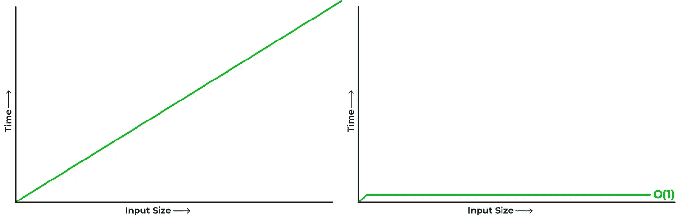
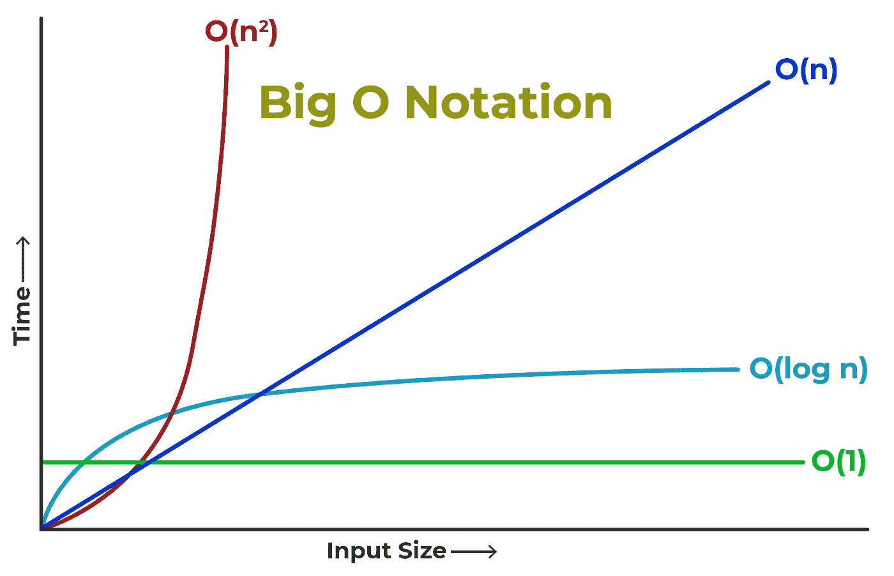

# 哦不！大 O

> 原文：<https://medium.com/nerd-for-tech/oh-no-big-o-a3aeb29526d3?source=collection_archive---------13----------------------->

大 O 及其分解。这篇文章需要对 big O 进行总结，以及如何在识别算法的实际时间复杂度时将它从理论应用到实践。


马库斯·温克勒在 [Unsplash](https://unsplash.com?utm_source=medium&utm_medium=referral) 上的照片

一年前，我甚至没有听说过“大 o”这个术语。我有一个根植于通信设计的视觉背景，所以这个术语直到我开始学习编码中的各种算法设计模式时才出现。在关于避免循环中的循环的对话中偶然提到了这一点。我，当时天真的程序员，没有意识到循环中有循环的含义。好吧，举例来说，当你处理一个 25 项长的数组时，这没什么大不了的，但是当处理大型数据集时，这就有很大的影响了。所以在这篇文章中，我将详细介绍我对大 O 的理解，以及如何开始识别/分类实际的算法，而不是理论方程，希望可以帮助其他迷失的人。

# 大 O 关乎大局。

我意识到大 O 的关键在于趋势识别。当你执行一个函数 3 次对 1，000，000 次，而不是 3 次对 20 次，会发生什么？它的大致轨迹是怎样的？手术数量是否继续复合？它是平的吗？

记住大局，否则你的趋势识别可能会被误解。例如:

如果你举上面的例子。该功能输出到控制台，从`n`计数到`20`。因此，从微观角度来看，它可能看起来像 O(n ),因为随着输入大小的增加，比如从 1 到 5 到 15，发生的操作数量也会增加。



但是一旦你大幅增加输入大小，比如说 100，000，轨迹看起来就和以前不一样了。这仅仅是 0(1)时间中的一个短暂现象。

重要的是宏观的观点，而不是微观的观点

# 这是模糊逻辑

从我收集的情况来看，没有真正的公式化方法来接近大 O。从概念的角度来看，你会认为你可以计算一个函数中的运算次数，因为这就是大 O 的时间是如何计算的。归结起来就是这些操作的复杂性。

如果，比如拿上面的代码，算一下运算。你会得到:

```
2 assignments // equal sign followed by an integer
1 n assignment // because i++ is short for i+= 1
2 n additions // once in the i++ and on line 6 
1 n comparision // in the for loop line 5
---------------------
A total of 4n + 2 operations 
```

所以它等于 O(4n + 2)。2 可以去掉，因为它在最大的图片中是名义上的。但是等等，那就是 O(4n)了，对吧？为什么是，但实际上不是。事实是，事情的广泛范围`4 * n`并不重要。时间还是线性的。所以你可以去掉 4。 **n 的输入越多，**运算所需的时间越长。

```
O(4n + 2) = O(n)
```

> W **重要的是操作的复杂性。**

这里有一个非常深刻的例子:

`myCoolFunction()`现在稍微复杂一些。仍然简单，因为这是为了说明的目的。所以我们再统计一下操作，只是为了比较。

```
2 assignments // equal sign followed by an integer
3 n assignments // i++ is i+= 1 and line 6 
2 n additions // in the i++ and on j++ 
2 n comparisions // in the for loop line 5
---------------------
A total of 7n + 2 operations
```

好的，那么通过纯粹尝试采用上面的公式化方法，你会确定我们有 7 n 个操作和 2 个常量操作。如上所述，这减少到 O(n)。很不幸，在这种情况下，那就错了。这里的不同之处在于，我们的`for loop`包含了一个额外的`for loop`。所以每次循环第一个循环时，它都要循环内部的 for 循环。所以这实际上会分解成。

```
OUTER LOOP
1 assignment // equal sign followed by an integer
3 n assignments // i++ is i+= 1 and line 6
1 n comparision // in the for loop line 5
INNER LOOP
1 assignment // equal sign followed by an integer
2 n asignments // j=0 and j++
1 n comparision // in the for loop line 7
```

> 我知道这有点让人昏昏欲睡，但我确实有一个观点，所以继续吧。

我们马上就要讲到了。因为我们有一个内部循环和一个外部循环，这 n 个赋值是相关但独立的。关系是`outerloop * innerloop`,因为我们执行外部循环多少次，内部循环就会执行多少次。

```
O(4n + 1) // outer loop 
O(3n + 1) // inner loop
O(4n + 1) * O(3n + 1) // outerloop * innerloop
O(n) * O(n) // applying the same reduction logic above
--- or --- 
O(n^2)
```

好了，够了。我通过上面的练习展示了如何系统地确定一个函数的运行时。在一天结束的时候，你应该花时间计算操作吗？如果你愿意，但正如你在上面看到的，由于大 o 的宽泛态度，大多数操作都被打折扣/取消了。重要的是复杂性，或者在我们的情况下，是循环中的循环。这取决于你去破译到底发生了什么逻辑。此外，在计算 big O 时，还有其他一些细节我们不会在本文中讨论，比如推入或弹出数组中的项的运行时间、数据类型的访问时间。文章的重点是给你一个对大 o 的粗略估计。

# 将大 O 应用于实际算法



我们将讨论的 4 大 O 符号供参考，还有更多

现在是时候跳过理论层面，把它应用到实际算法中去了。虽然有一些其他的大 O 方程，我们将坚持上面的 4。实际上，我们已经在上面的文章中讨论了其中的三个。

*   **O(1) —是在常量时间运行的任何东西，输入大小不影响运行时间(记住这个有大图)。**
*   O(log n) —我们很快就会谈到这个问题。我会解释日志是什么意思。
*   O(n)-这是一种复杂度呈线性的算法。输入越大，运行的时间就越长。
*   **O(n ) —通常称为二次时间，是一种随着输入大小的增加而运行时间呈指数增长的算法。**

## O(1) —常数时间

总的来说，无论输入大小如何，这个运行时都是平坦的。一个示例算法是访问哈希表。虽然从技术上来说它是摊销常数时间，但它仍然是常数。因为无论生成多少个键，运行时间都不会增加，所以可以将其视为访问一个索引数组。一个更简单的例子是。输入一个无限长的字符串，返回第一个字母。

## O(log n) —对数时间

首先快速解释一下 *log* 对于包括我在内的非数学专业人士来说意味着什么。 *Log* 就是一个数的对数，粗略的衡量了在得到一个小于等于 1 的值之前，你可以将那个数除以 2 的次数。

如果这没有意义，你可以把 O(log n)想象成一个运行时，你有一个馅饼，你把它切成两半，丢弃一半，拿另一半，然后把那一半切成两半，丢弃一半，拿另一半，然后把那一半分成两半。或者，在算法领域，我描述的是一个流行的算法，叫做二分搜索法。它很省时，因为与线性搜索不同，它在每次循环中把 n 分成两半。

## O(n) —线性时间

线性时间是一种在轨迹上是线性的算法。输入的大小与执行所需的时间有关。一个流行的例子是线性搜索。此外，简单的递归算法通常是 O(n)。

## O(n ) —多项式/二次时间

二次时间是一种算法，其中执行时间随着输入的大小呈指数增长。例如，如果你有一个带有内部循环的循环，例如，将数组中的字符串与数组中的其他字符串进行比较。或者，就像下面的例子一样，我们循环遍历一个数组，然后循环遍历数组的各个元素并做一些工作。

这就是应用于实际代码的四个大运行时。你如何利用这种学习来识别其他算法的大 O？我发现，将 Big O 的理论转化为实际代码，以学习典型算法方法的设计模式，并了解它们的 Big O 时间复杂度，是最有见地的方法。比如二分搜索法 *O(log n)* ，线性搜索 *O(n)* ，冒泡排序 *O(n )* 。和大 O 一样，没有放之四海而皆准的答案。通常，您的算法属于许多类别中的一种。

因此，我已经带你们了解了一些关于大 O 的理论思考，并展示了一些大 O 在算法中的实际应用。最后，我想重申文章的要点:

*   谈到大 o，要从大处着眼。
*   对于 Big O 来说，没有现成的答案。这是一种模糊逻辑，由您自己去做一些调查工作来决定代码在做什么。
*   一旦确定了基本设计模式，就可以对算法进行粗略的估计。了解流行的算法方法，并知道其中的大 O。

编码快乐！