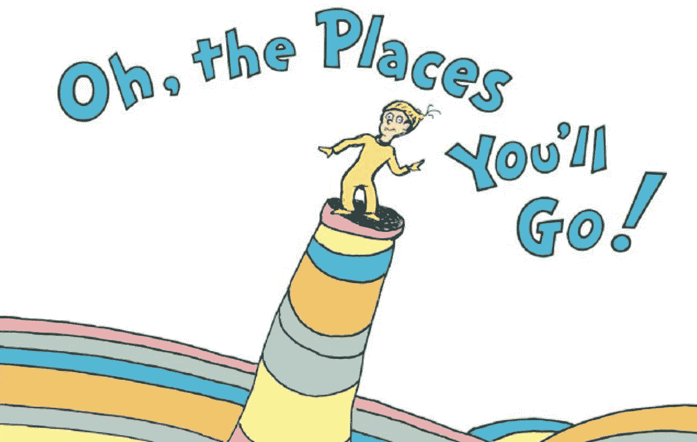
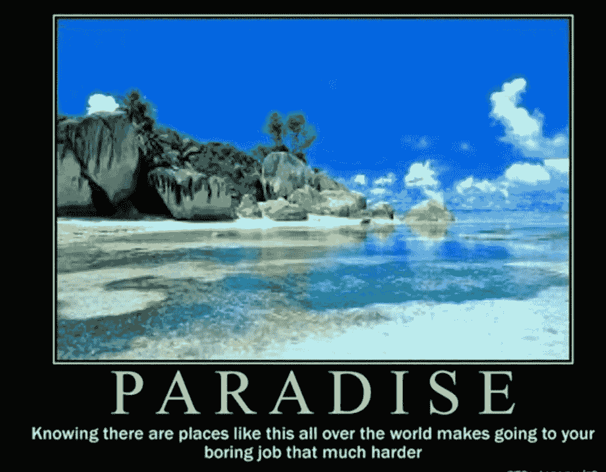
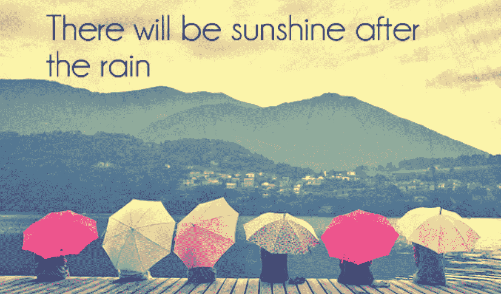

# 哦，你要去的地方！

> 原文：<https://medium.com/nerd-for-tech/oh-the-places-youll-go-cbdc6fbdf0e9?source=collection_archive---------0----------------------->

## 在你的技术生涯中，有些日子会令人惊叹…但很多日子不会。没关系。

在我大学毕业的那天，我的一个最好的朋友给了我一本[哦，你将要去的地方！](https://www.amazon.com/Oh-Places-Youll-Dr-Seuss/dp/0679805273)作者苏斯博士。我不是在美国长大的孩子，实际上我已经设法活了 21 年，却不知道*苏斯博士是谁。所以，一开始我很迷茫。为什么我的朋友要给我一部卡通片，里面有愚蠢的文字和古怪的图画？那天发生了很多事，所以我礼貌地笑了笑，把这本书放回了其他毕业礼物中。直到几天后，我才真正花时间从头到尾读了一遍。这本书是一部杰作，是给任何人从任何专业毕业的最佳礼物。*

这本书很好地抓住了*我无所不能的感觉。我仍然记得那天早上我感觉到的蝴蝶，幻想着我要在这个世界上做一些令人惊奇的事情。1997 年，我毕业了，获得了计算机科学学位，并得到了微软的聘用。这是历史上获得计算机科学学位的最佳时期之一(在互联网热潮的推动下)。微软在 90 年代是无可争议的，无情的老大。微软研究院是知识分子的温床，他们有无限的预算和自由来解决像自然语言处理这样的计算机科学难题。天空是极限。苏斯博士已经告诉我了！*

在我毕业那天，没人告诉我的是:这份奇特的工作在等着你……是的，有些日子你会做出惊人的事情，但其他日子你将不得不忍受，做一些会让你无聊到死的无聊的事情。即使是把人类送上月球的工程师们也曾有过这样的日子，他们也做着不需要动脑筋的事情，只需要完成这些事情，就可以让令人兴奋的事情发生。如果你快毕业了，我想尝试设定期望值。或者，如果你已经在这个行业工作了几年，你感到幻灭，这不是你所期望的，坚持下去:*这很正常，我们都感觉到了，它会变得更好*。

有时候感觉就是这样，不是吗！

我住在西雅图。10 月和 11 月绝对是可怕、灰暗、潮湿的月份。我在这里已经 25 年了，但还是不习惯。12 月份你会有一个小小的假期，因为圣诞节前后一切都变得更加美丽，甚至偶尔会下一场雪，让一切变得神奇。一月，二月，三月又是苦不堪言，漆黑一片，细雨蒙蒙。到了三月底，我问自己:我到底为什么要住在这里？？？然后，太阳出来了，没有什么比夏天的西北太平洋更令人惊艳的了。每天都是辉煌的 75 度天，蓝色的海洋波光粼粼，点缀着帆船，森林郁郁葱葱，群山环绕，空气清新。我们去远足，我们去航海，我们去游泳，我们在沙滩上啜饮拿铁咖啡，看着对岸的奥运会。我是一个狂热的世界旅行家，一生中背包旅行过 65 个国家，但在这个星球上，没有一个地方比西雅图更让我向往。所以我被提醒了:这就是为什么我忍受灰色的，糟糕的日子，这样我就可以有这样的日子。

在软件行业工作会有这种感觉…有时候你会想，为什么我会在这里？我为什么要这么做？

我们带着不切实际的期望开始我们的职业生涯，期望每天都很精彩。计算机科学的民间传说充斥着激动人心、令人惊叹的故事，其中可能有一些真实和一些 T2 式的修饰。比尔·盖茨和保罗·艾伦飞往阿尔伯克基，在飞机上为牵牛星编写引导程序。在 1980 年的那次会议上，一个小小的微软欺骗了一个庞然大物 IBM 获得了 DOS 的许可，这是比尔·盖茨甚至没有*拥有的东西。在 1979 年的那次会议上，史蒂夫·乔布斯从施乐 PARC 公司窃取了鼠标、视窗、图标的创意，然后用它们来制造第一台麦金塔电脑。杰夫·贝索斯辞去了一份六位数的稳定工作，开车横穿美国，在西雅图的一个车库里通过互联网卖书来赌上这一切。1998 年，年轻的拉里·佩奇(Larry Page)和谢尔盖·布林(Sergey Brin)仍在斯坦福大学，他们试图以 100 万美元的价格将他们的初创公司谷歌(Google)出售给雅虎(但遭到拒绝)(谷歌今天的市值在 1 到 2 万亿美元之间)。甲骨文因让私家侦探翻遍微软在雷德蒙德的垃圾箱寻找丑闻而被逮捕。等等，等等，等等。*

> 我已经在这个行业的中心呆了 25 年(在微软呆了 11 年，然后在亚马逊呆了 11 年，现在我在谷歌呆了 3 年)。在我的职业生涯中，我在三家影响了整个世界的公司分享了激动人心的时刻。

看了一手微软称霸九十年代([故事](https://link.medium.com/DFtR2QNELgb))。我们不会做错事。我们去了全国最好的学校，得到了最好的学生，不管花费多少。见鬼，我们也有教授。每隔一年股票分割，法拉利和兰博基尼扔在停车场，奢华的聚会。我们太自大了。在大约两年的时间里，我从生活在贫困线以下到拥有价值超过一百万美元的微软股票，并在 20 多岁时驾驶一辆崭新的保时捷([故事](https://link.medium.com/g9FsOVk9Ujb))。我熬了一夜给比尔·盖茨放小样([故事](https://link.medium.com/4CAMIrvF8gb))。我发布了许多版本的微软 Office，全世界有数亿人在使用它们。当你有拼写或语法错误时看到的那些绿色和红色的曲线？我的宝贝们。识别一个单词拼写错误是微不足道的，但是找出建议哪些单词实际上是一个有趣的计算机科学问题(提示:您可以应用许多启发式方法来有效地计算拼写错误的单词和潜在建议之间的*编辑距离*)。尽管语法检查器更有趣，因为有一个成熟的自然语言解析引擎为它提供动力，这在 1997 年是最前沿的。微软研究院里全是拥有名牌大学博士学位的计算语言学家。我们将他们的研究成果产品化。

这给我上了现实生活中的第一课。自然语言处理是一种资源消耗，但是有了无限的预算，微软研究院的人们可以在超级计算机上运行他们的原型。没有延迟要求，所以他们可以开始测试，然后睡觉，第二天早上醒来就完成了。然而，他们会把算法交给我们，我们不得不把它们重写为有生产价值的代码，这些代码需要在只有几兆内存的奔腾-90 上实时运行*，并且不要过多地从 Microsoft Word 的其余部分中占用资源(因为我们在相同的进程空间中运行)。这就好比拿到了劳斯莱斯的蓝图，却不得不去造一辆起亚。它并不像我刚从大学毕业时想象的那样迷人。*

*此外，进展缓慢，令人沮丧。这是在 Siri 之前，在 Alexa 之前，在谷歌助手之前。这是自然语言处理的初级阶段。我们都被自然语言小组所吸引，因为我们被计算机以自然、智能的方式与人类互动的前景所吸引。凭借其资金和天赋，微软可能是上世纪 90 年代实现这一目标的最佳选择。我们年轻，充满理想，充满激情，雄心勃勃，渴望实现这一切，我们整个团队多年来每周工作 80 小时，面带微笑。*

*九十年代接触微软研究院至今仍是我职业生涯中的亮点之一。但与此同时，它也教会了我，要把登月变为现实，需要花费大量的时间和努力，有时甚至是非常枯燥的任务。有时候你在处理一些很酷的计算机科学问题，但另一些时候你只是试图重现、理解和修复一个来自地狱的错误，或者重新安装你的操作系统，想要抓出你的眼球。*

*当你在大学里学习计算机科学时，你的作业总是一个有趣的问题，它是完全独立的，因此可以在 N 小时或几天内解决。然后你在 FAANG 面试，你会遇到一些很酷的问题，包括动态规划，树，图，或者其他一些你的面试官选择用来确定你是否是 FAANG 材料的愚蠢不切实际的东西。但是它们也包含在一些可以在 45 分钟内完成的事情中。非常坦率地说:大多数日子都不是这样的，即使是在微软、亚马逊或谷歌这样的地方。但有些日子是。他们是光荣的，让你充满自豪。*

*2009 年，我离开了微软，在亚马逊度过了接下来的 11 年。在我在微软的最后几年里，我看到一个全能的软件巨兽在鲍尔默时代渐渐被遗忘，变得无关紧要，而亚马逊提供了相反的经历。当我加入时，我们是 3k 工程师，主要在零售网站上工作，有几个小团队在启动 AWS。我亲眼目睹了亚马逊的迅速崛起，从一个简单的电子商务网站成为全球软件领导者。3k 的工程师变成了 6k，然后 20k，然后 40k，然后 60k。我欣然接受了周围令人窒息的节奏和强度，我的职业生涯呈指数级增长。我对 Amazon.com 数百万美元的停机负责，然后通过防止几十次类似规模的停机来挽回自己([故事](https://link.medium.com/gpHGJxmc3hb))。我获得了杰夫·贝索斯颁发的全亚马逊奖，并与他见过几次面(【T4 故事】)。我解决了有趣的计算机科学问题:我设计了一个能够每秒运行数亿个事务的东西，分布在数千台机器上，天哪，启动控制这些数千台机器的命令，看着它们尽职尽责地做它们应该做的事情，这真令人兴奋。亚马逊给了我一个机会，让我以对大多数人来说难以想象的规模了解分布式系统。作为负责整个公司负载和性能测试的首席工程师，我接触到了做各种有趣事情的团队……从 Alexa、Kindle、AWS 到电子商务。*

*我和亚马逊一起环游世界。有时是去拜访一个远程办公室，有时是去参加一个招聘活动，有时是去参加一个会议。我想我在亚马逊的一角钱上坐了 100 万英里的联合航班。作为一个来自第三世界国家的移民孩子，我经历了我做梦也想不到的事情。所以我发现自己在开普敦和企鹅一起游泳，在约翰内斯堡进行非洲狩猎旅行，在约旦的沙漠中露营，探索迪拜和安曼的集市，在印度骑骆驼和大象，在爱尔兰的中世纪城堡住宿，在墨西哥攀登玛雅遗址，在布宜诺斯艾利斯跳探戈，在马德里吃塔帕斯，在柏林吃整个 schweinshaxe，在北京的狭窄小巷中迷路，与西安勇士面对面，敬畏东京新宿的交通和灯光，这只是其中的几个例子。亚马逊给了我这一切。*

*你在我刚刚告诉你的迷人故事中没有看到的是*所有其他的日子*。那些我不得不做必须完成的琐碎工作的日子。我做了很多我不想做的工作，因为必须有人做，因为这对公司很重要。几天来，我不得不在持怀疑态度，有时甚至是充满敌意的观众面前为我的理想而战(这里是[最糟糕的一个](https://link.medium.com/kOhCaVK0tkb)！).那些我不得不解雇我非常关心的人的日子。我自己差点被解雇的那一天([故事](https://www.linkedin.com/feed/update/urn:li:activity:6813490633576189952/?updateEntityUrn=urn%3Ali%3Afs_feedUpdate%3A%28V2%2Curn%3Ali%3Aactivity%3A6813490633576189952%29#:~:text=lifestories%20%23corporateculture-,On%20almost%20being%20fired%20at%20Microsoft%20%5B2003%5D,link.medium.com,-53))。那天我真的失去了我在微软的工作。有我鄙视的老板(但是嘿，我也有很多好老板！).当我全身心的认为这是我应得的时候，我却没有得到晋升。为没有成功的想法写原型的失望。不得不扔掉我倾注了全部心血的代码令人心碎。我参与的项目被取消了(我在微软的最后两年都在做一个甚至没有发布的东西)。搁置那些可以为公司节省数百万美元却得不到资金支持的想法。尴尬的是，我不得不告诉我的客户，他们迫切需要我的产品今天拥有的功能将在 18 个月内实现，因为我们有一个痛苦的积压，同时还不得不放弃我正在做的一切，以处理没有提供任何价值的强制升级或迁移。被告知我不够好。让我的领导决定我需要做我认为不正确的工作(但不同意和承诺)。那些日子里，股市大幅波动，我的大部分净资产蒸发了(微软、亚马逊和谷歌在不同时期都出现过这种情况)。不得不在毫无用处的会议上保持清醒，在这些会议上，我既没有学到东西，也没有做出贡献。我可以继续说下去，但你明白了。*

*在你的职业生涯中，你也会有这样的日子。这没关系。请记住，每一个阴天也会有美好的一天。愿晴天比雨天多！*

**