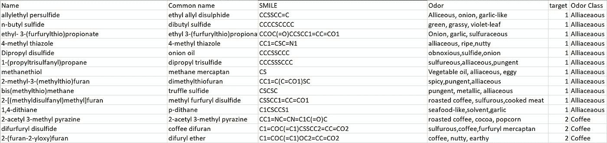
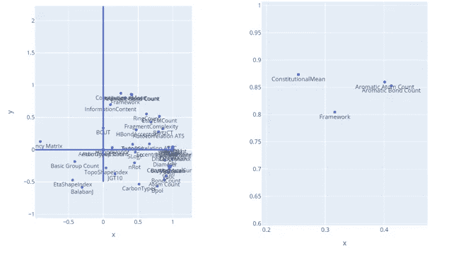
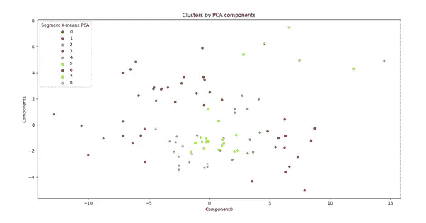
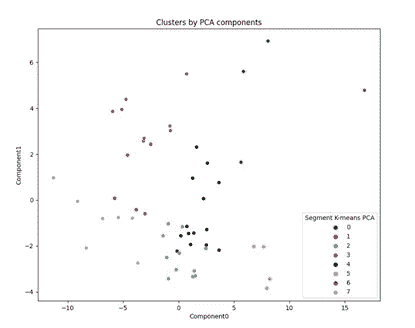
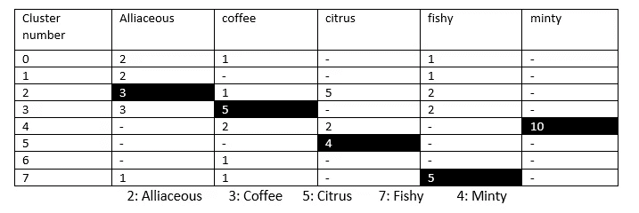

# 嗅觉预测——无监督学习

> 原文：<https://medium.com/nerd-for-tech/olfactory-prediction-unsupervised-learning-f9a19f4154d1?source=collection_archive---------17----------------------->


来源:Pinterest

在我们生活的世界里，我们可以通过音轨分享声音，通过照片分享视觉，通过移动设备内置的触觉分享某些身体感觉。但是气味呢？

这是一个棘手的领域，仅仅是因为气味本身的主观性。不同的人习惯于不同程度和种类的气味，因此他们对每种气味的感知不同或强度不同。这造成了一个很大的差距，在创造一个地面现实的化合物是“真的”联系在一起的气味。

然而，好气味公司的专家([气味类型列表(thegoodscentscompany.com)](http://www.thegoodscentscompany.com/allodor.html))能够提出一套全面的气味类别，以及每个气味类别中的数百种化合物，可以作为推进研究的基础。这个源是创建数据集的好地方。我随机挑选了 10 个气味类别，每个类别中有 10 种化合物。这创建了一个包含近 100 种化合物的数据集。我们需要每种化合物的主要数据点是它的 IUPAC 名称、SMILE 以及各自的气味和气味类别。为了更好地理解，我添加了一些数据值。



图一。气味数据集

有了化合物的坚实基础，我们就可以深入问题陈述——如何从化合物的分子描述符中识别气味？

> **分子描述符**

对于一个机器学习工程师来说，这只是一个简单的数学数字。它与化合物的不同物理属性有关，如原子数、原子量、电负性等。它有助于创建一种可量化的方法来衡量如何在数学空间中识别每种化合物，这使得训练模型或帮助计算机理解化学物质变得更容易。

对于一个化学工程师来说，这有实际的物理意义，并且会告诉我们更多关于化合物的化学性质。

如果你对分子描述符不熟悉，在你继续之前先阅读一下这个[分子描述符——概述|科学直接主题](https://www.sciencedirect.com/topics/medicine-and-dentistry/molecular-descriptor)，并且阅读[邻接矩阵——概述|科学直接主题](https://www.sciencedirect.com/topics/computer-science/adjacency-matrix)来理解相关描述符的物理意义。

使用名为 [mordred PyPI](https://pypi.org/project/mordred/) 的 python 库，计算这些分子描述符变得极其简单。该软件包中提供了 2D 和 3D 描述符。2D 描述符可以直接从化合物的微笑中计算出来，因此我只使用了 2D 描述符。SMILES 是简化的分子输入行输入系统(SMILES)，用于使用短 ASCII 字符串描述化学物种的结构。我总共使用了 48 个描述符，你可以在代码中找到。

```
# Locate and load the data base file from the local machine
df = pd.read_csv(r"C:\Documents\Olfaction Project\odor_data.csv")

# Defining the columns required from the data frame
features = [*'Common name', 'Odor Class', 'ABCIndex', 'Acidic Group Count', 'Basic Group Count', 'Adjacency Matrix', 'Aromatic Atom Count', 'Aromatic Bond Count', 'Atom Count', 'Autocorrelation ATS', 'Autocorrelation ATSC', 'BalabanJ', 'Barysz Matrix ','BCUT', 'BertzCT', 'BondCount', 'CarbonTypes', 'Chi', 'ConstitutionalSum', 'ConstitutionalMean','DistanceMatrix','EccentricConnectivityIndex','AtomTypeEState','EtaCoreCount','EtaShapeIndex','EtaVEMCount','FragmentComplexity','Framework','HBondAcceptor','HBondDonor','InformationContent','VMcGowan','LabuteASA','MID','PathCount','APol','Bpol','RingCount','nRot','SLogP','JGT10','Diameter','TopoShapeIndex','TopoPSA', 'Vabc', 'VAdjMat','MWC01', 'MW', 'WPath', 'Zagreb1'*]
```

我已经在第一个数据库中添加了所有的描述符及其值，然后在这个更新的数据库上定义了这个特性数组。这样你就不必担心描述符是如何计算出来的。由于这个研究领域已经被隔离，没有任何可用的数据库。请随意使用我这里的综合数据集[气味列表| Kaggle](https://www.kaggle.com/manyasingh0909/odour-listing?select=odor_data.csv)

> **主成分分析**

因为我们知道有 48 个描述符或参数要处理，所以我们需要降低这个数字。一个简单的方法是，主成分分析(PCA)丁。主成分分析将有助于分析哪些参数的方差最大。有了这些分析，我们就可以只使用这 4 或 5 个主要成分作为关键参数来调整我们的模型。

如果你是 PCA 的新手，这里有一个全面解释的链接:[主成分分析](https://towardsdatascience.com/principal-component-analysis-with-python-an-example-for-beginners-by-a-beginner-ac052eff45c)

```
# Defining input x as all 48 descriptors
x = df.iloc[:, 6:53]
x = StandardScaler().fit_transform(x)
# Defining output y as the odour class each compound belongs to
y = df['Odor Class']# Applying PCA
pca = PCA()
PC = pca.fit(x)
pca = PCA(n_components=5)
scores_pca = pca.transform(x)
print(scores_pca)
```

主成分分析的结果将给出一定数量(由您定义)的列，这些列中填充了每个化合物的数字。这些数字告诉你，对于特定的化合物，该成分的重量是多少。这些列被称为 PCA 得分。要查看主成分的名称，或显示最高方差的参数，使用以下代码。

```
 PCloadings = pca.components_.T * np.sqrt(pca.explained_variance_)
components=df.columns.tolist()
components=components[6:53]
loadingdf=pd.DataFrame(PCloadings,columns=('PC1','PC2'))
loadingdf["variable"]=components# The plot
fig = ex.scatter(x=loadingdf['PC1'],y=loadingdf['PC2'],text=loadingdf["variable"])
fig.update_layout( height=600,width=500, title_text='loadings plot')
fig.update_traces(textposition='bottom center')
fig.add_shape(type="line", x0=-0, y0=-0.5,x1=-0,y1=2.5, line=dict(color="RoyalBlue",width=3))
fig.add_shape(type="line", x0=-1, y0=0,x1=1,y1=0, line=dict(color="RoyalBlue", width=3))
fig.show()
```



图 2 分子描述符与它们的 PCA 分数

从这里我们可以看出，芳族原子数、芳族键数、结构平均值和骨架是最大的方差，因此可以推断为主成分。这些在化学和气味研究领域具有物理意义，但我们将使用它来创建我们的预测模型。

> **K 表示聚类**

有了更小的参数池，我们现在可以开始构建我们的模型了。正如我们所知，预测化合物的气味是一种无监督学习。这指导我们使用聚类算法来简化我们的问题。我在 PCA 的结果上使用 K 均值聚类来创建一个更好的模型。

如果您不熟悉 K-Means 聚类，请阅读 [K-means 聚类 Python 示例|作者 Cory Maklin |走向数据科学](https://towardsdatascience.com/machine-learning-algorithms-part-9-k-means-example-in-python-f2ad05ed5203)

```
# finding the k means clusters on the PCA score

kmeans_pca = KMeans(n_clusters=8, init='k-means++', random_state=42)
kmeans_pca.fit(scores_pca)

df_new = pd.concat([df.reset_index(drop= True), pd.DataFrame(scores_pca)], axis=1)
df_new.columns.values[-5:] = ['Component0','Component1','Component2','Component3','Component4']
df_new['Segment K-means PCA'] = kmeans_pca.labels_
df_new['Segment'] = df_new['Segment K-means PCA'].map({0:'first',
                                                      1:'second',
                                                      2:'third',
                                                      3:'fourth',
                                                      4:'fifth',
                                                      5:'sixth',
                                                      6:'seventh',
                                                      7:'eighth'})
```

K 均值聚类算法根据每个 PCA 分数值之间的距离对化合物进行分组。它创建相似 PCA 分数的聚类，并分离那些具有非常远的值的聚类。这使得具有相似值的化合物成簇，并且可以产生多个这样的簇。集群的数量可以由你在代码中控制。为了可视化聚类，我们绘制第一主成分与第二主成分的关系图。

```
# Visualizing the clusters

x_axis = df_new['Component0']
y_axis = df_new['Component1']
plt.figure(figsize = (10,8))
sns.scatterplot(x_axis, y_axis, hue = df_new['Segment K-means PCA'], palette=['g', 'r', 'c', 'm', 'k', 'orange', 'brown', 'orchid'])

plt.title("Clusters by PCA components")
plt.show()
```



图 3 主成分 1 与主成分 2

整个数据集上的聚类非常混乱，因此为了简化结果，我们可以将数据集分成更小的部分。每个部分都可以是整个数据集的一个更小的子集。这将在每个数据集上创建不同的聚类，并为每个数据集上的每个模型带来不同的准确性/效率。因此，我们需要一种方法来评估哪个数据集与哪个模型相结合会给我们带来最好的结果或最小的预测误差。

> **集群评估**

K- Fold 交叉验证是评估任何线性模型性能的常用方法，但是将它应用于聚类算法可能会很棘手。首先，我把我的数据集分成 5 个更小的数据集，每个 4 或 5 个气味类别。这产生了更好的聚类图。在每个数据集上，我应用了一个简单的 k 倍验证来观察 MAE 和 RMSE。RMSE 值没有对错之分，但是将其应用于不同的数据集，产生最低值的数据集可以帮助我们专注于模型。这里有一个解释 RMSE[RMSE 到底是什么意思](https://towardsdatascience.com/what-does-rmse-really-mean-806b65f2e48e)的链接

```
# define predictor and response variables
X = df_new[['target']]
y = df_new['Segment K-means PCA']

# define cross-validation method to use
cv = KFold(n_splits=10, random_state=1, shuffle=True)

# build multiple linear regression model
model = LinearRegression()

# use k-fold CV to evaluate model
scores = cross_val_score(model, X, y, scoring='neg_mean_absolute_error', cv=cv, n_jobs=-1)

# view mean absolute error

print("MAE")
print(mean(absolute(scores)))
print("RMSE")
print(sqrt(mean(absolute(scores))))
```

该代码可用于聚类模型，以帮助确定哪个数据集将给出最低的平均相对误差和 RMSE 值。一旦解决了这个问题，所有的分析和结果都可以从同一个地方得出。



图 4 8 个聚类图的结果

可以清楚地看到这些簇，但是这回避了哪个簇对应于哪个气味类别的问题。这可以通过每个气味类别下的简单投票机制来解决，其中我们计算 k 均值聚类给出的最大投票。



图 5 将聚类映射到气味

在 GitHub 存储库中找到用于构建这个项目的完整代码和所有数据集:

> [manya 09 Singh/气味预测:根据化合物的分子描述符(github.com)进行气味预测的全长代码](https://github.com/manya09singh/Odour-Prediction)

如果你遇到任何问题，请随时在评论区联系我！感谢您的阅读:)

资源和链接

*   【thegoodscentscompany.com 气味类型清单
*   [气味列表| Kaggle](https://www.kaggle.com/manyasingh0909/odour-listing)
*   莫德雷德·皮比
*   [公共化学(nih.gov)](https://pubchem.ncbi.nlm.nih.gov/)
*   [分子描述符—概述|科学直接主题](https://www.sciencedirect.com/topics/medicine-and-dentistry/molecular-descriptor)
*   P [用 python 进行主成分分析](https://towardsdatascience.com/principal-component-analysis-with-python-an-example-for-beginners-by-a-beginner-ac052eff45c)
*   [K-means 聚类 Python 示例|作者 Cory Maklin |走向数据科学](https://towardsdatascience.com/machine-learning-algorithms-part-9-k-means-example-in-python-f2ad05ed5203)
*   [评估聚类算法的交叉验证方法:使用多标签数据集的实验研究| SpringerLink](https://link.springer.com/article/10.1007/s42979-020-00283-z#Sec6)
*   [https://www . research gate . net/publication/5984319 _ Predicting _ Odor _ pleasant ness _ from _ Odorant _ Structure _ pleasant ness _ as _ a _ Reflection _ of _ the _ Physical _ World](https://www.researchgate.net/publication/5984319_Predicting_Odor_Pleasantness_from_Odorant_Structure_Pleasantness_as_a_Reflection_of_the_Physical_World)