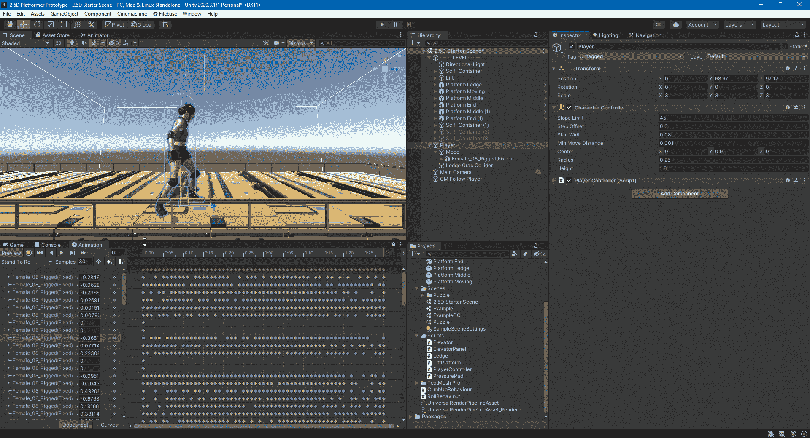
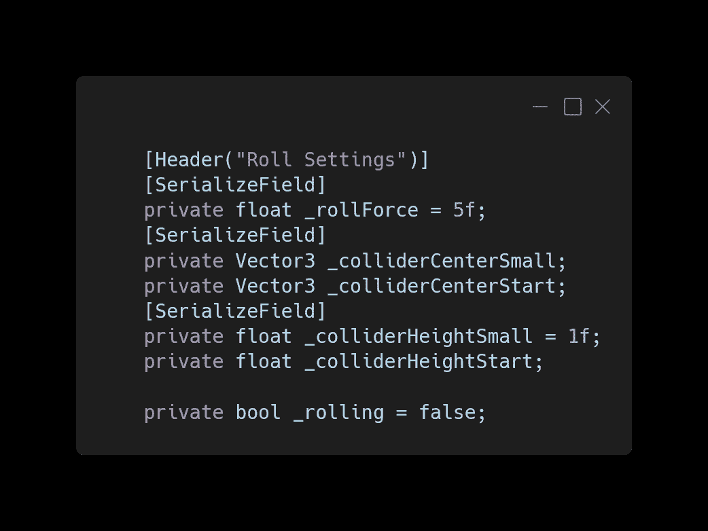
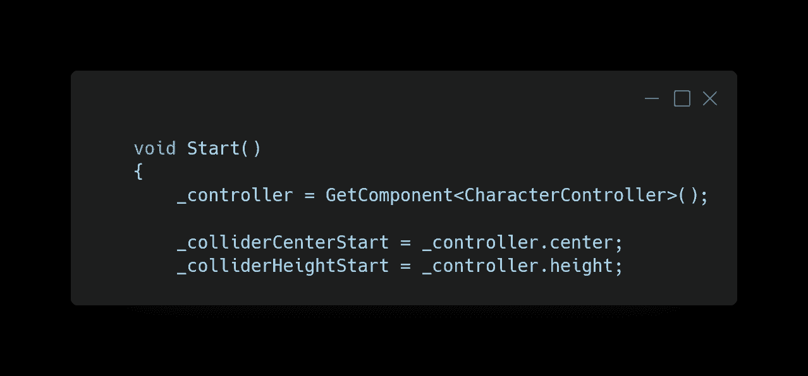
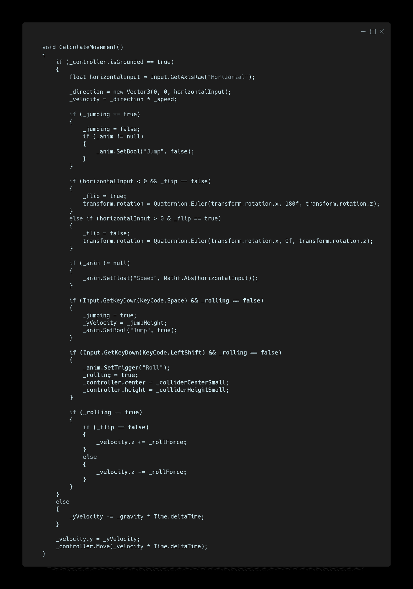
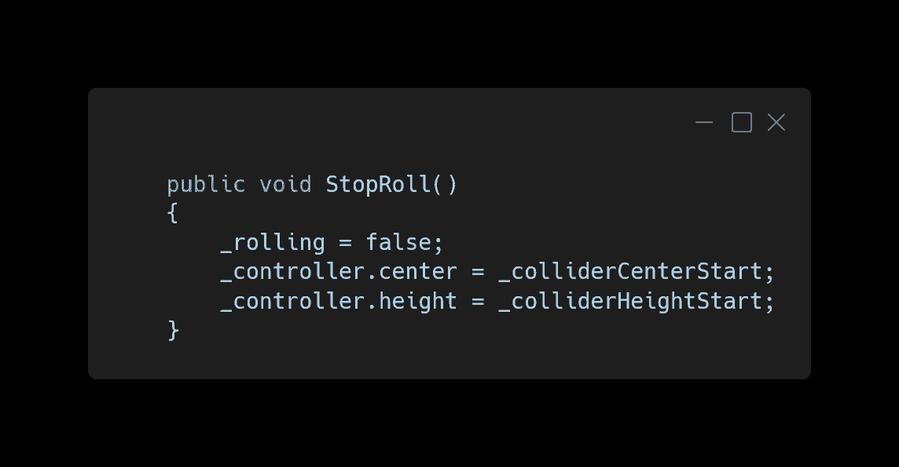
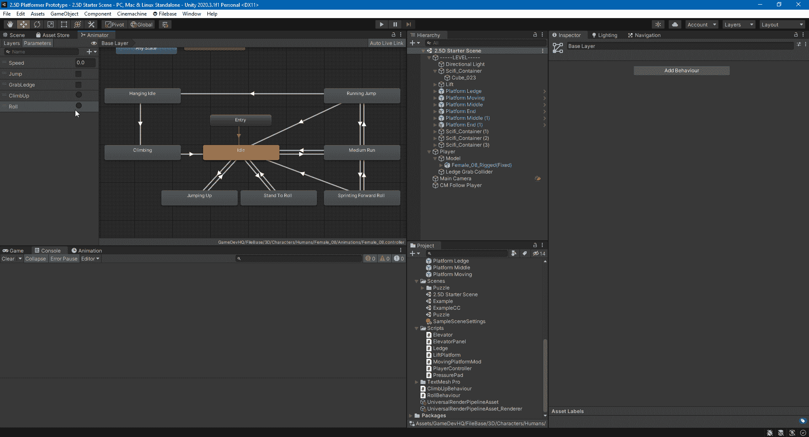
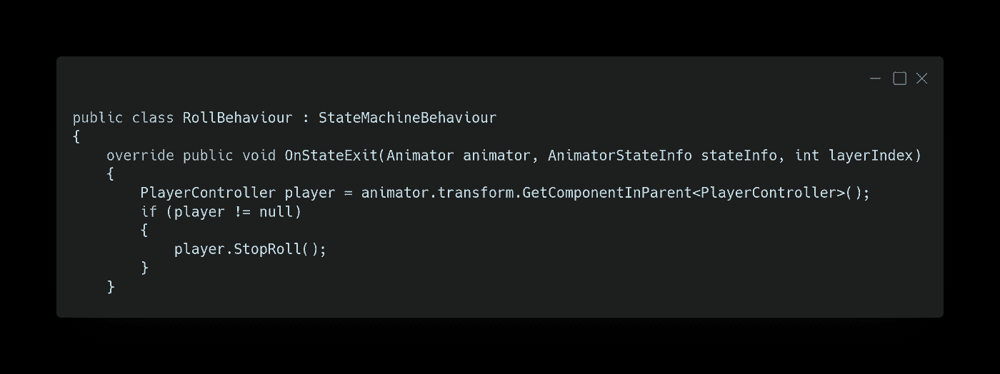
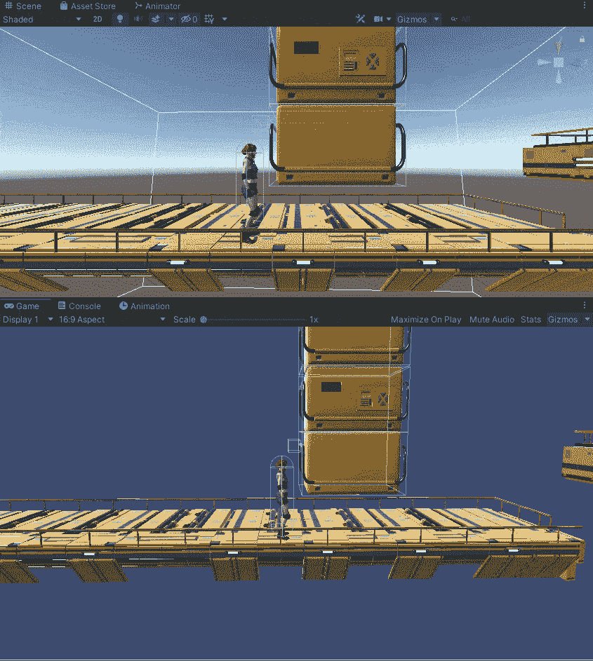

# 势如破竹！—玩家滚动动画

> 原文：<https://medium.com/nerd-for-tech/on-a-roll-player-roll-animation-37f99dfcfa13?source=collection_archive---------17----------------------->

这篇文章展示了如何为玩家增加滚动的能力来躲避障碍物。翻滚动画来自 [Mixamo](https://www.mixamo.com) ，这是[以前的一篇文章](https://kwpowers.medium.com/setting-up-3d-character-in-unity-with-mixamo-c0dd9d159fad)中的特色。

我们将在输入掷球时通过代码更改角色控制器碰撞器，以匹配模型的更改轮廓，然后在动画结束后将其更改回正常状态。

在玩家脚本中，我们需要一些变量来实现滚动逻辑。

1.  掷骰子时增加玩家速度的数量。
2.  滚动时碰撞器中心的新 XYZ 轴值。
3.  滚动后碰撞器中心返回的起始 XYZ 轴值。
4.  滚动时碰撞器的新高度值。
5.  滚动后碰撞器返回的起始高度值。
6.  该 bool 知道玩家是否已经在滚动，以防止在滚动时跳跃和滚动。

我们从 Start 中的控制器获得碰撞器中心和高度的初始值。

当玩家在地面上时，如果按下了左 Shift 键，但还没有滚动，我们告诉动画制作人播放滚动动画，禁用滚动和跳跃，直到滚动完成，并将碰撞器的中心和高度更改为较小的轮廓。然后，如果玩家在滚动，我们根据玩家面对的方向，从速度中加上或减去滚动力。

我们需要的最后一件事是一个方法，可以调用它来将 rolling bool 更改为 false，从而允许跳跃和再次滚动，并将碰撞器的中心和高度返回到初始值。

在播放器的 Animator 窗口中，我们需要为 Roll 添加一个触发参数，以过渡到滚动动画。然后在动画完成后，我们转换回空闲或运行动画。在滚动动画状态下，我们需要添加一个行为脚本。

在行为脚本中，当滚动动画状态完成并转换到下一个状态时，我们从动画师的父级获取 PlayerController 脚本，并对其调用 Stop Roll 方法。

玩家现在可以在障碍物下翻滚和移动。

