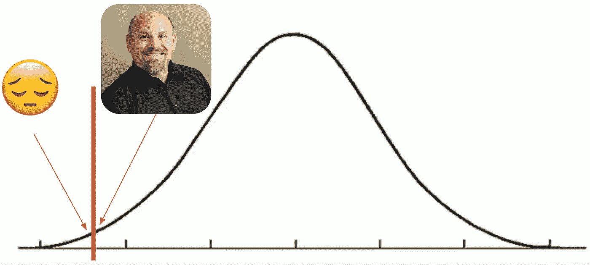
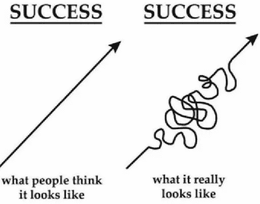

# 差点被微软解雇

> 原文：<https://medium.com/nerd-for-tech/on-almost-being-fired-at-microsoft-2003-d8445d6b304f?source=collection_archive---------2----------------------->

## 失败是正常的，它会发生，拥抱它并从中学习

今天，我很荣幸拥有一个只有一小部分谷歌工程师达到的水平。我取得了一些成功，帮助我实现了这个目标。但在我的职业生涯中，我也有过一些非常壮观和令人尴尬的失败，我也有过一些迷失的艰难时期。这是一个关于追求一个你并不热衷的机会的故事，为了它对你职业生涯的感知价值。这是一个关于贪多嚼不烂的故事。这是我差点被解雇的故事。

我想发表这个故事，因为我看到了围绕失败的巨大文化耻辱。这导致许多工程师认为失败是不应该的，尤其是更多的初级工程师。这种对失败的极度恐惧会阻止我们采取更大胆的措施，从而导致创新的飞跃。我碰巧相信，我们在职业生涯中遭遇重大失败只是时间问题，害怕失败会限制职业生涯。一般来说，我发表的故事都是关于我做的一些效果很好的事情。但是失败比那些成功更能塑造我的人格，所以他们也应该在这里拥有一些房产！

稍后想看这个故事吗？ [*把它保存在日志里。*](https://usejournal.com/?utm_source=medium.com&utm_medium=noteworthy_blog&utm_campaign=tech&utm_content=guest_post_read_later_text)

我在微软的头四年非常积极，我上升很快。我在 18 个月内被提升。两年后，我再次被提升，这次是首席工程师。微软有一个可怕的假设，即优秀的工程师造就优秀的经理，所以一旦你用几年时间证明了自己，就会被鼓励去追求管理职位。我从一个由 3 名出色的工程师组成的小团队开始。我们都很年轻，似乎有无尽的时间、精力和激情。我们为 40 种不同的语言编写了测试 Microsoft Office 中拼写检查和语法检查的所有工具。你在 Word 中看到的那些红色和绿色的曲线都是我的孩子。我们相互尊重、信任、依赖。我蒸蒸日上。生活很美好。

然而，微软正面临着一系列阻碍其发展的事件。首先，1999 年，美国司法部提起反垄断诉讼，让该公司元气大伤。其次，2000 年，网络泡沫的破灭对整个软件行业来说是残酷的，微软活了下来却受到了重创。第三，2001 年，911 事件影响了整个国家。2001 年底，一项行政命令来勒紧我们的裤腰带。在随后的重组中，我失去了 3 名工程师，他们都去微软内部寻找新的工作。

如果没有工程师向我汇报，我将失去“领导”的头衔，我认为这是非常有价值的。回想起来，我并没有比没有它的时候赚更多的钱，而且作为一名个人贡献者(这是我多年后最终选择的道路)，我本可以像一名经理一样轻松地在职业生涯中成长。但是“领导”在我的简历中听起来更花哨。它对我来说更有威望。今天，我可以看到我是出于完全错误的原因去追求它；当时，我幸运地没有意识到更大的图景。

我有机会留在公司，继续做经理，但在公司的另一个部门。我和招聘经理聊了聊，感觉很糟糕。回想起来，从第一天开始，我们就很明显不适合对方。我对这个团队的章程完全不感兴趣。我不适合这份工作。总而言之，有很多我应该看到的危险信号。然而，以我天真的观点来看，这是我在困难时期保住“头衔”的唯一方法。所以我接受了这份工作。我讨厌它，就像你可能猜到我会讨厌它一样。于是我开始纠结。

与此同时，我决定去西雅图的华盛顿大学攻读计算机科学硕士学位。我是在全职工作的时候做的，这很有挑战性。如果我想让微软给我报销学费，我至少要有 B 级的平均成绩。但是，最重要的是，我想在斯坦福大学攻读博士学位，我真的需要在这方面拿到全 a。因此，在全职工作的同时，在全国排名第五的学校攻读硕士学位，保持平均成绩是一项挑战。我肯定也在那里挣扎。

第三，我的个人生活一团糟。那里有很多个人戏剧。我也在那里挣扎。

我认为这是职业斗争、学校斗争和个人生活斗争的完美风暴。我遇到了麻烦，而我却不知道。我各方面都表现不佳。尽管我不习惯失败，但我太骄傲了，不敢看着镜子里的自己，承认失败并后退一步。我只是继续努力向前，想着我会通过努力工作和奉献把自己从困境中解救出来。有时候，光靠蛮力是不够的。你需要一个策略。我缺少一个。我应该做的是与我的经理进行坦率的讨论，承认我无法处理所有事情，并从我的一些工作职责中抽身出来。或者干脆抽出一段时间让我的生活变得更好。

我们人类的本性是投射出一种权力和力量的形象，而不是显露出我们的脆弱和挣扎。但这样做总是对的吗？

我最终这么做了，但为时已晚。我失去了经理的信任，也失去了下属的信任。绩效评估出现了，当我在写自我评估时，我终于能够反思我的一些糟糕的选择。我写了一篇非常诚实的评论。后来，我知道那是那年唯一救了我的东西。我的老板想解雇我，但当他看了我的评论后，他欣赏我直言不讳地自我批评，并认为也许有什么可以挽回的。由于微软制定了严格的业绩钟形曲线，我也很幸运:我是曲线右边“你被解雇了”那条线的最后一个人。所以，毫不夸张地说，我没被解雇的唯一原因是有人做得比我差。我得到了“0.00 美元”的年度奖金，加薪“0.00 美元”，没有股票刷新。我盯着我的复习数字，心里一阵刺痛:额外的“. 00”似乎有点太用力了:你做得太糟糕了，这不仅仅是“0”，这是“0.00”，以强调你甚至不应得到一分钱。

微软在钟形曲线上校准…我是最后一个**没有**被解雇的人！

我不得不从我的领导角色上退下来，重新成为一名个人贡献者。这本身并不坏，尽管当时感觉很尴尬，好像每个人都知道我不够好。更糟糕的是，我不得不回到基础，重新赢得信任。接下来的几年是灰色的。赢得信任需要很长时间，但你可以在很短的时间内失去它。

团队中的一些人多年来一直对我隐瞒这件事。当你停留在**同一个地方**时，真的很难在**有一个新的**开始:人们一直期望你今天还是和昨天一样有缺陷的人，即使你在积极努力改善自己。我的一部分认为我应该去一个完全不同的团队(或公司)，那里的人对待我没有任何先入为主的想法。我敢肯定，那些人看到我后来成为亚马逊的首席工程师和谷歌的高级员工工程师会感到震惊(在微软的级别中，那是从 60 级升到 67 级，或者 7 次晋升，或者大约每隔一年晋升一次，一旦我搞清楚了自己)。他们已经放弃了我。每个人的道路都是不同的，我的道路也有一段时间是曲折的，直到我发现我到底是谁，以及如何有效地完成我的工作。这是我必须做的。不要放弃人！

虽然这段经历很痛苦，但它深深地塑造了我最终成为一名领导者的形象，所以我很感激我经历了这一切。我明白了世界并没有停止旋转，这让我不那么害怕失败，我开始在生活中承担更大、更大胆的风险(有些没有回报，但有些让我有了今天的成就)。*失败就是解放！*我认识到信任是一种基本货币，因此我非常重视透明度、问责制以及与周围人建立信任的方式。我也学到了一些谦逊和同情——我担心那些从未失败过的领导者，因为他们取得的成功越多，他们对自己的判断就越自信。最后，这让我更愿意相信人们也可以进化，变得更好。

*总而言之，那次失败虽然可怕，但也是我职业生涯中发生的最好的事情。*

创造你自己的东西？加入[杂志 slack 社区](https://links.usejournal.com/slack-community)寻求像你一样的创作者的支持。