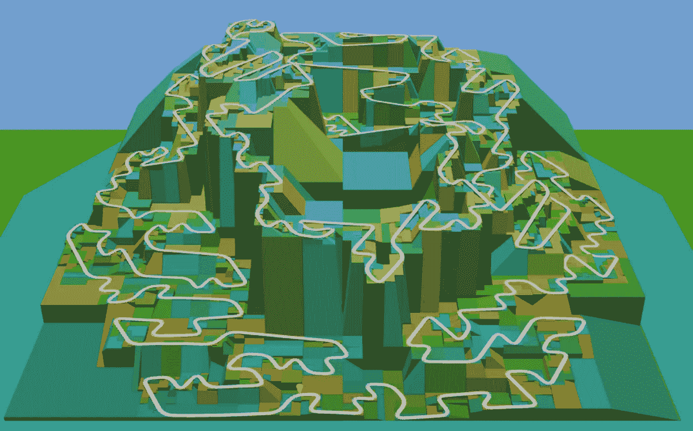

# 论数据结构的选择

> 原文：<https://medium.com/nerd-for-tech/on-the-selection-of-data-structures-3cee0f430ea9?source=collection_archive---------7----------------------->

## GPXmagic 中的优化



GPXmagic 的“自然”数据结构是一个跟踪点列表。毕竟，这就是道路。大多数情况下这是非常好的，但是随机访问一个单独的跟踪点的代价是令人担忧的。

特别是，我需要找到一个离用户点击 3D 图像最近的跟踪点。因为我将旋转和缩放留给了 WebGL 组件，所以我没有直接的方法来解释点击位置。我能做的最好的事情就是创建一条“射线”,从这条射线我可以测量任意点的距离。给定一条射线和一系列点，我的第一步解决方案就是找到距离最小的点，很容易写:

```
trackPointNearestRay : List TrackPoint -> Axis3d Meters LocalCoords -> Maybe TrackPoint
trackPointNearestRay track ray =
    track
        |> List.Extra.minimumBy
            (Length.inMeters << distanceFromAxis ray << .xyz)
```

它必须扫描整个列表。对于数百甚至数千个点来说，这是可以接受的，但随着列表的增长，这显然不够优雅或高效。尽管如此，对于大多数曲目来说，它对用户输入的响应速度已经足够快，所以不需要急着修改。(霍尔的原话是“我们应该忘记小的效率，比如说 97%的时候:过早的优化是万恶之源。”)

随着时间的推移，我已经找到了一种检测交叉轨道段的简洁方法。一个简单的基于列表的方法需要的时间与点数的平方成正比。可能对一百点有用的东西，对十万点可能要花一百万倍的时间。是时候研究数据结构了。

长话短说，四叉树有几种变体可能有效，但实现起来都异常复杂。我决定尝试一个非常非常简单的方法。假设您负责一个矩形区域，并且必须跟踪您所在区域的所有路段。进一步假设你把你的区域分成四个象限(比如:西北、东北、东南、西南)。您可以实施以下规则:

> 如果路段的边界框完全在一个象限内，将责任委托给该象限。如果它跨越两个或更多，将其添加到我这一级的列表中。

添加了对细分施加限制的规则，使得小于(比方说)10 米的区域不被细分，这是一种定义明确且易于实现的树形结构。当然，对于某些路线来说，它可能会严重失衡，但对于大多数现实生活中的路线来说，它表现得相当不错。

搜索很简单:给定一个边界框，我寻找与我所在级别的条目重叠的部分，并要求我的代理也这样做。

比所有这些巧妙的结构简单得多；比全面搜索好得多，但在信封背面解释起来足够简单。

然后我想我可以用这个来帮助找到最近的射线。事实证明这相当简单。如果我将光线投射到 XY 平面，我可以通过询问“你的哪个边界框与这条线相交？”来查询数据结构

不过，我们可以做得更好。与其检索所有相互作用的盒子并找到最近的，为什么不“下推”查询，以便递归遍历跟踪“最近的”盒子并只返回一个结果？

下面是“数据结构遍历”,它使用了一个我们试图最小化的`valuation`函数:

```
queryNearestToAxisUsing :
    SpatialNode contentType units coords
    -> Axis2d.Axis2d units coords
    -> (contentType -> Float)
    -> Maybe (SpatialContent contentType units coords)
queryNearestToAxisUsing current axis valuation =
    case current of
        Blank ->
            Nothing SpatialNode node ->
            let
                boxSides =
                    node.box
                        |> Rectangle2d.fromBoundingBox
                        |> Rectangle2d.toPolygon
                        |> Polygon2d.edges intersected =
                    List.any
                        (\edge -> LineSegment2d.intersectionWithAxis axis edge /= Nothing)
                        boxSides
            in
            if intersected then
                [ List.Extra.minimumBy (.content >> valuation) node.contents ]
                    ++ [ queryNearestToAxisUsing node.nw axis valuation
                       , queryNearestToAxisUsing node.ne axis valuation
                       , queryNearestToAxisUsing node.se axis valuation
                       , queryNearestToAxisUsing node.sw axis valuation
                       ]
                    |> List.filterMap identity
                    |> List.Extra.minimumBy (.content >> valuation) else
                Nothing
```

“应用程序端”调用非常简洁:

```
trackPointNearestFromIndexFor3d :
    SpatialIndex.SpatialNode TrackPoint Length.Meters LocalCoords
    -> Axis3d Meters LocalCoords
    -> Maybe TrackPoint
trackPointNearestFromIndexFor3d index ray =
    let
        rayShadow =
            ray
                |> Axis3d.projectInto SketchPlane3d.xy
                |> Maybe.withDefault Axis2d.x distanceFunction =
            .xyz
                >> Point3d.distanceFromAxis ray
                >> Length.inMeters
    in
    SpatialIndex.queryNearestToAxisUsing index rayShadow distanceFunction
        |> Maybe.map .content
```

真正令人兴奋的是，拥有这种结构已经开启了大量的应用可能性，如果没有有效的索引，这些应用是不可能实现的。但是，我很高兴我等到有一个明确定义的需求，这不是在“过早优化”的范畴。