# Unity 中的 OnClick 事件

> 原文：<https://medium.com/nerd-for-tech/onclick-events-in-unity-f65d12a12e47?source=collection_archive---------8----------------------->

现在我们已经有了商店老板和商店橱窗，让我们开始在玩家之间建立适当的互动，这样我们就可以购买商店里的东西了。首先，让我们得到它，以便我们的商店向玩家显示他们必须知道多少宝石，如果他们有足够的购买物品。首先，我们将创建一个 UIManager 脚本来保存 UI 信息的所有信息。一旦我们将它附加到画布上，我们将开始链接到我们的玩家数量:

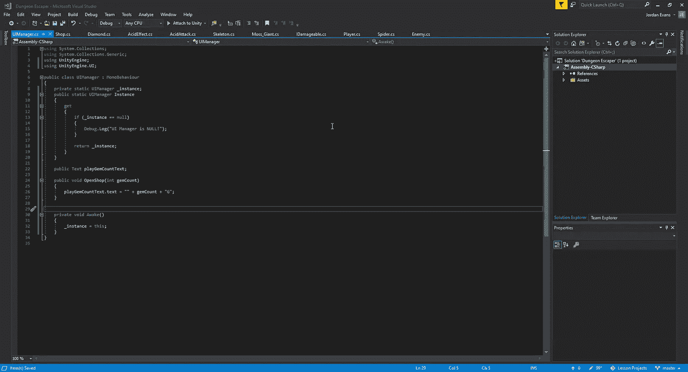

然后，我们将进入我们的商店脚本，因为它是在进入触发区时与玩家互动的内容，并通过它获得我们的宝石计数:

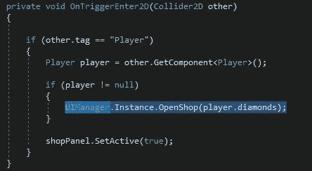

有了这个，让我们看看它在我们的游戏中是什么样子的:

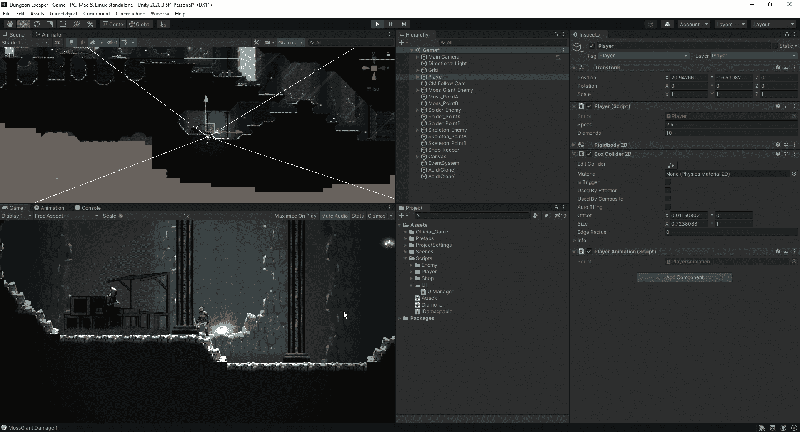

现在我们已经把我们的金币数正确地更新到了玩家总数，让我们开始通过 OnClick 事件购买我们的各种物品。

接下来，让我们得到它，以便我们可以有一个独特的事件，当我们点击每个按钮。为此，我们将把我们的 On Click()参数与我们的按钮链接起来，以表示一个特定的数字:

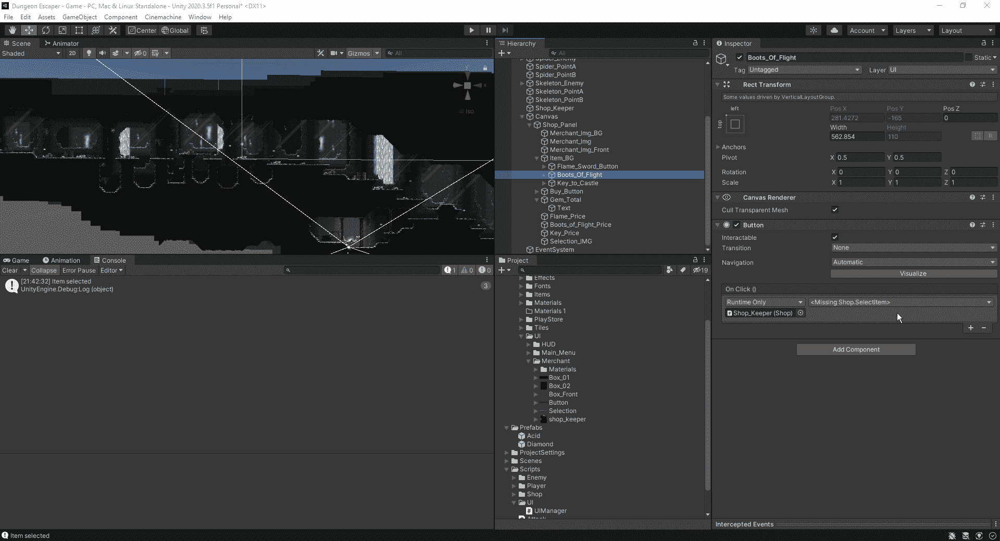

从这里开始，我们将拥有它，以便当我们单击该特定项目时，出于测试目的，它将为我们提供我们单击了哪个项目的日志:

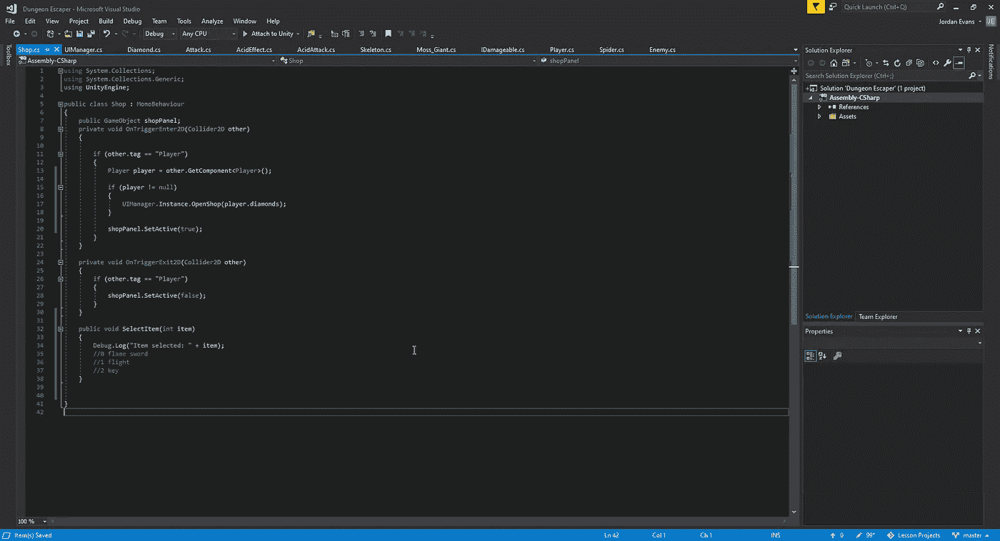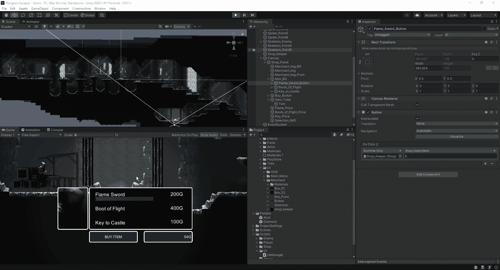

现在我们有了它，每个按钮都创建了自己的动作，我们现在要设置我们的选择高亮，以便玩家知道他们选择了哪个选项:

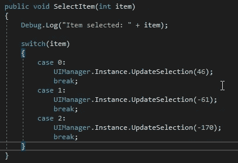

我们在这里所做的是在商店脚本中，我们创建了逻辑来知道哪个按钮被按下，以及我们希望我们的高亮显示在什么位置，这在 UIManager 中是这样控制的:

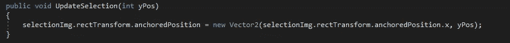

我们现在可以返回 Unity，看看单击特定按钮是否会导致高亮显示到正确的项目上:

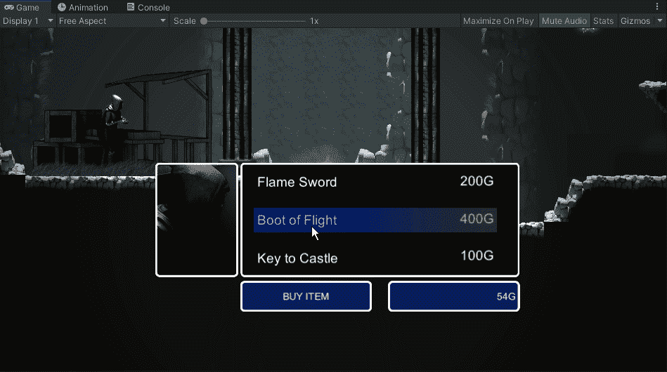

最后，让我们把它设置好，这样当我们点击购买一个项目时，我们就可以用我们收集的钻石来购买它。首先，我们需要将逻辑添加到 SelectItem void 中，以给出一个要处理的值，并创建一个新的 void，以给出知道我们是否可以购买它的逻辑:

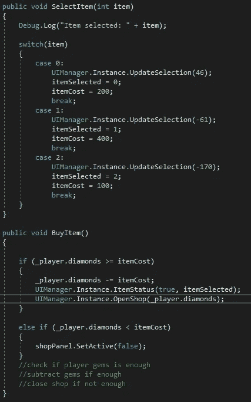

正如我们所看到的，如果我们能够购买物品，它将从玩家那里拿走钻石，如果我们不能，它将关闭商店。现在，让我们在游戏中测试一下:

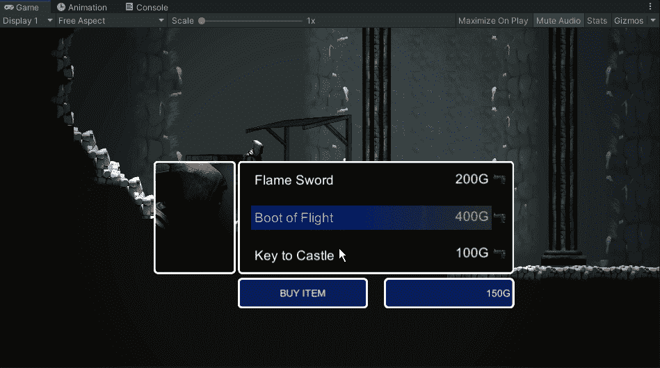

随着我们的商店现在工作，我们现在可以期待建立在我们的游戏 HUD，并开始与游戏的一些最后的接触。