# OnClick 事件| Unity

> 原文：<https://medium.com/nerd-for-tech/onclick-events-unity-f4805203b039?source=collection_archive---------0----------------------->

## 统一指南

## 关于如何使用 Unity 处理 OnClick 事件的快速指南

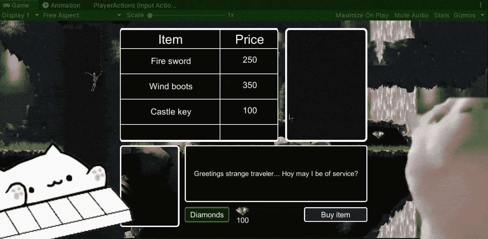

**目标**:在 Unity 的 2D 游戏中，使用 OnClick 事件显示带有 UI 元素的信息。

在上一篇文章中，我介绍了[如何用 Unity 创建一个战利品系统。](/nerd-for-tech/creating-a-loot-system-unity-27476f9948be)现在，该处理 UI 元素中的 OnClick 事件了，以便根据商店中的选择向用户显示信息。

# 商店

首先，让我们看看 2D 游戏的当前商店。目前，我们有 3 种商品在出售:

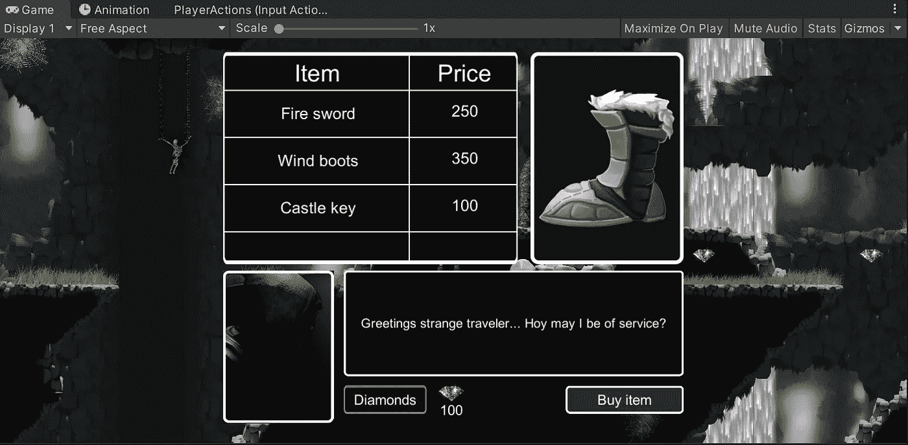

我们使用画布来显示商店中的 UI 元素。现在，我们有一个按钮来显示每一件出售的商品:

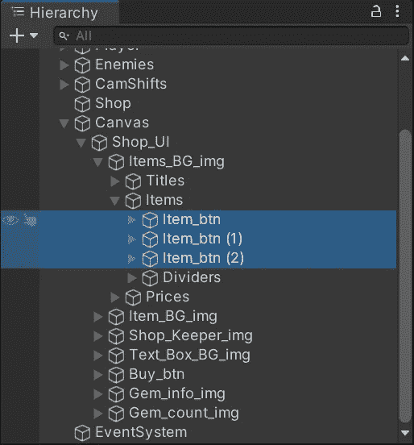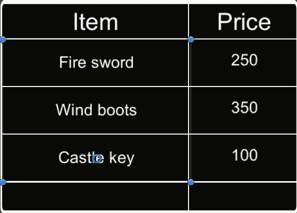

## 新输入系统

此外，由于我们正在使用 Unity 的“新”输入系统，我们需要替换来自 **EventSystem** gameobject 的**独立输入模块**组件，每次我们在场景中创建画布时都会创建该组件。这样，我们就能毫无困难地点击每个按钮。

> 注:如果您使用的是传统输入系统，请跳过这一步。

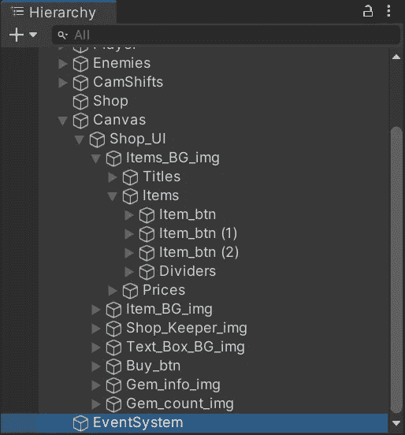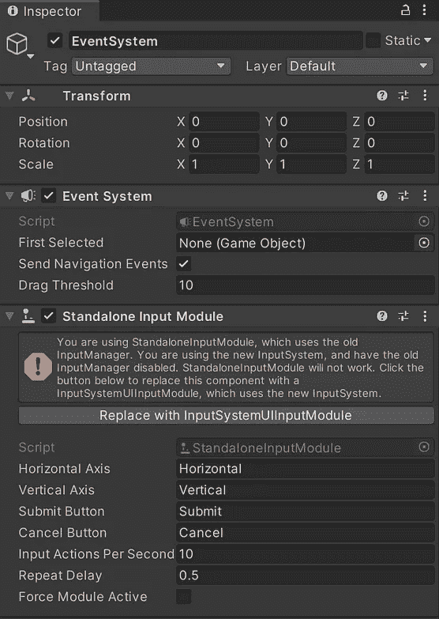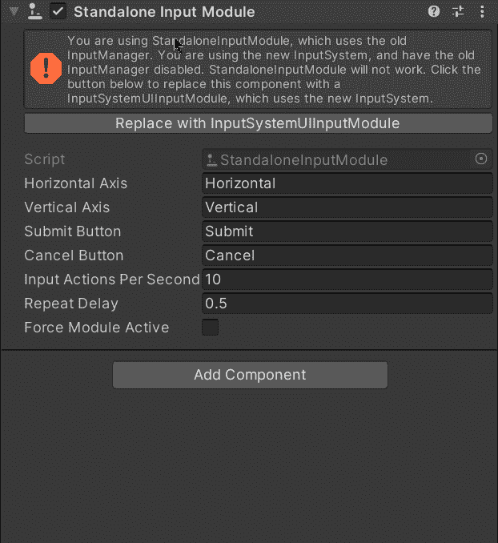

# 创建车间技工

现在，让我们开始在一个新的 C#脚本中创建车间机制:

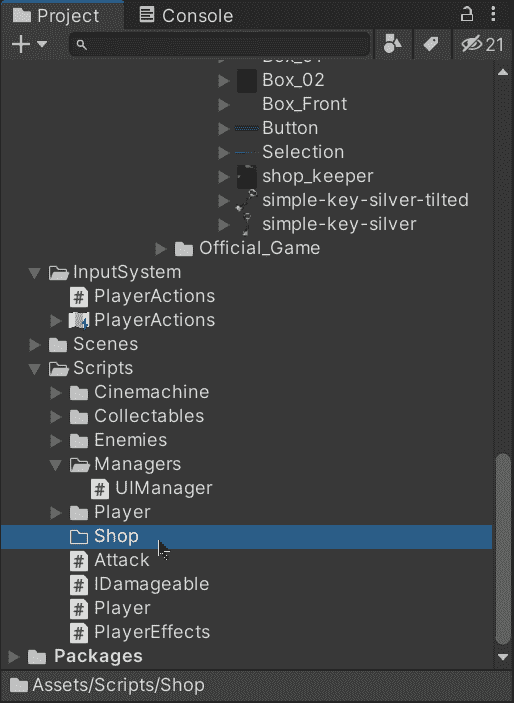

创建完成后，让我们从 **UnityEngine** 库中导入 **UI** 名称空间，以便能够处理我们代码中的 UI 元素:

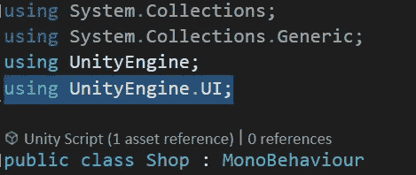

然后，让我们创建两个新的变量来引用对话文本和商店中的商品图片。不要忘记将**【serialize field】**与私有变量一起使用，以便能够将引用拖动到检查器:

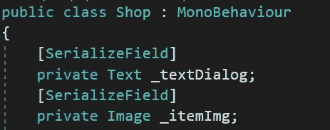

接下来，让我们创建一个新的公共方法，它将接收一个类型为 **Item** 的可脚本化对象作为参数。然后，当一个项目被选中时，我们将使用它来更改对话框中的文本和相应的图像:

> 注意:我们可以接收其他信息作为参数来实现我们的目标，但是我们使用可脚本化的对象，因为它们是存储信息的好方法。

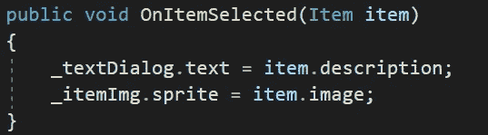

类型为**项目**的可脚本化对象包含以下信息:

*   名字

该属性将存储我们项目的名称。我们在名字前使用**新的**关键字来避免命名的麻烦，因为 Unity 使用**名字**关键字来存储每个创建的游戏对象的名字。

*   费用

该属性将以钻石的形式存储物品的价值。

*   图像

该属性将存储该项中相应的 sprite。

*   描述

该属性将存储项目的描述。

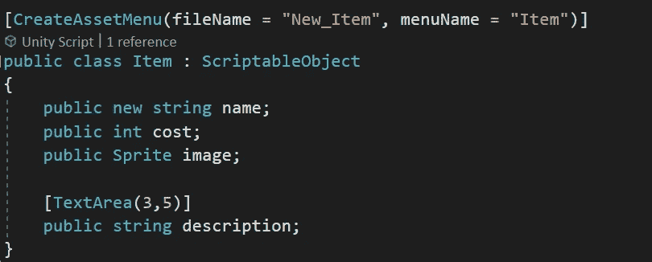

因此，定义了可脚本化的对象后，让我们为商店中的每个商品创建一个对象，并通过检查器定义各自的属性:

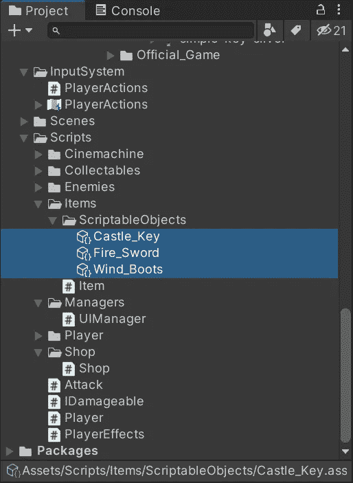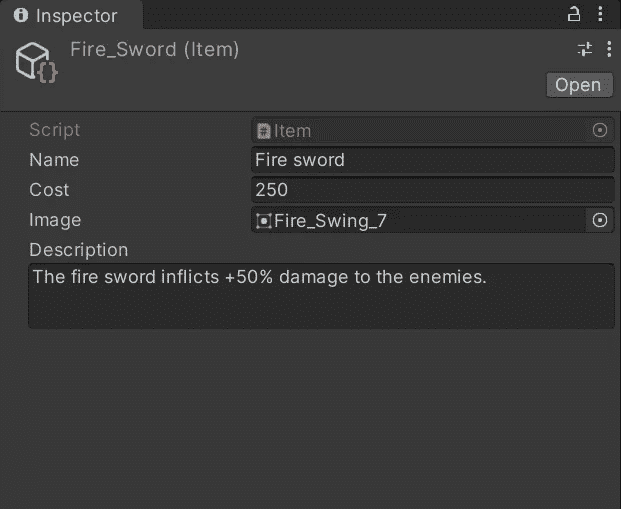

然后，让我们将**商店**脚本附加到商店游戏对象中:

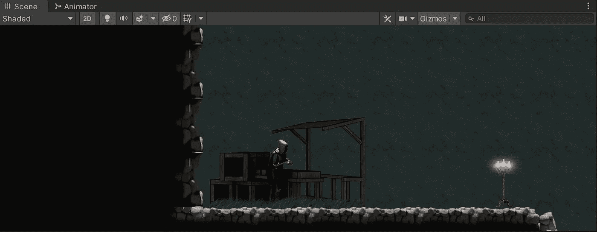

连接后，让我们将 UI 元素的引用拖动到检查器:

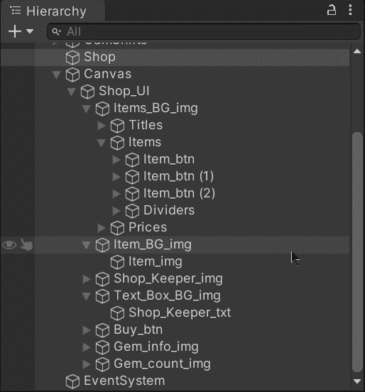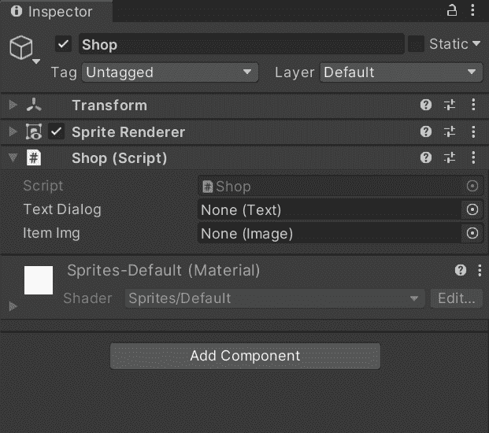

# 使用 OnClick 事件

现在，为了在我们点击商店的按钮时显示各自的信息，让我们使用 UI 按钮的 OnClick 事件来调用**商店**类中各自的方法。

要使用它们，让我们:

*   选择按钮并在按钮组件中添加一个 OnClick 事件。
*   将商店游戏对象(带有**商店**类组件)拖到 OnClick 事件中。
*   当按钮被选中时，选择我们创建的方法。
*   将相应的可编写脚本的对象拖到 OnClick 事件中，作为参数发送。

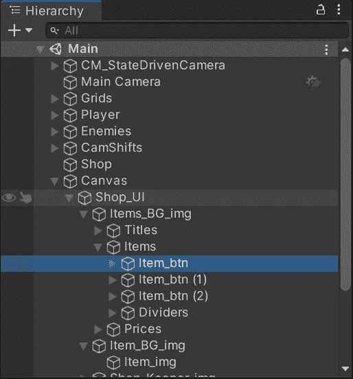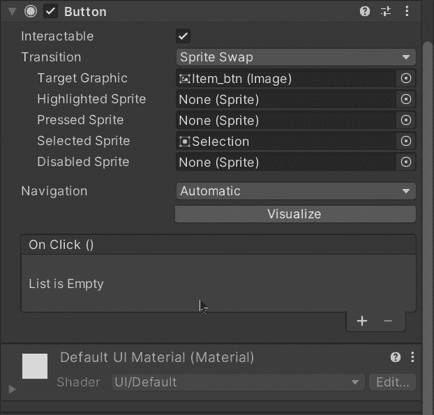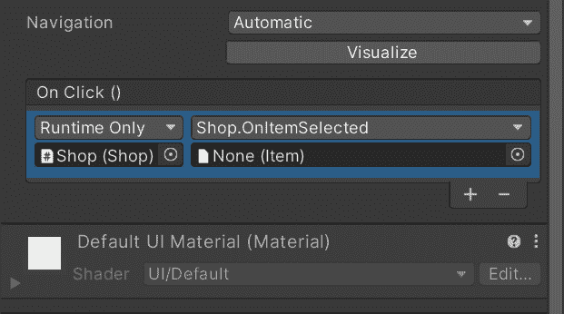

现在，如果我们用 Unity 运行游戏，我们会看到当我们单击每个按钮时，描述和图像 UI 元素会发生变化:

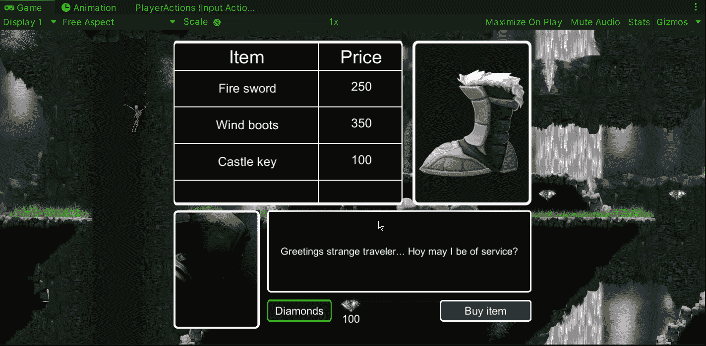

就这样，我们使用 UI 元素中的 OnClick 事件来统一显示信息！:d .下一篇文章再见，我将展示如何用 Unity 在我们的游戏中实现跨平台输入。

> *如果你想了解我更多，欢迎登陆*[***LinkedIn***](https://www.linkedin.com/in/fas444/)**或访问我的* [***网站***](http://fernandoalcasan.com/) *:D**