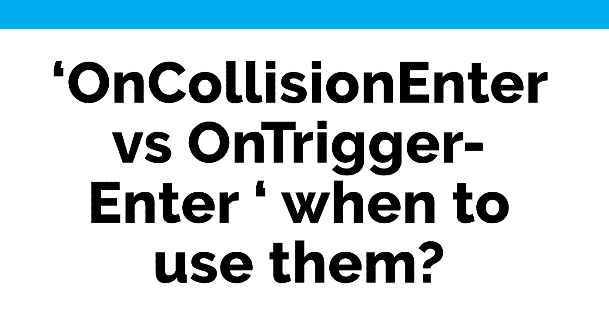
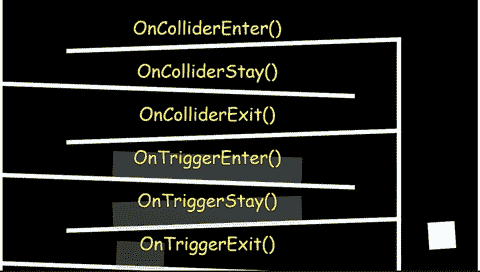

# OnCollisionEnter vs OnTriggerEnter '何时使用它们？

> 原文：<https://medium.com/nerd-for-tech/oncollisionenter-vs-ontriggerenter-when-to-use-them-37b08f3249a5?source=collection_archive---------8----------------------->

根据不同的情况，当物理碰撞或触发发生时，你需要使用 Unity 事件。一个事件允许你根据项目中当前发生的事情来执行你的代码，例如当游戏对象相互接触时它们之间的相互作用。

**碰撞**

两个或多个记录被赋予相同的标识符或在内存中的位置的情况。

Unity 区分了两种控制对象行为的方法，当它们相互作用或者**相互碰撞**时。

**肿瘤科医师**

***oncolissionenter(Collision other)***采用 [*碰撞*](https://docs.unity3d.com/ScriptReference/Collision.html) 类型参数，例如返回我们关于接触点的信息或碰撞发生时的速度。这是因为事件是在两个或更多对撞机相互作用的时候被探测到的。为了使这种方法有效，检测事件的对象必须有一个*刚体*附着其上。

***oncolissionstay(碰撞其他)*** 在*两个或两个以上物体*与*刚体*和*碰撞器*接触的每一帧被调用。

***oncolissionexit(碰撞其他)*** 在两个有刚体和碰撞器的物体**停止**接触时被调用一次。

**控制输入**

***【碰撞器其他】*** 取一个 [*碰撞器*](https://docs.unity3d.com/ScriptReference/Collider.html) 类型参数。这将返回关于被检测到的*碰撞器*的信息。检测到该碰撞的位置不一定是第一接触点。基本上， *OnTriggerEnter()* 用于返回进入碰撞器空间的*游戏对象*的信息。

***OnTriggerStay(Collider other)***每帧被调用一次，同时一个*碰撞器* **使**在空间与一个*触发区域*接触。

***OnTriggerExit(Collider other)***在*碰撞器*或*刚体* **停止使**与*触发区域*接触后被调用。

**结论**

***oncolissionenter()***通常用于检测或修改物理行为，而 ***OnTriggerEnter()*** 用于检测*触发区域*的目的，其中物理行为将被忽略。
这实际上取决于具体情况，以及我们想要检测并与之互动的对象或区域行为。

有关 Unity 活动的更多信息，请点击此处的。

← [上一张](/nerd-for-tech/introduction-to-physics-in-unity-8b3f9f467167) | [下一张](/nerd-for-tech/script-communication-in-unity-using-getcomponent-45fba58f322a) →