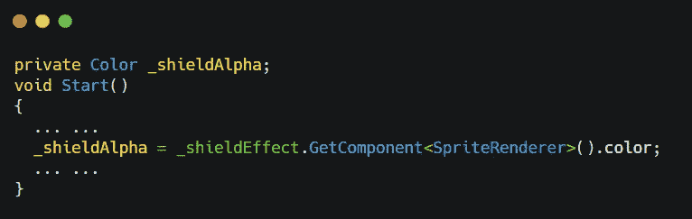
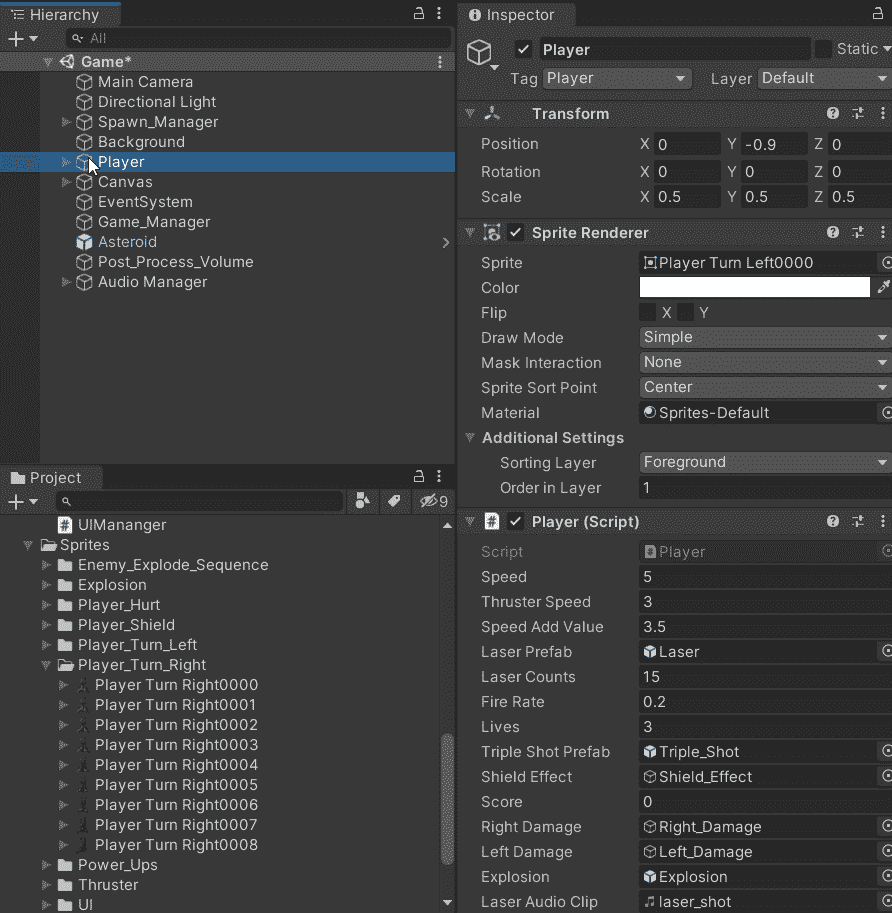
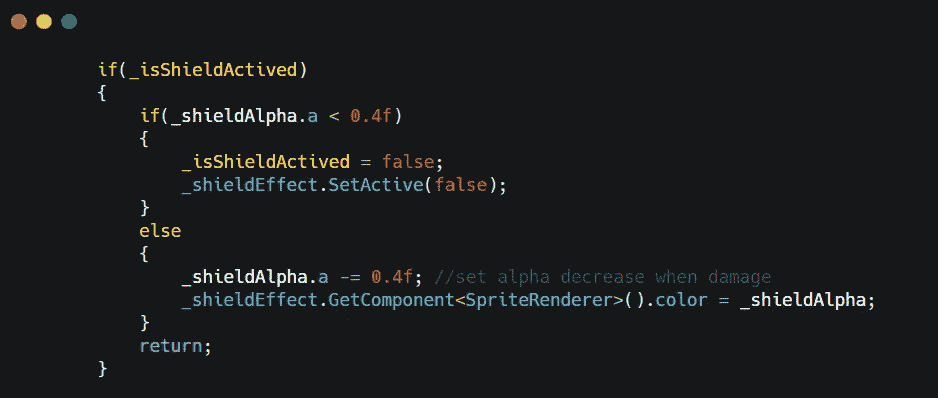
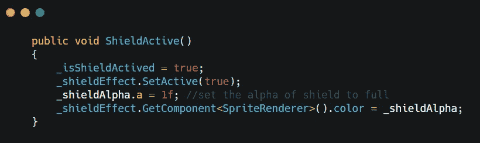
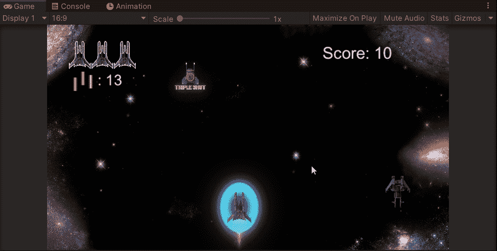

# 一个盾牌，三倍保护-游戏开发系列 33

> 原文：<https://medium.com/nerd-for-tech/one-shield-3-times-protection-game-dev-series-33-fa678f15ad56?source=collection_archive---------33----------------------->

目的:使护盾升级有三个等级的强度。

能量护盾只能阻止 1 次对玩家来说太残酷的攻击。我们可以创建一个三重防护盾来代替单一防护。

我首先想到的是如何呈现盾的等级。我认为降低盾牌精灵的不透明度会有明显的区别。不透明度值也是一个很好的变量，可以用来标识代码中的状态。

为了提取 sprite 内部的不透明度值，我们需要在 **SpriteRenderer** 组件中获取颜色值。
阅读 Unity 中 [Color 的文档，里面有 4 个值:R、G、B、A，最后一个“A”表示 alpha，这是我们需要改变的不透明度。](https://docs.unity3d.com/ScriptReference/Color.html)

创建一个颜色变量，然后在 **Start()** 中定位组件。

我们需要在编辑器中检查 alpha 颜色的取值范围。

在检查器中，你会看到 alpha 范围是从 0 到 1 *(如果你的范围是 0–255，不用担心，下面的代码也一样)*。这就是我们要在函数中改变的。我们将设定每次被攻击时，护盾的阿尔法值降低 25%。这个数值大约是 **0.3** 左右。由于最后一个状态会直接关闭 shield，我们将该值设置为 **0.4** 。

在 **Damage()** 的原 if 语句内设置另一条 if 语句。

在这个 if 语句中，当玩家在护盾保护期间受到第三次伤害时，护盾将被禁用，作为最后一次保护。

我们还需要在玩家启动盾牌时将值设置为 1。

然后我们可以测试我们的三重保护盾！

接下来:[损坏时相机抖动](https://sj-jason-liu.medium.com/camera-shake-when-damage-game-dev-series-34-9cca8c718603)