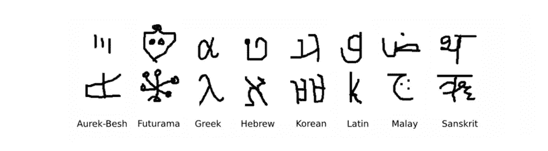
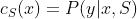
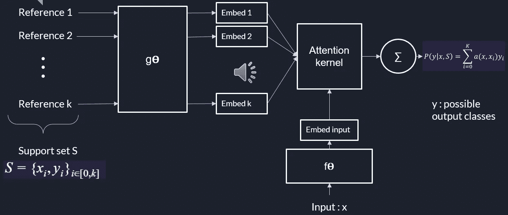
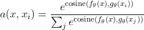
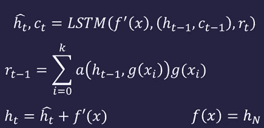
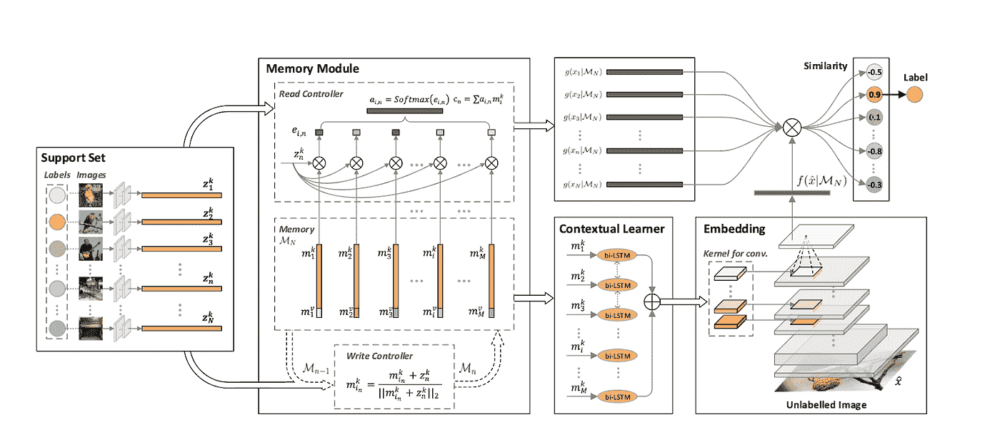
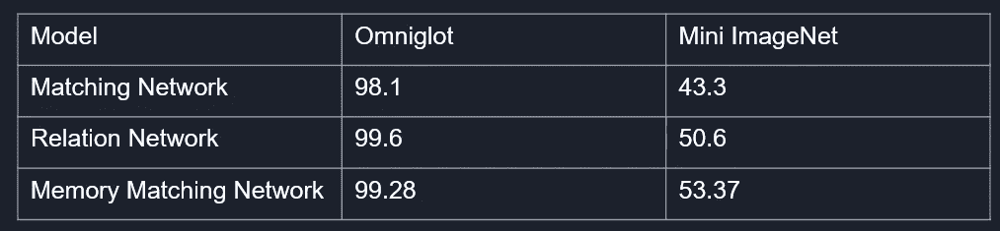

# 基于元学习的一次性图像分类

> 原文：<https://medium.com/nerd-for-tech/one-shot-learning-fe1087533585?source=collection_archive---------8----------------------->

## 简要背景

这篇博客是作为哥伦比亚大学 Parijat Dube 教授讲授的 class COMSE6998 实用深度学习系统性能系列研讨会的一部分发表的。我和我的朋友阿克塞尔查阅了 4 篇关于一次性学习的研究论文。在这篇博客中，我将总结其中的两篇论文。其他两篇论文可以参考他的[博客](/@ax2146/one-shot-learning-a23c29052d32)。

# 介绍

一次性学习是一种分类任务，其中模型必须通过仅查看每个类别的一个或几个训练示例来预测测试图像的类别。人类非常擅长一次性学习。年仅 3 岁的孩子只要看几个例子就能把猫和大象区分开来。我们能让机器以类似的方式学习吗？

一次性学习在签名验证和人脸识别等任务中很有用，在这些任务中，我们有许多类，但每个类的示例很少。此外，在这些任务中，类的数量可以保持变化，并且每次遇到新的类时训练模型是不可行的。例如，假设我们在一家公司有 100 名员工，我们想建立一个面部识别算法。我们可以训练一个在输出层有 100 个神经元的 CNN 来完成这个任务。当一个新员工加入组织时会发生什么？我们将不得不用 101 个班级重新训练这个模型。

为了在一次性学习中减轻这一点，我们建立了一个模型来生成图像的嵌入/表示，该嵌入/表示可用于测试期间的匹配，而不是建立一个模型来分类到一个确定的类别中。在这篇博文中，我们将会看到用于一次性学习任务的两种深度学习方法。

# 预赛

n 路 k-shot 分类的**任务是对来自 n 个不同类别**的实例进行分类，并为每个类别提供分类器 k 个实例。

## Omniglot 数据集

这个数据集由 50 个不同的字母组成，每个字符有 20 个手工绘制的样本。我们将在这个博客中介绍的模型的性能将在这个数据集上进行测量。对于一次性任务，模型将在没有共同字母的集合上训练、验证和测试，以使结果不会有偏差。

Omniglot 数据集

## 元学习

在少镜头分类的元学习中，我们试图在训练模型时模拟推理过程，即在训练期间，我们将把小批量的一些图像视为训练图像，而将其他图像视为测试图像，基于所选测试图像的损失来进行参数优化。

在本文中，我们不会深入元学习的细节。[【5】](https://lilianweng.github.io/lil-log/2018/11/30/meta-learning.html#training-in-the-same-way-as-testing)很好地概述了元学习的方法。

# 匹配网络

一次性分类模型的目标是学习训练图像的表示，通过计算相似性得分，可以利用该训练图像来对测试图像进行分类。Oriol Vinyals 等人[【2】](https://proceedings.neurips.cc/paper/2016/file/90e1357833654983612fb05e3ec9148c-Paper.pdf)提出的匹配网络考虑了整个支持集(训练集)来计算两幅图像之间的关系得分和相似度。

该模型被训练成将作为图像和标签集合的支持集 S = {x_i，y_i}映射到分类器，使得对于任何输入 x 和可能输出标签的向量 y，分类器给出不同标签上的分布:

匹配网络架构

S 的每个例子被参数θ的相同函数 g 嵌入，同时输入经历其嵌入。输入 x 和支持集 x_i 的每个例子之间的相似性通过具有余弦相似性的注意力核来测量:

概率分布将通过对各项求和来给出，就像上图中描述的那样。

# 匹配网络的嵌入

作者提出了两种类型的匹配网络嵌入。

## 简单嵌入

在简单版本中，嵌入函数是以单个数据样本作为输入的神经网络。我们可以设 f=g。

## 全上下文嵌入

匹配网络模型进一步提出通过除了原始输入之外还将整个支持集 S 作为输入来增强嵌入函数，使得可以基于与其他支持样本的关系来调整所学习的嵌入。

*   gθ使用双向 LSTM 在整个支持集 s 的上下文中编码 **x** i
*   fθ使用 LSTM 对测试样本 **x** 进行编码，并关注支持集 s 的“读取”

全上下文嵌入的工作原理:-

1.  首先，测试样本通过 CNN 嵌入层，提取该图像的特征(f’(x))
2.  然后，作为隐藏状态的一部分，利用支持集上的阅读注意力向量来训练 LSTM
3.  如果我们做 k 步“读”，最终 f(x，S)=h_k。

全上下文嵌入

这种嵌入方法被称为“全上下文嵌入(FCE)”。有趣的是，它确实有助于提高困难任务(mini ImageNet 上的少数镜头分类)的性能，但对简单任务(Omniglot)没有影响。

# 记忆匹配网络

在 2018 年的一篇论文中[【4】](https://openaccess.thecvf.com/content_cvpr_2018/papers/Cai_Memory_Matching_Networks_CVPR_2018_paper.pdf)Qi Cai 和他的团队提出了记忆匹配网络，该网络使用记忆块来存储训练集后的信息，并利用这些记忆块来获得关系分数。

下面显示的工作流程解释了内存匹配网络。

内存匹配网络架构

1.  存储器模块具有读控制器和写控制器。每当新的图像被添加到训练集中时，我们使用写控制器来更新存储器模块。
2.  作为上下文学习器，来自记忆槽的嵌入被输入到一个递归神经网络(RNNs)中，以**为未标记图像**预测 CNNs 的参数。
3.  支持集(g)的嵌入通过存储模块的读取控制器获得，并且未标记图像(f)的嵌入通过 CNN 层获得。
4.  使用 g 和 f 之间的相似性分数来预测标签

MM 网和匹配网的区别在于 CNN 参数的**上下文学习**使其对一次性任务更有用。

## 内存匹配网络性能

准确度五路一次分类

从上表中，我们可以看到，内存匹配网络在复杂的 mini Imagenet 集上的性能优于关系网和匹配 Met，但在简单的 Omniglot 集上的性能略差于关系网。因此，记忆匹配更适合处理困难的一次性任务。

# 结论

*   一次性学习是一个非常重要和活跃的研究领域。近年来出现了许多新技术。
*   一次性学习还有很大的提升空间。所有这些技术在 omniglot 集合上都表现良好，但在更复杂的集合上表现不佳。此外，这些模型对其他变化也很敏感。例如，如果一幅图像中的人戴着帽子、围巾或眼镜，而另一幅图像中的人没有戴，则准确性会大大降低。
*   最后，元学习方法(学会学习)带来了良好的泛化能力，对于一次性学习任务非常有用。

# 参考

[1]用于一次性图像识别的连体神经网络，Gregory Koch 等人:【http://www.cs.toronto.edu/~rsalakhu/papers/oneshot1.pdf 

[2]一击学习的匹配网络，Oriol viny als & al:[https://proceedings . neur IPS . cc/paper/2016/file/90e 1357833654983612 FB 05 E3 EC 9148 c-paper . pdf](https://proceedings.neurips.cc/paper/2016/file/90e1357833654983612fb05e3ec9148c-Paper.pdf)

[3]高光谱图像少镜头分类的深度关系网络，高魁良等:

[4]单镜头图像识别的内存匹配网络，齐蔡等:[https://open access . the CVF . com/content _ cvpr _ 2018/papers/Cai _ Memory _ Matching _ Networks _ CVPR _ 2018 _ paper . pdf](https://openaccess.thecvf.com/content_cvpr_2018/papers/Cai_Memory_Matching_Networks_CVPR_2018_paper.pdf)

[5]元学习:学会快速学习

[https://lilian Weng . github . io/lil-log/2018/11/30/meta-learning . html # training-in-the-same-way-as-testing](https://lilianweng.github.io/lil-log/2018/11/30/meta-learning.html#training-in-the-same-way-as-testing)