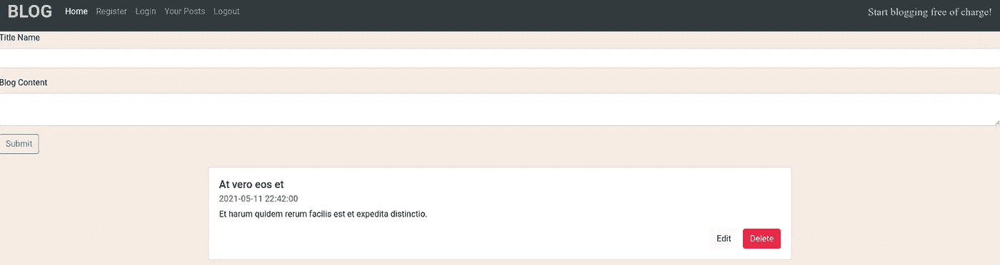
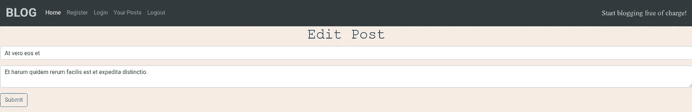
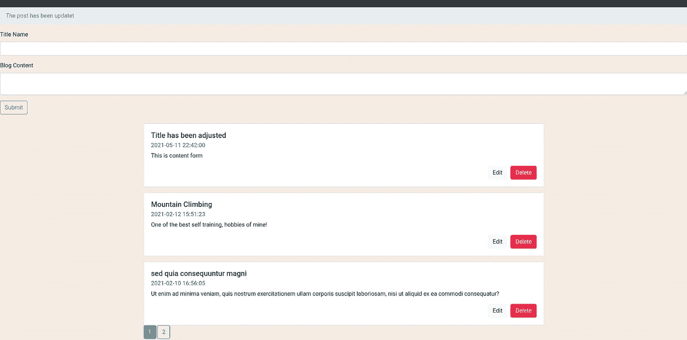
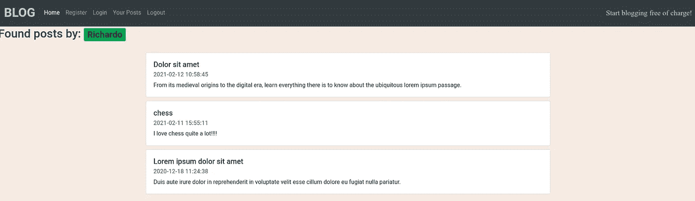
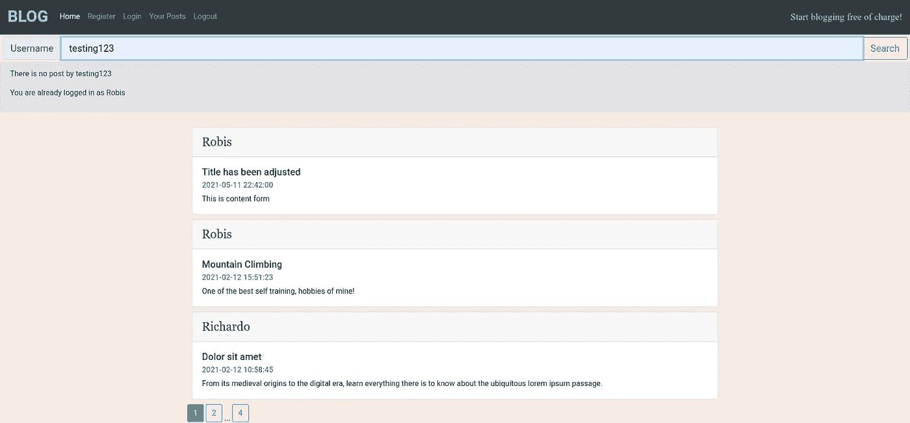
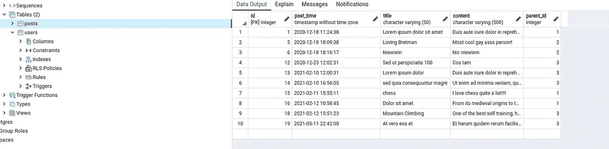

# 与 PostgreSQL 和 Flask 的一对多数据库关系(+CRUD)第 2 部分

> 原文：<https://medium.com/nerd-for-tech/one-to-many-database-relationship-crud-with-postgresql-and-flask-part-2-3e3e78255ef2?source=collection_archive---------12----------------------->


首先，这是第二部分，也是第一部分，如下所示:

[](/nerd-for-tech/one-to-many-database-relationship-crud-with-postgresql-and-flask-part-1-6f87fb574b7c) [## 与 PostgreSQL 和 Flask 的一对多数据库关系(+CRUD)第 1 部分

### 一对多关系是您必须掌握的东西(多对多也是一样)。我将使用我自己的项目作为…

medium.com](/nerd-for-tech/one-to-many-database-relationship-crud-with-postgresql-and-flask-part-1-6f87fb574b7c) 

我们将继续我们开始的地方，这里我们实际上进入了数据库关系部分，以及 CRUD 操作将如何操作。

# 您的帖子页面

那些你已经登录，然后你将能够创建一个**新职位，编辑**以及**删除**你的职位这里是如何功能的结构。

## 邮政

创建了 member() route，它将包括创建新帖子以及列出现有帖子。

```
page = request.args.get(‘page’, 1, type=int)
```

“page”用于分页，并将它设置为 type = int = 1

```
user_id = db.session.query(Users.id).filter_by(username = username).scalar()
user_posts = db.session.query(Posts).filter_by(parent_id=user_id)\.order_by(Posts.post_time.desc()).paginate(page=page, per_page=3)
```

我们在 user_id 中获取会话中的当前用户。user_posts 将通过使用 ***来查找来自该特定用户的所有**帖子**。filter _ by(parent _ id = user _ id)***按最新帖子排序。在**中。分页**模块每页最多有 3 篇文章。

初始化表单变量中的 PostForm，并获取相应的标题、内容值。

如果已提交，则发布并提交至数据库，重定向至**members.html。**



## 编辑

```
@app.route('/edit_post/<string:id>', methods= ["POST", "GET"])
def edit_post(id):
    post = db.session.query(Posts).filter_by(id = id).first()
    post_id = db.session.query(Posts.id).filter_by(id = id).first()
```

当我们想要编辑或删除帖子时，最好的选择是在 router 函数中添加一个 **id** 属性，这样我们就可以找到那个特定的**帖子**及其 **post_id。**

```
form = PostForm(obj=post)
if request.method == "POST":
    form.populate_obj(post)
```

正在创建新的表单实例，然后用编辑过的文章填充表单实例。

> 注意:当我们按下编辑按钮时，我们最终会重定向到 **edit_post.html**



## 删除

使用删除路由器功能非常简单，首先总是检查是否在会话中，然后获取 id 属性。

```
db.session.query(Posts).filter_by(id = id).delete()
db.session.commit()
```

完成后，我们重定向回 members.html

# 成员模板

为了简单和方便，模板在 gist 文件中有解释。

有人认为，只有当我们按下**编辑**时，我们才会重定向到该特定帖子的编辑模板，因为在 members.html 中无法做到这一点(至少我不这么认为)。

如果有不确定的地方，请随时询问或给❤建议！

# 编辑模板

因为它只包括编辑文章，它是一个非常短的模板。

帖子更新后，我们将返回到用户帖子页面。



上面你可以看到文章已经被调整。

Posts 数据库表应该看起来像这样。此外，您可以看到分页开始发挥作用，因为有“1”和“2”按钮，因为我们有超过 3 个用户的职位。

# 搜索用户

这是在主页上实现的，所以即使你没有登录，你也可以搜索用户的帖子！

首先，我们获取表单的“username”值，然后通过用户名查询 Users 表。如果找到了这个名字的用户，就获取所有的 user_posts 并按最近创建的顺序排列，render_template 到 s**earch.html**



当您已经搜索了用户名时

在主页中，搜索表单



您可以看到用户名输入字段，如果用户不存在，将会出现一条提示消息，说明您搜索的用户名下没有帖子。

## 帖子表



您可以在 posts 表中看到 parent_id 只有 1，2，3 个 its，因为我只创建了 3 个用户！

# 结论

这个项目是我迄今为止遇到的最具挑战性的项目之一，但同时也学到了很多东西，主要是关于数据库关系是如何工作的，我喜欢在前端/Flask web 框架中进行更深入的探索！

最肯定的是，这个项目有很大的增长和调整空间。我的进一步计划是在当前项目中添加[多对多](https://en.wikipedia.org/wiki/Many-to-many_(data_model))关系，以便更深入地了解。尽管如此，我希望你在一对多数据库关系、CRUD 操作和 Flask Web 框架方面学到了很多！

下面你会发现 GitHub 回购:

[](https://github.com/Mozes721/Flask_Blog_App) [## Mozes721/Flask_Blog_App

### 此时您不能执行该操作。您已使用另一个标签页或窗口登录。您已在另一个选项卡中注销，或者…

github.com](https://github.com/Mozes721/Flask_Blog_App)