# 一试| QC 解释

> 原文：<https://medium.com/nerd-for-tech/one-try-qc-explained-5b466c199616?source=collection_archive---------0----------------------->

[来源](https://www.greenbiz.com/article/how-quantum-computing-poised-support-sustainable-power-grids)

## 相位反冲与 Bernstein-Vaz 算法

*这个是技术性的。对量子计算基础感到生疏了吗？不要看。省省吧。把这篇文章收藏起来，等你复习完以后再看。你会很高兴你这样做了，特别是如果你是一个 QC 初学者，并试图了解相位反冲。*

我在想一个二进制数。

如果你想猜我的号码，有多少种可能就猜多少次。如果是`101101`，你将会尝试 64 次以上(2⁶)！

现在，如果你让我们日常使用的计算机来猜测这个数字，那么猜测的次数将会减少到数字的数量。因此，如果我再次选择`101101`，将需要 6 次尝试(如果你对为什么感兴趣，请查看[这个视频](https://youtu.be/sqJIpHYl7oo?list=PLOFEBzvs-Vvp2xg9-POLJhQwtVktlYGbY&t=112))。不错吧？

好吧，如果你有一台量子计算机，你就能在一次尝试中猜出我的号码——不考虑长度。听起来很疯狂吧？但这就是这个神奇的量子算法能做到的。这就是 Bernstein-Vazirani 算法，在本文中，我将向您展示它是如何工作的。

要开始，我们需要了解整个算法的主干:相位反冲。一旦你得到了它，算法本身就不在话下了。

*如果你一提到相对相位或叠加就头晕，我强烈推荐阅读一下***，它广泛涵盖了这些概念。**

# *相位反冲的“无特征向量”解释*

## *受控非量子门*

*为了让我们都在同一页上，让我们听取相位反冲的核心量子门:CNOT。受控非门(CNOT)是一个两个量子位的门，在第一个量子位(称为控制量子位)为 1 的条件下，对第二个量子位(称为目标量子位)进行比特翻转。如果控制量子位处于状态 0，那么它保持目标量子位(目标量子位)不变。这是它的电路示意图:*

*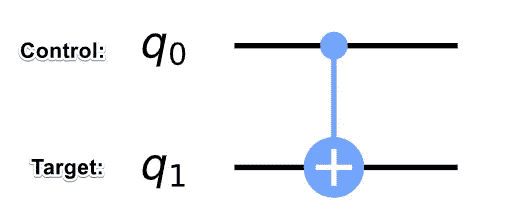*

*CNOT 电路表示: `q0` 为控制，q1 为目标*

*这是应用于每个计算基态的 CNOT:*

*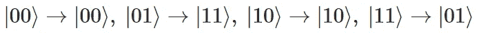*

*在符号上，首先是 q1，然后是 q0 ( **这个符号将适用于文章的其余部分**)*

## ***想到 CNOT 的更好办法***

*从数学上来说，我们会说状态`|01⟩`和`|11⟩`的振幅被交换了(参见上文),但当试图解释物理操作时，这并不成立，这是必须做出的一个关键区别。通常，我们会迷失在令人毛骨悚然的数学表达式中，忘记了像线性代数这样的工具——尽管很强大——仅仅是工具而已。它帮助我们将量子的不可思议抽象成连贯的表达，但归根结底，像 CNOT 这样的逻辑门是物理过程，因此我们应该这样看待它们。*

*我要求你们暂时忘记矩阵，实际想象量子态，因为它受到 CNOT 的影响。随着两个量子位穿越时间，如果它处于`|01⟩`状态，它将*变成*`|11⟩`——带走它的所有属性，包括振幅。*

*你可以把它想象成一个人搬进一所新房子。他/她进化到一个新的状态，但仍然拥有先前的大部分属性，如头发、肤色等。从时间演化的角度来看，物理上不同于认为它是*交换*状态。当我们处理相位反冲时，请记住这一点。*

## *那是什么呢？*

*如果我现在给你教科书上的定义，它会掠过你的脑海，所以让我们用两个不同的例子来建立它。第一个是相位反冲的无意义应用，但它有助于我们理解相位反冲产生真正效果的必要条件。我们构建的第二个电路将添加一个来自前一个电路的功能，这将完全改变电路结果。*

## *当相位反冲发生时，但没关系*

*让我们建立我们的第一个电路。我们使用一个 X 门将“控制量子位”置于`|1⟩`状态，然后应用一个 X 门和一个哈达玛将“目标量子位”的状态带到`H(X|0⟩)`。这是目前状态和电路的样子:*

*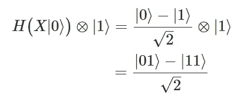**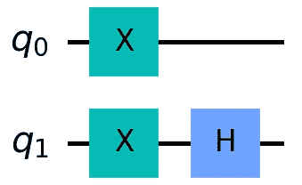*

*接下来，我们应用 CNOT 门…*

*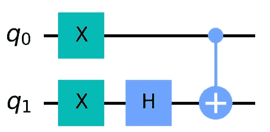*

*注意，在 X 门应用于`q1`(作为 CNOT 的一部分)的情况下，`q1`的状态向量已经在 X 轴上了(我鼓励你通过在 Bloch 球体上绘制来检查)，因此它不会影响`q1`。很奇怪，不是吗？我刚刚告诉你**目标量子位将保持不变**，不管控制量子位的状态如何！让我们一步一步来:*

*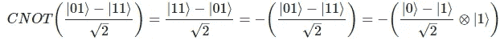*

*注意最后一步在整个量子态前面有一个负号，这可以作为全局相位忽略。如果你不知道那是什么，看看这篇文章的最后一部分。*

*哇，不仅`q1`没有被触及，而且将 CNOT 应用到我们的量子态也没有做任何事情，因为我们刚刚修改了全局相位！钻这个家，下面两个量子态物理上是等价的。*

*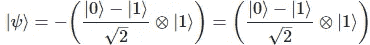*

*所以，是的，CNOT 实际上并没有改变我们的量子态，但有一些更重要的事情需要注意，`-|11⟩`变成了`-|01⟩`，而`|01⟩`进化成了`|11⟩`，这表明 `**q1**` **的**相对相位被“踢”到了** `**q0**` **。** **但这并不重要，因为将一个阶段应用于一个计算基础状态会使其全局化。**这是与上面相同的证明，但是有一个详细的步骤来指示`q0`上的相位反冲。***

*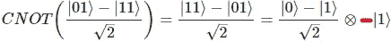*

*请注意，这与之前的量子态完全相同，只是|1 `⟩` (q0)上现在有一个负相位，但如上所述，这可以分解出来，得到与我们开始时相同的量子态。*

*在这种情况下，相位反冲没有影响，因为第二个量子位处于计算基态，然而，情况并不总是这样，所以让我们看一个例子，这种现象实际上很重要。*

## *关键区别*

*我们的第二条赛道将与上一条相似，但有一个关键区别。我们将应用 Hadamard，而不是在`q0`上应用 X gate。让我们看看电路是什么样子的。*

*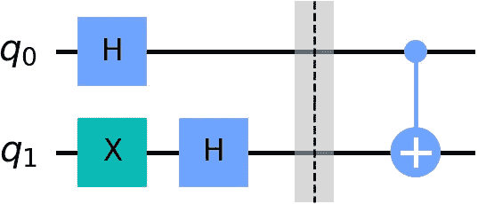*

*我在哈达玛和 CNOT 之间插入了一个屏障，这样我们就可以检查 CNOT 前后的量子态。在应用 CNOT 之前，让我们看看状态向量是什么。*

*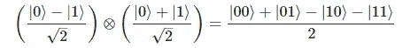*

*好，那么当我们应用 CNOT 时会发生什么？我们知道 CNOT 门将状态从`|01⟩`演化到`|11⟩`，反之亦然。在我们的电路中，我们观察到两个基本状态`|01⟩`和`-|11⟩`，因此将赌注押在`|01⟩ → |11⟩ ; -|11⟩ → -|01⟩`上是合理的。让我们看看我们是否正确。*

*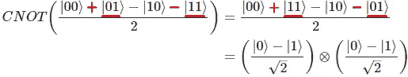*

*对 q1 应用 CNOT 将 q1 的相对相位提升到 q0*

*万岁！我们是对的！这是相位反冲起作用的一个典型例子。观察到`q0`在 CNOT 之前没有相对相位，但是在应用门之后，我们可以看到它有相对相位`-1`。发生了什么事？目标量子位不仅不受影响，还将其相对相位踢到了`q0`。*

## *论控制与目标*

*我在这篇文章中经常使用术语*控制*和*目标*，但是说实话，这并不完全正确。称`q0`为*控制*量子位意味着它坐落在一个基座上，对`q1`进行全面控制，但事实并非如此。如相位反冲所示，`q0`经常会受到影响。更好的理解 CNOT 的方式是将`|01⟩`转换成`|11⟩`的物理操作，反之亦然。*

*所以在那个镜头下，`q0`吸收了一个相对相位是有道理的。CNOT 把状态`|11⟩`转换成`|01⟩`，所以如果有一个伴随的阶段是`|11⟩`，它会自然地进入新的基态:`-|11⟩ --> -|01⟩`。*

*为了避免模糊的含义，我将把控制量子位称为辅助量子位。*

*我们现在理解了 CNOT 背景下的相位反冲，但这种现象在其他情况下也会发生。*

## *是时候给出一个广义的定义了*

*子弹时间到了:*

*   *众所周知，所有的量子逻辑门都是酉的，可以认为是在布洛赫球上的旋转*
*   *对本征态进行幺正运算，意味着你对一个状态向量进行了旋转，这个状态向量在你旋转的轴上。自然地，旋转不会物理地影响状态向量**，但是它增加了一个全局相位**。*
*   *例如，如果我在状态为 Hadamard 基(在 X 轴上)时应用 X 门，那么将不会发生任何事情，因为 X 门绕 X 轴执行π旋转。然而，一个全局阶段将被添加到状态中，因此它现在位于`e^iπ|+⟩`或`-|+⟩`中。*

*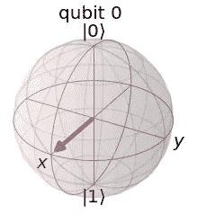*

*幺正 X 门的本征态*

*当你对一个处于酉本征态的目标量子位进行受控操作时，本质上发生的是，你在目标量子位上附加了一个全局相位。*

*通常情况下，这并不重要，但由于这是一个受控的操作，目标量子位将处于已经发生和没有发生这个全局相位的叠加状态。因此，在具有全局相位和不具有全局相位的量子状态(包括从属状态)之间产生了一个相对相位。*

***这意味着辅助量子位现在具有与应用于目标量子位的全局相位相等的相对相位。**这种现象就是我们所说的相位反冲。*

## *为什么是受控操作？*

*   *如果我们不使用受控操作，它将针对所有国家，因此我们将引发一个全球阶段。*

# *最简单的部分——Bernstein Vazirani 算法*

*既然我们已经知道了什么是相位反冲，我们可以使用 Bernstein Vazirani 算法一次性猜出任意数字。*

## *步骤 1:将量子位初始化为 0*

*在你知道你的二进制数是多少后，将量子位初始化为`|0⟩`。*

> *但是量子比特有多少呢？*

*一般来说，你需要的量子比特数等于你的数字中的二进制数字加上一个额外的数字。让我们以`1010`为例来创建这个电路。对于这个例子，我们需要 5 个量子位(4+1)。*

*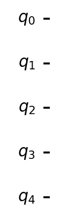*

## *第二步:哈达玛一切！*

*为了访问叠加态中所有可能的状态，我们将对每个量子位应用哈达玛。然而，对于最后一个量子位，我们将在哈达玛之前应用一个 X 门，使得该量子位具有负的相对相位。我将在接下来的步骤中解释这最后一个关键量子位的用途。*

*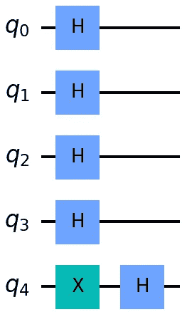*

## *第三步:哈达玛三明治*

*由于 Hadamard 门是单一的，应用它两次会恢复第一个 Hadamard 门施加的变换。如果两个哈达玛门之间没有任何东西，它将返回`|0⟩`。但是 Hadamard 三明治的要点是巧妙地在三明治中放置某些门，这样它就能告诉我们一些关于这个州的信息。下一步会有更多的介绍。*

*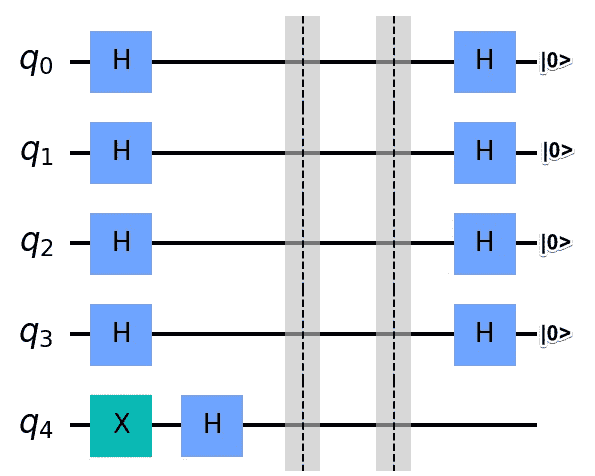*

## *第四步:用神谕填满三明治*

*哈达玛三明治中间的部分至关重要，这中间的部分是神谕。先知的工作是辨别正确的数字和我们输入的数字，在这种情况下，我们输入所有可能的叠加数字。*

*怎样才能分辨出正确的数字？好吧，如果你还记得我们从相位反冲中学到的东西，我们可以利用`q4`有一个负相位的事实，利用 CNOT 有策略地将这个相位分配给其他量子位。如果我们将目标量子位设置为`q4`，并为二进制数中为 1 的每个数字连接一个 CNOT，那么我们就可以为这些量子位中的每个量子位设定一个负相位。`q4`的要点仅仅是通过使用 CNOTs 给每个代表 1 的量子位分配负的相对相位。这将“1”量子位与其他量子位区分开来。哈达玛的最后一行将把“1”量子位转换成`|1⟩`，其余的转换成`|0⟩`；从而给我们一个随机数。*

***澄清:***

*回想一下，除了最后一个量子位，每个量子位都代表我们选择的二进制数中的一个数字。因此，对于每一个代表数字 1 的量子位，我们将设置这些量子位作为目标为`q4`的 CNOT 的控制。这对`q4`没有任何作用，但它会将负的相对相位踢回代表 1 的二进制数字的每个量子位。因为我们的编号是`1010`，所以我们的电路看起来像这样:*

*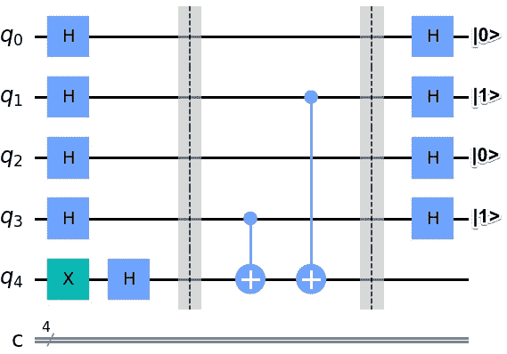*

*你可能已经注意到，我们已经对神谕进行了编码，使得电路对任何被认为代表二进制数 1 的量子位进行比特翻转。*

> *难道我们不需要知道答案来制造神谕吗？感觉像出轨…*

*一开始使用 oracle 可能看起来不舒服，因为我们在技术上使用解决方案数据来制作它，但是没有其他方法来区分输入和解决方案。即使是经典计算机的黑匣子也知道答案，但仍然需要更长的时间来解决它。**这个算法的巧妙之处在于，利用叠加和相位反冲，可以在 1 次尝试中发现未知数。***

*在这些琐碎的例子中，我们会预先知道解决方案，但是随着我们在量子计算方面的进展，神谕将被制造成能够辨别解决方案和输入；你不需要知道解决方法。*

## *第五步:测量*

*在测量了除最后一个以外的所有量子位之后，我们可以一次就得到我们的随机数！*

*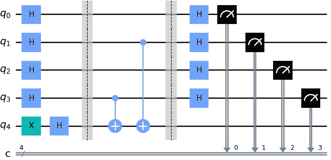*

*解决 1010 问题的电路的完整电路图*

*不出所料，以下是统计数据:*

*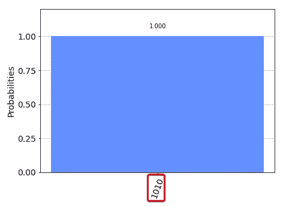*

*正如承诺的那样，我们获得了`1010`赛道的成绩！*

# *概述*

*这已经很多了，下面是要点:*

*   *为了记住相位反冲，回想一下 CNOT 的例子。具有负相位的基态切换到另一个基态，使得副量子位现在也具有负的相对相位。*
*   *Bernstein Vazirani 算法利用相位反冲来标记所有为 1 的二进制数字，使我们能够一次测量整个数字。*

***如果你喜欢这篇文章或学到了新东西，请随时在** [**LinkedIn**](https://www.linkedin.com/in/pavan-jayasinha-6b06b71b6/) **或** [**上联系我，在我的每月简讯中查看我在做什么**](https://www.subscribepage.com/pavanjaynews) **。***