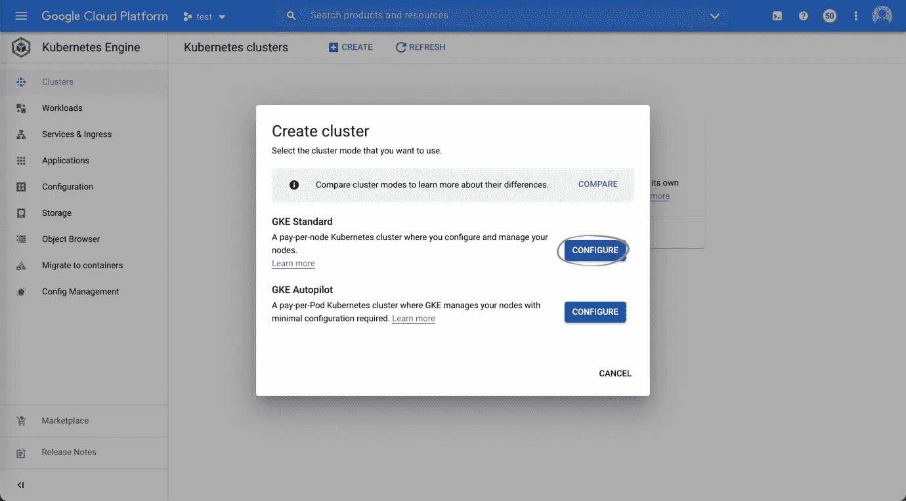
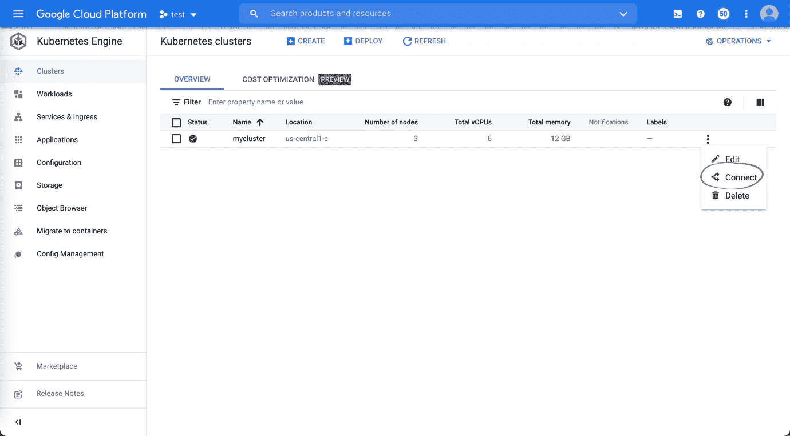
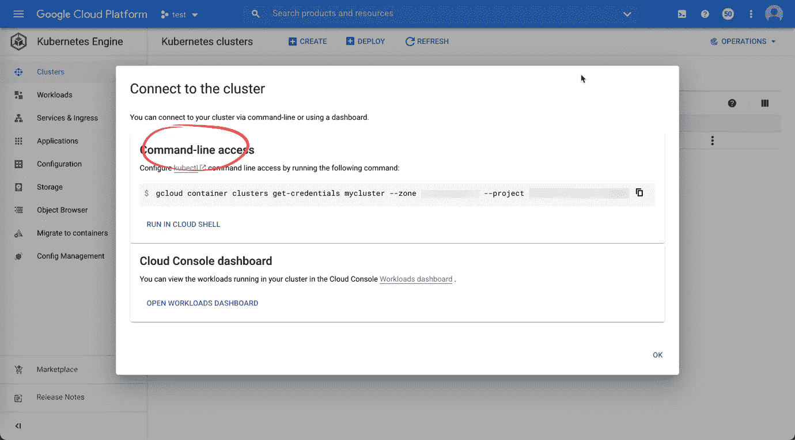

# OneDev 与 Kubernetes 和 LetsEncrypt

> 原文：<https://medium.com/nerd-for-tech/onedev-with-kubernetes-and-letsencrypt-c63d16a3a31?source=collection_archive---------5----------------------->


OneDev 是一个开源的 git 服务器，具有内置的发布板和 CI/CD 功能。

本教程解释了如何将 OneDev 部署到 Kubernetes 集群中以获得一个成熟的 CI/CD 场，并使用 LetsEncrypt 对其进行保护。

我们将使用 Google Kubernetes 引擎进行演示，根据我的经验，这个引擎的设置和维护最为方便。

1.  使用所有默认选项创建标准 GKE 集群



2.创建集群后，配置 kubectl 以连接到集群



3.确保安装了[头盔](https://helm.sh/docs/intro/install/)，运行以下命令安装入口 Nginx 控制器和证书管理器:

```
$ helm install ingress-nginx ingress-nginx --repo https://kubernetes.github.io/ingress-nginx --namespace ingress-nginx --create-namespace
$ kubectl apply -f https://github.com/jetstack/cert-manager/releases/download/v1.6.0/cert-manager.yaml
```

4.运行以下命令获取 nginx 控制器的外部 ip 地址:

`$ kubectl get service ingress-nginx-controller -n ingress-nginx`

5.配置您的 dns 提供商以添加一个`A`记录，从而将 OneDev DNS 名称与上述外部 ip 地址相关联。等待一段时间，让 DNS 条目展开(您可以 ping DNS 名称，看看它是否返回正确的 ip 地址，以确保)

6.现在，使用以下命令将 OneDev 部署到集群中(将<onedev dns="" name="">替换为上述 DNS 名称，将<an email="" address="">替换为用于接收 LetsEncrypt 证书通知的电子邮件地址):</an></onedev>

```
$ helm install onedev onedev --repo https://dl.cloudsmith.io/public/onedev/onedev/helm/charts --namespace onedev --create-namespace --set ingress.host=<OneDev DNS name> --set ingress.tls=true --set letsencrypt.email=<an email address>
```

有关 OneDev 图表可配置值的完整列表，请查看 [values.yaml](https://code.onedev.io/onedev/server/~files/main/server-product/helm/values.yaml) 文件

7.请等待 OneDev 部署完成。如果一切正常，您应该可以访问位于`https://<OneDev DNS name>`的 OneDev。如果它不工作，请遵循本指南解决名称空间`onedev`中证书`onedev-tls`的问题

8.如果您还希望启用对 OneDev 存储库的 SSH 访问，请运行以下命令来配置 Nginx 控制器的 tcp 端口

```
helm upgrade ingress-nginx ingress-nginx --repo https://kubernetes.github.io/ingress-nginx --namespace ingress-nginx --create-namespace --set tcp.22=onedev/onedev:22 --reuse-values
```

然后将 OneDev 端的`SSH server url`(通过菜单*管理/安全设置/ SSH 设置*)更新为`ssh://<OneDev DNS name>`

感谢阅读！