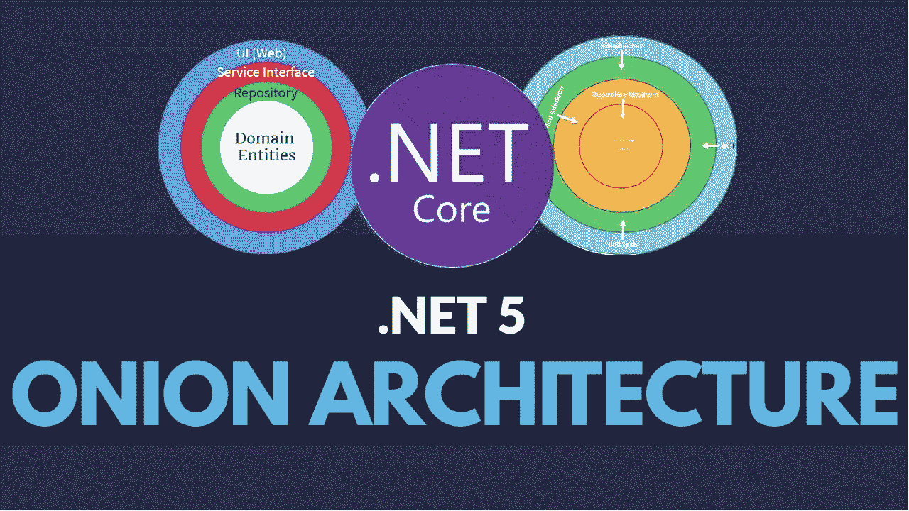
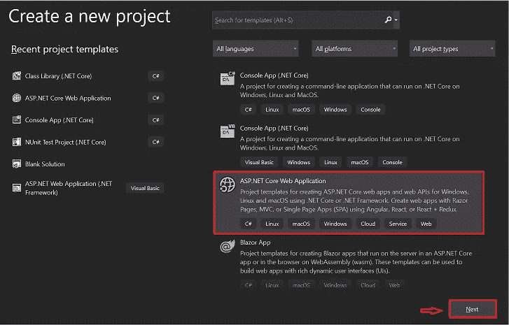
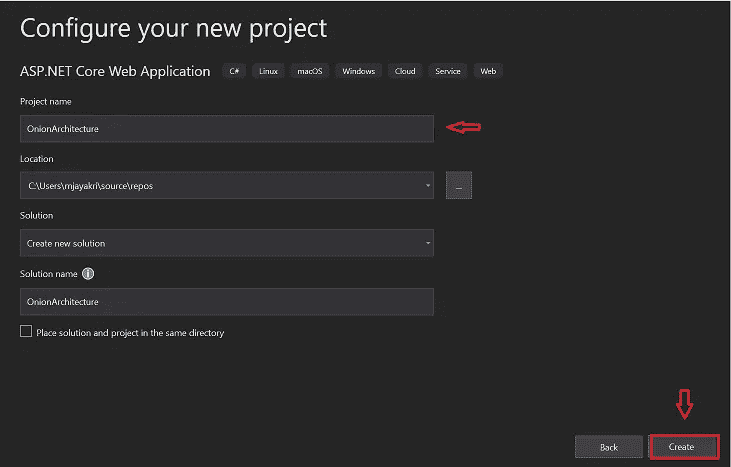
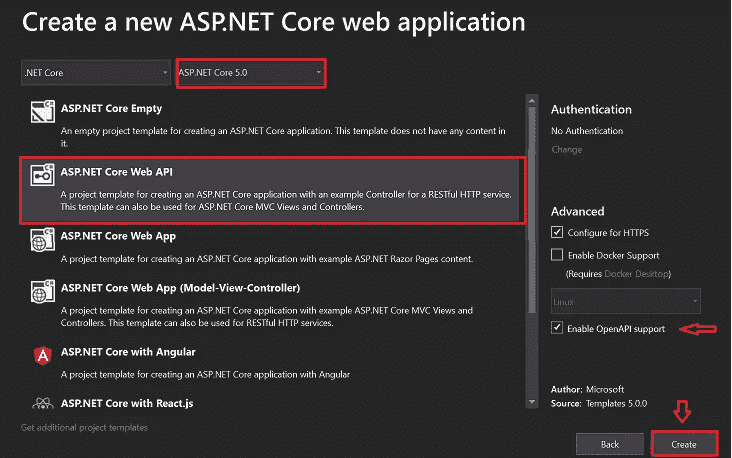
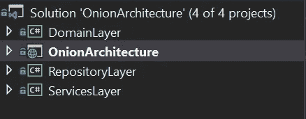
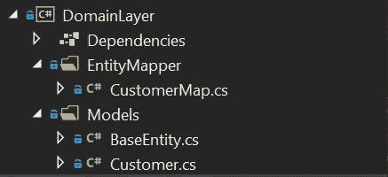
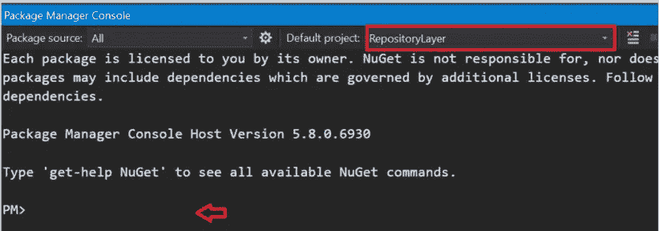
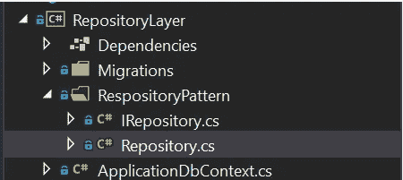
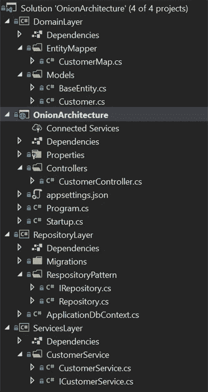
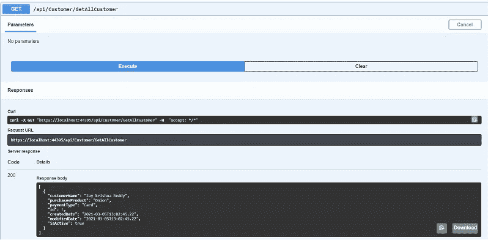

# 洋葱建筑在。网络 5

> 原文：<https://medium.com/nerd-for-tech/onion-architecture-in-net-5-deb04efe9df0?source=collection_archive---------0----------------------->

洋葱建筑图

在本文中，我们将介绍 ASP.Net 5.0 中的洋葱架构。众所周知，这是一个新推出的框架，于 11 月正式发布。在这里我分享了为[安装 SDK 的链接。网 5](https://dotnet.microsoft.com/download/dotnet/5.0)

*支持我*

**我们将要讨论的内容。NET 5 洋葱架构？**

*   什么是洋葱建筑
*   洋葱状建筑的层次
*   洋葱架构的实现
*   利弊

# 洋葱建筑是什么？

习惯设计的很大一部分提出了紧密耦合和关注点划分的基本问题。Jeffrey Palermo 认为洋葱架构提供了一种在更好的可测试性、实用性和稳定性的背景下构建应用程序的优越方法。洋葱体系结构倾向于 3 层和 n 层体系结构所面临的困难，并给出了普通问题的答案。洋葱设计层通过使用接口相互关联。

# 洋葱状建筑的层次

基本上，它使用了层的概念，但它们不同于 3 层和 N 层。让我们深入了解每一层。

**域层**

它存在于洋葱架构的中心部分，由所有应用程序域实体组成，这些实体只不过是由代码优先方法创建的数据库模型。在这个项目中，我使用了 Fluent API 来创建使用实体框架的表模式

**储存库层**

存储库层充当服务和模型对象之间的中间层，在这一层中，我们将维护所有数据库迁移和应用程序数据上下文对象，在这一层中，我们通常添加接口，这些接口将由涉及数据库的读写操作的数据访问模式组成。

**服务层**

该层用于存储库层和主项目之间的通信，其中包含可公开的 API。服务层也可以保存实体的业务逻辑。在这一层，服务接口与它们的实现保持分离，以实现松散耦合和关注点的分离。

**UI 层**

UI 只是一个前端应用程序，它将与这个 API 进行通信。

# 洋葱架构的实现

创建新项目

图一

单击“下一步”按钮后，添加项目名称和解决方案名称，然后单击“创建”按钮

图二

在下拉列表中选择 ASP.Net 核心 5.0 模板，并确保检查**启用开放 API** 对项目中默认 Swagger 实现的支持

图三

默认项目将被创建，现在我们需要 3 个空的**类库(。Net Core)** 项目在这个应用程序内部作为

*   域名持有者
*   仓库层
*   服务杀手

图 4

我们将首先从领域层开始

**域层**

**该层使用的包**

*   微软。实体框架工作核心(5.0.3)
*   微软。EntityFrameworkCore . Relational(5 . 0 . 3)

创建一个名为 **Models** 的文件夹，并在其中创建 customer 类和 BaseEntity 类，Customer 类调用这个基本实体

***BaseEntity.cs***

**customer . cs**

因此，现在我们将使用这个 customer & base 实体类创建实际的表。为此，创建一个单独的文件夹 EntityMapper，我们将在该文件夹中维护所有的表模式

***customer map . cs***

**域层结构**

图五

***储存层***

**该层使用的包**

*   微软。实体框架工作核心(5.0.3)
*   微软。实体框架工作核心设计(5.0.3)
*   微软。EntityFrameworkCore . SQL server(5 . 0 . 3)
*   微软。实体框架工作核心工具(5.0.3)

到目前为止，我们在域层中设计了我们的表，现在将使用 SQL DB 中的迁移命令创建相同的表。让我们在主项目中创建连接字符串。

***appsettings . JSON***

在 ConfigureMethod 下的 startup.cs 文件中设置连接

**startup . cs**

现在切换回存储库层，创建一个 DataContext 文件，它表示与数据库的一个会话，可以用来查询和保存实体的实例

***applicationdbcontext . cs***

让我们使用迁移命令在 SQL 中创建表。打开软件包管理器控制台，将默认项目切换到 Repositorylayer，并依次执行以下命令。

图 6

要执行的命令

*   添加迁移' CreateCustomerTable '
*   更新-数据库

ASP。Net Core 的设计就是为了支持依赖注入。现在我们为实体操作创建一个通用的存储库接口，这样我们就可以看到松散耦合的应用程序。下面是代码片段

***I repository . cs***

创建 repository 类来执行继承 IRepository 接口的数据库操作。

***repository . cs***

***知识库层结构***

图 7

# 服务层

这包含了作为我们项目一部分的核心业务逻辑，它充当了存储库层和控制器之间的一个层。

**icustomerservice . cs**

***customerservice . cs***

在 startup.cs 文件中配置这些服务

**startup . cs**

在客户控制器中创建可向 UI(前端应用程序)公开的 API 方法

***customer controller . cs***

**洋葱架构项目结构**

图 8

让我们运行并测试这个应用程序，检查 swagger 或 postman 中的输出。

图 9

因为我已经使用 InserCustomer API 在数据库中插入了一条记录，所以我们将通过执行 Get ALL Customers API 来查看数据。

图 10

# 洋葱架构的利与弊

以下是实现洋葱架构的优势:

*   洋葱架构层通过接口联系在一起。在运行期间进行植入。
*   应用工程是基于区域模型之上的。
*   所有外部依赖，类似于数据集准入和管理调用，都在外部层处理。
*   内层没有外层的条件。
*   联轴器朝向中间。
*   适应性强、可行、方便的设计。
*   没有令人信服的理由让正常和共享的活动。
*   可以立即尝试，因为应用程序中心不依赖任何东西。

洋葱架构的几个缺点如下:

*   业余爱好者很难理解，包括期望吸收信息。建模者通常会混淆层与层之间的分离义务。
*   大量使用的界面

 [## JayKrishnareddy/onion architecture

### ASP.NET 核心 5.0 中的洋葱架构包括流畅的 API、Swagger、依赖注入、工作单元什么是洋葱…

github.com](https://github.com/JayKrishnareddy/OnionArchitecture) 

希望这篇文章能帮助你清楚地了解洋葱架构。

….继续学习！！！