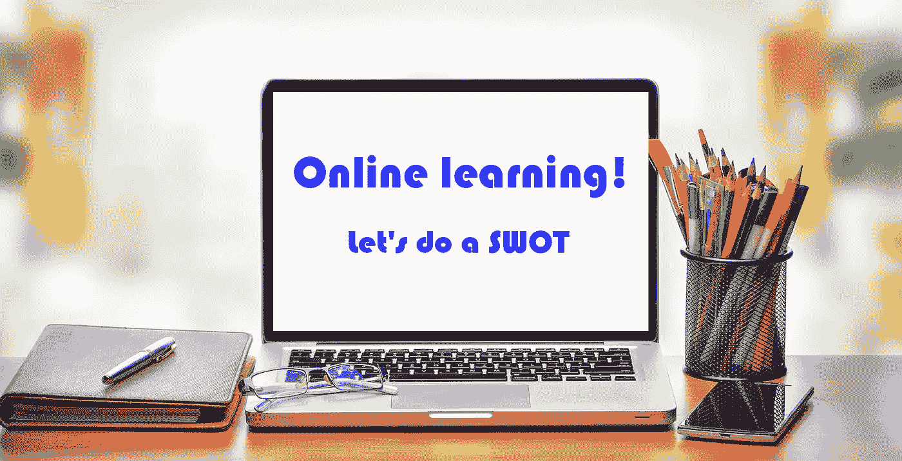
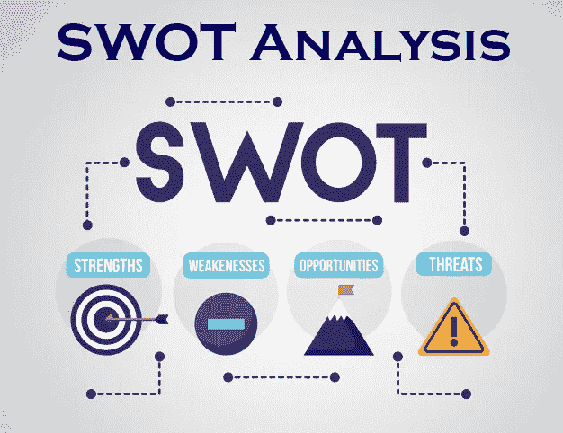

# 在线学习！让我们做一个 SWOT 分析

> 原文：<https://medium.com/nerd-for-tech/online-learning-lets-do-a-swot-fea4cf0bf69a?source=collection_archive---------2----------------------->

在线学习！让我们做一个 SWOT 分析

在线学习是通过网络进行的一种有效的学习方法。在很大程度上是通过学习管理框架进行的，在这个框架中，替补演员可以分享他们的学术观点并提高他们的表现，此外，在线学习允许在意外情况下非常容易地与同学和课程教师进行交流。

由于新冠肺炎创造的意想不到的情况，在线学习这些天变得更加流行。在此期间，它为参与者之间有效地共享视频、演示文稿、课堂笔记和学术材料提供了优势。这种在线学习方法给了我们一个重建被新冠肺炎危机摧毁的教育系统的机会。

相反，在这种在线学习中，利益相关者会面临优势、劣势、机会和威胁。SWOT 分析是识别它们的方法。

**什么是 SWOT 分析？**

四点分析

**在线学习 SWOT 分析的重要性**

这项研究有助于了解一项任务的有效性、成功性、正确性和新意。因此，这将有助于更新在线学习系统，并有效地开发它来帮助用户。参与在线学习的双方。

*   教师
*   学生

在线学习的 SWOT 分析将有助于加强双方的沟通。该国互联网设施的扩展可以通过这一分析来确定，也可以确定需要发展的领域。通过这种分析可以获得利益相关者的新想法。这将为国家教育系统的技术复兴提供所需的信息，并确定当前的争议。由于这些原因，对在线学习进行 SWOT 分析是当今一个重要的程序。

**在线学习的 SWOT 是什么？**

我们可以从不同的角度来确定在线学习的 SWOT。不仅学生，一些教师也参加了这种情况。首先，我们将对学校、大学和其他教育机构的学生进行 SWOT 分析。所有这些信息都是通过直接询问学生的回答和想法来收集的，以提高观点的可靠性。

**强项**

*   这比呆在家里不学习好。
*   讲课时，讲师们给予我们最大的支持。
*   不想和兄弟姐妹分开，不想去宿舍。
*   对在线讲座的录音非常有用。
*   大学里的学生在网上课堂上没有数据成本。
*   所有的学生都有机会直接提问。

**弱点**

*   与面对面的讲座相比，这些讲座很无聊。
*   难懂的数学和高级部分。
*   缺少集体活动。
*   教室里的所有学生都没有参加在线讲座。
*   和朋友在面对面的教室里学习更有趣。
*   在招待所学习比在家更轻松。

**机遇**

*   通过在线授课，你知道如何使用新的在线学习软件。
*   服装成本较低，不想为外观而烦恼。
*   学生对讲师提问的恐惧在网络课堂上是看不到的。
*   易于平衡与其他工作的时间。

**威胁**

*   对于一些学生来说，没有足够的信号来加入视频，只有他们能听到声音。
*   由于信号问题，很难按时连接到讲座。
*   由于信号问题，讲师的声音不清晰，因此无法正常听清讲座。
*   缺乏与朋友和讲师的互动。
*   一些学生有经济问题，因此他们不能参加在线学习过程。
*   缺乏使用互联网和技术的知识。

接下来，我们将从教师的角度确定在线学习的 SWOT。所有这些事实都是通过询问大学讲师、学校教师和教育机构的其他教师获得的。

**强项**

*   这比呆在家里不教书好。
*   能够进行时间管理。
*   能够保持良好的心态。
*   体力活动减少。
*   对于大学讲师和很多指导老师来说，数据成本由研究所承担。

**弱点**

*   与面对面的课堂教学相比，教学是枯燥的。
*   难教的数学和高级部分。
*   无法分配小组活动。
*   在教室里面对面教学更令人满意。
*   不能很好地理解学生的行为。
*   师生关系很难维持。
*   很单调。
*   没有能力戏剧性地教学。
*   帮助学习差的学生是非常困难的。
*   缺少纠正学生错误的机会。
*   不实用(人为)。

**机遇**

*   通过在线教学，教师可以了解如何利用新技术使用新的在线教学软件
*   没必要考虑外表。
*   在工作中节省时间、人力和金钱
*   在线课堂不会像传统课堂那样受到干扰。
*   获得如何使用互联网和技术进行教学的良好知识。

**威胁**

*   信号不够。
*   由于信号问题，很难按时连接到在线教室。
*   不得不在数据上多花钱。
*   缺乏使用互联网和技术的知识。

*社交媒体:* [*LinkedIn*](https://www.linkedin.com/in/sajith-dilshan/) *，*[*Twitter*](https://twitter.com/sajithd7)*，*[*Instagram*](https://www.instagram.com/sajithd_dilshan/)*，*[*YouTube*](https://www.youtube.com/channel/UCXvjoCD39q8s3zWCwKD-Qpw)*，* [GitHub](https://github.com/Sajith-Dilshan) 。