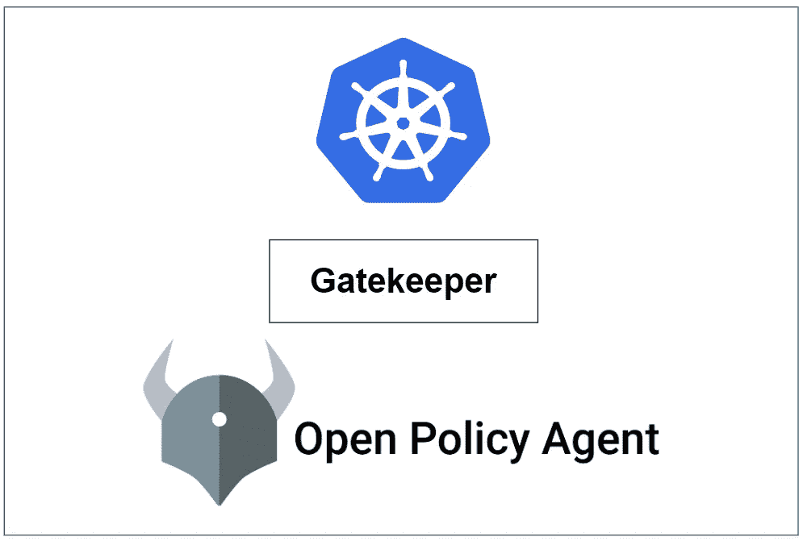
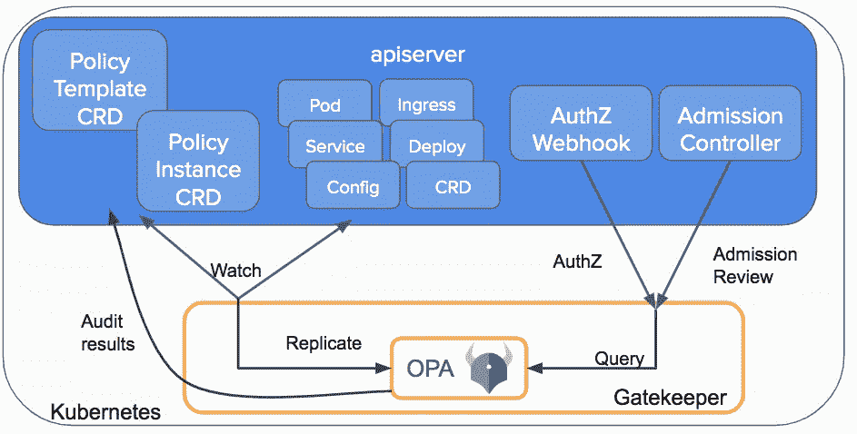
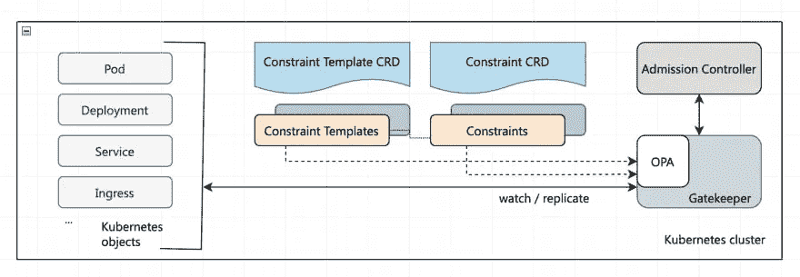
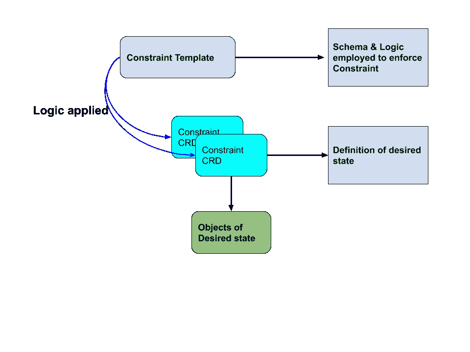
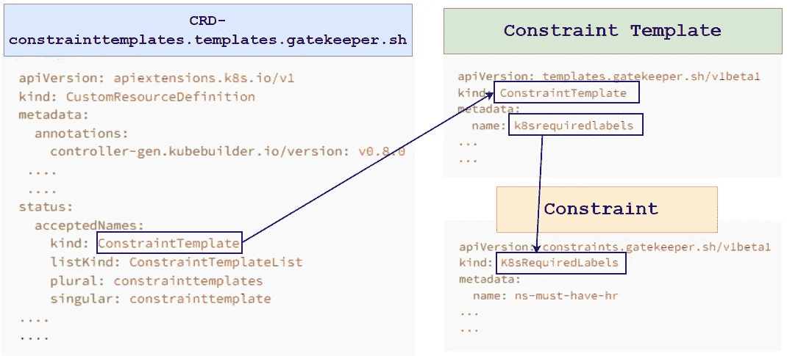

# Kubernetes 上的 OPA 看门人

> 原文：<https://medium.com/nerd-for-tech/opa-gatekeeper-on-kubernetes-69ca657c8631?source=collection_archive---------0----------------------->

## OPA 看门人:Kubernetes 的政策和治理



## 什么是 OPA:

[开放策略代理(OPA)](https://www.openpolicyagent.org/docs/latest/) 是一个开源的通用策略引擎，可以在整个堆栈中统一策略实施。OPA 提供了一种高级声明性语言，让我们可以将策略指定为代码和简单的 API，以从我们的软件中卸载策略决策。我们可以使用 OPA 在微服务、Kubernetes、CI/CD 管道、API 网关等方面实施策略。**在 kubernetes，OPA 使用准入控制器。**

## 什么是 OPA 看门人？

[OPA Gatekeeper](https://open-policy-agent.github.io/gatekeeper) 是在 OPA 和 Kubernetes 之间提供一流集成的专业项目。

OPA 网关守护设备在普通 OPA 的基础上增加了以下内容:

> *●可扩展、参数化的策略库。
> ●用于实例化策略库的本地 Kubernetes CRDs(又名“* ***约束*** *”)。
> ●用于扩展策略库的原生 Kubernetes CRDs(又名“* ***约束模板*** *”)。
> ●审计功能。*



来自: [Kubernetes 博客](https://kubernetes.io/blog/2019/08/06/opa-gatekeeper-policy-and-governance-for-kubernetes/)

## 网关守护设备安装:

```
>> kubectl apply -f https://raw.githubusercontent.com/open-policy-agent/gatekeeper/master/deploy/gatekeeper.yaml
```

以下是作为网关守护设备安装的一部分而创建的对象:

```
>> kubectl get all -n gatekeeper-system

NAME                                                 READY   STATUS    RESTARTS   AGE
pod/gatekeeper-audit-56ddcd8749-mlvjv                1/1     Running   0          2m50s
pod/gatekeeper-controller-manager-64fd6c8cfd-cqvnw   1/1     Running   0          2m49s
pod/gatekeeper-controller-manager-64fd6c8cfd-xgmxv   1/1     Running   0          2m49s
pod/gatekeeper-controller-manager-64fd6c8cfd-znxfh   1/1     Running   0          2m49s

NAME                                 TYPE        CLUSTER-IP     EXTERNAL-IP   PORT(S)   AGE
service/gatekeeper-webhook-service   ClusterIP   10.245.56.27   <none>        443/TCP   2m51s

NAME                                            READY   UP-TO-DATE   AVAILABLE   AGE
deployment.apps/gatekeeper-audit                1/1     1            1           2m51s
deployment.apps/gatekeeper-controller-manager   3/3     3            3           2m50s

NAME                                                       DESIRED   CURRENT   READY   AGE
replicaset.apps/gatekeeper-audit-56ddcd8749                1         1         1       2m51s
replicaset.apps/gatekeeper-controller-manager-64fd6c8cfd   3         3         3       2m50s
```

## 验证准入控制

一旦在我们的集群中安装了所有的网关守护设备组件，每当集群中的资源被创建、更新或删除时，API 服务器将触发网关守护设备准入 webhook 来处理准入请求。
在验证过程中，网守充当 API 服务器和 OPA 之间的桥梁。API 服务器将执行 OPA 执行的所有策略。

## **自定义资源定义**

**自定义资源定义** ( [CRD](https://kubernetes.io/docs/concepts/extend-kubernetes/api-extension/custom-resources/#customresourcedefinitions) ) API 允许我们定义自定义资源。定义一个 CRD 对象会创建一个新的定制资源，它具有我们指定的名称和模式。Kubernetes API 服务并处理定制资源的存储。

Gatekeeper 在内部使用[customresourcediations](https://kubernetes.io/docs/tasks/extend-kubernetes/custom-resources/custom-resource-definitions/)，并允许我们定义 **ConstraintTemplates** 和 **Constraints** 来对 Kubernetes 资源(如 pod、部署和作业)实施策略。

网关守护设备在安装过程中会创建几个 CRD:

```
>> kubectl get crd | grep -i gatekeeper

assign.mutations.gatekeeper.sh                       2022-11-29T07:04:42Z
assignmetadata.mutations.gatekeeper.sh               2022-11-29T07:04:43Z
configs.config.gatekeeper.sh                         2022-11-29T07:04:43Z
constraintpodstatuses.status.gatekeeper.sh           2022-11-29T07:04:43Z
constrainttemplatepodstatuses.status.gatekeeper.sh   2022-11-29T07:04:43Z
constrainttemplates.templates.gatekeeper.sh          2022-11-29T07:04:44Z #<---
expansiontemplate.expansion.gatekeeper.sh            2022-11-29T07:04:44Z
modifyset.mutations.gatekeeper.sh                    2022-11-29T07:04:44Z
mutatorpodstatuses.status.gatekeeper.sh              2022-11-29T07:04:44Z
providers.externaldata.gatekeeper.sh                 2022-11-29T07:04:44Z
```

其中之一是**" Constraint Templates . Templates . gatekeeper . sh "**，使用它我们可以创建**约束**和**约束模板**来与 gate keeper 一起工作:



来自:[https://dev . to/ashokan/kubernetes-policy-management-ii-opa-gate keeper-465g](https://dev.to/ashokan/kubernetes-policy-management-ii-opa-gatekeeper-465g)

●[**constraint templates**](https://open-policy-agent.github.io/gatekeeper/website/docs/howto)定义了一种验证网守的 Kubernetes 准入控制器中的某组 Kubernetes 对象的方法。它们由两个主要元素组成:

1.  [定义策略违规的减压阀](https://www.openpolicyagent.org/docs/latest/#rego)代码
2.  伴随的`**Constraint**` 对象的模式，表示`**ConstraintTemplate**`的实例化

●约束是系统需要满足的需求声明。换句话说，**约束**用于通知看门人管理员想要强制实施约束模板，以及如何实施。



来自:[https://grumpygrace.dev/posts/intro-to-gatekeeper-policies/](https://grumpygrace.dev/posts/intro-to-gatekeeper-policies/)

下图说明了 CRD、约束模板和约束是如何相互连接的:



## 游戏攻略

现在，假设我们想要实施一个策略，使得 kubernetes 资源(比如 pod、名称空间等)必须定义一个特定的标签。为了实现这一点，让我们先创建一个`**ConstraintTemplate**` ，然后再创建一个`**Constraint**` :

## 约束模板:

下面是`**ConstraintTemplate.yaml**`文件，我们将使用该文件在 k8s 集群上创建一个`**ConstraintTemplate**` :

```
# ConstraintTemplate.yaml
# ---------------------------------------------------------------
apiVersion: templates.gatekeeper.sh/v1
kind: ConstraintTemplate                    # Template Identifying Info
metadata:
  name: k8srequiredlabels
# ----------------------------------------------------------------
spec:
  crd:
    spec:
      names:
        kind: K8sRequiredLabels        # Template values for constraint crd's                                          
      validation:
        # Schema for the `parameters` field
        openAPIV3Schema:
          type: object
          properties:
            labels:
              type: array
              items:
                type: string
# ----------------------------------------------------------------
  targets:
    - target: admission.k8s.gatekeeper.sh
      rego: |                                     # Rego
        package k8srequiredlabels

        violation[{"msg": msg, "details": {"missing_labels": missing}}] {
          provided := {label | input.review.object.metadata.labels[label]}
          required := {label | label := input.parameters.labels[_]}
          missing := required - provided
          count(missing) > 0
          msg := sprintf("you must provide labels: %v", [missing])
        }
# ----------------------------------------------------------------
```

使用上面定义的清单创建`**ConstraintTemplate**` :

```
>> kubectl create -f ConstraintTemplate.yaml

#　List the available ConstraintTemplate's 
>> kubectl get ConstraintTemplate
NAME                AGE
k8srequiredlabels   29s
```

## 约束: **pod 标签**

现在，让我们创建一个`**Constraint**`，它将强制每次创建一个 pod 时，pod 必须有一个名为“ **app** 的策略。下面是名为**“pod-must-have-app-level . YAML”**的`**Constraint**` 文件

```
# pod-must-have-app-level.yaml

apiVersion: constraints.gatekeeper.sh/v1beta1
kind: K8sRequiredLabels
metadata:
  name: pod-must-have-app-level
spec:
  match:
    kinds:
      - apiGroups: [""]
        kinds: ["Pod"]   
  parameters:
    labels: ["app"] 
```

在我们的 kubernetes 集群上创建`**Constraint**` 并列出可用的约束:

```
>> kubectl create -f pod-must-have-app-level.yaml

# List the available Constraint's
>> kubectl get constraints

NAME                      ENFORCEMENT-ACTION   TOTAL-VIOLATIONS
pod-must-have-app-level                        13
```

现在，让我们在不定义标签的情况下创建一个 pod，并观察会发生什么:

```
# Create a pod without labels
>> kubectl run nginx --image=nginx 
Error from server (Forbidden): admission webhook "validation.gatekeeper.sh" denied the request: [pod-must-have-app-level] you must provide labels: {"app"}
```

正如我们在上面的演示中看到的，pod 创建请求被拒绝，因为在创建 pod 时没有提供所需的“标签”。

现在，让我们创建一个标签为“ **app** 的 pod，并观察其行为:

```
# Create a pod with label
>> kubectl run nginx --image=nginx --labels=app=test
pod/nginx created
```

在上面的演示中，我们可以看到 pod 的部署没有任何问题，因为我们在创建 pod 时指定了所需的标签。

## **约束:名称空间标签**

一个`**ConstraintTemplate**` 可以被几个`**Constraint**`使用。在前一阶段，我们指定了一个`**Constraint**` ，这样一个 pod 必须有一个特定的标签。如果需要，我们可以使用同一个`**ConstraintTemplate**` 创建另一个`**Constraint**` ，但这一次它将用于一个名称空间。我们可以写一个`**Constraint**`，这样一个名称空间必须有一个特定的标签。

下面是名为**“ns-must-label-state . YAML”**的`**Constraint**` 文件，用于强制名称空间具有名为 **state** 的特定标签:

```
# ns-must-label-state.yaml

apiVersion: constraints.gatekeeper.sh/v1beta1
kind: K8sRequiredLabels
metadata:
  name: ns-must-label-state
spec:
  match:
    kinds:
      - apiGroups: [""]
        kinds: ["Namespace"]
  parameters:
    labels: ["state"]
```

让我们使用上面定义的**“ns-must-label-state . YAML”来创建`**Constraint**` :**

```
>> kubectl create -f ns-must-label-state.yaml

# List the available Constraint's
>> kubectl get constraints

NAME                      ENFORCEMENT-ACTION   TOTAL-VIOLATIONS
ns-must-label-state                            5
pod-must-have-app-level                        13
```

然后创建一个**名称空间**，而没有定义所需的标签，在当前情况下标签为“**状态**”:

```
>> kubectl create ns test

Error from server (Forbidden): admission webhook "validation.gatekeeper.sh" denied the request: [ns-must-label-state] you must provide labels: {"state"}
```

现在，使用所需的标签创建一个名称空间，看看会发生什么:

```
# test-ns.yaml

apiVersion: v1
kind: Namespace
metadata:
  name: test
  labels:
    state: dev   #<---

---

>> kubectl create -f test-ns.yaml
namespace/test created
```

在上面的演示中，我们可以看到命名空间的创建没有任何问题，因为我们指定了所需的标签。

## 检查违规情况

我们可以描述或检查一个`**Constraint**`来找出现有 kubernetes 资源的违反政策的情况:

```
# To describe a Constraint
>> kubectl describe <ConstraintTemplate>  <Constraint>
```

让我们描述一下" **ns-must-label-state** "约束:

```
 [ConstraintTemplate]  [Constraint]
>> kubectl describe  k8srequiredlabels     ns-must-label-state

#--------------------------------------------------------------------------

Name:         ns-must-label-state
Namespace:    
...
...
Status:
  Audit Timestamp:  2022-11-30T02:32:48Z
  By Pod:
    Constraint UID:       846a2d86-5d00-4eba-bd6a-669cd27fc703
    Enforced:             true
    Id:                   gatekeeper-audit-56ddcd8749-htgk5
    Observed Generation:  1
    Operations:
      audit
      mutation-status
      status
    Constraint UID:       846a2d86-5d00-4eba-bd6a-669cd27fc703
    Enforced:             true
    Id:                   gatekeeper-controller-manager-64fd6c8cfd-jh7qr
    Observed Generation:  1
    Operations:
      mutation-webhook
      webhook
    Constraint UID:       846a2d86-5d00-4eba-bd6a-669cd27fc703
    Enforced:             true
    Id:                   gatekeeper-controller-manager-64fd6c8cfd-q6ds9
    Observed Generation:  1
    Operations:
      mutation-webhook
      webhook
    Constraint UID:       846a2d86-5d00-4eba-bd6a-669cd27fc703
    Enforced:             true
    Id:                   gatekeeper-controller-manager-64fd6c8cfd-rbvsz
    Observed Generation:  1
    Operations:
      mutation-webhook
      webhook
  Total Violations:  5        #<-------------
  Violations:
    Enforcement Action:  deny
    Group:               
    Kind:                Namespace
    Message:             you must provide labels: {"state"}
    Name:                kube-public
    Version:             v1
    Enforcement Action:  deny
    Group:               
    Kind:                Namespace
    Message:             you must provide labels: {"state"}
    Name:                kube-node-lease
    Version:             v1
    Enforcement Action:  deny
    Group:               
    Kind:                Namespace
    Message:             you must provide labels: {"state"}
    Name:                gatekeeper-system
    Version:             v1
    Enforcement Action:  deny
    Group:               
    Kind:                Namespace
    Message:             you must provide labels: {"state"}
    Name:                kube-system
    Version:             v1
    Enforcement Action:  deny
    Group:               
    Kind:                Namespace
    Message:             you must provide labels: {"state"}
    Name:                default
    Version:             v1
Events:                  <none>
```

在上图中，我们可以看到有几个名称空间违反了策略，这是因为它们(名称空间)是在创建 **"ns-must-label-state"** 约束之前创建的。

## OPA 网守库

有一个社区拥有的 OPA 看门人项目政策库。

● [OPA 网守库](https://open-policy-agent.github.io/gatekeeper-library/website/)

> *如果你觉得这篇文章很有帮助，请* ***别忘了*** *来砸* ***跟着*** *👉******拍拍*** *👏* *按钮帮助我写更多这样的文章。
> 谢谢🖤***

## **🚀👉**Kubernetes 上的所有文章****

**

[Md 沙米姆](/@shamimice03?source=post_page-----69ca657c8631--------------------------------)** 

## **关于 Kubernetes 的所有文章**

**[View list](/@shamimice03/list/all-articles-on-kubernetes-7ae1a0f96f3b?source=post_page-----69ca657c8631--------------------------------)****24 stories**************

## **🚀👉 **HelmーSeries****

**

[Md 沙米姆](/@shamimice03?source=post_page-----69ca657c8631--------------------------------)** 

## **HelmーSeries**

**[View list](/@shamimice03/list/helmseries-6e2076d48ba8?source=post_page-----69ca657c8631--------------------------------)****11 stories**************