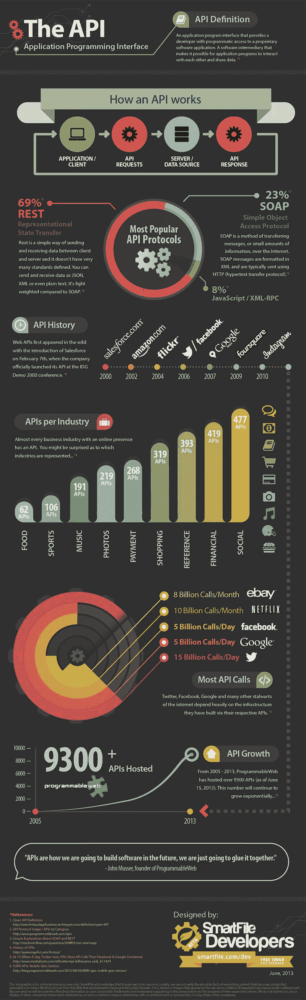
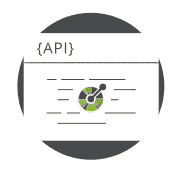
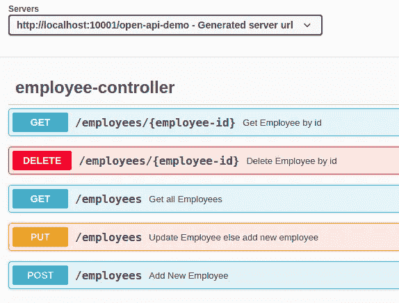
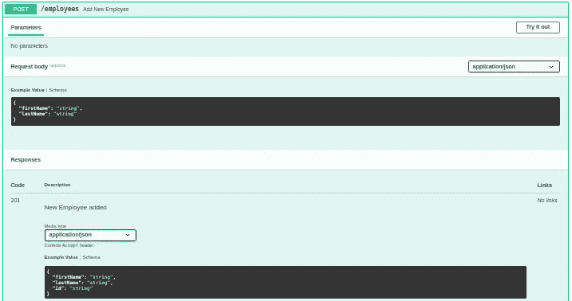
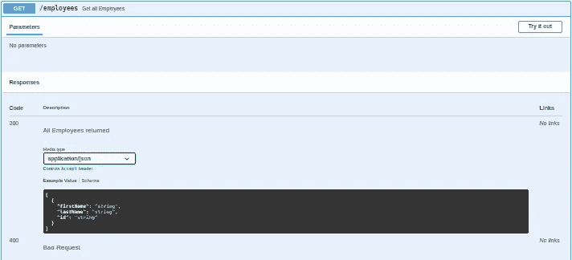
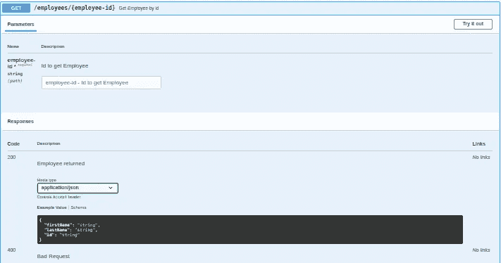
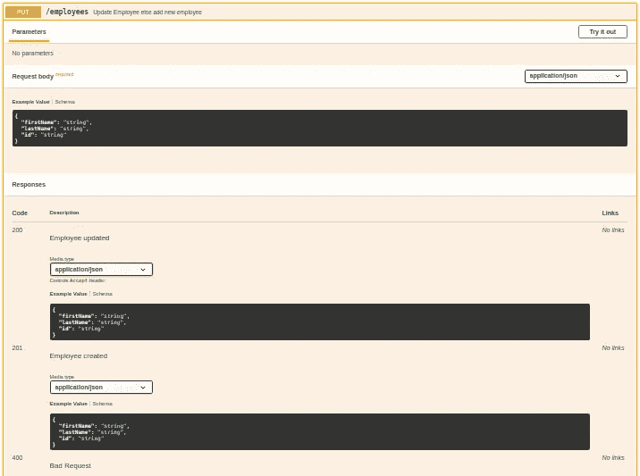
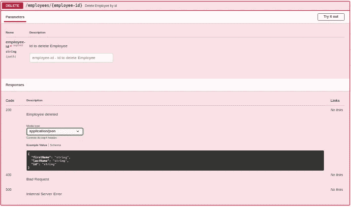
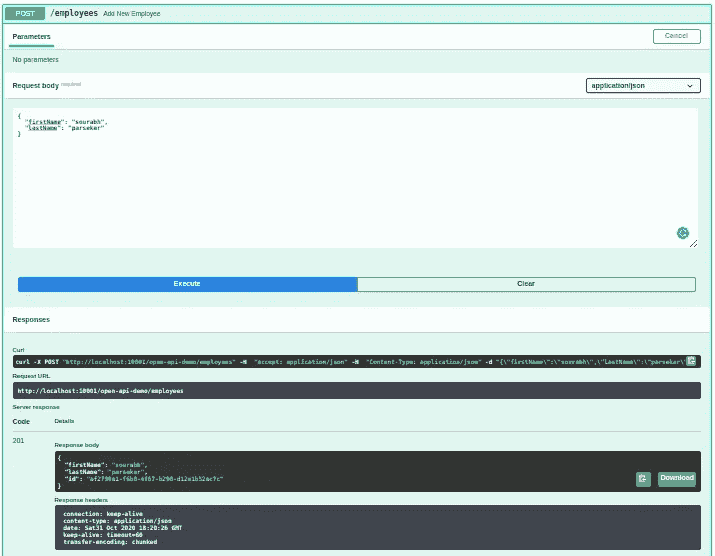

# OpenAPI 规范— Swagger UI

> 原文：<https://medium.com/nerd-for-tech/open-api-specification-swagger3-fc9ad3bbacdd?source=collection_archive---------0----------------------->

什么是 API，为什么需要 API？它很旧，但仍然适用…[https://www . gov tech . com/applications/Whats-an-API-and-Why-Do-You-Need-one . html](https://www.govtech.com/applications/Whats-an-API-and-Why-Do-You-Need-One.html)

我们，开发人员，倾向于使用现有的一段代码*(大多来自*[*【stackoverflow.com*](https://stackoverflow.com/)*)*，而不是重新发明轮子。

API 正在推动以共享服务为中心的新一波创新，而开发者不必共享他的代码。因此，从某种意义上说，API 是一个可重用的组件，它们实现了一块拼图，其他人可以重用它，而不必解决同一块拼图。这就是为什么我们经常听到人们说*“你就不能用一个 API 来实现吗？”。* **谷歌**目前提供二十多个 API，可以在[谷歌代码网站](http://code.google.com/apis/)上找到

可以说，应用编程接口(API)允许其他程序与之交互，而不需要开发者共享整个代码。开发人员公开一个 API，告诉程序员如何与现有的服务进行交互。这表明需要一种标准化的方法来记录 API，帮助其他程序员更有效地理解和使用 API。

在本文中，我们将看到如何使用开放 API 规范和呈现一个 swagger UI 来简化和标准化我们的 API 文档。

[Github 代码](https://github.com/sourabhparsekar/open-api-spec) —这是我们将在本文中使用的代码的链接。请随意克隆它、尝试它、共享它、改进它，最重要的是用它来简化您的 API 文档。

记住，[糟糕的或者不存在的文档](https://nordicapis.com/5-reasons-why-developers-are-not-using-your-api/)是你的 API 没有被其他人使用的原因之一。

# 什么是开放 API 规范(OAS)？

[https://swagger.io/](https://swagger.io/)

OpenAPI 规范(OAS) 以前被称为 Swagger 规范。它是定义 RESTful 接口的标准。当 OAS 被正确定义时，消费者可以用最少的实现逻辑理解远程服务并与之交互。

> [OpenAPI 规范](https://swagger.io/specification/) (OAS)为 RESTful APIs 定义了一个标准的、与语言无关的接口，允许人类和计算机在不访问源代码、文档或通过网络流量检查的情况下发现和理解服务的功能。

# 什么是 Swagger UI？

https://swagger.io/

[Swagger](https://en.wikipedia.org/wiki/Swagger_(software)) 于 2011 年首次发布，是一个在线交互式 HTML 文档页面，它定义并描述了[RESTful](https://en.wikipedia.org/wiki/Representational_state_transfer)API，并使用 [JSON](https://en.wikipedia.org/wiki/JSON) 来表达。因此，Swagger UI 生成交互式 API 文档，让用户通过与实时 API 交互，直接在浏览器中尝试 API 调用。

> 如果不谈论 [Swagger](https://swagger.io/tools/open-source/) UI，OAS 就不完整。

OpenAPI 定义使用并符合 OpenAPI 规范。OAS 的最初基础是 SmartBear 的 Swagger 项目，由 Swagger 规范和 Swagger 工具组成。Swagger 是使用 OpenAPI 规范开发 API 的最广泛的开源工具集之一。

# 让我们看看代码实现

现在我们已经看到了理论上的优势，让我们看看如何将它集成到我们的项目中。对于这个例子，我使用[spring boot-2 . 3 . 4 . release](https://docs.spring.io/spring-boot/docs/2.3.4.RELEASE/reference/html/index.html)、 [Apache Maven](https://maven.apache.org/) 作为构建工具，使用 [Java 8](https://www.oracle.com/java/technologies/java8.html) 。完整的演示项目代码可在 [GitHub](https://github.com/sourabhparsekar/open-api-spec) 上获得。参考 [README.md](https://github.com/sourabhparsekar/open-api-spec#readme) 文件在本地安装并运行这个项目。

> 我们的最终目标是什么？

我们将逐步理解如何使用 OpenAPI 规范来编码和实现 Swagger UI。

我们还将看到如何使用它来测试我们的服务。

一旦我们完成，请使用[示例代码](https://github.com/sourabhparsekar/open-api-spec)亲自尝试一下。

*让游戏开始吧……*

> ***第一步:OpenAPI 规范 Maven 依赖***

在 Swagger2 版本中，我们必须导入 2 个 Springfox Swagger Jars 来设置 Swagger UI。当迁移到 Swagger 3 时，我们只有一个依赖项可以使用。最新版本的`springdoc-openapi-ui`可以在[*Maven Central*](https://search.maven.org/classic/#search%7Cga%7C1%7Cspringdoc-openapi-ui)*上找到。*要将它添加到我们的 Maven 项目中，我们需要在 *pom.xml* 中添加依赖项

OpenAPI 规范依赖性

> ***第二步:昂首阔步配置带跳趾***

Swagger3 的配置需要 **OpenAPI** bean。还可以使用 OpenAPI bean 添加许可证和联系信息。为简单起见，标题、版本和描述取自“应用程序.属性”

一旦我们获得了配置设置，就该添加带有 Swagger 注释的 API 端点了，这将在后续步骤中描述。

> ***步骤 3:让我们为 POST 请求添加第一个端点***

在这个演示中，我们将使用 SpringBoot Rest APIs。我们将仔细检查在[样本代码](https://github.com/sourabhparsekar/open-api-spec)中使用的所有注释。这包括 Spring 注释和 Swagger 注释。由于这只是一个介绍，我们不会看到每个注释的细节，但我们会涵盖一些注释，它们可以帮助我们整理文档。现在，让我们看看 HTTP POST

**弹簧注解**

`[RestController](https://docs.spring.io/spring-framework/docs/current/javadoc-api/org/springframework/web/bind/annotation/RestController.html)` annotation 表示每个方法返回的数据将直接写入响应体，而不是呈现一个模板。

`[PostMapping](https://docs.spring.io/spring-framework/docs/current/javadoc-api/org/springframework/web/bind/annotation/PostMapping.html)` 注释将 HTTP POST 请求映射到特定的处理程序方法。它是一个组合注释，作为`RequestMapping(method = RequestMethod.POST)`的快捷方式。

`[RequestBody](https://docs.spring.io/spring-framework/docs/current/javadoc-api/org/springframework/web/bind/annotation/RequestBody.html)`注释表示方法参数应该绑定到 web 请求的主体。

**霸气注解**

`[Operation](https://docs.swagger.io/swagger-core/v2.0.0-RC3/apidocs/io/swagger/v3/oas/annotations/Operation.html)`注释可用于将资源方法定义为 OpenAPI 操作，和/或定义操作的附加属性。我曾经描述过这次行动。

`[ApiResponses](https://docs.swagger.io/swagger-core/v2.0.0-RC3/apidocs/io/swagger/v3/oas/annotations/responses/ApiResponses.html)`是一个可重复 ApiResponse 注释的容器。

`[ApiResponse](https://docs.swagger.io/swagger-core/v2.0.0-RC3/apidocs/io/swagger/v3/oas/annotations/responses/ApiResponse.html)`注释可用于方法级或作为`Operation`的一个字段，以定义操作的一个或多个响应。

`[Content](https://javadoc.io/doc/io.swagger.core.v3/swagger-annotations/latest/io/swagger/v3/oas/annotations/media/Content.html)`注释可用于定义参数、请求或响应的内容/媒体类型，通过将其定义为字段`[Parameter.content()](https://javadoc.io/static/io.swagger.core.v3/swagger-annotations/2.1.5/io/swagger/v3/oas/annotations/Parameter.html#content--)`、`[RequestBody.content()](https://javadoc.io/static/io.swagger.core.v3/swagger-annotations/2.1.5/io/swagger/v3/oas/annotations/parameters/RequestBody.html#content--)`或`[ApiResponse.content()](https://javadoc.io/static/io.swagger.core.v3/swagger-annotations/2.1.5/io/swagger/v3/oas/annotations/responses/ApiResponse.html#content--)`

注释可用于定义 OpenAPI 规范的一组元素的模式，和/或定义该模式的附加属性。它适用于例如参数、模式类(也称为“模型”)、这种模型的属性、请求和响应内容、报头。

Swagger 注释是可选的，它可以用 Spring 注释创建最小的 Swagger UI。然而，使用 Swagger 注释，我们可以使文档更具可读性和用户友好性。

让我们来看看下面的示例代码和输出。Swagger 创建了一个现成的示例请求/响应，还提供了一个“试用”选项，可用于测试实时 API。我们将在后面的章节中查看“试用”选项。

HTTP POST 请求的示例控制器端点

HTTP POST 请求的大摇大摆

> ***第 4 步:让我们为 GET 请求添加端点***

由于上面的 HTTP POST 中已经介绍了一些注释，我们将讨论 HTTP GET 请求中的新注释。对于 GET，我们将看到 get all employees 和 get an employee by id。

**弹簧注释**

`[GetMapping](https://docs.spring.io/spring-framework/docs/current/javadoc-api/org/springframework/web/bind/annotation/GetMapping.html)` 用于将 HTTP `GET`请求映射到特定处理程序方法的注释。它是一个组合注释，作为`RequestMapping(method = RequestMethod.GET)`的快捷方式。

`[PathVariable](https://docs.spring.io/spring-framework/docs/current/javadoc-api/org/springframework/web/bind/annotation/PathVariable.html)`注释表明方法参数应该绑定到 URI 模板变量。这一般用在我们需要按 id 找东西的时候。

**招摇标注**

`[Parameter](https://docs.swagger.io/swagger-core/v2.0.6/apidocs/io/swagger/v3/oas/annotations/Parameter.html)`可在方法参数上使用注释，将其定义为操作的参数，和/或定义参数的附加属性。这一般用在我们需要按 id 找东西的时候。

让我们来看看下面的示例代码和输出。

HTTP GET all 请求和 HTTP GET by id 请求的示例控制器端点

HTTP GET all 请求的 Swagger

HTTP GET by id 请求的 Swagger

> ***第 5 步:让我们为 PUT 请求添加端点***

由于上面的 HTTP POST，GET 中已经包含了一些注释，所以我们将讨论 HTTP PUT 请求中的新注释。我在这里做了一个小小的改动，如果员工不存在，那么创建一个新员工。因此，对于更新，响应可以是 200，对于添加新员工，响应可以是 201。

**弹簧注释**

`[PutMapping](https://docs.spring.io/spring-framework/docs/current/javadoc-api/org/springframework/web/bind/annotation/PutMapping.html)` 将 HTTP `PUT`请求映射到特定处理程序方法的注释。这是一个合成的注释，作为`RequestMapping(method = RequestMethod.PUT)`的快捷方式。

让我们来看看下面的示例代码和输出。

HTTP PUT 请求的示例控制器端点

为 HTTP PUT 请求招摇过市

> ***步骤 6:让我们为删除请求添加端点***

由于上面的 HTTP POST、GET、PUT 中已经包含了一些注释，我们将讨论 HTTP DELETE 请求中的新注释。我在这里做了一个小小的改动，如果员工不存在，那么返回 400 Bad Request，否则返回被删除的员工。通常，您不会用已删除的实体进行响应，状态代码为 204 No Content，表示删除成功。

**弹簧注解**

`[DeleteMapping](https://docs.spring.io/spring-framework/docs/current/javadoc-api/org/springframework/web/bind/annotation/DeleteMapping.html)` 用于将 HTTP `DELETE`请求映射到特定处理程序方法的注释。它是一个组合的注释，作为`RequestMapping(method = RequestMethod.DELETE)`的快捷方式。

让我们来看看下面的示例代码和输出。

HTTP 删除请求的示例控制器端点

HTTP 删除请求的 Swagger

> ***第七步:瞧。我们完了！！让我们测试一下***

大摇大摆“试试看”

如果您已经在本地机器上下载了[示例代码](https://github.com/sourabhparsekar/open-api-spec)，编译并运行它，那么您已经在您最喜欢的浏览器中加载了 Swagger UI。

要运行 swagger，在运行 SpringBoot 应用程序后，您可以点击 URL:

[http://localhost:10001/open-API-demo/swagger-ui](http://localhost:10001/open-api-demo/swagger-ui/)。超文本标记语言

> 作为下载和/或编译和/或运行代码的指南，请参考示例代码根目录中的 [README.md](https://github.com/sourabhparsekar/open-api-spec/blob/main/README.md) 文件。如果你仍然不能让它工作，给我留言或笔记。我们可以一起努力让它成功。毕竟，把手弄脏会让你更容易理解。

假设您已经完成了示例代码的所有工作，那么在我们尝试这个 API 之前，就没有其他配置了。Swagger 针对每个 API 都有一个内置的“试用”按钮，它能够运行请求，以便消费者可以验证输出。它还显示了与标头和其他参数一起发送的请求。

因此，当您尝试执行请求时，Swagger 将读取请求的定义，并期望使用者提供测试数据(如果适用的话)，比如路径参数或请求体。输入数据后，消费者可以点击`Execute`来运行请求，并显示其响应。

虽然我们讨论了所有这些，但是由于 Swagger 有限的验证功能，用它运行测试还是有缺点的。由用户来验证这是否是预期的响应。此外，由于缺少内置的自动化功能，必须一次运行一个请求。

让我们看看“添加新员工”成功请求的运行情况，同时您可以在您的系统上尝试其他请求。

尝试 HTTP POST 请求

我们现在已经成功地添加了 Swagger 并测试了我们的 API。说到这里，我们结束了对 API 文档的探索。在我们的旅程中，我们已经看到了 ***如何使用 OpenAPI 规范和 Swagger 3 为 API 文档添加 Swagger UI。***

总结我们的旅程，我们用 Rest Controller 创建了一个 SpringBoot 应用程序。我们添加了 Swagger 依赖和必要的 OpenAPI 规范配置。此外，为了配置 Swagger 来显示有意义的 API 文档，除了 Spring 注释之外，我们还使用了 Swagger 注释。然而，我们还没有看到关于 Swagger 的所有内容，是时候探索其他功能了。然而，我将会有另一篇关于如何使用 JWT 令牌保护 API 的博客。

# 参考资料:

 [## OpenAPI 规范

### 3.0.3 版关键词“必须”、“不得”、“要求”、“应当”、“不得”、“应当”、“不应当”…

swagger.io](https://swagger.io/specification/)  [## 什么是 API，我为什么要使用它？

### 有没有人问过你，“你就不能用一个 API 来做这个吗？”心想“API 到底是什么？”

medium.com](/@TebbaVonMathenstien/what-is-an-api-and-why-should-i-use-one-863c3365726b)  [## 用 Spring 构建 REST 服务

### REST 已经迅速成为在 web 上构建 web 服务的事实上的标准，因为它们易于构建并且…

spring.io](https://spring.io/guides/tutorials/rest/)  [## REST 资源命名指南

### 在 REST 中，主要的数据表示称为资源。拥有强大且一致的 REST 资源命名策略…

restfulapi.net](https://restfulapi.net/resource-naming/)