# 欢迎来到 OpenCV 指南第 1 部分

> 原文：<https://medium.com/nerd-for-tech/open-cv-basic-guide-part-1-cbc94ba3280f?source=collection_archive---------16----------------------->

大家好，

希望你一切都好，在接下来的博客中，我会努力帮助你开始你的公开简历课程。这是这个系列的第一篇博客，在这篇博客中，我主要关注 OpenCV 的基础，所以我们将在这篇博客中回答下面提到的问题。

☚**如何安装 OpenCV？**

**如何加载和显示图像？**

我们能像阅读图像一样阅读和显示视频吗？

☚**如何调整图像大小？**

如何在图像内添加形状和文字？

☚**如何裁剪图像？**

如何旋转或移动图像？

# 简介:

OpenCV 代表开源计算机视觉库。这是 python 库用来解决计算机视觉问题的。通过使用 OpenCV，我们可以轻松地添加不同的图像，或者有时我们可以裁剪图像，或者我们可以检测图像中的边缘，或者我们可以使用它进行人脸检测等。基本上，我们可以通过使用 OpenCV 库非常容易地执行计算机视觉问题。

# OpenCV 的编程历史:

根据维基百科

*OpenCV 是用*[*C++*](https://en.wikipedia.org/wiki/C%2B%2B)*编写的，它的主要接口是 c++，但它仍然保留了一个不太全面但广泛的更老的* [*C 接口*](https://en.wikipedia.org/wiki/C_(programming_language)) *。所有的新发展和算法都出现在 C++界面中。*[*Python*](https://en.wikipedia.org/wiki/Python_(programming_language))*[*Java*](https://en.wikipedia.org/wiki/Java_(programming_language))*[*MATLAB*](https://en.wikipedia.org/wiki/MATLAB)*/*[*八度*](https://en.wikipedia.org/wiki/GNU_Octave) *中有绑定。***

# **QnA 系列:**

**好了，现在介绍的内容已经足够了。查看下面提到的问答系列，它将涵盖您的所有疑问。现在不浪费时间，让我们开始吧。**

## ****1)如何安装 OpenCV？****

**在这个模块中，我们需要 Numpy 和 Matplotlib 以备将来使用。因此，我们可以通过在命令提示符下执行下面提到的命令来安装所有这些(这里我假设 python 3.0 已经安装在您的系统中):**

**1) pip 安装数量**

**2) pip 安装 matplotlib**

**3) pip 安装 opencv-contrib-python**

**如果安装时有任何问题，请参考此[链接](https://docs.opencv.org/master/d5/de5/tutorial_py_setup_in_windows.html)了解详情**

## ****2)如何加载和显示图像？****

**首先我们必须导入一些重要的库，如下所示:**

**现在，我们将尝试使用 *im.read* 读取图像，并使用 cv2_imshow 显示图像(如果有任何问题，您也可以使用 cv.imshow，因为我正在使用 google Collab，所以更喜欢使用 cv2_imshow)。**

**上述代码的输出是:**

**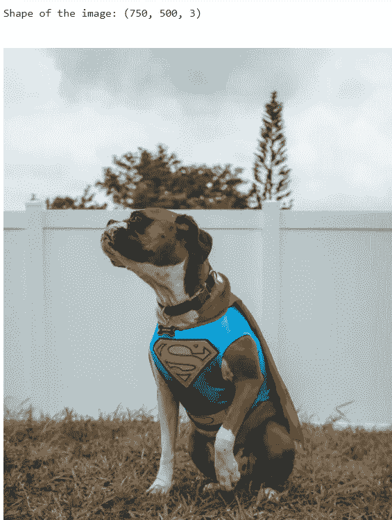**

## **3)我们可以像阅读图像一样阅读和显示视频吗？**

**是的，我们可以，但是*图像和视频*有什么区别？**

**实际上，最简单的答案是，照片是单个图像，而视频是以指定的帧速率按顺序播放的一系列图像，通常来自软件播放视频文件(数字)或硬件播放像带(模拟)。换句话说，视频是有运动的。**

**同样的事情，我们将在 OpenCV 中观察到，当我们试图读取和显示视频时，我们得到了图像序列，我们可以对图像执行相同的操作。**

**让我们看看它将如何发生。**

**上述代码的输出是:**

**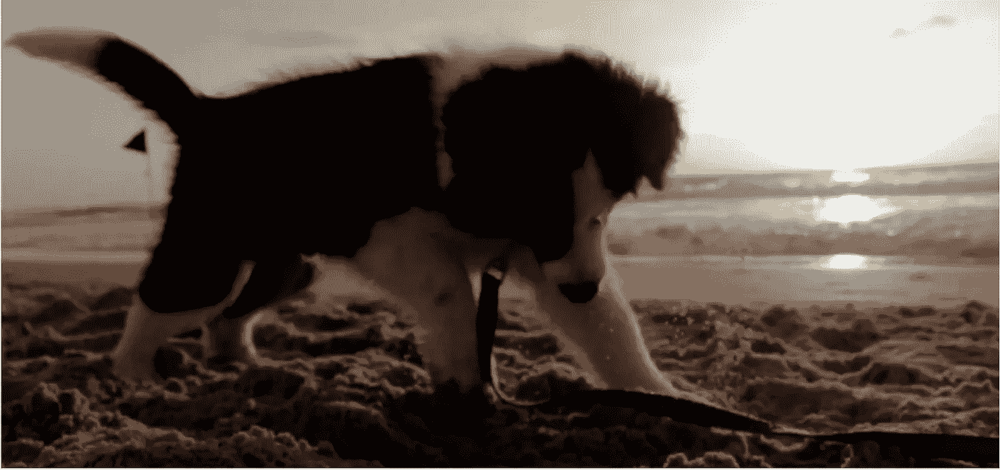**

**视频的第 1 帧**

****

**视频的第 2 帧**

**我已经展示了视频的前 2 帧。但是在输出中，你会得到视频中所有可能的帧。**

**此外，重要的是，如果我们必须捕捉现场视频，那么我们可以使用 cv。视频捕获(0)。如果我们有 2 台摄像机与系统连接，那么我们可以使用 cv。视频捕获(1)我们可以根据摄像机的数量进一步增加数量。**

## **4)如何调整图像大小？**

****4.1。缩小图像:****

**有时我们会得到高分辨率的图像，因此很难对这样的图像执行任何操作，因为这会消耗更多的空间并影响性能。在这种情况下，我们将调整图像的大小和比例，以避免此类问题。cv.resize()较好的插值方法是 cv。原始图像缩小的 INTER_AREA。**

**下面提到的是我们可以用来调整图像、视频和直播视频大小的功能。**

**现在，我们将尝试调整 50%的图像大小。**

**上述代码的输出是:**

****原始图像:****

**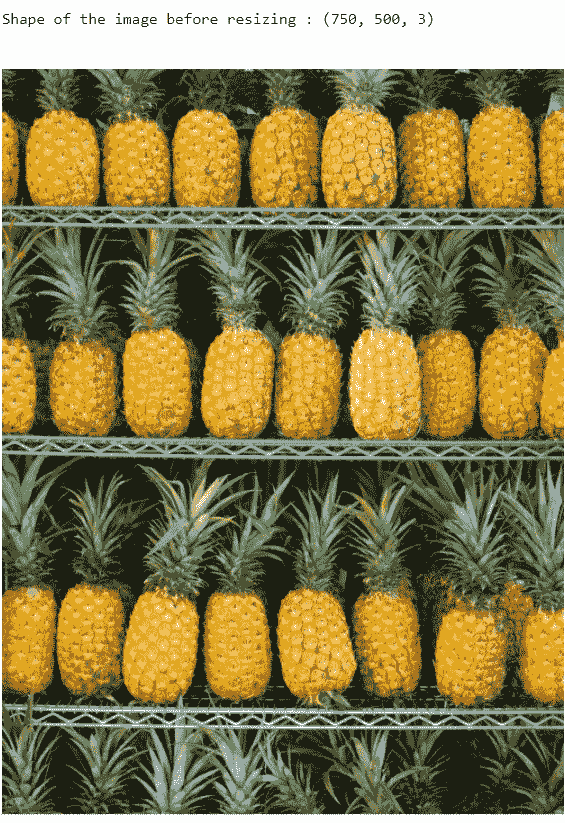**

****后期调整大小:****

**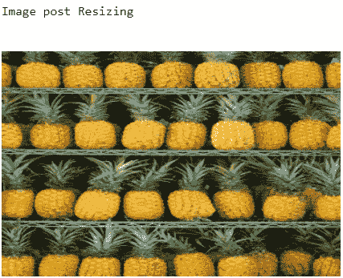**

****4.2。放大图像:****

**上面我们已经看到了图像的缩小。现在我们将重点放在图像的放大上。**

**我们将使用 cv。立方和立方之间。用于放大的 INTER_LINEAR。简历。与 cv 相比，INTER_CUBIC 比较慢。但是在 cv 的情况下输出相对更好。INTER_CUBIC than cv。线性的。默认情况下，插值方法 cv。INTER_LINEAR 用于所有调整大小的目的。**

**上述代码的输出是:**

****

****4.3。视频大小调整:****

**现在，我们将检查视频的大小调整。**

**上述代码的输出是:**

**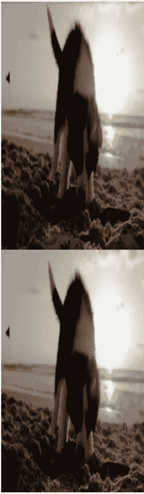**

**调整视频大小后**

**下面提到的是另一个功能，这是有帮助的情况下，现场视频。**

## **5)如何在图像中添加形状和文本？**

**在这里，我们将尝试添加不同的形状，如矩形，圆形，并实验形状的厚度。**

****5.1。在图像中添加矩形:****

**下面提到的是这里的代码，我们把 original_img 作为输入图像，我们将在上面绘制矩形。矩形的起始像素点是(200，200)，一直到(300，300)。而颜色是 B=200，G=100，R=150。**

**检查下面提到的代码及其输出**

**上述代码的输出:**

**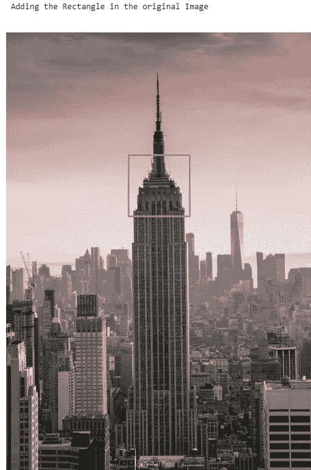**

****5.2。添加全厚度矩形:****

**下面提到的是这里的代码，我们把 original_img 作为输入图像，我们将在上面绘制矩形。矩形的起始像素点是(0，0)，它位于图像的中心。而颜色是 B=200，G=155，R=40。这里我们取了厚度=-1，所以整个矩形被颜色填充。**

**上述代码的输出:**

**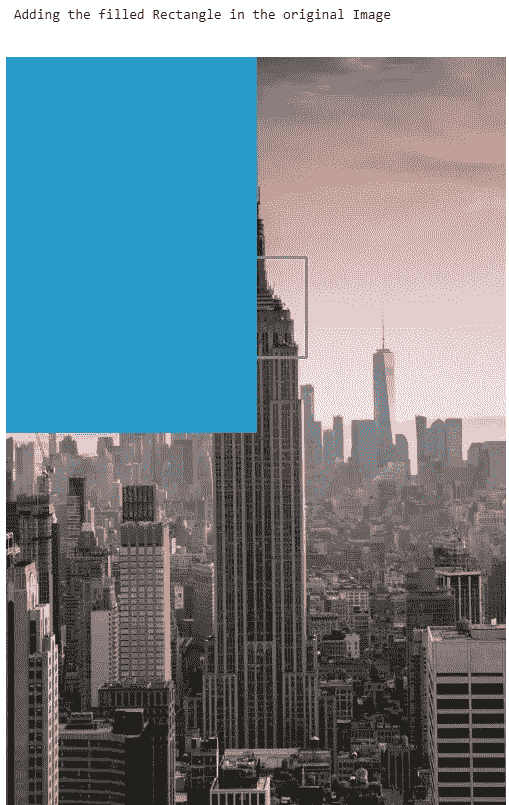**

****5.3。添加全厚度圆:****

**下面提到的是这里的代码，我们把 original_img 作为输入图像，我们将在上面画圆。圆的中心像素点是(450，450)，圆的半径是 40。而颜色是 B=25，G=0，R=100。这里我们取了厚度=-1，所以整个圆都用颜色填充。**

**上述代码的输出:**

**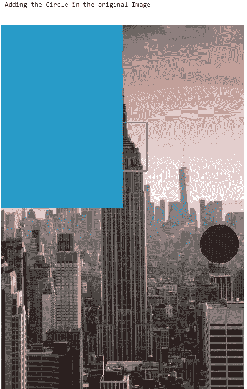**

****5.4。在图像中添加线条:****

**下面提到的是这里的代码，我们把 original_img 作为输入图像，我们将在上面绘制矩形。该线的起点像素点是(300，300)，终点像素点是(500，500)。**

**上述代码的输出:**

**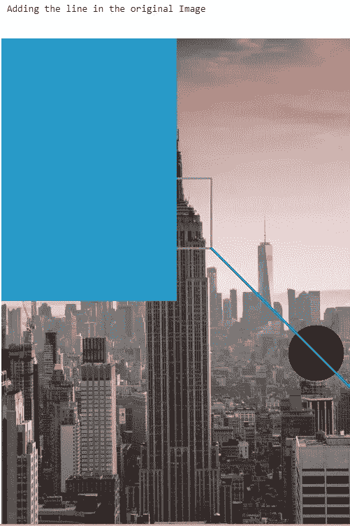**

****5.5。在图像中添加文本:****

**在这里，我们将使用 cv.putText()方法在空白图像中添加文本，在这里我们输入文本，我们必须放置文本的像素位置，我们还可以选择字体类型，如 FONT_HERSHEY_SIMPLEX，FONT_HERSHEY_PLAIN **，** *等。，*字体大小，颜色，粗细。**

**我们也可以通过使用 numpy 来创建空白图像，下面提到的代码中也提到了 numpy。**

**上述代码的输出:**

**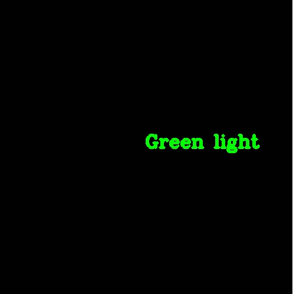**

****6)如何裁剪图像？****

**通过使用下面提到的代码，我们可以很容易地裁剪图像的特定部分。这里你只需要提到你要裁剪的像素。**

**上述代码的输出:**

**原始图像:**

****

**从图像中裁剪部分:**

**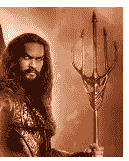**

****7)如何旋转或移动图像？****

**如果我们想移动图像，那么检查下面提到的功能，这是非常有用的:**

**在这里，我们试图通过使用上述功能来旋转图像。**

**上述代码的输出:**

**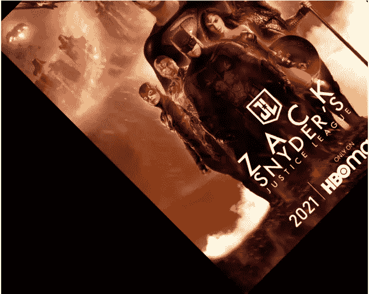**

**现在，我们将尝试旋转上面已经旋转的图像。**

**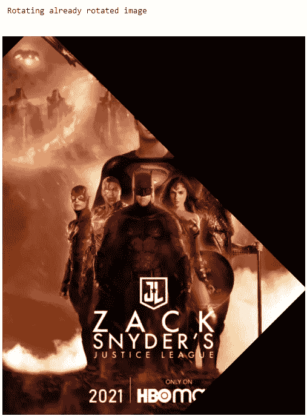**

**从上面的输出我们知道，如果我们试图旋转已经旋转的图像，那么在先前的图像中不可见的图像部分在当前的输出图像中也会消失。**

**此外，我们可以将图像上下颠倒。检查下面提到的代码及其输出。**

**上述代码的输出:**

**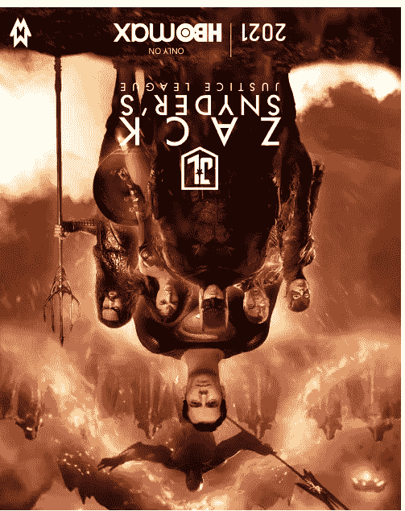**

# **总结:**

**如果你已经阅读了这个博客，那么你一定对 OpenCV 很熟悉。OpenCV 的其他主题将在下一篇博客中讨论。查看下一篇博客的[链接](https://pioneerspd.medium.com/opencv-guide-part-2-f4362c5ae365),在那里我们将关注 OpenCV 的一些高级内容。**

# **个人资料:**

**感谢阅读！请鼓掌感谢我的辛勤工作。我总是乐于接受建设性的反馈——如果你对这个分析有后续想法，请在下面评论或者通过 LinkedIn 联系[。](https://www.linkedin.com/in/shubham-dhawas-3ba232b7)**

# **参考资料:**

**1)【https://www.youtube.com/watch?v=oXlwWbU8l2o】T4&t = 8707s**

**2)[https://docs.opencv.org/master/d6/d00/tutorial_py_root.html](https://docs.opencv.org/master/d6/d00/tutorial_py_root.html)**