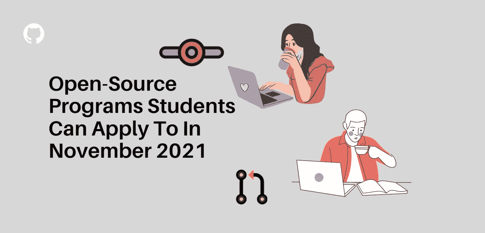
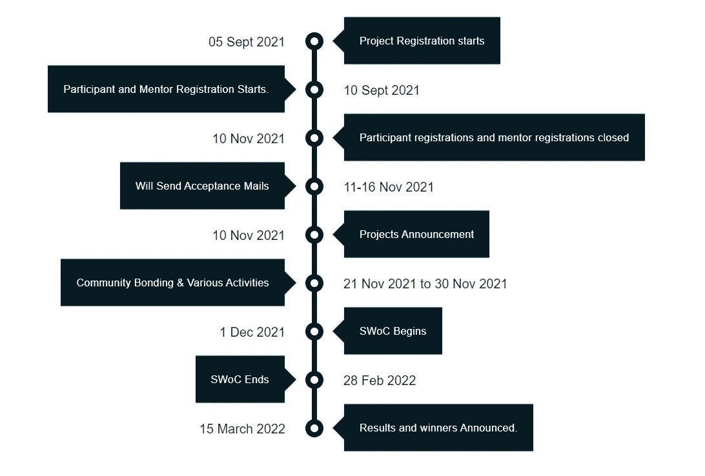
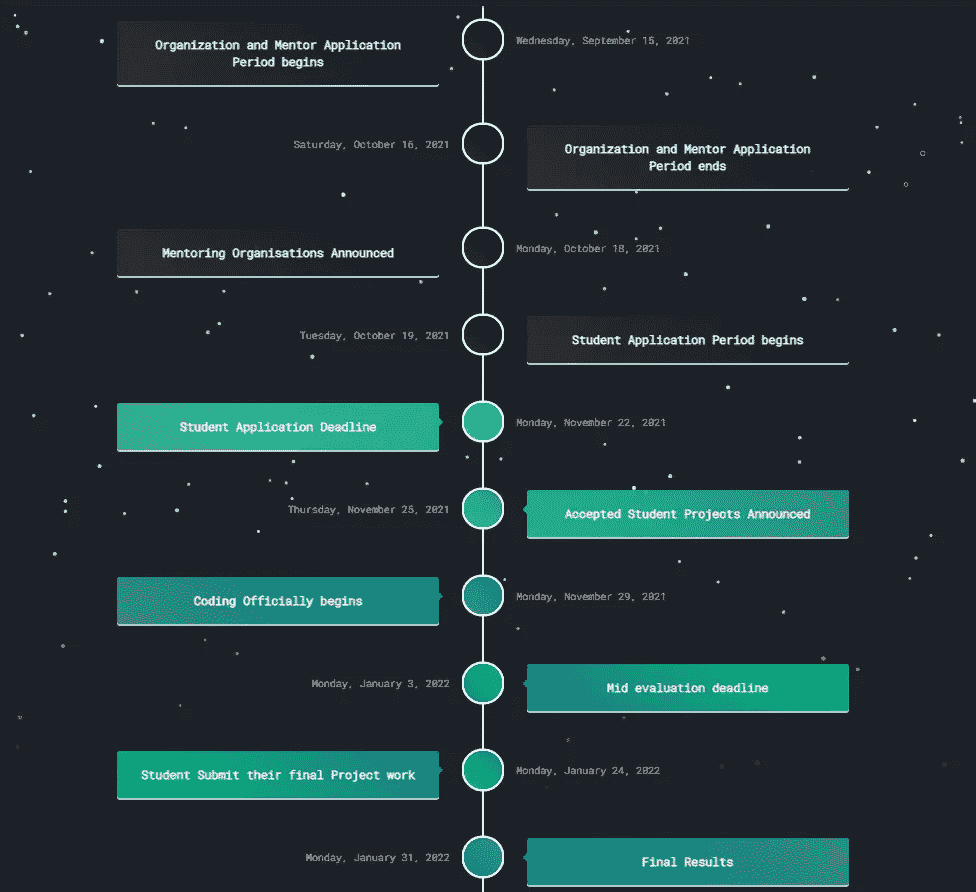
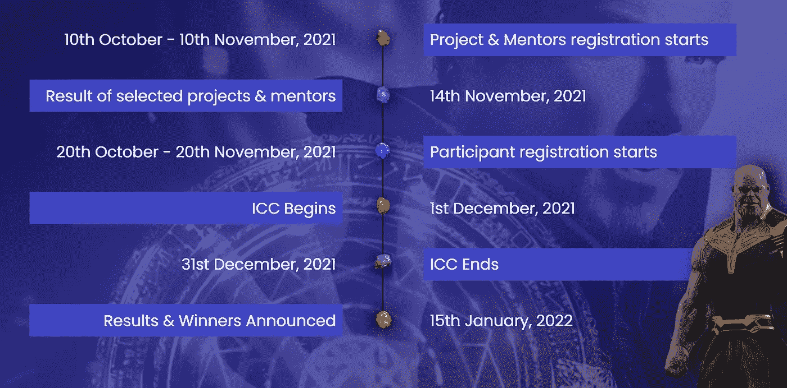
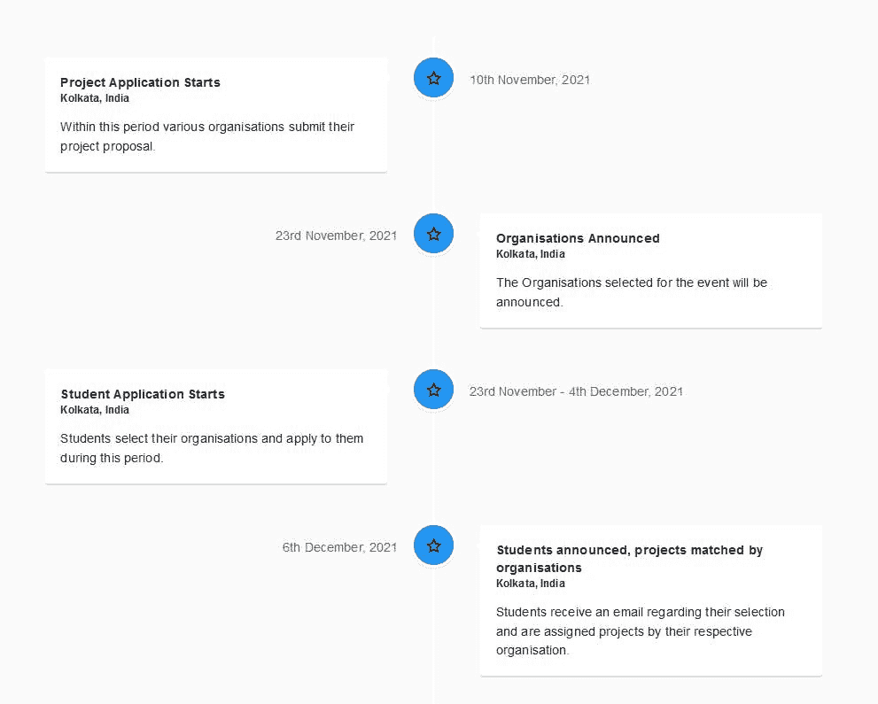
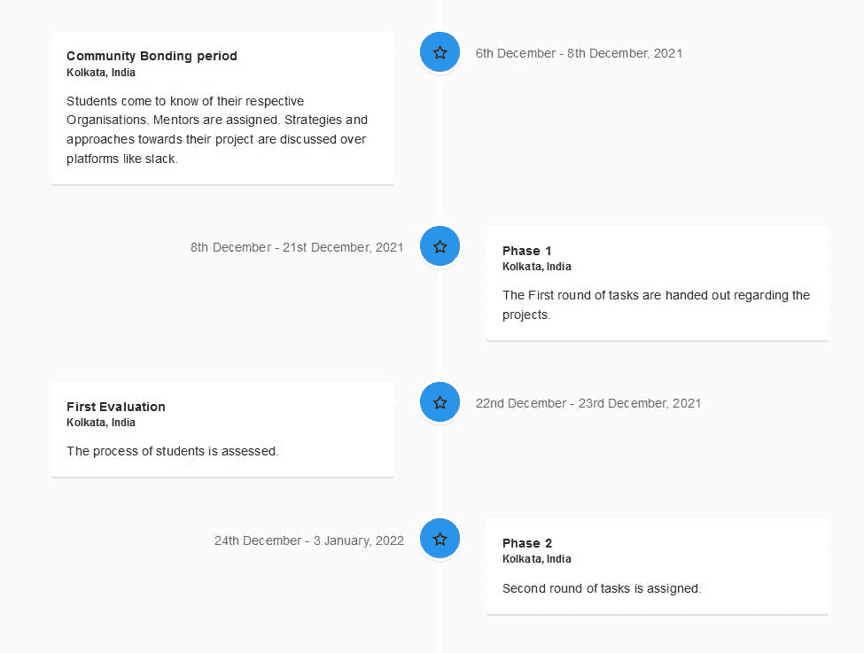
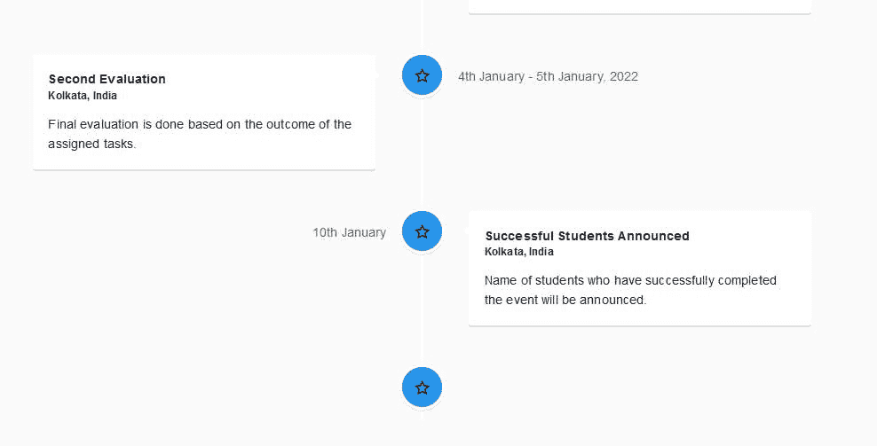
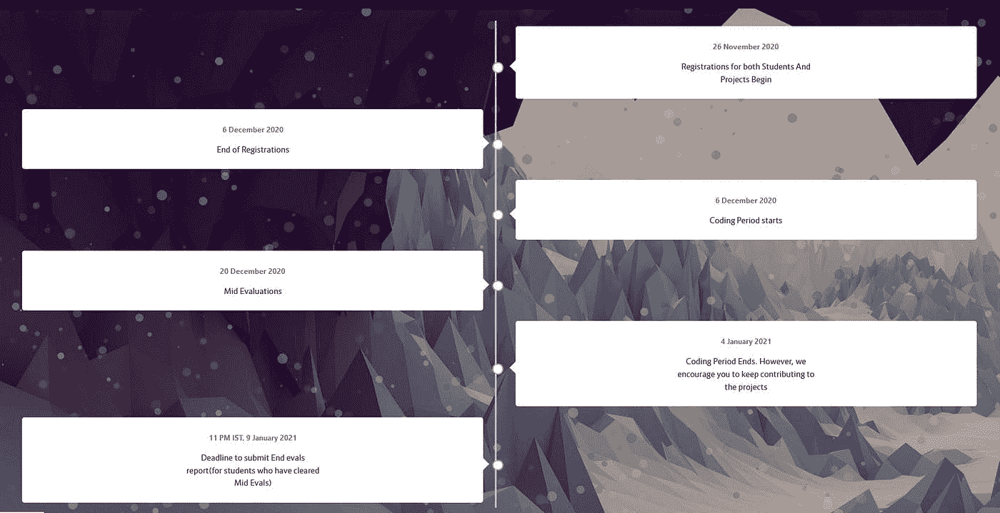
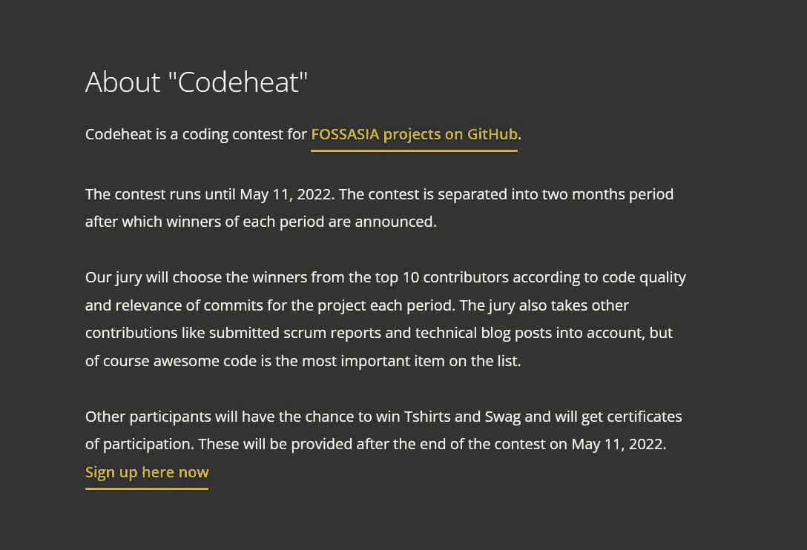

# 学生可以在 2021 年 11 月申请开源项目

> 原文：<https://medium.com/nerd-for-tech/open-source-programs-students-can-apply-to-in-november-2021-c2aeae472ca2?source=collection_archive---------1----------------------->

现在是 11 月，如果你仍然对开源感兴趣，恭喜你。你刚刚通过了 hacktoberfest。每年都有各种各样的开源项目。十月的结束并不意味着开源贡献的结束。你们中的许多人肯定参加了刚刚结束的 hacktoberfest，并在等待你们的战利品。为开源做贡献是获得软件开发实际经验的最好方式。

在本文中，我们将讨论一些学生可以在 2021 年 11 月申请的开源项目。所以让我们开始吧。

# **1。脚本代码之冬(SWOC)**

Script Foundation 创建了一个名为 Script Winter of Code 的开源程序。它的目标是向学生介绍开源开发的世界，并展示实时统一解决问题的能力。这些项目是精心挑选的，旨在激发所有参与者的创造性思维和协作。

在整个旅程中，学生们将由经验丰富的导师陪同。他们将获得在软件开发领域取得成功所需的技能，同时也发展对开源的透彻理解。 [**此处适用**](https://swoc.scriptindia.org/#/)

## 计划时间表

# 2.三角洲冬季代码(DWoC)

DWoC 是一个由 NIT Trichy 的编码俱乐部三角洲部队组织的长达一个冬天的项目。这为年轻的学生开发人员(甚至是初学者)提供了一个平台，通过承担他们感兴趣的项目来掌握他们的技术能力，目标是支持和改善学生周围的开源软件文化。 [**此处适用**](https://dwoc.io/)

## 计划时间表

# 3.GDSCCU 的《代码的冬天》

由 Google DSC 昌迪加尔大学为新生和开源爱好者举办的为期一个月的编码盛会。

“代码之冬”是一个为期一个月的编码计划，主要针对新生和开源爱好者，类似于谷歌的“代码之夏”。该计划的主要目标是为学生提供类似的体验，让他们为谷歌代码之夏做好准备，在这种体验中，他们可以学习开源贡献的基础知识，与专家导师互动，构建现实世界的解决方案，并扩展他们的技术技能。 [**此处适用**](https://woc.gdsccu.tech/)

## 计划时间表

# 4.无限克隆人阴谋(ICC)

Techsahead 的无限克隆阴谋是一个新组织的开源程序。它的目标是向学生讲授开源编程，并展示实时统一解决问题的强大功能。会主持一些手选项目，督促大家创造性思考，贡献力量。

在整个 ICC 项目中，参与者将接受训练有素的导师的指导。他们将获得在编程方面出类拔萃所需的能力，同时也学到很多关于开源的知识。 [**此处适用**](https://icc-techsahead.netlify.app/)

## 计划时间表

# 5.代码之冬(WoC)

“代码之冬”是 NSEC 开发者学生俱乐部的一项倡议，旨在提高大学生对谷歌代码之夏计划的参与度。

作为“代码之冬”的一部分，学生与来自合作组织的导师配对。这个项目旨在提高你在各种学科中设计真实世界软件的能力。因此，参与组织了解你的潜力和能力。 [**此处适用**](https://winterofcode.com/)

## 计划时间表

# 6.[哈拉格普尔冬季代码](https://kwoc20.kossiitkgp.org/) (KWoC)

Kharagpur Winter of Code 是一个为期 5 周的在线项目，面向刚接触开源软件开发的学生。该计划不仅帮助学生接触开源，还为他们准备了许多开源暑期项目；谷歌代码之夏就是其中之一。

# 计划时间表

# 7. [FOSS 亚洲代码热](https://codeheat.org/)

FOSSASIA 和 OpnTec 将于 2021 年 11 月 10 日至 2022 年 5 月 11 日举办 Codeheat 编码比赛。 Codeheat 分为两个月。每一阶段结束后，将宣布获胜者。贡献至少五个拉请求的参与者可以获得一个数字证书，超过十个拉请求的开发者可以赢得大奖。符合竞赛条件的问题在 GitHub 上有“Codeheat”的标签。请加入 FOSSASIA GitHub 组织，开始行动吧。

**注意:**所有的项目都已公布，截止日期也很近，所以如果你有兴趣，请申请并与你的朋友分享。如果有更多的开源程序发布，截止日期在 11 月，请在评论中提及。这样我就可以把这个程序添加到我的文章中，让其他人受益。整个 11 月，我都会不时更新这篇文章，所以请收藏。

**如果你❤️我的内容！帮我接通** [**推特**](https://twitter.com/Astrodevil_)