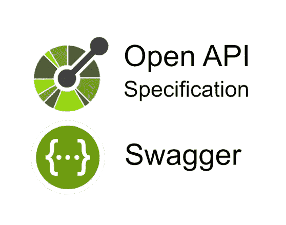
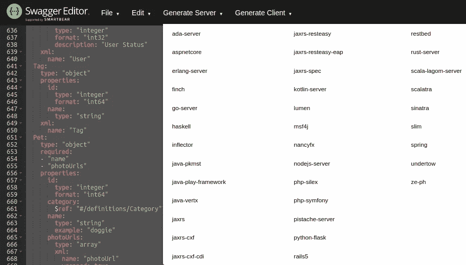
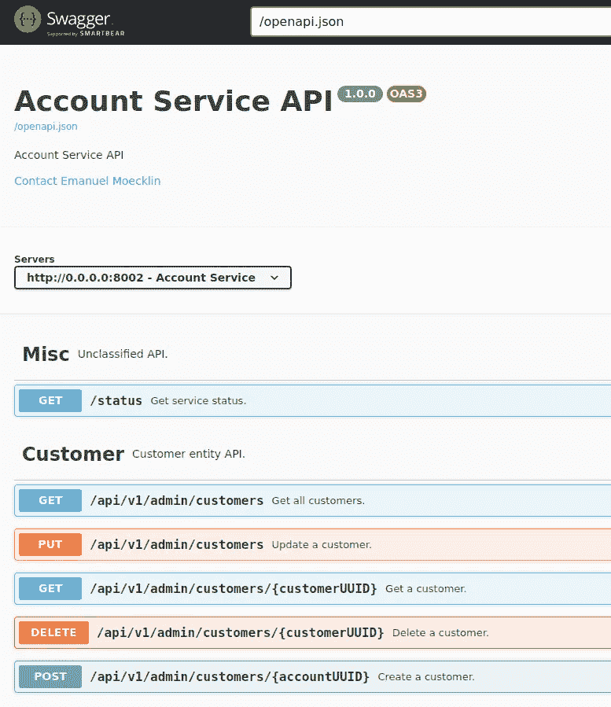

# 用 Ktor 生成 OpenAPI

> 原文：<https://medium.com/nerd-for-tech/openapi-generation-with-ktor-d57879ec5ab0?source=collection_archive---------4----------------------->

# 介绍

作为我的系列“[一个固执己见的 Kotlin 后端服务](/p/87f814e3dffd)”的一部分，我正在研究如何**自动生成** [**OpenAPI**](https://www.openapis.org/) **文档**(问题)。在解释如何从代码(解决方案)中**生成 api 文档之前，我将简要概述生成这种文档的不同方法。**

# OpenAPI

[OpenAPI](https://www.openapis.org/) 是描述 API 的标准，因为 [RAML](https://raml.org/) 的开发者加入了 [OpenAPI 倡议](https://www.openapis.org/)(这有点复杂，但这不是一篇关于不同标准的文章……)。如果你想让你的后端服务被正确使用，它应该有一个 OpenAPI 文档。

# 我已经有一个 API 了

如果你已经有一个 API，只需要文档，使用各种 Swagger 工具中的一个(像 [Swagger Inspector](https://inspector.swagger.io/builder) 、 [Swagger Editor](https://swagger.io/tools/swagger-editor) 或[另一个 Swagger Editor](https://editor.swagger.io/) )来记录你的 API，然后将其作为你的应用的一部分发布，或者用 [SwaggerHub](https://app.swaggerhub.com/) 托管它。顺便说一句，我不是靠招摇过市来赚钱的，我也知道，除了招摇过市，还有其他选择；-).

# 我还没有 API

如果你没有 API 或者想将现有的 API 转换成自动生成的文档，imo 有三种方法:

1.  从 API 文档生成路由/服务器存根:
    **API 文档** ➔ **代码生成**
2.  从您的代码文档生成 API 文档:
    **代码文档** ➔ **API 文档**
3.  从路由代码
    **生成 API 文档路由代码** ➔ **API 文档**

## API 文档➔代码生成

在这种情况下，编写 API 文档，代码生成器生成服务器和/或客户端存根。

最受欢迎和最完整的发电机可能是 https://github.com/OpenAPITools/openapi-generator。它支持许多不同的目标平台，kotlin-server 就是其中之一。如果你想查看生成的代码，我建议你先试试 [Swagger Codegen](https://swagger.io/tools/swagger-codegen/) 。它比[的 openapi-generator](https://github.com/OpenAPITools/openapi-generator) 更容易使用，并且还有一个 kotlin-server 选项:

## **代码文档** ➔ **API 文档**

在这种情况下，通过使用注释和/或文档生成器(如 [JavaDoc](https://www.oracle.com/java/technologies/javase/javadoc-tool.html) 、 [JSDoc](https://jsdoc.app/) 或 [YARD](https://yardoc.org/) )来记录代码。扩展可用于在常规代码文档之上创建 OpenAPI 文档。

例如，对于 nodejs，有 [swagger-jsdoc](https://www.npmjs.com/package/swagger-jsdoc) 从注释和 jsdoc 生成 OpenAPI 文档:

对于 Java，有一个 [Swagger 核心](https://github.com/swagger-api/swagger-core):

## 路由代码➔ API 文档

在这种情况下，API 被记录为代码的一部分，并且生成器通过解析代码(例如插件)或者通过扩展路由库以添加文档特征来创建 OpenAPI 文档。

该选项不同于“代码文档➔ API 文档”选项，因为它对实际路线和 API 文档使用相同的语言(与注释、配置文件或特定文档“语言”相比)。

对于 Ruby on Rails，例如有 [rswag](https://github.com/rswag/rswag) :

对于 Ktor/Kotlin，有 [Ktor-OpenAPI-Generator](https://github.com/papsign/Ktor-OpenAPI-Generator) :

## 决定

有两个决定:

1.  生成代码或文档？
2.  从代码还是从注释/特定文档生成文档？

当我检查了生成的代码后，第一个决定对我来说很容易。与 Java 不同的是，[https://github.com/OpenAPITools/openapi-generator](https://github.com/OpenAPITools/openapi-generator)生成的 kotlin-server 代码非常简单，没有增加什么价值，因为每一次代码生成都需要手工集成。似乎也没有太多兴趣将它用于 Ktor(在[上只有一个问题与 openapi-generator 和 ktor](https://stackoverflow.com/questions/tagged/openapi-generator%20ktor) 相关)。如果实际的业务逻辑可以很容易地插入，并且在代码生成运行后不需要手动更改，那么代码生成将会很有用。

第二个决定对我来说也很容易。正如在[https://medium . com/nerd-for-tech/object-validation-in-kot Lin-c 7 e 02 b 5 dabc](/nerd-for-tech/object-validation-in-kotlin-c7e02b5dabc)中已经解释过的，我提倡使用单一语言，而不是为特定目的(配置、文档、路由定义等)使用不同的语言。)所以我决定深入研究，并使用 [Ktor-OpenAPI-Generator](https://github.com/papsign/Ktor-OpenAPI-Generator) 来实现我的目的。

# ktor-open API-生成器

## 坏事

项目[https://github.com/papsign/Ktor-OpenAPI-Generator](https://github.com/papsign/Ktor-OpenAPI-Generator)不是很活跃，8 个守望者，122 个星，25 个叉。上次提交时间是 2021 年 3 月 17 日，版本是 0.2-beta.16。

文档非常缺乏，这里的例子[https://github . com/papsign/Ktor-open API-Generator/wiki/A-first-examples](https://github.com/papsign/Ktor-OpenAPI-Generator/wiki/A-few-examples)让人困惑多于启发。演示项目[https://github.com/SerVB/e-shop](https://github.com/SerVB/e-shop)相当古老。它确实比“[几个例子](https://github.com/papsign/Ktor-OpenAPI-Generator/wiki/A-few-examples)”解释得更多，但作为快速入门指南，它肯定不理想。

有一件事我马上就被绊倒了，而且几乎让我放弃了图书馆，那就是所谓的 DSL。它是嵌套对象生成、构造函数对象实例化、扩展函数和实际 DSL 的混合体。

设置插件看起来还是有希望的(实际 DSL):

设置路线已经很尴尬了:

添加异常处理会使情况变得更糟(这是来自[https://github.com/SerVB/e-shop](https://github.com/SerVB/e-shop)的一个真实例子):

虽然我可以看到分层路由的好处，但我不明白为什么 throws 语句要包装路由，为什么它们需要包装彼此(事实上它们不需要包装，但缺乏文档使这很难弄清楚)。

## 好人

生成的文档看起来不错:

是开源的！

也就是说，我分叉了这个项目，并开始消除一些缺点:【https://github.com/1gravity/Ktor-OpenAPI-Generator。

首先，我改变了异常处理，使层次变平。APIExceptionBuilder 可用于构建一个异常(使用 Builder 模式时，属性是可选的)，而不是具有不同签名的多个扩展函数:

其次，我将 exception 作为参数添加到 route 函数中，这样就可以将异常定义传递到路由定义中，而不是将路由包装到 throws 调用中:

我计划取消构造函数调用，用一个使用路由构建器的 DSL 来代替它，以得到这样的结构:

另一个想法是完全废弃这个新的 DSL，并围绕常规的 Ktor 路由编写扩展函数或包装器，将其用作一个插件，使 Ktor 开发人员易于采用。

请和我一起参加 https://github.com/1gravity/Ktor-OpenAPI-Generator[的](https://github.com/1gravity/Ktor-OpenAPI-Generator)活动，让这一切成为现实！

像往常一样，请不要犹豫，提供反馈和快乐编码！