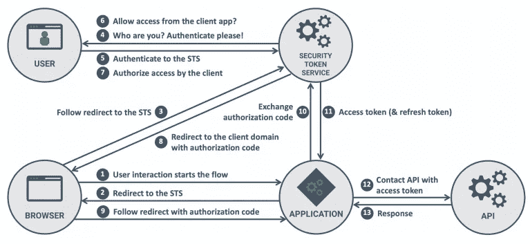
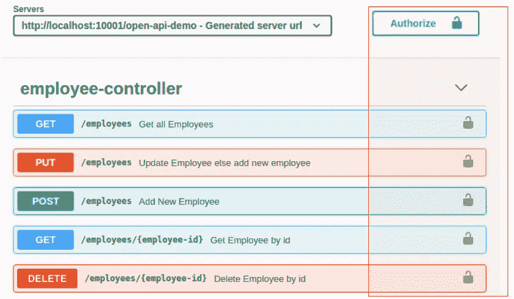
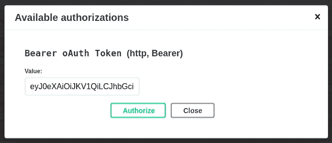
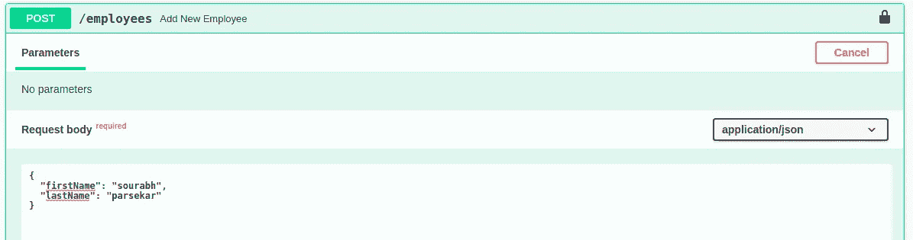
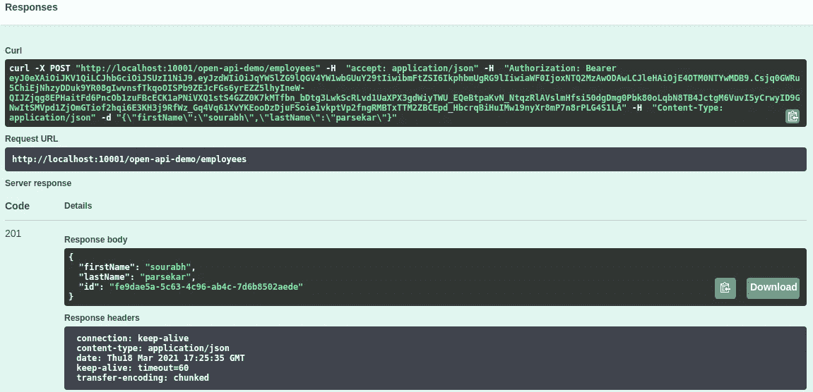

# OpenAPI 规范— Swagger 认证

> 原文：<https://medium.com/nerd-for-tech/openapi-specification-swagger-authentication-c150f86748ea?source=collection_archive---------1----------------------->

[https://www . synopsys . com/blogs/software-security/WP-content/uploads/2020/05/API-security-offtoagodstart . jpg](https://www.synopsys.com/blogs/software-security/wp-content/uploads/2020/05/api-security-offtoagoodstart.jpg)

*我为什么信任你？*这是 API 可以向访问 API 资源的客户提出的问题。当需要保护资源，防止未经授权的访问时，它可能会要求提供客户端凭据。

在第 2 部分——哦，等等，你可以通过[第 1 部分——了解基本的 Swagger 3 OAS](https://sourabhparsekar.medium.com/open-api-specification-swagger3-fc9ad3bbacdd) ,没有认证复杂性。第 1 部分涵盖了什么是 Swagger & OAS，它如何改进 API 文档，以及它如何使 ***other*** 开发者的生活变得简单。

> *[*open API 规范*](https://swagger.io/specification/) *(OAS)为 RESTful APIs 定义了一个标准的、与语言无关的接口，允许人类和计算机在不访问源代码、文档或通过网络流量检查的情况下发现和理解服务的功能。**
> 
> *[*Swagger UI*](https://swagger.io/tools/swagger-ui/)*生成一个交互式 API 文档，让消费者通过与实时 API 交互，直接在浏览器中试用 API 调用。**

*在本文的第 2 部分中，我们将看到如何保护我们的 swagger 端点。*

# *为什么和什么是 API 安全？*

**

*[https://www . soap ui . org/learn/security/state-of-API-security/](https://www.soapui.org/learn/security/state-of-api-security/)*

*Guy Levin 在他的博客中写了五大 REST API 安全指南。正如他所说，我们有许多动词，即 GET、POST、PUT、DELETE 等来通过 HTTP 访问和修改资源，但是所有的资源都需要被认证。*

*对于身份验证，我们将只验证客户端/用户应用程序的身份。*

*在本文中，我们没有看到角色或其他 Spring 认证是如何工作的。我们将看到开发人员如何配置 OAuth 令牌(*让我们在下一节*中看看它的含义)，然后验证它，只是为了展示它是如何完成的。我们只是看到了其中一个选项，有多种方式进行身份验证和授权。*

*你可以随时用新的认证方式更新我的 [GitHub](https://github.com/sourabhparsekar/open-api-spec) 库。随意派生、使用和重用存储库。*

# *让我们检查几种验证 HTTP 请求的方法*

## *HTTP 基本身份验证*

*这是最简单的技术，我们将用户名和密码组合在一起形成一个值。然后，这个值用 Base64 编码，并通过 HTTP 头授权传递。服务器检查授权头，并将其与存储的凭证(用户名和密码)进行比较。如果它们匹配，服务器满足客户端的请求。然而，如果它们不匹配，则指示未授权访问的 HTTP 状态代码 401 被发送回请求者。该代码通知客户端身份验证失败，因此客户端的请求被拒绝。*

## *OAuth 认证*

*OAuth 是一种基于令牌的身份验证，也可以涵盖授权。在发出请求之前，客户端需要向身份验证服务器请求一个身份验证令牌。该令牌被添加到 HTTP 授权报头中，并与请求一起发送。服务器需要将令牌转发给身份验证服务器或在本地对其进行验证。*

**

*[https://pragmatic web security . com/files/cheat sheets/oauth 2 security fordevelopers . pdf](https://pragmaticwebsecurity.com/files/cheatsheets/oauth2securityfordevelopers.pdf)*

*OAuth 认证实际上比其他可用的认证机制更安全，它很快成为许多客户端和应用程序的首选。出于同样的原因，我们将看到如何使用 Swagger3 - OpenAPI 规范实现 OAuth 令牌验证。令牌授权不会完全实现，但我们将编写足够的代码来了解令牌如何传递给决定接受或拒绝请求的服务层。*

# *让我们看看代码实现*

*现在我们知道了为什么身份验证如此重要，以及我们可以用什么方法做到这一点，让我们看看如何将它集成到我们的项目中。对于这个例子，我使用的是[spring boot-2 . 3 . 4 . release](https://docs.spring.io/spring-boot/docs/2.3.4.RELEASE/reference/html/index.html)、 [Apache Maven](https://maven.apache.org/) 作为构建工具，以及 [Java 8](https://www.oracle.com/java/technologies/java8.html) 。完整的演示项目代码可在 [GitHub](https://github.com/sourabhparsekar/open-api-spec) 上获得。参考 [README.md](https://github.com/sourabhparsekar/open-api-spec#readme) 文件，在您的本地环境中设置并运行项目。*

> ****我们的最终目标是什么？****

**

*我们将逐步了解如何在 Swagger UI - OpenAPI 规范中添加身份验证。*

*我们还将看到如何使用它来测试我们的服务。务必使用[样本代码](https://github.com/sourabhparsekar/open-api-spec)亲自尝试一下。*

**那么让游戏开始吧……**

> ***第一步:OpenAPI 规范 Maven 依赖***

*在 Swagger 中设置身份验证不需要额外的依赖。最新版本的`springdoc-openapi-ui`可以在 [*Maven 中央*](https://search.maven.org/classic/#search%7Cga%7C1%7Cspringdoc-openapi-ui) *上找到。*要将它添加到我们的 Maven 项目中，我们需要在 *pom.xml* 中添加依赖项*

*springdoc-openapi-ui 的依赖关系*

> ***第二步:使用跳趾的摇摆配置***

*Swagger3 的配置需要`**OpenAPI**` bean。还可以使用 OpenAPI bean 添加许可证和联系信息。为了认证，我们必须调用`**addSecurityItem(SecurityRequirement securityItem)**` ，它在授权模式中添加消息。我们还为必要的安全模式添加了组件。安全模式由模式名称、类型、方案和其他细节组成。*

*在我们的例子中，我们使用 JWT 令牌的不记名令牌。以下是我们的 swagger 配置:*

*使用载体认证的 Swagger 配置*

> ***第三步:授权按钮:运行应用程序***

**

*授权按钮*

*就像之前的代码变化一样，Swagger 现在会在右上角显示“`**Authorize**`”按钮。*

*我们还没有为实际的身份验证编写任何代码，但是是的，swagger UI 的更改已经完成。当我们点击授权按钮，下面的模式应该弹出，我们可以添加令牌和授权的 API。现在您可以像以前一样调用 API 了。*

**

*Swagger 授权令牌的输入屏幕*

> ***步骤 4:让我们修改代码来验证令牌***

*因此，我们不打算进行完整的实现来验证 JWT 令牌。然而，我们将尝试生成 [JWT 令牌](https://jwt.io/)并在我们的请求中传递它们。*

*让我们看看下面的代码，看看是什么改变了！！*

*创建员工的安全 HTTP Post 端点*

*正如我们所看到的，我们在现有的代码中添加了一些东西*

1.  *对于`**HttpStatus**`代码 401，我们有一个额外的`**ApiResponse**`来指示由于令牌验证失败而导致的未经授权的用户请求。*
2.  *我们添加了`**HttpServletRequest**`参数来读取 servlet 请求。*
3.  *添加 Try-catch 块是为了捕获身份验证失败并返回带有 401 HttpStatus 代码的响应*
4.  *我还添加了额外的服务类来验证令牌，否则会在令牌无效的情况下抛出身份验证异常。这个令牌是从`**HttpServletRequest**`报头中提取的。`**httpServletRequest.getHeader(HttpHeaders.*AUTHORIZATION*)**`*

> ***步骤 5:行动中的认证***

*我们之前已经了解了如何使用`**Authorize**`按钮。当发送请求时，令牌被应用于所有 API 头。我们将着眼于创建新的员工记录。其他 API 以类似的方式运行。*

***请求:**我们已经添加了令牌和请求体。*

**

*带有令牌验证的 Swagger Post 请求*

***响应:**我们可以看到，对于 swagger 生成的 curl 请求，在请求头中分配了 token。*

**你可以试着看看不设置令牌时会发生什么。**

**

*使用令牌身份验证的招摇 Post 响应*

> *第六步:瞧。我们完了！！考验的时候到了*

**

*霸气"`**Try it out**`"*

*如果您已经在本地机器上下载了[示例代码](https://github.com/sourabhparsekar/open-api-spec)，编译并运行了它，那么您可能已经在您最喜欢的浏览器中加载了 Swagger UI。*

*要运行 swagger，在运行 SpringBoot 应用程序后，您可以点击 URL:*

*`http://localhost:10001/open-api-demo/swagger-ui.html`*

> *作为下载、编译和/或运行代码的指南，请参考示例代码根目录中的`README.md`文件。如果你仍然不能让它工作，给我留言或笔记。我们可以一起努力让它成功。毕竟，把手弄脏会让你更容易理解。*

*我假设示例代码在您的系统上运行良好。Swagger 针对每个 API 都有一个内置的“`**Authorize**`”、&、`**Try it out**`按钮，它能够运行请求，以便消费者可以验证输出。它还显示了与授权头和其他参数一起发送的请求。*

*因此，当您尝试执行请求时，Swagger UI 将读取请求的定义，并期望使用者提供相关的测试数据，如路径/查询参数或请求体。一旦提供了数据，消费者可以点击`**Execute**`按钮来运行请求，请求的响应被返回。*

*因此，我们用 OAuth 令牌更新了 SpringBoot 应用程序。我们添加了 Swagger 依赖项和身份验证所需的 OpenAPI 规范配置。*

*这样，我们为 API 文档 *向 Swagger UI 添加认证的旅程就结束了。**

**直到下次再见…继续编码...继续学习…继续分享…**

*请随意发表评论，让我知道你喜欢什么或不喜欢什么。我非常期待您的建议和反馈，告诉我如何做得更好。*

# *参考资料:*

* [## 开放 API 规范— Swagger3

### SpringBoot API 文档

sourabhparsekar.medium.com](https://sourabhparsekar.medium.com/open-api-specification-swagger3-fc9ad3bbacdd)  [## 什么是 API 认证？| API 验证定义| RapidAPI

### 我们都知道 API 是帮助客户机和服务器通信的软件协议和工具。然而……

rapidapi.com](https://rapidapi.com/blog/api-glossary/api-authentication/#:~:text=Since%20API%20is%20a%20profound,to%20authorized%20full%20access%20when)  [## 5 大 REST API 安全指南

### 开发 REST API 时，必须从一开始就注意安全性。在这篇文章中，我将回顾并…

blog.restcase.com](https://blog.restcase.com/top-5-rest-api-security-guidelines/)  [## Spring 安全 OAuth2 应用程序中的| Baeldung

### 在本教程中，我们将了解 JSON Web 签名(JWS)，以及如何使用 JSON Web Key 实现它…

www.baeldung.comm](https://www.baeldung.com/spring-security-oauth2-jws-jwk)*