# 欢迎来到 OpenCV 指南第 2 部分

> 原文：<https://medium.com/nerd-for-tech/opencv-guide-part-2-f4362c5ae365?source=collection_archive---------17----------------------->

大家好，

希望大家都好，在之前的博客中，我们已经开始学习 OpenCV 的基础知识。在那里，我们已经看到了如何执行图像和视频的大小调整，裁剪等。这是 OpenCV 教程的第二部分。在这篇博客中，我们主要关注 OpenCV 的高级部分，它将涵盖下面提到的问题。但是如果你是 OpenCV 的新手或者发现这很难理解，那么请访问 [OpenCV 基础指南第一部分](https://pioneerspd.medium.com/open-cv-basic-guide-part-1-cbc94ba3280f)博客，温习一下基础知识，然后再回到这个博客。

我们心中仍然存在的问题是:

**如何在图像中进行边缘检测？**

**如何在图像中进行轮廓检测？**

☚**如何在图像中进行色彩间隔？**

☚**色版怎么处理？**

☚**如何模糊图像？**

☚**如何使用按位运算符？**

☚**如何绘制图像每个像素中颜色的直方图？**

让我们从比特深度的所有问题开始。

**1)如何在图像中进行边缘检测？**

**1.1。精明:**

对于这里的边缘检测，我们将使用 cv。精明的方法。输入图像是原始图像，阈值-1 即低于 150 的像素值被视为非边缘，阈值-2 即高于 175 的像素值被视为有效边缘。如果该值在 150 和 175 之间，那么如果边缘像素与有效边缘相关，那么只有它被认为是有效边缘。

上述代码的输出:

原始图像:

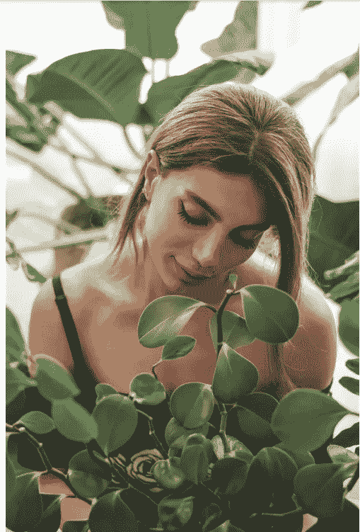

原象

原始图像的边缘:

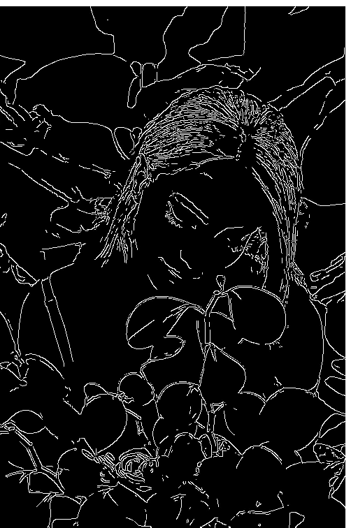

现在，我们将试图找到原始图像的边缘，使其变得模糊。如何使图像模糊将在博客中进一步讨论。

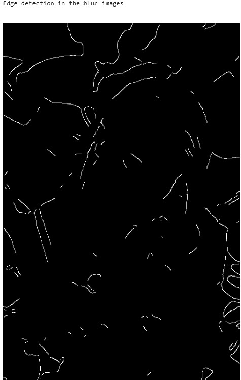

通过比较原始图像和模糊图像之间的边缘检测。我们知道，随着图像变得越来越模糊，图像中的边缘检测越来越少。

**1.2。拉普拉斯:**

在拉普拉斯边缘检测方法中，我们将计算源图像的(x，y)像素的第二梯度。当 ksize>1 时，检查下面提到的用于源图像的拉普拉斯公式:

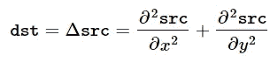

当 ksize=1 时，拉普拉斯算子通过使用以下 3×3 孔径对图像进行滤波来计算:

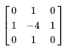

其中 ksize:用于计算二阶导数滤波器的孔径大小。大小必须是正数和奇数。

上述代码的输出:

**拉普拉斯边缘检测:**

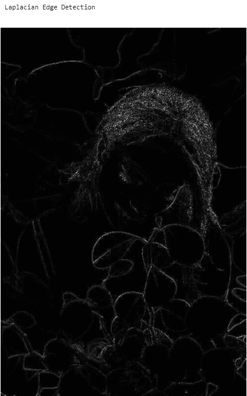

**1.3.Sobel 边缘检测:**

在计算拉普拉斯算子时，我们计算了二阶导数，称为 Sobel。因此，在 sobel 检测中，我们将计算 sobelx(也称为水平 Sobel 导数)和 sobely(也称为垂直 Sobel 导数)。我们可以通过输入图像与大小为 3*3 的核的卷积来计算 Sobelx 和 sobely(但是我们可以根据需要改变核的大小)。

拉普拉斯公式中的 Sobelx 和 sobely:

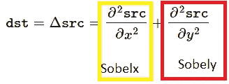

3*3 矩阵提到的卷积是:

索贝尔边缘检测的代码演练。

上述代码的输出:

索贝尔:

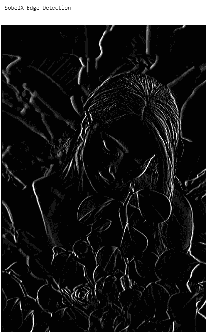

**清醒地:**

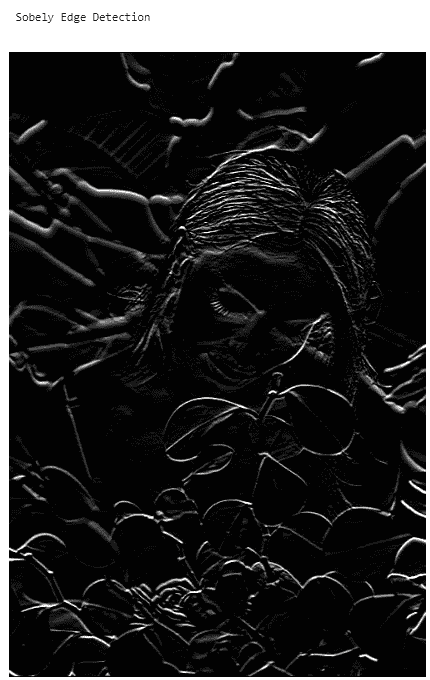

**贴合两者的索贝尔:**

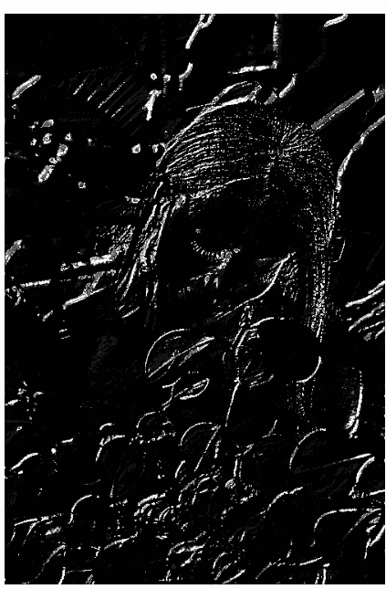

**1.4。侵蚀和扩张:**

**1.4.1 侵蚀:**

*   这对于去除小的白噪声是有用的。
*   用于分离两个相连的物体等。

工作原理:

1.  核(奇数大小(3，5，7)的矩阵)与图像进行卷积。
2.  只有当内核下的所有像素都是 1 时，原始图像中的像素(1 或 0)才会被视为 1，否则它会被侵蚀(变为零)。
3.  因此，根据内核的大小，所有靠近边界的像素都将被丢弃。
4.  因此前景物体的厚度或尺寸减小，或者图像中的简单白色区域减小。

**1.4.2 扩张:**

*   在像噪声去除这样的情况下，腐蚀之后是膨胀。因为，侵蚀去除了白噪音，但也缩小了我们的物体。所以我们扩大它。既然噪音没了，他们就不会回来了，但是我们的对象面积增加了。
*   它在连接物体的断裂部分时也很有用。

工作原理:

1.  核(奇数大小(3，5，7)的矩阵)与图像进行卷积
2.  如果内核下的至少一个像素是‘1’，则原始图像中的像素元素是‘1’。
3.  它增加了图像中的白色区域或者增加了前景物体的尺寸

扩张和侵蚀的代码演练:

上述代码的输出:

**将图像输入到 cv.dilate():**

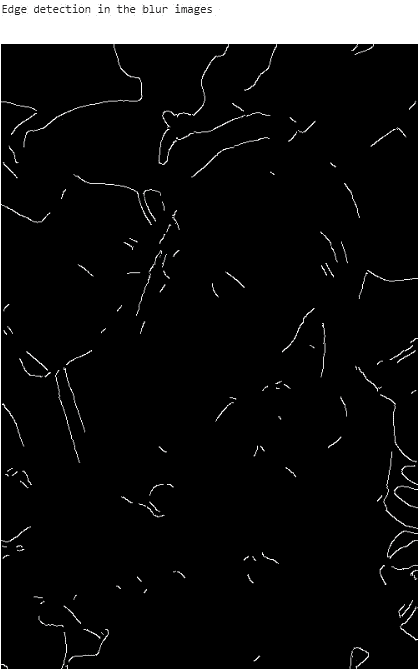

**扩张**:会增加边缘的厚度

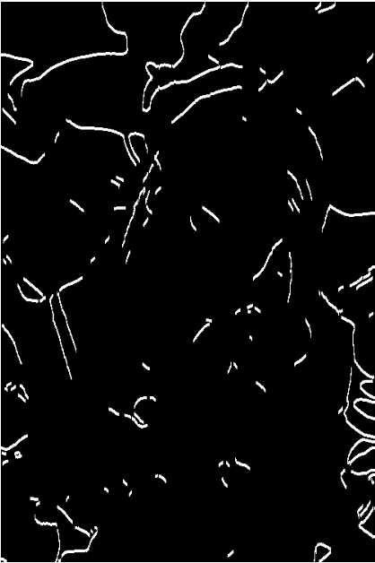

**侵蚀**:此处输入图像为 cv.dilate 输出。所以现在侵蚀输出将恢复扩张的输入图像。

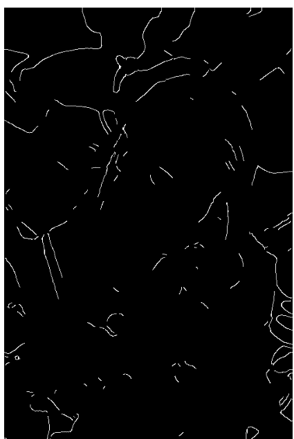

**2)如何进行图像中的轮廓检测？**

有时，如果我们对图像执行边缘检测和轮廓检测，那么两者的输出可能看起来相似。但是通常轮廓检测比边缘检测更详细。

cv.findContours 函数中的一些重要参数是:

**图像:**输入图像应为二进制源，8 位单通道图像。非零像素被视为 1。零像素保持为 0，因此图像被视为二进制。

**轮廓检索模式:**

1)简历。RETR 树→它会给出图像中的层次轮廓。

2)简历。RETR _ 外部→它将给出图像中唯一的外部轮廓。

3)简历。RETR 列表→它将给出图像中出现的所有轮廓。

**轮廓逼近方法:**

1)CHAIN _ APPROX _ NONE→它将给出图像中出现的所有计数器。

2)CHAIN _ APPROX _ SIMPLE→它将给出图像中的重要轮廓，例如，如果我们有直线，它将只给出图像中的起点和终点，而在 CHAIN_APPROX_NONE 的情况下，我们将得到所有点。

现在让我们看看它实际上是如何工作的。

上面图像的输出:

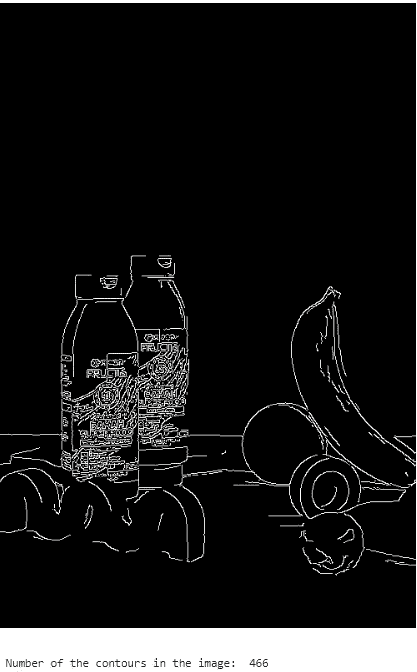

现在我们将模糊图像并检查轮廓的数量

上述代码的输出:

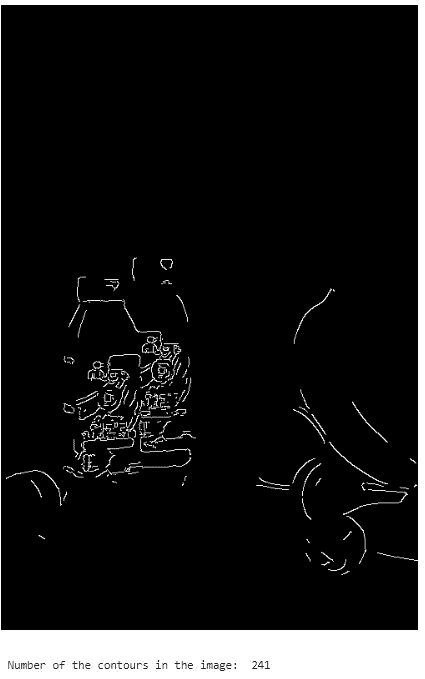

通过观察图像和它的总轮廓，我们知道模糊图像中的轮廓数量比原始图像少。现在，我们将尝试在空白图像上绘制图像的轮廓

上述代码的输出:

轮廓查找的图像:

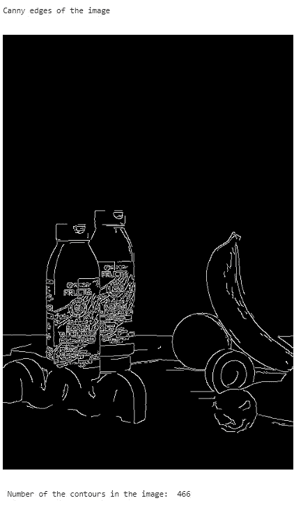

在空白图像上绘制轮廓:

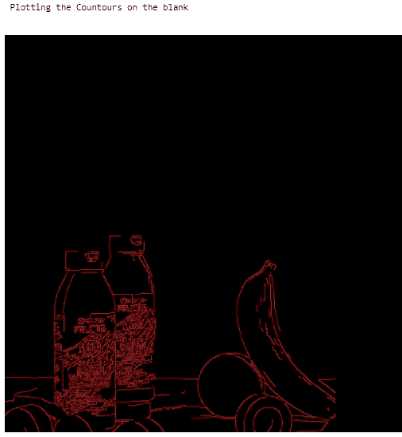

**3)如何在图像中表现色彩间距？**

我们知道每一种颜色都是由红、绿、蓝三种颜色组合而成的。因此，我们通常将色彩间距称为 RGB，如果我们分析图像和视频，也是如此。但是在 OpenCV 中，颜色间距是相反的顺序，即 BGR。检查下面提到的代码，我们将使用 OpenCV 和 matplotlib 显示图像，并观察变化。

使用 OpenCV 的 BGR 图像:

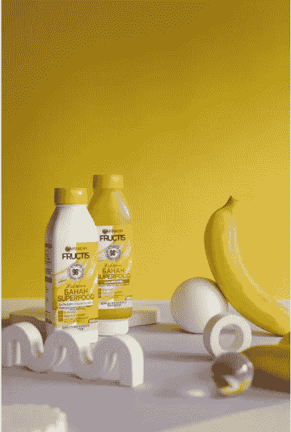

我们将尝试使用 matplotlib 绘制相同的图像

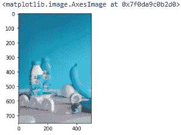

因此，我们在这里观察到，由于从 BGR 到 RGB 的颜色间距发生了变化，颜色发生了反向变化。

现在，我们将检查如何使用 cv.cvtColor()方法将 BGR 色彩间距转换为不同的色彩间距

**3.1) BGR 转灰色:**

输出:

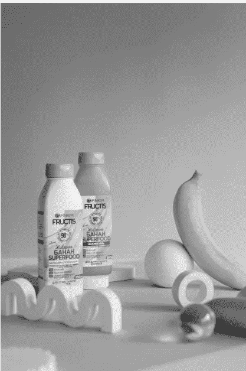

**3.2) BGR 至 HSV:**

输出:

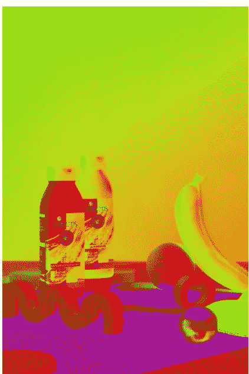

**3.3) BGR 到实验室:**

输出:

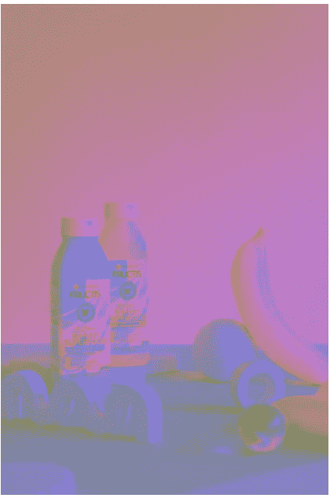

**3.4) BGR 到 RGB:**

输出:

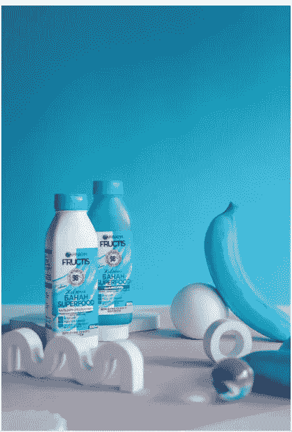

我们也可以通过使用下面提到的颜色间距参数来反转上面提到的图像颜色间距:

简历。COLOR_HSV2BGR

简历。COLOR_LAB2BGR

简历。颜色 _ 灰色 2BGR

简历。COLOR_BGR2RGB

**4)如何处理颜色通道？**

在 OpenCV 中，我们可以从原始图像中分离 B、G、R 通道，然后再次合并所有的 B、G、R 通道，如下所示。

上述代码的输出:

**原始图像:**

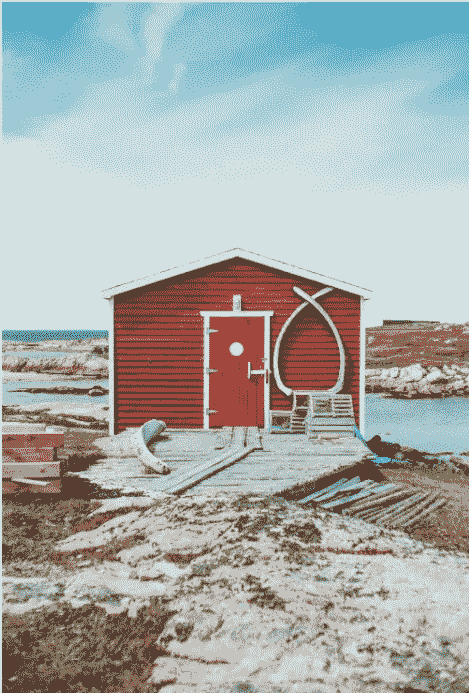

**带有蓝色像素的图像:**

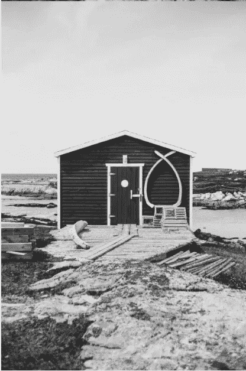

**带有绿色像素的图像:**

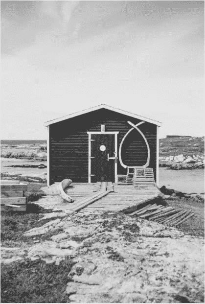

**红色像素图像:**

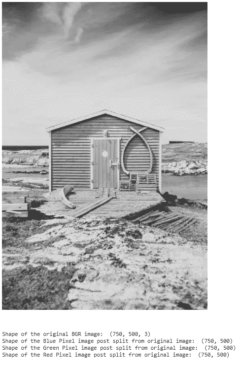

**合并所有三个 BGR 通道后的图像:**

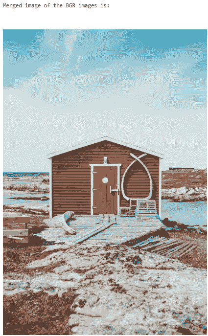

上述分割图像以灰色图像的形式反映出来，因此为了清楚了解每个通道，我们将尝试在空白屏幕上绘制这些分割图像，然后检查通道。现在，我们将使用 B，G，R 像素分别与空白图像，我们得到了下面提到的输出:

上述代码的输出:

**蓝色通道:**

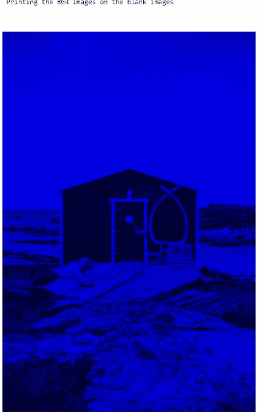

**绿色通道:**

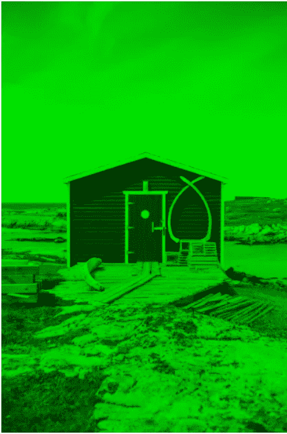

**红色通道:**

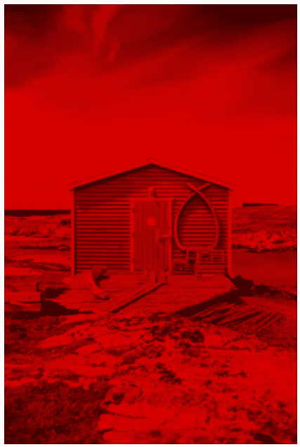

**5)如何模糊图像？**

模糊图像有不同的方法。有关详细信息，请查看下面提到的代码演练:

**平均模糊:**

在这里，我们将输入原始图像，并执行它与内核的卷积。随着内核大小的增加，图像的模糊程度也会增加。

**高斯模糊:**

在这里，我们将输入原始图像，并执行它与内核的卷积。随着内核大小的增加，图像的模糊程度也会增加。我们还应该指定 X 和 Y 方向的标准偏差，分别为 sigmaX 和 sigmaY。如果仅指定 sigmaX，则 sigmaY 与 sigmaX 相同。如果两者都给定为零，则根据内核大小计算它们。高斯模糊在去除图像中的高斯噪声方面非常有效。

**中值模糊:**

函数[**cv . medianblur()**](https://docs.opencv.org/4.5.2/d4/d86/group__imgproc__filter.html#ga564869aa33e58769b4469101aac458f9)取内核区域下所有像素的中值，并用该中值替换中心元素。这对于图像中的椒盐噪声非常有效。在这里，我们将输入原始图像，并执行它与内核的卷积。随着内核大小的增加，图像的模糊程度也会增加。但这里的内核大小是 1D 形状，而不是 2D 像平均和高斯。

**双侧模糊:**

[**cv . bilateral filter()**](https://docs.opencv.org/4.5.2/d4/d86/group__imgproc__filter.html#ga9d7064d478c95d60003cf839430737ed)在保持边缘锐利的同时高效去除噪声。但是与其他过滤器相比，操作较慢。我们已经看到，高斯滤波器采用像素周围的邻域，并找到其高斯加权平均值。这种高斯滤波器仅是空间的函数，即在滤波时考虑附近的像素。它不考虑像素是否具有几乎相同的强度。它不考虑像素是否是边缘像素。所以它也模糊了边缘，这是我们不想做的。在这里，我们将输入原始图像，并执行它与内核的卷积。随着内核大小的增加，图像的模糊程度也会增加。但这里的内核大小是 1D 形状，而不是 2D 像平均和高斯。同样为了简单起见，我们可以将 2 sigma 值设置为相同。如果它们很小(< 10)，滤镜不会有太大的效果，而如果它们很大(> 150)，它们会有非常强烈的效果，使图像看起来“卡通化”。

上述代码的输出:

**原图:**

**平均模糊图像:**

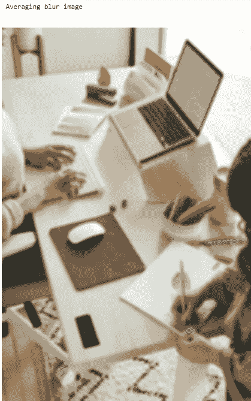

**高斯模糊图像:**

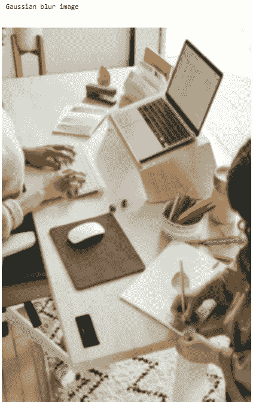

**中值模糊图像:**

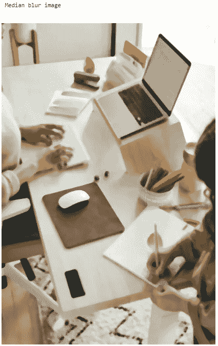

**双侧模糊图像:**

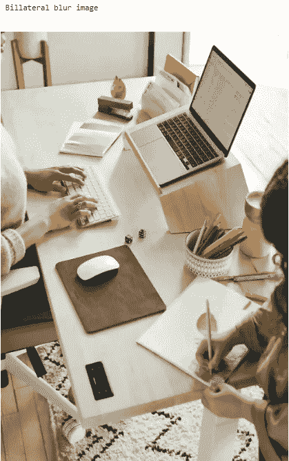

**6)如何使用按位运算符？**

有 4 种最常用的按位运算符是 AND、or、XOR 和 NOT。

**按位 AND:** 仅显示输入图像的相交像素

检查下面提到的代码及其输出

上述代码的输出:

Org_img_1:

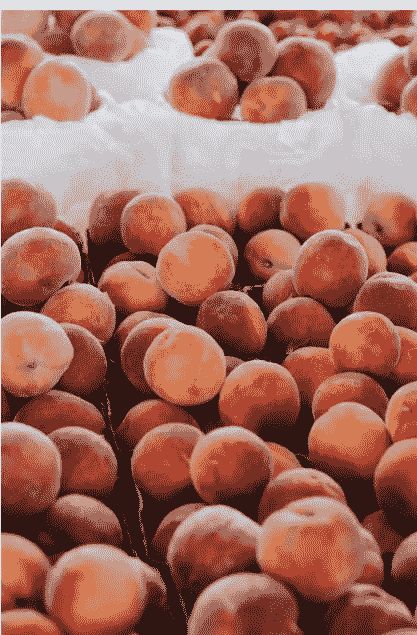

Org_img_2:

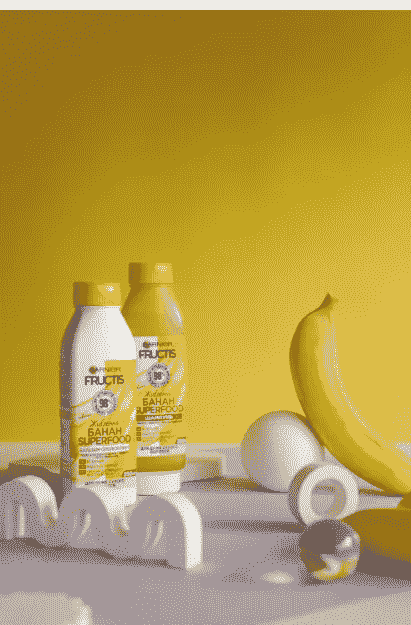

按位与:

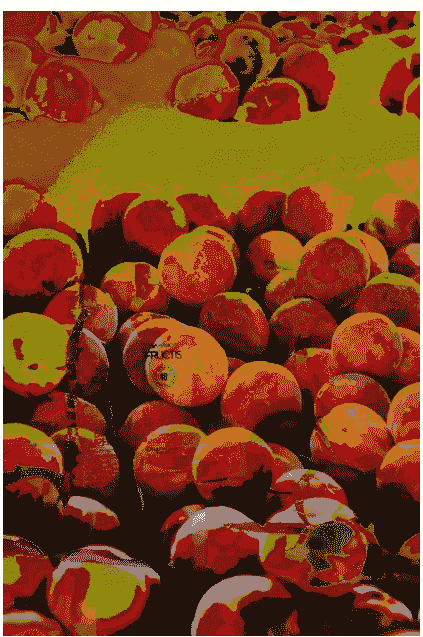

**按位 OR:** 显示图像中相交和不相交的像素。

检查下面提到的代码及其输出

上述代码的输出:

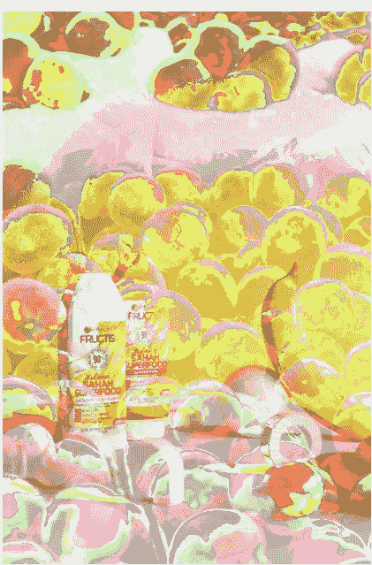

**按位异或:**显示图像中不相交的像素。

检查下面提到的代码及其输出

上述代码的输出:

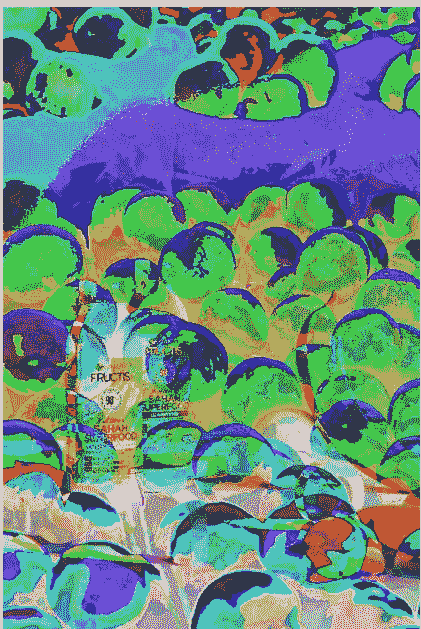

**BITWISE NOT:** 作为否定，即反转图像的色彩空间。

检查下面提到的代码及其输出

上述代码的输出:

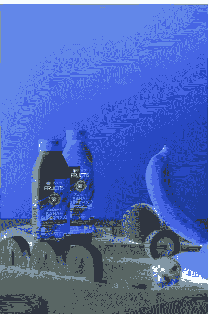

**7)如何绘制图像每个像素中颜色的直方图？**

7.1.BGR 图像:

我们将尝试使用 matplotlib 绘制所有三个通道 BGR 的直方图。有关详细信息，请查看下面提到的代码和输出:

上述代码的输出:

BGR 图像:

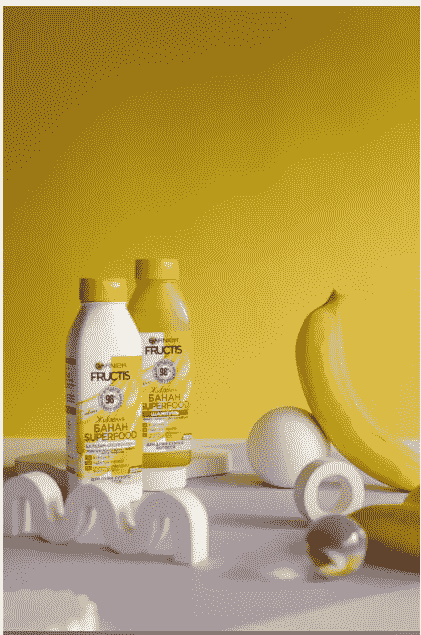

直方图:

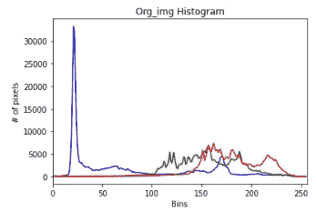

**7.2。灰度图像:**

我们将原始图像转换成灰度图像，然后尝试绘制该图像像素的直方图。有关详细信息，请查看下面提到的代码和输出:

上述代码的输出:

灰度图像:

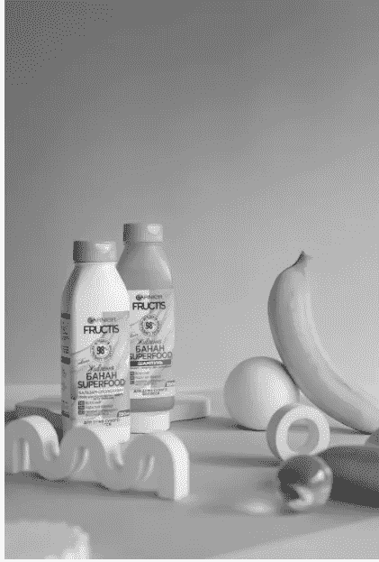

直方图:

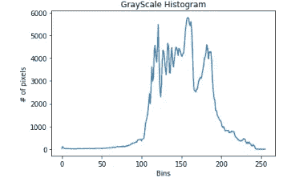

# 总结:

这就是我的观点，现在我们已经在 [Blog1](https://pioneerspd.medium.com/open-cv-basic-guide-part-1-cbc94ba3280f) 中完成了 OpenCV 的基本和高级内容，这个 Blog 已经涵盖了 OpenCV 中的一些高级内容，这些内容主要用于计算机视觉任务。现在将有最后一个博客，总结这一系列的 OpenCV 将很快发表。

# 个人资料:

感谢阅读！请鼓掌感谢我的辛勤工作。我总是乐于接受建设性的反馈——如果你对这个分析有后续想法，请在下面评论或者通过 LinkedIn 联系[。](https://www.linkedin.com/in/shubham-dhawas-3ba232b7)

# 参考资料:

1)【https://www.youtube.com/watch?v=oXlwWbU8l2o】T4&t = 8707s

2)[https://docs.opencv.org/master/d6/d00/tutorial_py_root.html](https://docs.opencv.org/master/d6/d00/tutorial_py_root.html)

[3)https://www.geeksforgeeks.org/](https://www.geeksforgeeks.org/)