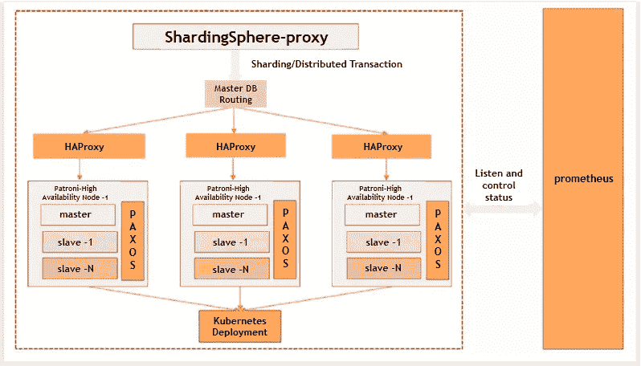

# openGauss X ShardingSphere:顶级分发解决方案之一

> 原文：<https://medium.com/nerd-for-tech/opengauss-x-shardingsphere-one-of-the-top-distribution-solutions-12ebf9c0199e?source=collection_archive---------6----------------------->

1.  **关于 openGauss**

[openGauss](https://opengauss.org/en/) 是一个开源的关系数据库管理系统。自 2020 年 6 月推出以来，它已经掀起了垂直数据库管理的浪潮。随着越来越多的合作伙伴和开发人员的加入，it 已经从为构建成功的数据库生态系统而投入的巨大努力&资源中获益匪浅。

2.**项目背景**

面对数据量爆炸和超高并发数据处理水平等问题，openGauss 做出了选择:采用分布式解决方案。它开始致力于大数据存储、超高并发的吞吐量提升、改善表中大量数据导致的性能瓶颈等。

Apache ShardingSphere 促进了 openGauss 的分布式特性开发。在全栈和开源解决方案上的这种合作有助于 openGauss 取得重大突破。

3.**分布式解决方案**

openGauss 集成了许多开源组件来优化其完整的堆栈&用于水平扩展、分布式事务和分布式治理的开源分布式解决方案。其框架如图 1 所示

*图 ShardingSphere X openGauss 分布解决方案的结构*

ShardingSphere-Proxy 是开源的分布式数据库解决方案。ShardingSphere 众所周知的特性包括但不限于数据分片、分布式事务、弹性伸缩和读写拆分。

HAProxy 使用 Patroni REST API 识别数据库主节点并保证高可用性，以及负载均衡器。

Patroni 的每个高可用性节点都支持一主多从，并使用 Praxos 协议保持数据一致性，因此允许节点部署在同一站点或不同站点，以确保多个站点和中心的数据安全。

就解决方案而言，ShardingSphere-Proxy 以其强大的分发功能做出了贡献，Kubernetes 帮助管理集群，prometheus 监控集群状态。这个全明星团队的整合使该项目成为一个真正强大的全栈、开源分发解决方案。

4.**项目有什么特别之处？**

*-出色的延展性和弹性伸缩*

水平扩展有助于实现计算和存储能力的线性扩展。最大碎片数量增加到 6400。数据库性能相应提高，单个数据库的数据量爆炸问题得到有效管理。

根据用户的流量情况，用户可以灵活扩展数据节点，并采用智能读写拆分来实现分布式数据库的自动负载均衡。

*-增强的企业级功能*

该项目为用户提供各种企业级功能，如分布式数据存储、触发器、分布式治理、全面的端到端加密和工作负载诊断报告(WDR)

*-简单部署*

部署项目可能只需要几秒钟。它的部署既简单又高效，因为它采用标准化的映像部署来保持不同环境中交付的一致性。它还使用容器部署和资源池，因此对平台的依赖性较小。

*-超高可用性和远程灾难恢复*

该项目可以有效地管理集群并促进操作和维护。它遵循 Paxos 协议，以确保数据安全性和强一致性，并提供各种灾难恢复功能，其恢复点对象(RPO)为零。它支持单区域、跨区域、多区域和多中心的弹性恢复方法。

*-开源生态系统*

开源项目 openGauss 热烈欢迎更多的贡献者，并鼓励共同努力来发展开源数据库生态系统。

**5。应用场景**

*-财务系统*

即使对于要求苛刻的金融系统，该产品也非常可靠。Paxos 是一系列协议，用于在不可靠和易出错的处理器网络中解决一致性问题。除了基于 Paxos，该产品还包括强大的功能，如具有强一致性的分布式事务，以及 RPO 为 0 的多区域多中心灾难恢复。

*-政府和企业运营*

由于其全面的端到端安全保护、硬件和软件生态系统支持以及高可用性功能，它对于政府和企业运营来说非常安全和方便。

*-智能电网*

该产品灵活的灾难恢复功能可以提高智能电网数据库的可扩展性。

# ShardingSphere 社区:

*sharding sphere Github:*[https://github.com/apache/shardingsphere](https://github.com/apache/shardingsphere)

*ShardingSphere 推特:【https://twitter.com/ShardingSphere】T22*

*沙丁球松弛通道:*apacheshardingsphere.slack.com