# 在吉隆坡开咖啡馆--使用 Foursquare API 的探索性研究。

> 原文：<https://medium.com/nerd-for-tech/opening-a-caf%C3%A9-in-kuala-lumpur-an-exploratory-study-using-foursquare-api-6bfc844429c6?source=collection_archive---------8----------------------->

# **摘要**

**目的** —本研究的目的是使用替代方法在吉隆坡市建立关键区域，描述在吉隆坡市内可以开展的主要活动，并确定在附近开设咖啡馆的最佳地点。

**设计/方法/途径** —该研究采用了吉隆坡周边政府诊所和私立医院的公开数据。这项研究的数据分析主要由 Foursquare API、pandas、scikit-learn 和 follow 软件包支持。使用“肘”方法、轮廓评分和误差平方和的组合来分析和识别聚类的 K 数。

**调查结果** —这项研究已经在吉隆坡建立了 45 个关键区域。此外，该研究建议游客在城市中的主要活动是“吃”、“逛美食”和“逛咖啡馆”。最后，研究确定了城市中适合新开咖啡馆的 3 个集群。在城市中也发现了一些“小区域”,在那里新的咖啡馆几乎没有竞争。

**限制/影响** —该研究有一个限制，即 Foursquare API 中的数据可能不是该城市的最新数据，并且缺乏额外的数据源来进一步证实这些发现。

**价值** —该研究有助于城市分析的当前存储库。本研究中使用的方法可以修改为分析新冠肺炎聚类和风险区域的识别。

# **1。0 简介**

吉隆坡这座耀眼的城市是马来西亚的联邦领地，位于东南亚的心脏地带。近年来，这座城市的人口超过了 173 万[1]。

吉隆坡是马来西亚的文化、金融和经济中心。它也是马来西亚国会的所在地，也是国王的官邸。这座城市是新加坡现代城市生活方式的典范。

该市由 11 个议会选区组成，这些选区在市内形成选区。每个选区代表马来西亚议会中的一个席位，该席位将由在每个地区的大选中获胜的政党的领导人担任。

咖啡是这个城市居民最喜欢的饮料之一。城市中的咖啡消费习惯是非常动态的，因为它代表了城市的趋势和生活方式。这刺激了咖啡馆业务的建立，反过来加剧了它们之间的竞争。近年来，该市内各种具有独特主题和方法的咖啡馆的建立进一步支持了这一点。

吉隆坡联邦领地及其 11 个议会选区

这项研究利用政府诊所和私立医院的数据来确定吉隆坡的重点区域。由于政府诊所的主要目标是向公众提供医疗保健服务，所以诊所都设在交通便利的地方。私立医院也是如此，尽管它们是受利润驱动的。

# **1.1 研究目标**

这项探索性研究旨在回答一些基本的业务问题:

**1.1.1 吉隆坡的主要区域是哪里？**

由于吉隆坡独特的管理，城市中的区域隔离是非常独特的。例如，吉隆坡地区被划分为 11 个议会选区。这对于 243 公里的区域来说太笼统了。

马来西亚也使用邮政编码系统。然而，吉隆坡大约有 200 多个邮政编码，而且分布不均。这意味着一些地区可能比其他地区有集中的不同的邮政编码。

因此，本研究将采用替代方法来建立吉隆坡关键区域。我们将利用全市政府诊所和私立医院的数据来回答这个问题。

**1.1.2 在吉隆坡哪里开咖啡馆最好？**

随着吉隆坡咖啡馆之间的激烈竞争，这项研究将为新企业主制定商业计划提供一些启示。

大多数新企业在需要与更大、更成熟的直接竞争对手正面竞争时都会遇到问题，因为他们可能在品牌名称和大量忠诚客户方面具有优势。

策略之一是尽可能远离直接竞争，并从那里开始有机增长。如果这是不可能的，专注于一个更“稀释”的位置也是一个替代策略。

这项研究旨在为新咖啡馆老板提供思路，通过战略性地选址来减少与现有企业的正面竞争。

**1.1.3 对吉隆坡的最佳描述是什么？**

既然我们正在寻找开咖啡馆的地方，为什么不走远一点，从整体上分析一下这座城市呢？

吉隆坡一定有很多活动可以做。基于 Foursquare 的数据，我们将进一步分析这座充满活力的城市最吸引人的景点/活动。

# **1.2 本次研究的主要受众**

这项研究的主要受众如下:

***准咖啡馆老板* -** 这项研究旨在让准咖啡馆老板了解如何策划在吉隆坡开设咖啡馆。

***咖啡爱好者* -** 咖啡爱好者可以在咖啡馆密集的地区寻找最好的咖啡。

***游客***——通过对吉隆坡描述的更多分析，游客可以对他们下次访问吉隆坡有所期待。

***数据科学家***——本研究中采用的方法将为数据科学家提供一些如何解决相同主题问题的思路。由于这个城市可用的资源有限，我们希望这项研究可以增加现有的吉隆坡及其周边地区的分析资料库。

# **2.0 数据描述**

1.  吉隆坡附近政府诊所的列表和位置。这些数据是从马来西亚卫生部的官方网站[1]过滤和删除的
2.  吉隆坡周边私立医院列表。这些数据是从维基百科的网页上截取下来的，存储在 github 中
3.  来自 Foursquare API 的位置数据。这将用于分析城市的周边活动。
4.  **来自 HERE 位置服务 API 的位置数据**。这将在本研究中用于地理编码和反向地理编码的目的。
5.  **吉隆坡 Geo-json** 数据取自历届大选的分界线。这是用来划分吉隆坡市内的区域[3]。

# **3.0 方法论**

**3.1 吉隆坡重点区域的建立**

我们用熊猫从卫生部网站上删除了吉隆坡政府诊所的名单。抓取网页的快照结果(头)如下:

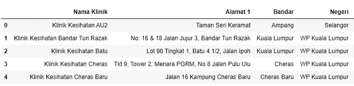

关于私立医院的数据，我们之前已经从维基百科上删除了它们，并以. CSV 文件的形式存储在 github 中。我们使用 pandas read.csv 功能将数据导入笔记本。这种提取的快照(头)如下:

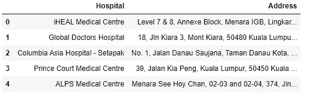

然后将这两个数据合并，并删除所有不必要的列。该快照如下所示:

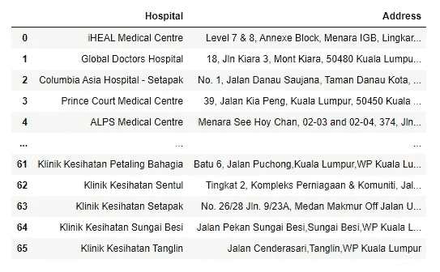

现在我们结合这两个列表建立了吉隆坡重点区域。

**3.2 吉隆坡重点区域的地理编码**

我们在这里利用定位服务 API 找到每个关键区域的坐标。所有重复的数据，带有“NA”名称的区域以及吉隆坡以外的区域都被删除。

此外，我们提取了所有必要的相关信息，以便在接下来的步骤中为我们提供帮助。这种提取的快照(头)如下:

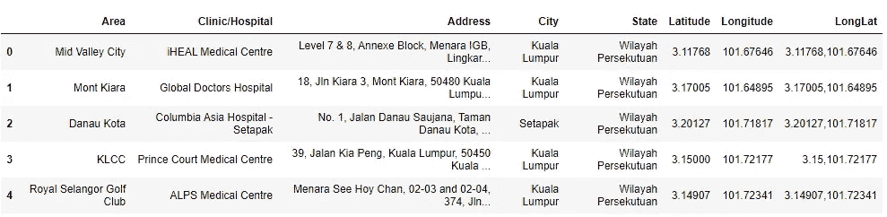

**3.3 关键区域可视化**

我们利用 follow 从地理编码练习的纬度和经度输出中生成可视化。然后，我们添加了吉隆坡 geo-json 来在地图内划分吉隆坡区域。

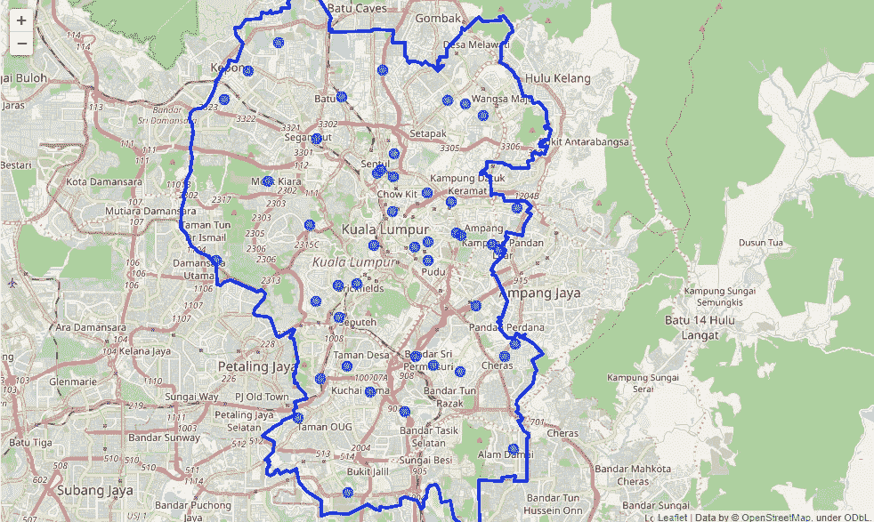

吉隆坡和已建立的关键地区

**3.4 吉隆坡市中心附近的场馆**

我们利用 Foursquare API 提取市中心周围的热门地点及其评级。为此，我们将半径设定为 1 公里，以吉隆坡中心点为限，100 个场馆为限。结果(头)如下:

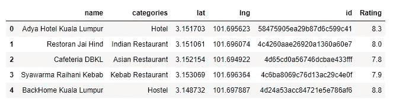

根据这些数据，我们生成了“吉隆坡最受欢迎的 20 个场馆类别”。

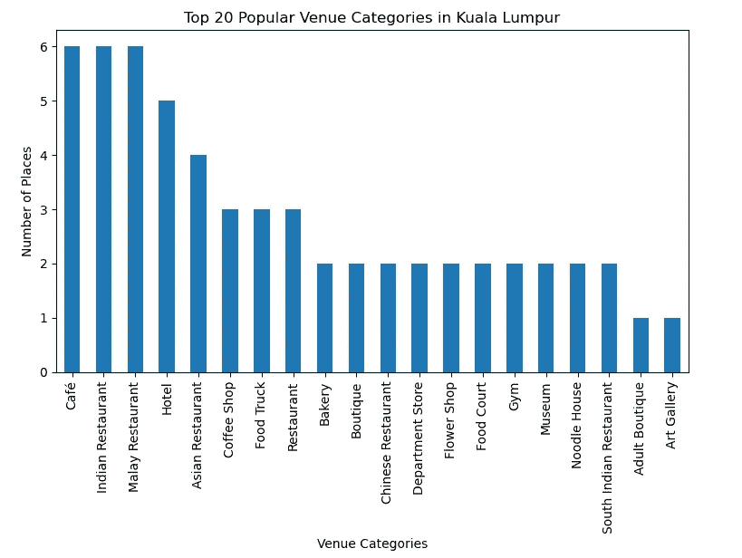

我们还生成了“吉隆坡市中心前 20 个得分最高的场馆类别”

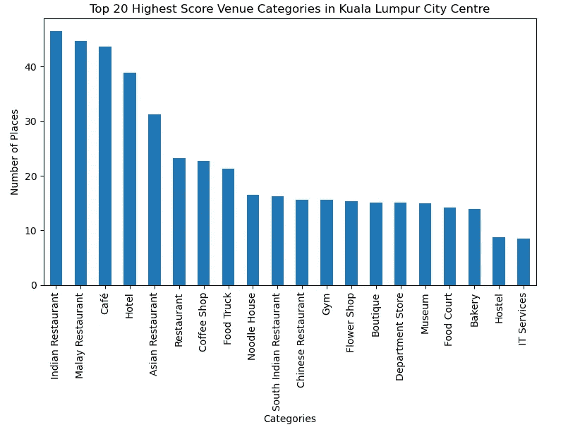

**3.5 吉隆坡各重点区域周边场馆**

我们把分析扩展到吉隆坡的每个关键地区。为此，我们使用了 Foursquare API，并将参数设置为半径 2 公里，每个地点限制为 100 个场地。

我们从 Foursquare API 调用中收集了 4，476 个场地和 297 个独特的类别。这种提取的标题如下:

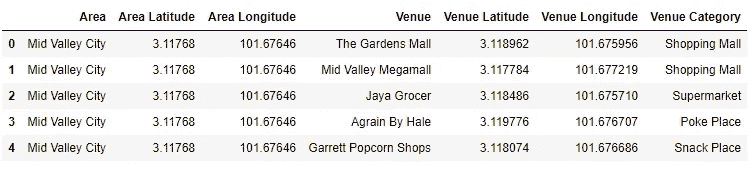

我们使用“一键编码”对数据进行了转换，并分析了每个场馆类别在每个区域重复出现的频率。为此，我们为每个地区设定了最多 10 个场馆类别。已经被传送到熊猫数据帧的结果(头部)如下:

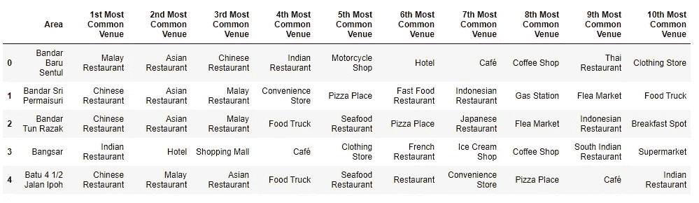

**3.6K 的测定**

为了进行聚类过程，我们需要确定 K 的个数。为此，我们利用无监督学习 K-means 算法或 Elbow 方法。为了获得最佳结果，K 的范围被设置为高达 8。

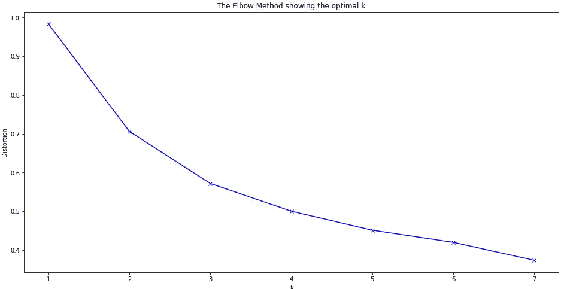

“肘”方法的结果

然而，结果确实显示了任何独特的“肘”，以便我们确定 k 的数量。或者，我们使用侧影分数，该分数与平方差和(SSE)一起读取，以获得更好的准确性。

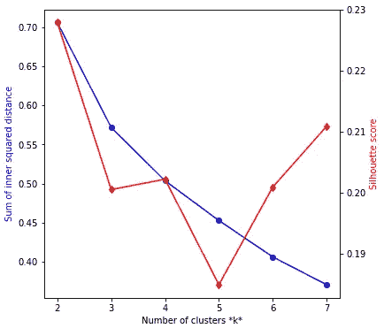

轮廓得分和误差距离平方和(SSE)的结果

从上图中，我们可以看到，当 K 变大时，距离平方和或 SSE 下降。我们还注意到，不同数量的 K 的侧影得分也不一致。因此，为了更有意义地进行聚类，**我们选择 K=7** 用于本研究，因为它具有最低的 SSE 和相当高的侧影得分。

**3.7 重点区域聚类**

基于确定的 K 数，我们运行 KMeans 并将每个区域的聚类标签与我们在 3.5 中的结果合并。这种合并的结果(标题)如下:

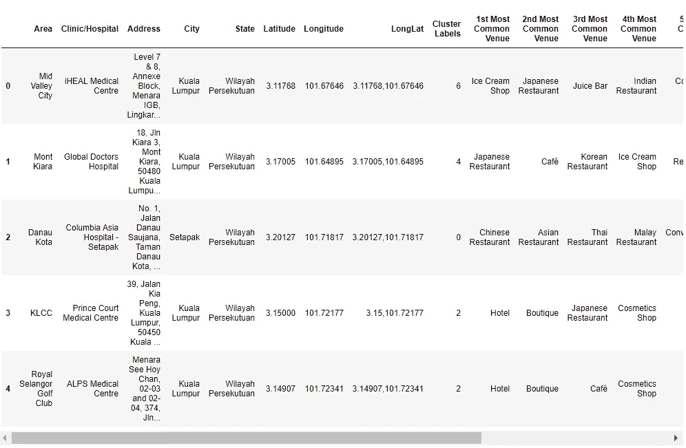

有了这些数据，我们使用 fluous 在地图上可视化集群:

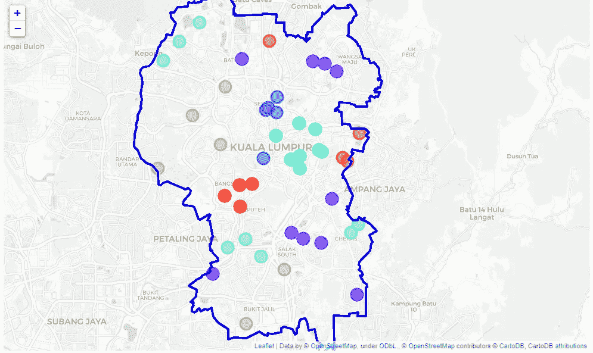

基于集群的关键领域总结如下:

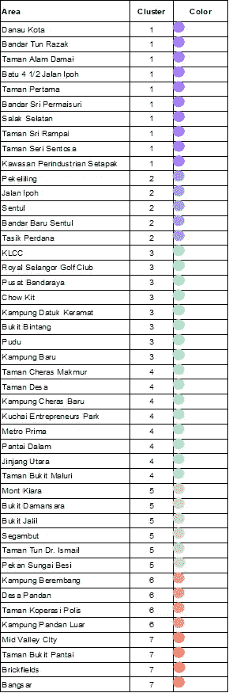

关键区域和相应的集群

根据对每个集群的分析，我们可以将每个集群的最佳场馆总结如下:

集群 1:中国和马来餐馆

集群 2:马来餐馆

第 3 组:旅馆

集群 4:中国餐馆

集群 5:日本餐馆、中国餐馆、咖啡馆和冰淇淋店

第六组:马来餐馆

集群 7:印度餐馆和冰淇淋店

**3.8 吉隆坡周边咖啡馆位置的具体分析**

最初，我们利用了来自*第 3.5 节的数据。*然后，数据按“咖啡馆”和“咖啡店”的场馆类别进行过滤。我们利用 follows 在地图上显示了这些场馆，如下所示:

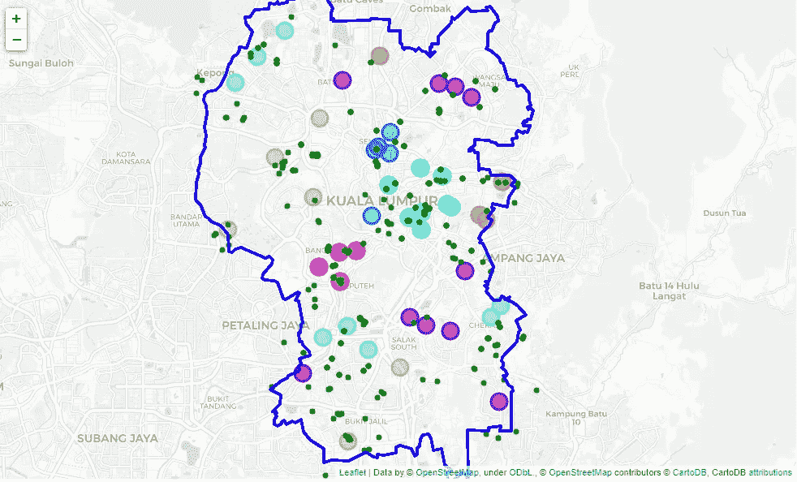

视觉化给了我们一个关于开咖啡馆的最佳地点的粗略想法，但是由于缺乏数据而没有结论。为此，我们利用 Foursquare API 根据第 3.2 节专门提取关键区域周围的咖啡馆和咖啡店设施。这个摘录的类别 id 是从 Foursquare 文档站点[4]获得的。

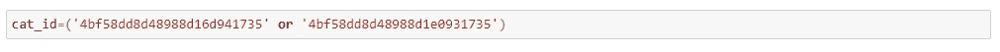

该请求产生了 2，239 个结果。这种提取的快照如下:

通过使用叶，我们生成了热图，以帮助我们分析吉隆坡周围的咖啡馆密度。我们还划分了市中心。

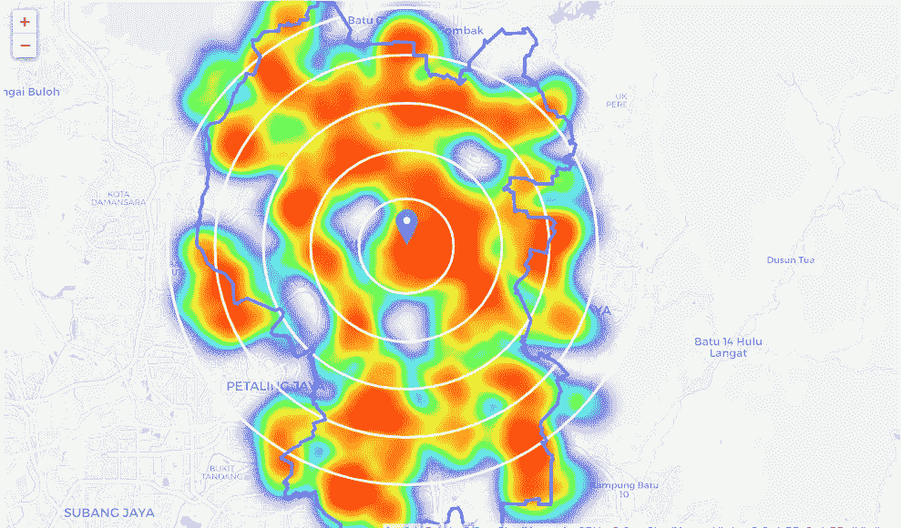

为了进一步帮助我们分析热图，我们将聚类数据覆盖在了如下的叶图上:

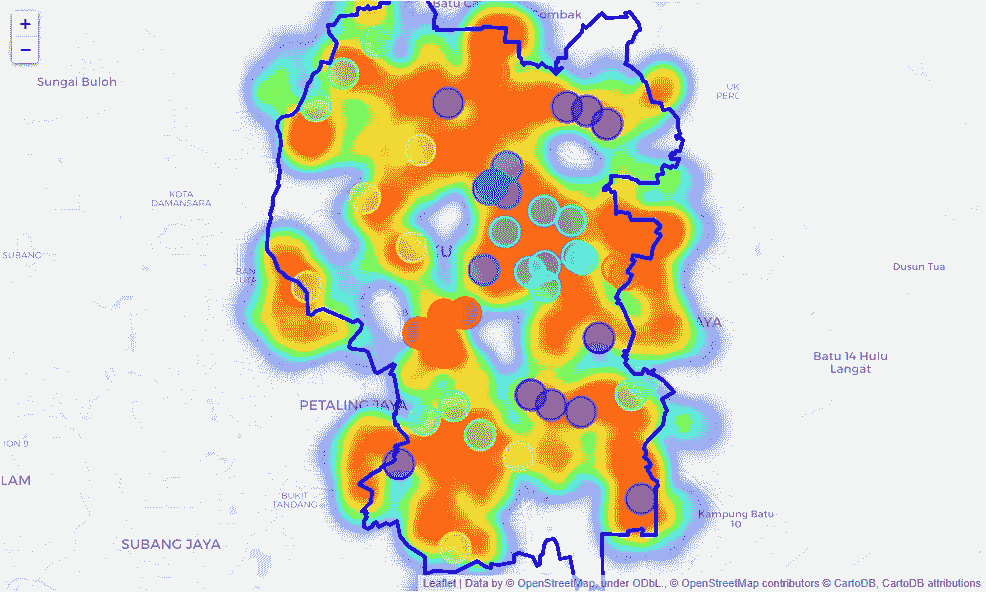

# **4.0 结果和讨论**

如前所述，这项探索性研究旨在回答一些基本的业务问题。我们将根据第 1.1 节中的三个业务问题讨论结果。

**4.1 吉隆坡的主要区域是哪里？**

本研究探索并尝试在吉隆坡建立关键区域的替代方法。根据来自吉隆坡附近的政府诊所和私人医院的数据，我们已经确定了 **45 个位置**可能是吉隆坡的主要重心

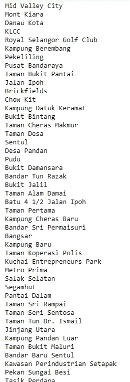

吉隆坡主要地区

**4.2 在吉隆坡哪里开咖啡馆最好？**

根据对热图的分析，我们可以为新咖啡馆提供以下建议:
1。避免在集群 **1、2、3 和 7** 内开设咖啡馆；和

2.专注于在集群 **4、5 和 6** 内开设咖啡馆，以实现更易于管理的竞争。

3.此外，我们在热图中确定了一些“小块区域”,咖啡馆老板可以在这些区域开发咖啡馆，即 **Bukit Tunku、Penchala、Setapak、Desa Melawati 和 Sungai Besi。**

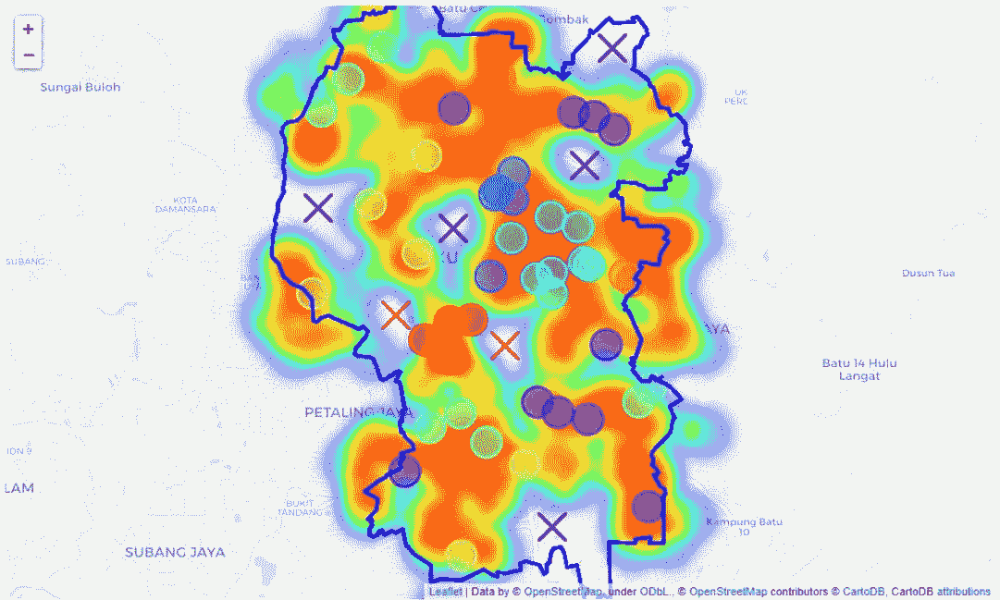

吉隆坡的“口袋区”

在上面的热图中，这些区域(“口袋区域”)用黑色“x”标出。这些地区似乎不太拥挤，竞争可能也不激烈。然而，并不是所有的“口袋区域”都值得探索，例如那些红色“x”区域就是大墓地。很明显为什么那里没有咖啡馆。

集群 1、2、3 和 7 的咖啡馆过于拥挤，因此区域内的竞争可能会非常激烈。这些地区的咖啡馆高度集中是因为其位置位于吉隆坡市中心的中部。

因此，建议新的咖啡馆老板考虑按照我们上面的建议 2 和 3 开咖啡馆。在创业初期，与更受欢迎、更成熟的公司正面竞争可能不是个好主意。新咖啡馆的老板可以制定策略，发展自己的品牌，在规模相当大、时机合适的时候，慢慢搬进市中心。

**4.3 对吉隆坡的最佳描述是什么？**

4.3.1 市中心

根据我们在这项研究的早期阶段的分析，我们可以说，在吉隆坡最好的活动是“吃”或“食物跳跃”。这是因为吉隆坡 20 个受欢迎的场所中有 12 个都与食品和饮料有关。考虑到吉隆坡人口的多样性，这并不令人惊讶。

简而言之，马来西亚有三个主要种族——土著人(马来西亚最早的定居者)、华人(祖先来自 Mainland China)和印度人(祖先来自印度)。这三个种族实践他们自己的传统、文化和信仰。这些多样性也转化为马来西亚多样的食物。

“逛咖啡馆”也是你在吉隆坡可能想考虑的活动之一。咖啡馆和咖啡店是吉隆坡十大热门场所之一。这得到了近年来在吉隆坡周围建立的各种主题咖啡馆的支持。你可能不想错过这次经历。

吉隆坡的主要地区

第 3.7 节的结果与第 4.3.1 节一致，其中 7 个集群中的 6 个顶级场馆与食品和饮料相关。这进一步加强了我们之前在第 4.3.1 节中的建议，即当你在吉隆坡时，“吃”、“逛美食”和“逛咖啡馆”是主要的活动。

# **5.0 讨论**

这项研究确定了吉隆坡的关键区域，确定了城市中可以开展的主要活动，并分析了在城市中开设咖啡馆的最佳地点。我们在吉隆坡确定了适合作为新咖啡馆滋生地的集群和一些“口袋区域”,如果合理利用，可以成为新咖啡馆老板的巨大优势。

**5.1 限制**

该分析利用了免费的 Foursquare API 调用，每次调用仅限于 100 个结果。因此，结果可能没有考虑搜索区域内的所有可用数据。

本研究中推荐的位置仅基于 Foursquare 中可用的数据，因此，来自各种来源的额外数据将有助于证实本研究的发现。还建议在对其中一个领域执行商业计划之前进行“现场”研究。

此外，吉隆坡的数据可能不是最新的。不像谷歌的数据经常被用户更新，Foursquare 的数据可能缺乏这种属性。话虽如此，也有一种可能性是，这些数据已经考虑到了不再运营的企业。

**5.2 未来研究方向**

本研究也旨在为未来吉隆坡及其周边地区的研究提供基础。这项研究可以通过使用不同类型的 API(如谷歌地图 API)来提供更多关于吉隆坡及其周边地区的信息。

最后，考虑到本研究的实用性，所用的相同方法可用于/修改为分析新冠肺炎聚类和城市内风险区域的识别。

# **6.0 参考文献**

[1]https://en.wikipedia.org/wiki/Kuala_Lumpur

[2][https://www . MOH . gov . my/index . PHP/database _ stores/store _ view/1？search =吉隆坡+吉隆坡& items=25 & page=1](https://www.moh.gov.my/index.php/database_stores/store_view/1?search=Kuala+lumpur&items=25&page=1)

[3][https://github . com/azrulihsan/IBM _ Capstone _ Project/blob/master/Week % 204% 20 battle % 20 of % 20 neighborhood/KL % 20 private % 20 hospitals . CSV](https://github.com/azrulihsan/IBM_Capstone_Project/blob/master/Week%204%20Battle%20of%20Neighborhood/KL%20Private%20Hospitals.csv)

[4][https://developer . four square . com/docs/build-with four square/categories/](https://developer.foursquare.com/docs/build-with-foursquare/categories/)

github:[https://github . com/azrulihsan/IBM _ Capstone _ Project/blob/master/Week % 204% 20 Battle % 20 of % 20 neighborhood/Battle % 20 of % 20 neighborhood-% 20 open % 20 cafe % 20 in % 20 Kuala % 20 Lumpur . ipynb](https://github.com/azrulihsan/IBM_Capstone_Project/blob/master/Week%204%20Battle%20of%20Neighborhood/Battle%20of%20Neighborhood-%20Open%20Cafe%20in%20Kuala%20Lumpur.ipynb)