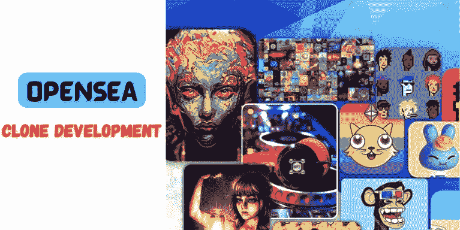

# Opensea 克隆开发:NFT 市场巨人的精确同步！

> 原文：<https://medium.com/nerd-for-tech/opensea-clone-development-the-exact-sync-of-the-nft-marketplace-giant-554d786905bd?source=collection_archive---------13----------------------->

像 opensea 这样的顶级市场是人们首先想要得到的。它展示了一种以不同的速度交易令人兴奋的收藏品的新方法。以目前的市场趋势，你不可能收购他们，因为他们是数字生态系统的领导者。但是，您仍然可以创建一个看起来像原版的平台。为此，你需要得到一个 [**opensea 克隆开发**](https://bit.ly/3FJp3kD) 。这正是一个展示出令人兴奋的未来发展前景的市场所渴望的。市场正在击中正确的目标，并可能在即将到来的未来成为永恒的事物。让我们看看为什么它是一个令人兴奋的未来的选择。

## **Opensea 克隆**

Opensea clone 是一个平台，它和原来的平台一样具有增强的功能。你可以利用他们的能力将潮流转向不同的方向，从而在竞争中保持领先。Opensea 总是充满了每个企业家都希望分享的故事，这就是为什么许多公司开始雕刻可以讲述完全不同的故事的克隆体。

## **他们继承的特征**

OpenSea Clone 首先提供了最基本的功能。然而，无论如何都不应该忽略下面列出的关键组件。看看这些。

👉**店面**

用户将能够看到平台上列出的数字资产，以及关于买价或出价等类似信息。

👉**创建列表**

提供所需信息是一个允许卖家列出其数字资产的过程。

👉**警报**

OpenSea 克隆将向平台用户发送关于 NFT 销售的通知和警报。这将是提高参与度的好方法。

👉**搜索&过滤选项**

用户可以通过使用搜索和过滤选项从类别中找到他们想要的 NFT。这将加快购买过程，大大减少花在寻找上的时间。

👉**钱包支持**

不可替换的令牌必须使用钱包来保存、发送和接收。这将大大有助于确保快速和安全的交易。

> [***衍生自己的方式开始 OpenSea 克隆开发流程！***](https://bit.ly/3FJp3kD)

## **发展一个类似 OpenSea 的 NFT 市场必须考虑的步骤**

您现在已经看到了 OpenSea 克隆开发的目的和特性。现在，当开发一个类似于 OpenSea 的 NFT 市场时，必须考虑以下步骤。看看这些。

✪确定你的目标市场和你的利基。

✪确定了区块链网络。

✪用户界面和用户体验必须简单和有吸引力。

✪建立智能合同

✪测试 OpenSea 克隆

✪部署 Opensea 克隆平台

创建一个像 OpenSea 这样的 NFT 市场需要多少成本？

您选择哪种方法将在很大程度上决定开发像 OpenSea 这样的 NFT 市场的成本。

如果一个人决定从零开始构建这个平台，时间框架会显得很长，成本也会很高。然而，另一个选择是选择一个白色标签的 OpenSea 克隆，它只需要定制，因此所涉及的时间和金钱会少得多。

从外行人的理解来说，价格取决于你对 OpenSea 克隆的喜好。因此，最好在概述您的需求后，与业务部门联系并请求报价。

## **包装完毕！**

[**Opensea 克隆开发**](https://bit.ly/3FJp3kD) 给出了一条穿越未来的激烈途径。有了它们，你可以看到一个开放海洋克隆体的确切工作方式，那就是你看到巨大财富的时候。平台服务提供商有一个经验丰富的团队，他们可以在这里制作准确的场景。所以，是时候用克隆软件解开 opensea 的秘密了，它能以高效率进行无止境的交易。现在就开始你的 Opensea 克隆开发，以一种有趣的方式走向未来。