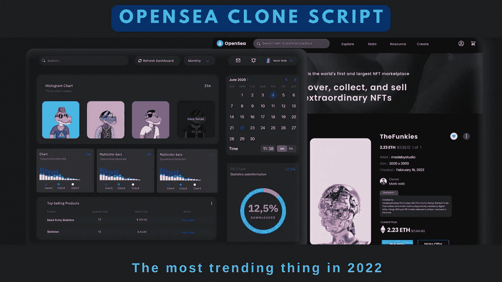

# OpenSea 克隆脚本:现在最流行的东西为什么？

> 原文：<https://medium.com/nerd-for-tech/opensea-clone-script-the-most-trending-thing-now-why-ba976ddf0ccf?source=collection_archive---------1----------------------->

OpenSea 克隆脚本

密码行业从来不缺少能引起人们兴趣和惊讶的创新发明。最近，OpenSea 克隆脚本和在区块链交易数字资产的迅速崛起已经成为一种趋势。每天，他们都在开发新的标记化方法，以提供更广泛的机会。

# **NFT 的独特属性**

*   NFT 是区块链中唯一的加密令牌，不可复制。
*   NFT 可用于表示真实世界的对象，如艺术品或房地产。
*   这些真实世界的有形资产被标记化，以使购买、销售和交易它们更有效，并降低欺诈风险
*   NFTs 也可以用来表示个人的身份、财产权和其他信息。

这些属性使得不可替代的令牌适合任何想要数字资产专有权的人。

资产可以是任何类型，如图像、视频、音乐、头像、游戏角色或项目。这使得许多音乐家、作家和收藏家能够通过将资产令牌化来参与数字经济。

要收购或出售 NFT，你需要一个充当拍卖平台的市场。这将使消费者和作者都能得到最好的交易。

我们将关注最受欢迎的 NFT 市场 OpenSea。在我们进一步了解 OpenSea Clone 及其开发之前，让我们先定义一个 NFT 市场。

# **什么是 NFT 市场平台？**

正如我们所知，NFT 与比特币和以太不是一回事。你不能直接在加密货币交易所兑换它们。

需要一个专门的平台来销售或收购 NFT。 [**OpenSea 克隆**](https://www.clarisco.com/opensea-clone-script) 提供了一个 NFT 市场。

不可替换的代币可以在那里交易或存储。NFT 既可以固定价格出售，也可以通过平台上的拍卖出售。

根据您使用的 NFT 市场，要求会有所不同。虽然一些卖家和买家可能需要钱包来存储 NFT，但其他人不需要。

OpenSea 是一个在线市场，在这里你可以将你的任何作品转化为有形的商品，然后出售。不再拖延，让我们来看看 NFT 开放海洋市场。

# **OpenSea——最大的 P2P NFT 市场**

OpenSea 是世界上最大的 P2P 市场。它收藏了受区块链技术保护的收藏品、游戏项目和其他虚拟产品。买卖物品是完全安全的。因为 OpenSea 的主要合作伙伴是比特币基地、创始人基金、区块链资本和 IC。

它是由 Devin Finzer 和 Alex Atallah 于 2018 年 1 月创立的。一个有目共睹的例子是，OpenSea 上个月处理了 33 亿美元的销售额，产生了大约 8250 万美元的收入。

# **OpenSea 克隆—概述**

OpenSea Clone 为基于 NFT 的交易提供了一个快速的解决方案，使企业家能够轻松快速地部署交易平台。该解决方案具有无缝交易(购买/出售)数字资产的关键特性和功能。OpenSea clone script 的主要优势是允许创业者根据自己的需求定制解决方案。在接下来的章节中，您将找到更多关于 OpenSea Clone 的信息。

# **在 OpenSea clone 上交易是如何进行的？**

## **关于 OpenSea 克隆应用的一个快速提示:**

要参加 OpenSea，您需要一个 Web 3 钱包，如 MetaMask。OpenSea 和任何其他 NFT 市场都将遵循这些标准。

这用于创建对等交易的基础设施。插入钱包，然后选择“浏览”标签，即可启动 OpenSea。

在你开始之前，该程序将扫描你的钱包，看看是否有任何资产或收藏品，你可能需要在市场上购买。

## **买方侧操作**

购买物品时，你可以出价，也可以接受标价。这类似于在易贝上购买物品。

你必须知道刊登物品的资产，视物品而定。

刊登后，你会收到一封电子邮件，确认你的购买。

## **卖方端操作**

你需要点击“帐户”进入销售页面。从“我的东西”中选择商品后，你可以像在任何其他社交媒体平台上一样选择价格、类型和优惠期限。

挂牌是免费的。然而，如果产品销售成功，该平台将收取最终价格的 2.5%。

# **OpenSea 克隆脚本有什么好处？**

灵活且适应性强的 OpenSea 克隆脚本与现实市场非常相似。

*   您将能够轻松展示各种数字资产。
*   脚本的互操作性使得平台之间的交易成为可能。
*   它在可供所有用户使用之前已经过身份验证和确认。
*   这创造了一个自由市场，买卖双方可以自由交易。

# **OpenSea Clone App 有哪些与众不同的特点？**

为了增加交易量和网站的可靠性，你可以添加吸引人的功能。

## **收藏搜索:**

您可以使用价格范围、类别或朋克品质等过滤器，让消费者更容易搜索收藏。

## **简化上市方法:**

这三个步骤简化了项目列表，并消除了新 NFT 名单的困惑。

## **捆绑:**

捆绑使得在平台上列出 NFT 比单独列出它们更容易。

## **钱包:**

在一个交易已经成为常态的市场，钱包可能是必需品。顾客也可以使用他们现有的钱包在市场上购买或销售。

# 【OpenSea 克隆脚本如何赚钱

OpenSea script 通过服务费挣钱。当数字资产通过平台成功销售时，将收取这些费用。

服务费是百分之二点五。每卖出 100 美元 NFT，OpenSea clone app 就能获得 2.5 美元。这种费用结构类似于 Rarible。

OpenSea app 免费提供其市场基础设施。在平台上列出 NFT 是免费的。

该平台还涵盖了与交易相关的所有天然气费用，这鼓励了买家和卖家更频繁地交易(并增加了市场的流动性)。

NFT 平台提供了许多购买类别，包括域名和交易卡。

知道他们购买的物品是真实的对买家来说是一个巨大的好处。供应商能够接触到更广泛的买家，这有助于推高售价。因此，他们的费用可能会被他们所能获得的更高价格所抵消。

## **结论**

NFT 生态系统吸引了如此多的关注，也是许多新项目的主题。我们可以说，建立一个像 OpenSea 这样的 NFT 市场将被证明是有利可图的。

一个有经验的 [**NFT 市场开发公司**](https://www.clarisco.com/nft-marketplace-development) 将能够为你进入 NFT 社区提供一个 OpenSea 克隆脚本。

你的公司将受益于他们的开发者的专业知识，他们将为 NFT 创建一个无与伦比的市场应用。