# NumPy 数组上的操作

> 原文：<https://medium.com/nerd-for-tech/operations-on-numpy-arrays-63edfc2022cb?source=collection_archive---------12----------------------->

在之前的[文章](https://prvnk10.medium.com/indexing-numpy-arrays-60a276f657b1)中，我们讨论了如何索引 NumPy 数组。在本文中，我们将讨论如何在 NumPy 数组上执行操作。让我们开始吧。

让我们创建一些相同大小的样本数组来玩玩，NumPy 的好处是我们可以将数组视为向量，我们可以像处理向量一样在它们上面执行操作。

例如，我们可以简单地用'+'操作符执行两个数组的相加，它将执行两个数组的元素相加。

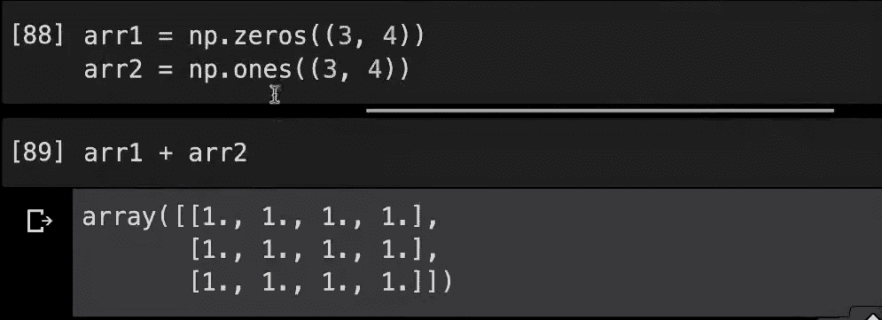

让我们用随机数代替 0 和 1 来做同样的事情。

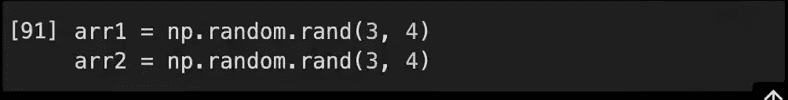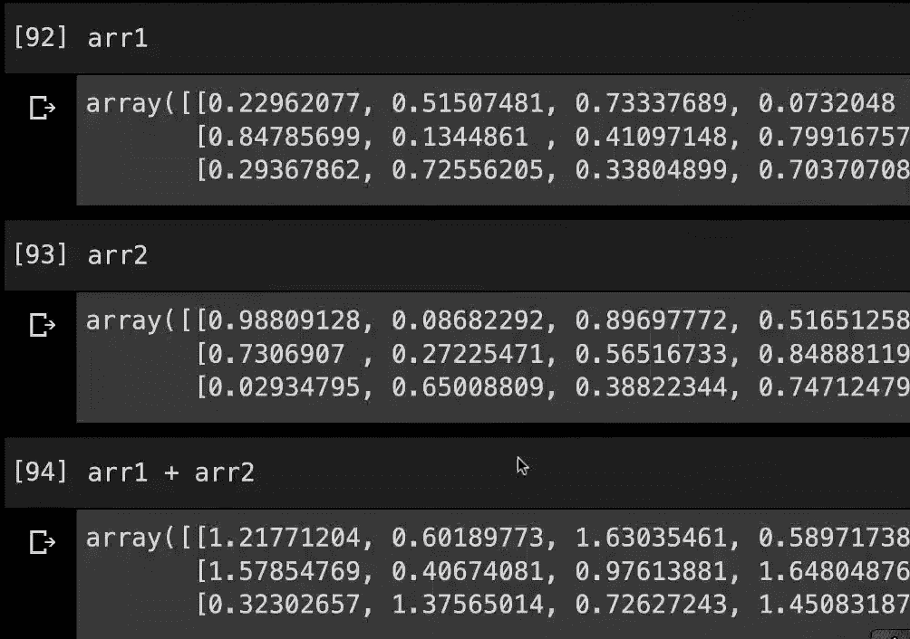

因此，我们可以执行这种逐点/逐元素的加、减、乘、除(如果分母中有一个值为 0 的元素，就会给出警告)

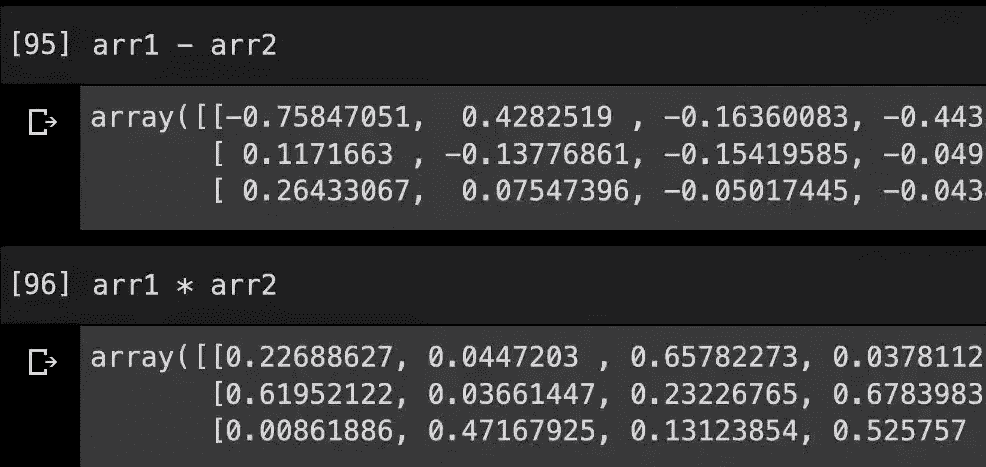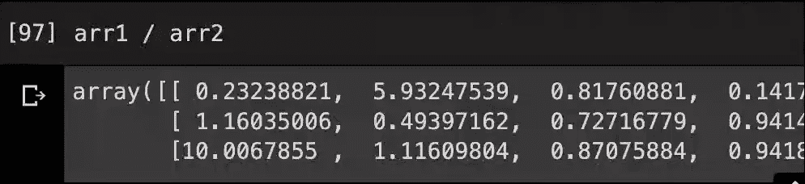

我们还可以对单个数组进行一些操作，例如计算每个值的指数，我们使用' **np.exp(array)** '函数，我们可以使用' **np.log(array)** 函数计算数组中每个数据点的对数

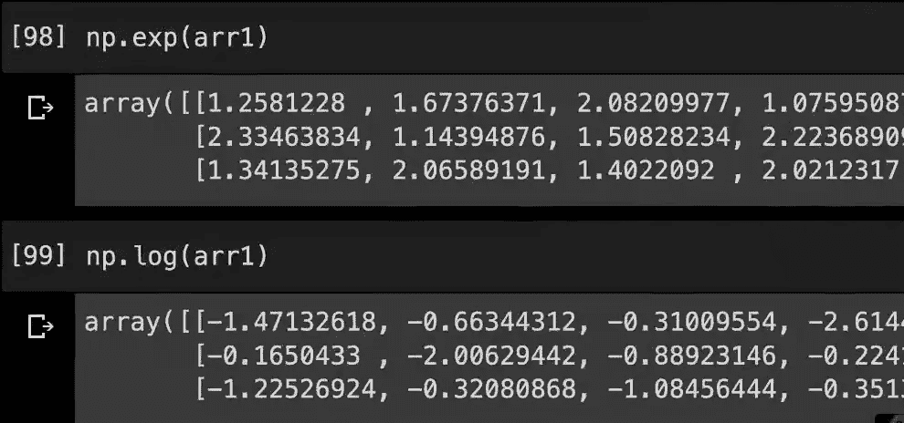

以类似的方式，我们有' **np.sin(array)** '，' **np.cos(array)** '和其他三角函数

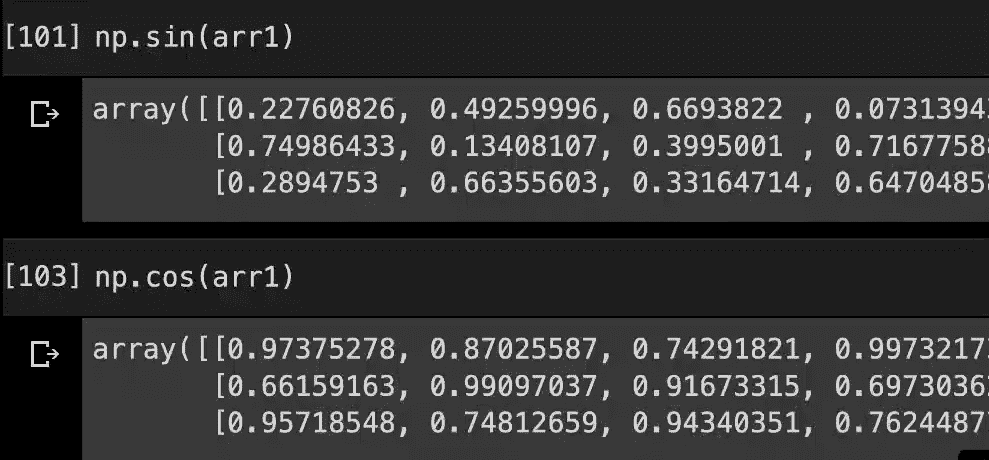

为了计算每个数据点的平方根，我们有'**NP . sqrt(array)【T11]'**

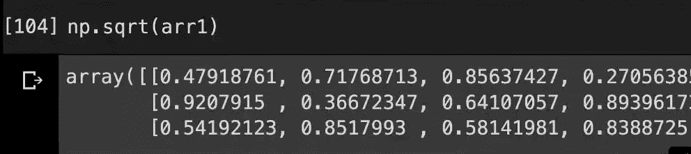

**NumPy**库中所有可用的函数都非常有用，并且**非常有效地实现了**因为它们考虑了数组如何存储以及这些操作如何矢量化，所以它们的实现比列表要快得多。

我们也可以使用标量来执行操作，操作将被广播到每个数据项，例如，对数组中的每个数据项求逆，我们可以只对数组求逆。

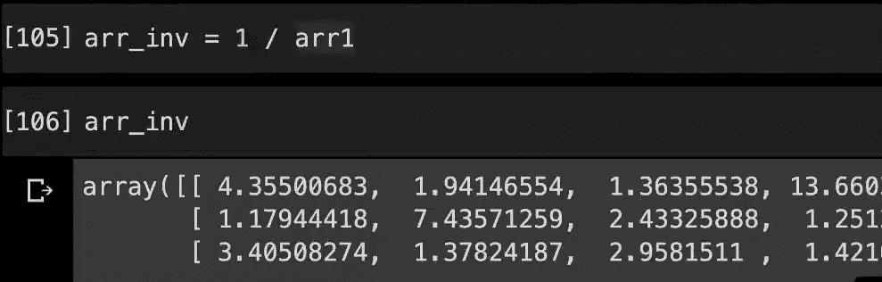

如果我们有一个零数组，我们取它的倒数，那么它不会给出错误:

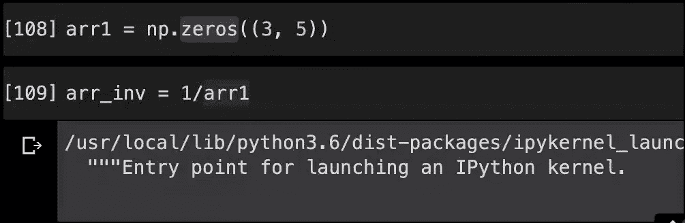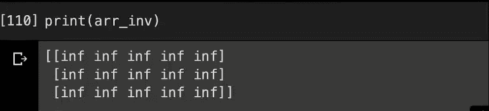

在这种情况下，反转数组将具有关键字' **inf** '，表示除法，反转导致无穷大值，这表示 NumPy 遇到了除以 0 的情况。我们可以通过使用' **np.isinf()** '来检查这一点，并给它一个特定的索引值，如果该索引处的值是无穷大，则该函数返回' **True** '

我们可以将整个数组传递给这个函数，它返回数组中每个数据项的布尔值

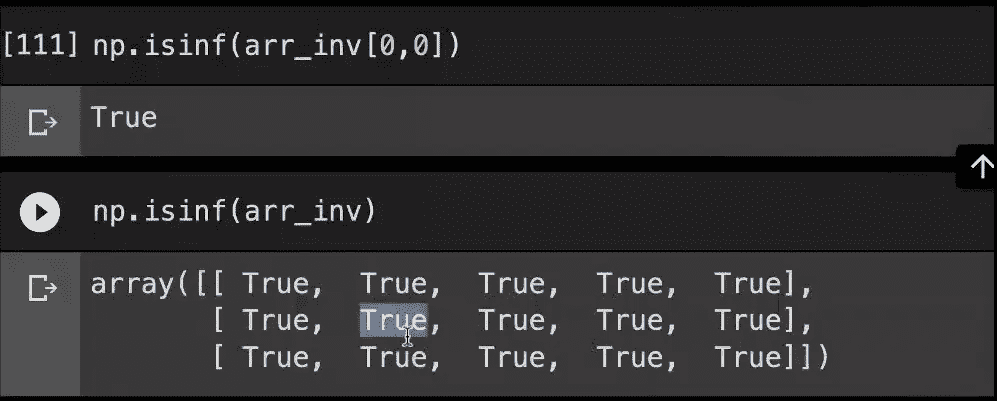

NumPy 阵列上可能有多种操作，并且所有操作都可以非常高效地执行。

参考资料:[帕德海](https://padhai.onefourthlabs.in/)