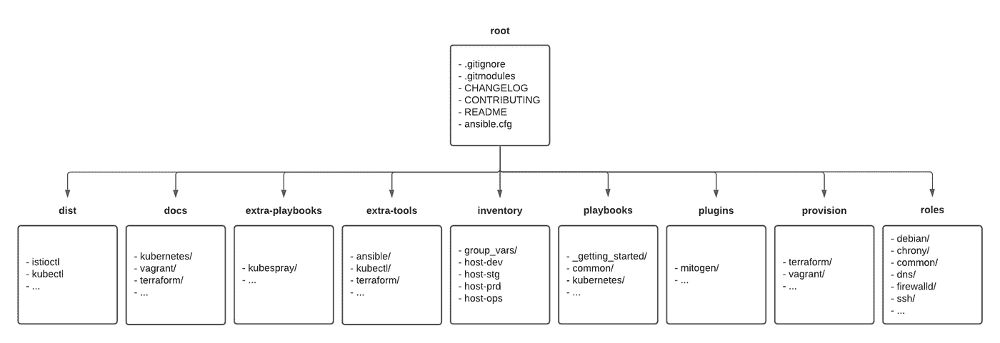
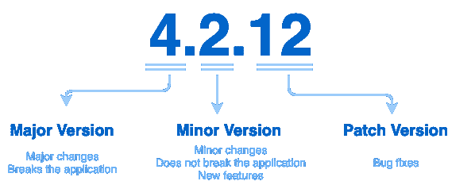

# 固执己见的基础设施即代码项目架构

> 原文：<https://medium.com/nerd-for-tech/opinionated-infrastructure-as-code-project-architecture-c77903e8703d?source=collection_archive---------1----------------------->

马丁·施瑞德在 [Unsplash](https://unsplash.com/s/photos/code?utm_source=unsplash&utm_medium=referral&utm_content=creditCopyText) 上的照片

基础设施即代码(IaC)已经成为一种趋势很多年了。虽然今天正在定义一些标准，但我们继续听到新的方法或工具，通过尽可能自动化我们的日常任务来改善我们的生活并使其变得更容易。

幸运或不幸的是，今天，我们可以在 Ansible、Pulumi、Terraform 等多种自动化工具之间进行选择，每种工具都有自己的优缺点。因此，选择正确的工具并不是最容易的部分。它需要团队协作来识别、测试和定义正确的工具。这种合作是成功的关键，确保其他团队参与 IaC 项目以适当地自动化每个团队的过程是很重要的。

选择正确的工具是一个挑战，但是定义项目的架构是另一个挑战。除了单库或多库之外，IaC 项目架构定义的焦点仍然应该是协作。目的应该是为了简化，以促进参与。

这篇文章的目的是展示一个在不同环境中使用不同自动化工具多次的自以为是的基础设施即代码项目架构。但是，让我们先快速介绍一下什么是 IaC 项目。

# 什么是基础设施即代码项目？

基础设施作为代码以描述性模型的形式表示任何基础设施组件(云架构、网络、虚拟或物理服务器、负载平衡器等)的管理。基于软件开发的实践，它强调提供和改变系统及其配置的一致的、可重复的例程。就像相同的源代码生成相同的二进制文件一样，IaC 模型每次应用时都会生成相同的环境。IaC 是 DevOps 的一个关键实践。

基本上，这意味着 IaC 是一种通过机器可读的定义文件来提供、配置和管理 IT 基础架构的方法，可以轻松地对整个基础架构的状态进行版本控制。

这种方法不是新的，它已经被改进了很多年，并且今天还在继续改进。IaC 项目可能没有尽头，因为它显然与公司的业务需求相关联。

IaC 项目有多种好处，主要有:

*   提高**速度**，通过允许某人快速建立一个完整的基础设施，它使得软件开发生命周期更加有效。
*   提高**一致性**，人是会犯错的，自动化手动流程避免了许多错误。自动化是重现性一致性成功的关键。
*   提高**成本**，再加上良好的云计算，IaC 可以大幅降低基础设施管理的成本。花费在硬件、操作人员和物理资源上的资金都在增加，但有了 IaC，自动化策略将工程从执行手动、缓慢和容易出错的任务中解放出来，从而专注于最重要的事情。

基于此，IaC 与正确的工具和适当的项目架构相结合，对于公司中的每个工程师来说都是非常强大的。自动化(和 IaC)并不是 DevOps 团队的专利，所以当您需要做出选择时，请记住整个基础设施，不仅要改进您的日常任务，还要改进您同事的任务。请记住，协作是成功的关键！

# 如何启动基础设施即代码项目？

这是一个自以为是的架构，证明了它在多种环境下的效率。很明显，它已经在迭代中得到了改进，并且很可能会再次得到改进。请记住，IaC 项目不可能从第一次开始就被正确定义，它需要多次迭代才能适应公司的项目。

下面是目录体系结构的简要说明:

*   Root 是项目的入口点，它包含项目入门的主要文档(自述文件、贡献文件)以及跟踪每个更新的 CHANGELOG 文件。
*   Dist 是一个由自动化脚本自动创建的可选文件夹，用于配置本地环境，以方便项目中的任何人。这主要用于将符号链接集中到存储在“extra-tools”文件夹中并由 IaC 项目使用的二进制文件。
*   Docs 是可以找到关于该项目的更多文档的地方。想法是将文档和代码源集中在一起，对它们进行版本控制，并使它们保持同步。
*   Extra-playbooks 是一个可以自动下载外部行动手册的文件夹。这个想法是将内部和外部资源分开，以便清楚地了解哪些代码可以更新，哪些不可以更新。
*   Extra-tools 是一个文件夹，包含用于管理 IaC 架构的每个工具的二进制文件。在本地拥有它是很有用的，以防任何角色需要它们来运行任何操作。
*   清单是自动化工具共享的全局信息的位置，就像不同环境中每个资源的清单一样。
*   行动手册是工程团队开发的内部行动手册的位置。
*   Plugins 是一个可选文件夹，由自动化脚本自动创建，用于配置本地自动化工具以轻松扩展其功能。
*   供应是用于供应基础设施的自动化代码的位置。它可以是云或内部(Terraform、Pulumi 等)资源，也可以是本地测试环境(vagger、Docker、Kubernetes)。该文件夹分为子文件夹(按工具划分)，以便于识别哪个工具管理配置。
*   角色是行动手册用来配置资源的不同角色的位置。

这种目录体系结构可用于在逻辑上将供应代码与配置代码分开，而不必管理多个存储库，这在某些情况下可能是一种优势。

通过这种方式，同一个项目可以轻松实现完全自动化，例如使用 Terraform 配置虚拟机，并使用 Ansible 等本地供应器自动配置虚拟机。

# 如何作为一个团队协作？

合作是成功的关键，就像一句伟大的谚语说的那样:“单独我们走得更快，一起我们走得更远！”。作为一个团队开发一个 IaC 项目可以避免有人开发一个其他人都无法理解的架构，也可以避免选择错误的自动化工具。请记住，公司工程团队中的任何人都应该使用 IaC 项目来自动化他们的过程。DevOps 方法的主要目标是减少操作和开发人员之间的差距。IaC 可以提供帮助，但是为了实现这个目标，这个项目需要每个人的参与。

显然，由不同团队开发的 IaC 需要项目管理将其划分为路线图、任务、子任务，并随着时间的推移跟踪进展。这篇文章的目的不是解释项目应该如何管理，而是团队可以做些什么来以更简单的方式协作。

## 给代码编版本

这一步经常被操作团队遗忘，但是请记住，IaC 项目应该被视为任何其他软件项目。版本控制是跟踪和管理源代码随时间变化的实践，以防止并发工作发生冲突。它还引入了发布管理，以便在需要时快速回滚到以前的版本。

必须定义一个[约定](https://semver.org/),并且可能由连续交付管道自动管理，以自动标记存储库、状态文件或存储桶。

这个约定可以简单到:

换句话说，IaC 项目的约定可能是这样的:

1.  主要版本当您引入重大变更时，如升级自动化工具，这可能会改变 API 的行为或需要重写代码，
2.  次要版本当您以向后兼容的方式添加功能时，如添加新角色、引入新工具等，
3.  当您进行向后兼容的错误修复或格式化时，请使用补丁版本。

## 使用具有明确名称的分支

IaC 项目应该遵循的另一个开发方面的最佳实践是分支的使用。任何源代码控制软件中的分支都允许人们从代码的生产版本中分离出来，以修复一个 bug 或添加一个特性。基本上，分支允许您在不影响生产或其他工作的情况下开发您的变更。

强烈建议在创建分支时使用显式名称，以确保其他人可以引用它并快速了解该分支是否仍在开发中。最佳实践是用当前任务的标签号命名分支，以便快速引用项目管理器中的标识符。

另一个最佳实践是维护生产代码的主分支和每个环境的专用分支。这样，可以定义一个工作流，首先在开发环境/分支中部署每个变更，然后在生产/主分支中发布变更。

## 编写显式提交消息

操作团队经常忘记的另一个最佳实践是提交消息的格式化，以确保很好地理解变更。

同样，强烈建议定义一个[提交消息约定](https://www.conventionalcommits.org/en/v1.0.0/)来从每次更新中提取有用的信息。

下面是一个由多种信息组成的提交消息约定的示例，这些信息可用于分析项目并快速了解成熟度:

换句话说，公约由 3 个部分组成:类型、范围和摘要。

类型定义了提交的全局目的:

*   文档:文档的更新，如自述文件。
*   专长:向项目添加新功能。
*   修复:代码更新，以修复一个错误。
*   重构:不引入新功能的代码更新。
*   格式:代码林挺。
*   测试:单元测试中的代码更改。
*   ci:持续集成过程中的代码变更。

范围定义了项目的哪个子组件受到影响，摘要用不到 80 个字符快速描述了更新。

使用约定需要使用小型提交来轻松找到要使用的提交类型。如果您不知道使用什么模式，这可能意味着您的提交必须分成多个提交。

一个名为“ [git-semantic-commits](https://github.com/fteem/git-semantic-commits) ”的 Github 项目很好地介绍了如何自动化命令行中创建的提交消息的格式。

为了确保每个贡献者都遵循该格式，任何源控制器软件都可以很容易地应用预提交规则。

提交消息对于多人在同一项目中的协作非常重要。如果使用得当，它可以在许多方面提供帮助，特别是在错误修复和回滚过程中。

## 查看代码

协作的主要重点是代码审查，这是一项软件质量保证活动，人们主要通过查看和阅读 IaC 代码的一部分来检查 IaC 代码，然后决定是继续还是中断实现。

一个简单的过程应该需要至少一个批准来合并主(也就是生产)分支中的代码。

## 促进项目启动

协作意味着参与，其中的一个难点可能是加入过程，这是贡献者获得项目理念、理解最佳实践和提交第一次更新所需的时间。

这显然取决于多种因素，文档的质量、代码的质量以及建立本地环境以开始开发更新所需的时间。设置环境可能需要时间，因为它需要安装或更新工具、配置工具、下载依赖项、配置文件等

为了使任何对 IaC 项目感兴趣的人更容易做出贡献，利用自动化工具来配置任何贡献者所需的“基础”概要文件。这样，每个人都可以共享相同的本地环境配置(工具版本、依赖项等)，并轻松地加入到项目中。

无需浪费时间进行研究、召开会议来设置具有正确版本或命令行执行的环境，只需运行一个行动手册，就可以开始 IaC 冒险之旅。

例如，在介绍的架构中，这种自动化由 Ansible 管理，以确保一次性安装 Python、Terraform、Kubectl、Helm、Mitogen 等，从而轻松配置多个环境(Linux、MacOS 等)。

# 可用工具的快速概述

如果不提到工具，我们就不能把基础设施说成是代码。因此，这里有一个在开始 IaC 项目时值得特别注意的工具的快速列表。

## 使用 Terraform 进行供应

Terraform 是由 HashiCorp 开发的开源工具，允许 DevOps 工程师以编程方式提供运行应用程序所需的资源。基于 HashiCorp 语言(又名 HCL)，它允许任何人通过在多个云和本地数据中心之间调配和重新调配来轻松维护整个基础架构的状态。由于采用了不同的供应器和模块，Terraform 能够管理应用程序所需的几乎所有资源。

Terraform 旨在保持最新并同时共享多个状态，但如果没有正确遵循 DevOps 流程，团队工作会变得复杂。幸运的是，已经开发了一个外部工具来轻松管理 Terraform 项目中的代码审查和任何更新的自动合并，这个工具被命名为 [**亚特兰蒂斯**](https://www.runatlantis.io/) 。毫无疑问，这是一款在将产品投入生产之前用来捕捉错误的软件。

测试是 DevOps 方法的重要部分，IaC 项目也不例外。已经开发了一个很好的工具来自动测试 Terraform 资源。这个项目命名为 [**Terratest**](https://terratest.gruntwork.io/) 。这个 Go 库是由 Gruntwork 开发的，它可以帮助 Amazon、Google 等 IaaS 提供商或 Kubernetes 集群创建和自动化使用 Terraform、Packer 编写的 IaC 测试。这是添加到自动化管道中的一个好步骤。

## 带 Ansible 的配置

Ansible 是一个为跨平台计算机支持提供强大自动化的工具。任何 It 专业人员都可以使用它来管理应用程序部署、工作站和服务器上的更新、云供应、配置管理，以及系统管理员每周或每天所做的几乎任何事情。Ansible 凭借其幂等性，极大地提高了 IT 环境的可伸缩性、一致性和可靠性。

Ansible 可以与 Terraform 耦合或不耦合，以轻松管理任何应用程序所需的物理资源。即使今天，Terraform 可以做的不仅仅是供应，它已经与 Ansible 结合了很长时间来管理供应，而 Ansible 则用于更灵活地配置组件。

像任何编程语言一样，Ansible 定义文件在投入生产之前必须经过测试和审查。可以使用两种不同的工具来使其自动化， [**分子**](https://molecule.readthedocs.io/en/latest/) 和 [**易变测试**](https://www.ansible.com/blog/introduction-to-ansible-test) 。两者都很好，并且易于使用，可以在评审代码之前在 Ansible playbooks 上运行单元测试来验证行为。

为了提高 Ansible 的性能，可以将一个名为 [**Mitogen**](https://mitogen.networkgenomics.com/ansible_detailed.html) 的伟大 Python 库添加到 Ansible 中，以大幅降低 Ansible 运行任何剧本所产生的压缩和流量。强烈推荐将其用于基于 Ansible 的 IaC 项目。

正如上一节所解释的，IaC 项目必须灵活，如果需要的话，可以很容易地改变方法、架构或工具。每年，社区都会开发和使用新的工具，旨在与市场上最好的工具竞争。这就是另一个侧重于编程语言方法的 IaC 工具 [**Pulumi**](https://www.pulumi.com/) 的情况，因此，如果您熟悉 Python、Go 等编程语言，并且您即将开始或重构一个 IaC 项目，那么请看一下 Pulumi 项目。绝对值得关注。

## 在虚拟环境中本地运行您的代码

IaC 项目必须被视为应用程序项目。它必须遵循关于定义文件开发的最佳实践，特别是测试步骤。在某些情况下，在开发或测试环境中测试更新之前，最好在本地测试它。

幸运的是，现在有多种工具可以帮助 DevOps 工程师在将代码投入生产之前对其进行测试。**[**Docker**](https://www.docker.com/)[**Podman**](https://podman.io/)[**Buildah**](https://buildah.io/)[**Minikube**](https://minikube.sigs.k8s.io/docs/start/)[**Kind**](https://kind.sigs.k8s.io/docs/user/quick-start/)[**micro k8s**](https://microk8s.io/)等是可以**

**例如，vagger 是一个很好的开源工具，可以创建一个虚拟环境(例如基于 Virtualbox)来测试软件在任何特定操作系统上的部署。**

**Docker、Podman 和 Buildah 可以用于在容器环境中做同样的事情，而 Minikube、Kind、MicroK8s 可以用于在本地 Kubernetes 集群中做同样的事情。**

**根据用例的不同，我们现在有多种方法可以轻松地在 IaC 项目中引入测试，以便对潜在问题采取主动，而不是被动。**

## **使用 Packer 构建您自己的图像(可选)**

**IaC 项目通常由一个关于计算资源的“基础”概要文件组成。基本配置文件或通用配置文件是自动化工具需要在任何计算资源上应用的角色列表，以确保跨资源的一致性。**

**这个基本配置文件可以由 root 密码、NTP 服务器、SMTP 服务器、监控工具部署等的配置组成**

**有时，当涉及到通过减少启动新机器的时间来改进 IaC 项目时，基本概要文件就成了一个问题。一种已知的改进方法是通过创建操作系统的自定义基本映像来减少基本配置文件。**

**要以编程的方式做到这一点，可以使用一个名为 Packer 的开源工具。 [Packer](https://www.packer.io/) 是一款开源工具，由 HashiCorp 开发，用于从单一源配置为多个平台创建相同的机器映像。然后，创建的映像可以上传到云中或由任何内部虚拟 orchestrator 平台使用。**

**Packer 可以由 vagger 在本地使用，根据特定的自定义映像定义生成一个虚拟机，并在本地测试 IaC 项目的一部分。这绝对是一个很好的组合，可以改进任何定制资源的部署。**

**这一步显然是可选的，取决于基础设施的需求。**

## **本地模拟云服务**

**在本地模拟云服务对于降低 IaC 项目的成本非常重要。在生产中测试代码之前，可以使用一些工具在本地模拟一些云服务，而不是生成整个环境来测试一段代码。**

**对于 AWS 用户来说，一个名为 [**LocalStack**](https://localstack.cloud/) 的伟大项目已经被开发出来，并且在今天，它对于在本地测试 Terraform 或 Ansible 代码是非常强大的。LocalStack 可以很容易地部署在本地虚拟环境(虚拟机或容器)上，以模拟许多 AWS 端点。**

**对于 GCP 用户来说，gcloud 命令有一些实验性的特性，可以暂时模拟[有限的端点](https://cloud.google.com/sdk/gcloud/reference/beta/emulators)。**

# **下一个？**

**这篇文章是对基础设施作为代码架构的一个有见解的介绍，以方便和正确地开始一个项目。可能有数以千计的其他方法来做到这一点，这个架构可能会得到改善，所以请在评论中自由分享您的想法！**

**有关更多信息:**

*   **[语义版本化定义](https://semver.org/)**
*   **[语义发布](https://github.com/semantic-release/semantic-release)工具帮助自动发布**
*   **[常规提交](https://www.conventionalcommits.org/en/v1.0.0/)**

# **关于作者**

**Hicham Bouissoumer —现场可靠性工程师(SRE) — DevOps**

**[Nicolas Giron](https://www.linkedin.com/in/nicolas-giron-6129b0a1/) —现场可靠性工程师(SRE) — DevOps**