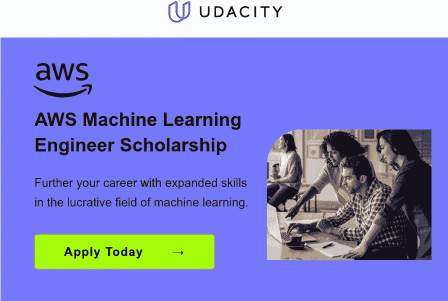

# ML 工程师奖学金计划的机会

> 原文：<https://medium.com/nerd-for-tech/opportunity-to-ml-engineer-scholarship-program-9696c17fba83?source=collection_archive---------4----------------------->

通过获得 AWS 机器学习工程师纳米学位计划的免费奖学金，推进您的职业生涯和技能。应用机器学习技术和算法，包括部署到 AWS 生产环境。

## [立即申请](https://imp.i115008.net/YgG6XR)

**该项目的目标:**
AWS 与 Udacity 合作，为 18 岁以上 ye‍ars 的学生提供全球项目奖学金。特别是，我们邀请来自技术领域代表性不足的群体的个人申请，如女性和有色人种。

该计划旨在扩展学习者在快速增长和需求的机器学习领域的技能。奖学金获得者不仅将学习强化学习和生成式人工智能等 ML 概念，他们还将利用现实生活中的 AWS 服务和产品，如 DeepRacer、SageMaker 和 DeepComposer。

被选中的个人将免费参加 Udacity 的机器学习工程师纳米学位计划，建立一个现实世界项目组合，并走上 ML 工程中利润丰厚的职业生涯的正轨。

**该计划将如何帮助我走向成功？**
您将参与真实世界的项目，这些项目包含最新的内容，由顶级行业专家共同创建，因此您可以立即应用您的新技能。

此外，成功完成该计划的个人将获得一个特殊的展示徽章，以便他们可以在社交媒体上与联系人分享他们的成就。

**如何入门？**
将在 20‍22 ju‍ne 2‍1—20‍22\. ju‍ly 2‍1 开放申请请注意，从开始到结束的一切都将是 100%远程的。

所有申请人都可以直接进入免费的 AWS ML 基础课程的课堂——只需完成申请，您就可以加入了。

开始拓宽你在 to‍day 科技的未来，并尝试一下。

**披露:这篇帖子包含附属链接，意思是当你点击链接并购买时，会收到佣金。这取决于你。**