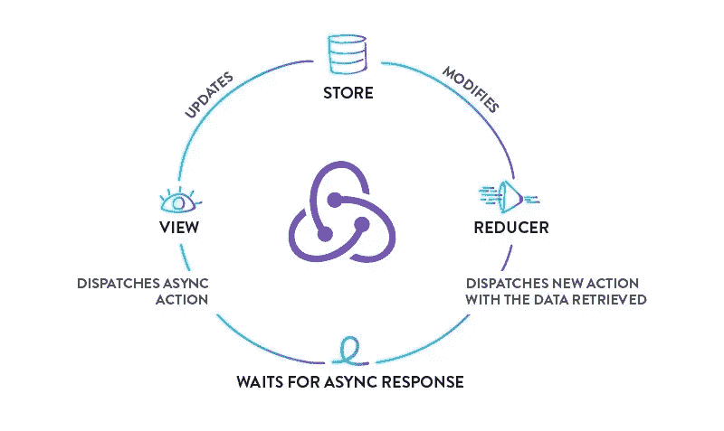
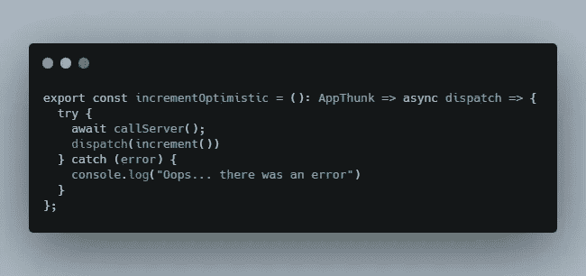
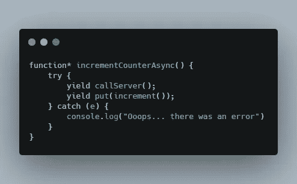
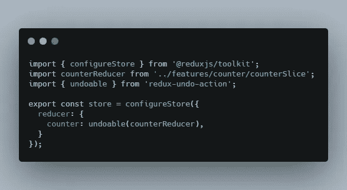
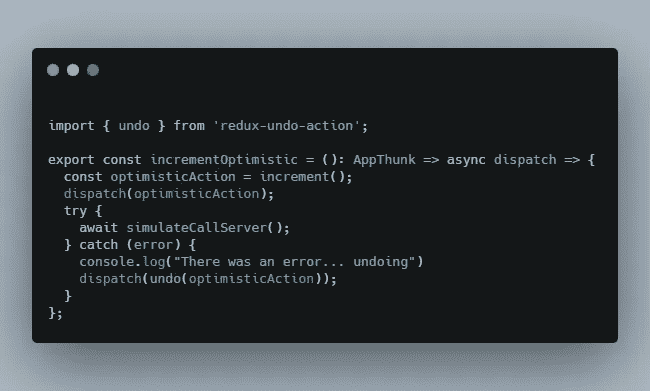
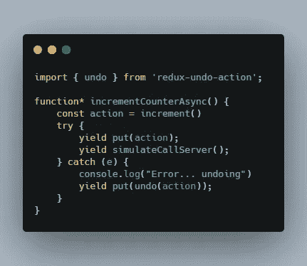

# 带有 React 和 Redux 的乐观用户界面

> 原文：<https://medium.com/nerd-for-tech/optimistic-ui-with-react-and-redux-c6fbcf320571?source=collection_archive---------4----------------------->

# 经典的方式

当您学习如何使用 Redux 执行异步操作时，这是它通常的工作方式。

Redux Thunk/Saga 经典工作流程

用户与触发 ***假动作*** 的 UI 交互，假动作不更新存储，它充当针对服务器的某种异步操作的**发起者**，如果操作成功，我们*更新存储以反映这种成功*，相反，如果操作失败，我们*显示错误，如果需要，我们更新存储以反映错误*。

与此同时，用户会盯着一些微调器或加载指示器，直到整个操作完成或失败，UI 才会反映出任何其他变化，当通过 2G 或 3G 网络连接时，或者当服务器忙于执行另一项任务时，这可能需要很长时间。

作为用户，我们知道在使用移动应用程序或网站时，查看加载指示器并不有趣，也不是一种有趣的体验。

# 具有 Redux 的经典异步流

这就是我们在典型的计数器 reducer 示例中处理异步操作的方式。

使用 Redux Thunk

使用 Redux Saga

如您所见，用户需要等待异步操作完成，然后才能注意到 UI 中的变化。我们可以说这种方法是一种悲观的方法，因为 UI 并不认为操作会成功，而是会等到确定操作成功完成或失败后再更改 UI。

# **乐观 UI**

乐观 UI 的概念来自于 UI 显示对用户操作的即时响应，好像它知道操作将会成功，并且在失败的情况下，它将恢复其状态并通知用户操作失败。

脸书喜欢使用乐观的用户界面

多年来，我们一直在不知不觉中使用实现这些功能的应用程序，其中最受欢迎的一个例子是脸书像按钮计数器。当你按下脸书应用程序中的 like 按钮时，即使在 2G 网络中，计数器也会立即上升，这让你觉得应用程序超级快，给用户带来了很好的体验，而不是盯着旋转器或加载指示器，直到 Like 到达脸书的服务器。

# 处理失败

实现乐观 UI 所需的特性之一是能够处理底层异步操作的失败。这个想法是 ***恢复一个被分派的*** 动作，并让 UI 进入**有效状态**，就像操作从未存在过一样，同时通知用户失败(并可能给出重试的选项)。

这就是如何使用 Thunk 或 Saga 实现*乐观计数器*

乐观计数器 Thunk

如前所述，如果对服务器的调用失败，我们**会调度减量**操作，将状态恢复到乐观更新之前的状态。这种方法适用于简单的情况，但是在我们的 reducer 中为每个动作创建一个相反的动作在编程上不是很有效。理想的场景应该是能够撤销一个特定的动作，而不依赖于另一个具有明显相反效果的动作。

## 撤消操作

为了能够撤销一个特定的动作，而不是必须分派一个具有相反效果的动作，我们将使用 [redux-undo-action](https://www.npmjs.com/package/redux-undo-action) 包。

> npm i 还原-撤消-操作

现在我们需要用*可撤销的缩减增强器*来包装我们的顶级缩减器。

使用可撤销的增强器包装顶级缩减器

现在，我们可以撤销发送到我们商店的任何操作。

可撤销操作 Thunk

不可撤销的动作传奇

现在我们**不再需要分派减量动作**，因为我们的存储知道如何撤销增量。

# 结论

Optimisitc UI 技术提供了改进的用户体验，这在高延迟或低速网络中非常明显，应该考虑用于每个应用程序，尤其是移动优先的网站或移动应用程序。
有了 Redux，这种 UI 模式实现起来非常简单明了，将大大提高用户的参与度，以及我们在使用应用程序时都喜欢的**快速响应**的整体感觉。