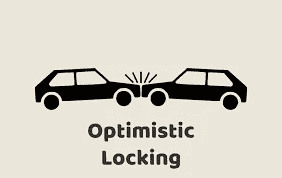
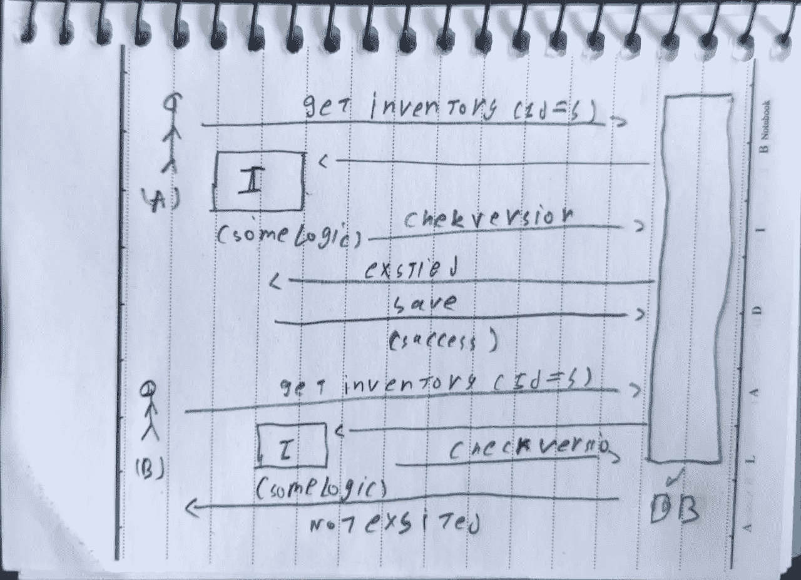
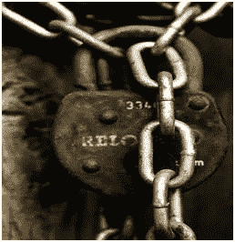
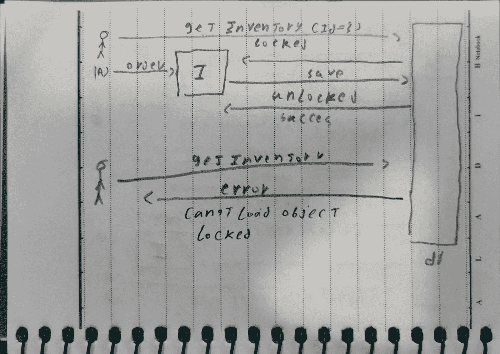

# 乐观与悲观的锁定策略

> 原文：<https://medium.com/nerd-for-tech/optimistic-vs-pessimistic-locking-strategies-b5d7f4925910?source=collection_archive---------0----------------------->

## 什么是**锁定？**

> 锁定是一种防止同时访问系统中的数据的技术，为了允许几个用户同时修改一条记录，也为了防止无限制访问造成的不一致结果，当检索到一条记录进行更新时，可以对其进行*锁定*。由于锁定，任何试图检索同一记录进行编辑的人都被拒绝写访问。一旦记录被保存或编辑被取消，锁就被释放。记录永远不会被保存以覆盖其他更改，从而保持数据完整性。

## 锁定一般示例

> 例如，您的应用程序中的每种产品都有一个库存对象，您需要下订单，并在下订单后保存订单数量
> 
> 想象一下，现在你的两个客户同时请求从库存中下订单，而你的库存中有 3 件商品
> 
> 第一个客户将购买 2 件商品，因此库存将检查其数量，这将是有效的，然后它将从库存中检测数量，并且在保存商品后，可用数量将是 1
> 
> 第二个客户将购买 3 件商品，因此库存将检查其数量，这将是有效的，然后它将从库存中检测数量，并且在保存商品后可用数量将为 0
> 
> 但是总缺陷数量为 5，因此它会将库存对象置于无效状态。这是本主题的一个简单示例，本文将使用不同的策略来解决它

# 乐观锁定

## 什么是乐观锁定？

> 在这个策略中，假设多个用户将在互不影响的情况下工作。换句话说，在进行乐观锁定时，不强制锁。我们只是验证没有其他事务修改过数据。在修改的情况下，我们将回滚我们的更改。

## 乐观锁定不同的实现

我们可以在许多实施中使用这种策略，例如:

*   更新前检查旧值和新值。
*   在对象中创建时间戳数据类型，并在更新时检查旧时间戳是否等于记录时间戳
*   向对象添加版本

## 乐观锁定问题的解决方案

> 我们将使用版本来解决我们的问题。我们将向清单对象添加版本号，在保存对象之前，我们将检查是否存在具有此版本的清单对象，然后保存具有该版本的对象
> 
> 所以我们的情况会是这样的:
> 
> 第一个和第二个客户将在运行时向对象发出请求，但在保存时，将只保存一个，第二个客户将找不到该对象，因为它已被更改为第一个请求，如 blow 图像所解释的

用户 A 和 B 将获得库存对象，但只有用户 A 修改过的对象将被保存，用户 B 对象将被删除，因为版本已更新，并且数据库届时将只接受一个请求，因为这是同步的本质

# 悲观锁定

## 什么是悲观锁定？

> 在这种情况下，假设当你需要访问对象进行更新时，我们会锁定该记录供独占使用，直到你完成它。它比乐观锁定具有更好的完整性，但是需要您小心应用程序设计以避免死锁。

## 悲观锁定不同的实现

我们可以在许多实施中使用这种策略，例如:

*   获取对象后，在内存或数据库中添加对象锁
*   使获取和更新对象的方法在代码级别可序列化
*   使用更强的事务隔离级别

## 悲观锁定问题的解决方案

> 我们将使用锁定来解决我们的问题。我们将锁定库存对象，同时让它继续进行更新，如果在此之后发送的任何获取相同对象的请求都将失败
> 
> 所以我们的情况会是这样的:
> 
> 第一个或第二个客户将在运行时向对象发出请求，而这个对象将有一个错误，因为这个对象被另一个请求锁定了，就像图像爆炸一样

用户 A 将获取库存对象并在其上添加本地，但是当用户 B 尝试获取该对象时将失败，因为它被另一个用户锁定

# 结论

> 乐观锁是一种非常有用的技术，即使在使用不太严格的隔离级别时，或者在后续事务中执行读写操作时，它也能很好地工作。
> 
> 乐观锁的缺点是数据访问会触发回滚，因此会丢失当前正在执行的事务所做的所有工作。
> 
> 争用越多，冲突就越多，中止事务的可能性就越大。回滚对系统来说代价很高，因为它需要恢复所有当前挂起的更改，这些更改可能涉及表行和索引记录。
> 
> 因此，当冲突频繁发生时，悲观锁定可能更合适，因为它减少了回滚事务的机会。