# 机器学习的优化算法

> 原文：<https://medium.com/nerd-for-tech/optimization-algorithms-for-machine-learning-23a4b71588a9?source=collection_archive---------8----------------------->

***第二章:凸集与函数***

照片由[迈克尔·泽兹奇](https://unsplash.com/@lazycreekimages?utm_source=medium&utm_medium=referral)在 [Unsplash](https://unsplash.com?utm_source=medium&utm_medium=referral) 上拍摄

T 此处“第 1 章:简介”的链接为。这一章是关于凸集的。这将稍微偏离优化问题的流程。然而，这种题外话是必要的，在本系列的适当时候你会自己理解原因。凸集是最优化领域的一个重要部分。

在本章中，我们将了解:

*   理解凸集所需的基本集合论概念
*   凸集
*   凸组合
*   凸集的一些性质
*   凸函数
*   凸包
*   为什么需要研究凸集和函数？

最后，我们将看看第一章中提出的问题的答案。

本章将使用的一些符号是:∀意为“所有”，⊆意为“子集或等于”，∈意为“属于”

首先，让我们复习一下集合论的一些基本概念，这些概念我们在高中都学过。让我们了解如何理解用**集合构建器符号**编写的集合定义。因此，在集合生成器符号中，集合被表示为:

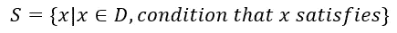

上面的等式将被理解为 S 是所有 x 的集合，使得(用“|”表示)x 属于域 D，并且 x 满足给定的条件。为了更好地理解这一点，我们来看下面的例子:

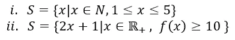

在第一个例子中，S 是所有 x 的集合，使得 x 是自然数，1 小于或等于 x，x 小于或等于 5。在第二个例子中，S 是所有 2x+1 的集合，使得 x 是正实数，f(x)≥10。

**器械包的图像和前图像:**

设函数 f 将集合 X 中的元素映射到集合 Y 中的元素，即 f: X->Y。在这种情况下，X 称为函数 f 的定义域，Y 称为 f 的余定义域。非常重要的是要注意，余定义域 Y 中的元素可能永远不会映射到函数的定义域 X。然而，反之则不然。当通过函数运算符时，函数 f 的定义域 X 中的元素在余定义域 Y 中不会有相应的值。这可以通过下图正确地表示出来:

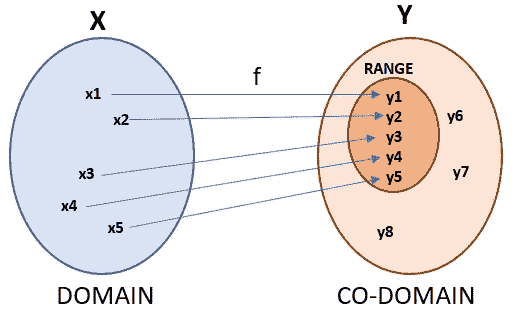

函数 f 的定义域和余定义域

由此，我们导出了函数的象和前象的概念。如果集合 A 是 X 的子集，则 A 在 f 下的像由 f(A)给出，f(A)是 y 的子集。

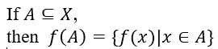

下图显示了函数 f:X->Y 的映像和预映像。集合 B 是集合 A 的映像，集合 A 是集合 B 在 f 下的预映像，表示如下:

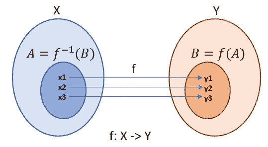

函数 f 下的图像和前图像(*作者的图像*

前映像的集合生成器符号由下式给出:

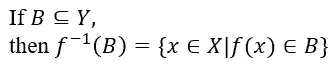

所以，现在让我们进入更有趣的部分:**凸集**

人们在研究凸集时首先会问的问题是:**什么是凸集？**答案很简单。如果连接集合中任意两点的线段上的每一点都位于该集合上，则该集合称为凸集。迷茫？别担心。我们来分析一下。所以，这句话的基本意思是，考虑一个集合，任何形状或形式的集合。取任意一条线段，使该线段所连接的点位于集合内。现在，如果该线段中的所有点也位于集合内，则满足凸集合的标准。请注意，所有可能在集合内绘制的线段都必须满足该标准。为了更清楚，让我们看一些例子。

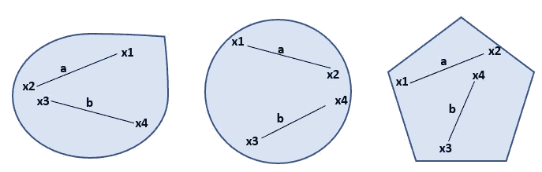

凸集(*图片作者*)

在上面的集合中，线段 a 和 b 分别连接所有 3 个集合中的点 x1-x2 和 x3-x4。当然，这意味着这些图(上图和下图)表示构成各个集合的点分布的区域。可以清楚地看到，这些线段上的任何一点都位于集合内部。这也适用于你能想到的任何其他线段。因此，这些集合被称为凸集。现在，让我们看一些非凸集合的例子。在下面的集合中，连接点 x1 和 x2 的线段“a”的一部分位于集合之外。这意味着并非连接该集合中 2 个点的线段中的每个点都位于该集合内。因此，这些集合是非凸的。当然，这意味着这些图(上图和下图)表示构成各个集合的点分布的区域。

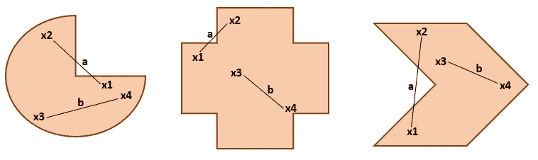

非凸集合(*图片作者*)

在数学形式中，凸集是这样的点的集合，使得位于连接该集合中任意两点 x1 和 x2 的线段上的这些点也位于该集合内。这些点的表达式如下所示

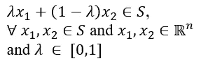

上面的表达式以一般的方式在连接点 x1 和 x2 的线段上定义了点“x ”,并且以比率λ和 1-λ分割该线段。这个点“x”可以是线段上的任何一点。λ显然位于 0 和 1 之间，因为线段划分的比率必须为正。因此，由可能连接集合内两点的每条线段上的所有这样的点“x”形成的集合是凸集。x1 和 x2 必须属于集合 S，并且还属于 n 维空间，因为集合 S 可以在任何维(2 维、3 维等等)。涉及λ和 1-λ的表达式也称为“**x1 和 x2 的凸线性组合**”。这清楚地显示在下面的凸集中。

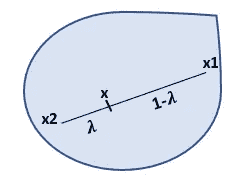

了解凸线性组合的图像(*图片作者*

另一种表示线性凸组合的方法是:考虑 n 维空间中的一组点 S={x1，x2，…，xN}。因此，这些点的线性凸组合由下式给出

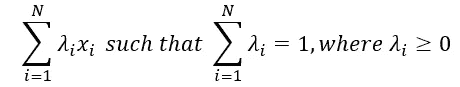

你能试着弄清楚上面的表达和前面提到的一个表达基本上是什么意思吗？请看下一章的结尾[这里](/nerd-for-tech/optimization-algorithms-for-machine-learning-acffa886a343)寻找答案。

理解了什么是凸集之后，让我们看看凸集的一些有趣的性质。

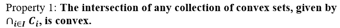

这个性质可以直观地理解，因此我们不进行数学证明。想象 2 个凸集，现在试着让它们相交。你注意到了什么？看看下面凸集的交集。你会注意到这样形成的相交区域(阴影区域所示)也是一个凸集

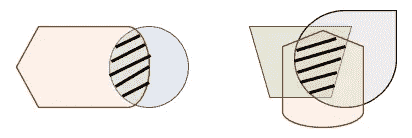

凸集的交集(图片由作者提供)

**性质 2:****2 个凸集 c1 和 c2 的向量和也是凸集**

我们将在这里进行数学证明。不过，我会说得很简单，让你明白。所以不要担心，让我们开始吧。

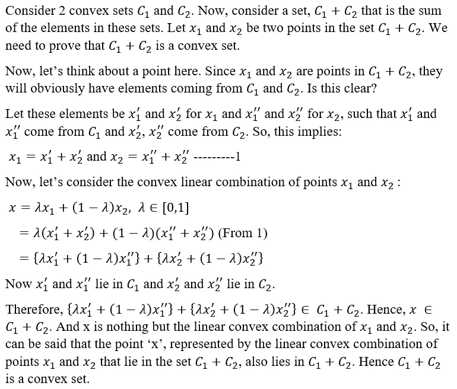

**性质 3:** **集合αC 对任意凸集合 C 和标量α都是凸的。让我们看看数学证明。**

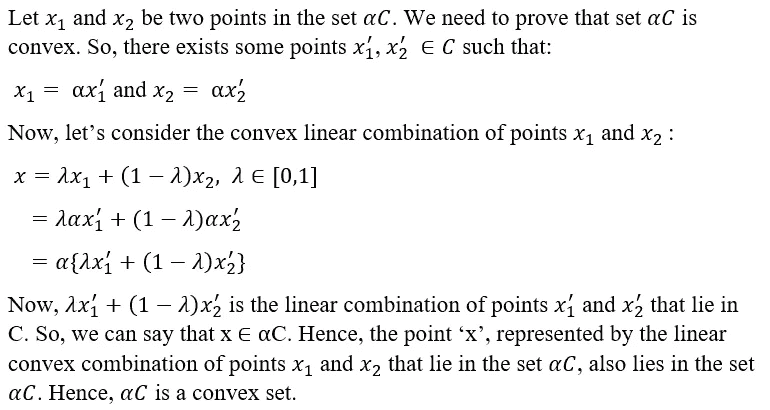

我们将在下一章左右研究凸集的更多性质。就目前而言，这些应该足够好了。

现在，让我们看看什么是**凸函数**。凸函数的定义如下:

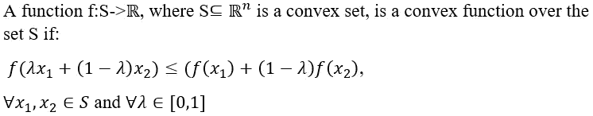

注意，S 是 n 维空间的子集，因为集合 S 可以位于任何维度。上述数学不等式的几何解释如下:

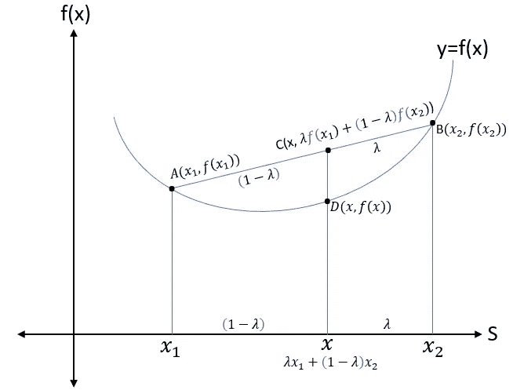

解释凸函数数学形式的图表(图片由作者提供)

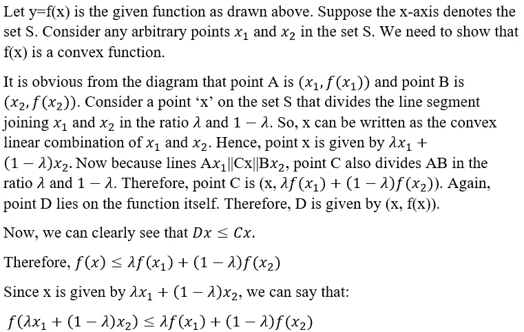

这意味着，如果一个函数是凸的，连接函数曲线上任意两点的线段将总是位于曲线之上或之上。让我们看一些例子:

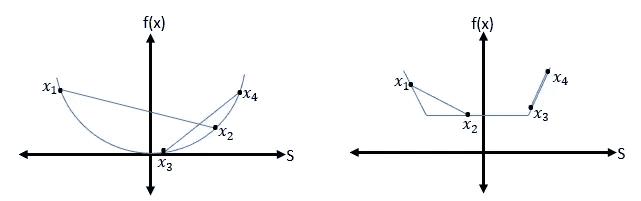

凸函数的例子；图 1(左)和图 2(右)(图片由作者提供)

在上面的图 1 中，请注意连接两点 x1、x2(也连接弧线)的线段位于弧线上方。点 x3 和 x4 的情况类似。在图 2 中，同样的事情发生了。连接点 x1 和 x2 的线段位于函数上方。另一方面，连接点 x3 和 x4 的线段取决于函数。因此，我们可以清楚地看到，如果一个函数是凸的，那么连接函数上任意两点的线段将位于函数图上。

另一个适用于凸函数的不等式(虽然不常用)是:

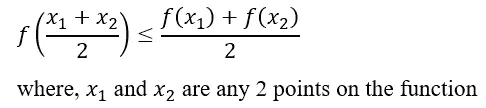

所以，现在我有一个问题要问你。你能想出“凹函数”的不等式条件是什么吗？如果你想不出来，请看下一章的结尾部分[这里](/nerd-for-tech/optimization-algorithms-for-machine-learning-acffa886a343)。

现在我们对凸集和函数有了一个好的想法，让我们看看什么是**凸包**。这是一个相当简单的概念。点集的凸包是包含集合中所有点的最小凸多边形(可能是也可能不是凸集合)。凸包主要指向集合的边界。数学上，集合 S 的凸包，记为 conv(S)，由下式给出

请注意，上面的表达式只不过是集合 s 中的点的线性凸组合。我们将很快看到上面方程的解释。下面是一个凸包的可视化。黑点代表集合中存在的所有数据。

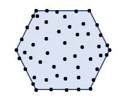

“凸”集的凸包(图片由作者提供)

现在你一定已经在想，既然凸包使用相同的线性凸组合，如果它与凸集如此相似，为什么我们要使用凸包作为一个独立的概念呢？一个合理的问题。我们使用凸包是因为它有一个非常有趣的特性叫做“包裹”。简而言之，凸包可以通过包裹集合中非凸的一边，将非凸多边形转化为凸多边形。迷茫？不要这样。关于凸包要记住的第一点是，它是一个“**凸**多边形。现在，让我们来看看它。

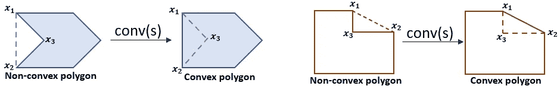

运行中的凸包(图片由作者提供)

从上面的图表中得到灵感？该套件的非凸起部分的包装用虚线示出。凸包，由于它的性质，以非凸多边形变成凸多边形的方式连接集合中的点。它基本上忽略了导致集合中非凸性的点。这叫包装。由于凸包聚焦在点的线性“凸”组合上，它以这样的方式形成点集的边界，使得结果多边形是凸多边形。请注意，我在**而不是**中使用短语“凸包将非凸‘集合’转换为凸集合”时过于谨慎，因为为了使集合变成凸的，必须从集合中移除上图中的点 x3。凸包没有做这样的事情。因此，原始点集没有变化。凸壳简单地忽略了点 x3，并连接了 x1 和 x2 以形成凸多边形。

凸包有着广泛的应用。凸包完全是一个独立的研究领域，因此，我们不会在这里涉及太多的细节。但值得注意的是，凸包用于处理识别某个事物的最佳紧凑形状的应用程序中。凸包用于避免汽车碰撞，检测疾病区域的范围，评估核/化学泄漏的最大扩散，图像处理，数据分类和许多其他应用。凸包的应用领域也非常广泛，从纯数学扩展到量子物理，线性和非线性规划等等。

用于设计凸包的算法称为 Jarvis march 或简称为 Jarvis 算法。这是一个非常棒的算法。互联网上有很多伪代码，所以我们不会详细讨论。然而，基本思想是识别数据集中具有最低 y 轴值的最左边的点 P0，然后根据它们与参考点 P0 所成的角度对其余的点进行排序。接下来的任务是考虑这些角度，形成第一条边界线。此后，参考点从 P0 变为第一边界连接的点，形成第二边界线，依此类推。这种情况一直持续到边界最终连接回 P0。下图显示了使用 Jarvis Walk 形成的凸包。

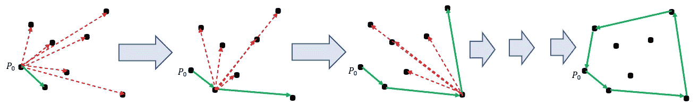

贾维斯行走的流程(图片由作者提供)

实现 Jarvis walk 的示例代码如下所示。这是一个非常简单的代码，它利用了名为“scipy”的库中的内置函数。同时，生成的凸包已经显示在旁边。

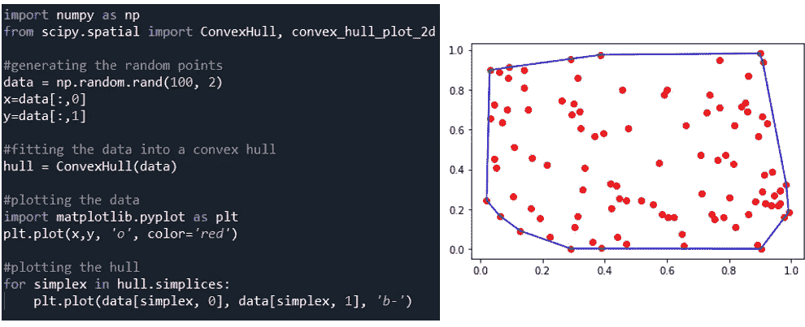

凸包的代码和绘图(代码和图像由作者提供)

**为什么我们需要研究凸集和函数？**在科学技术中，我们经常遇到的那类问题在本质上并不总是线性的。我们经常会遇到非线性问题，尤其是在解决最优化问题时，其中凸集和函数是非常重要的一部分。一旦我们通过观察一个特定问题的数学形式或它所采取的形状，或者通过测试该问题的某些性质，理解了该问题的性质是凸的，那么解决该问题就变得相当容易了。如果不是计算本身，而是继续计算的方向变得清晰。这些方向中的大多数都是预先安排好的，我们所要做的就是将问题放入蓝图中并进行计算。如果这一点现在还不清楚，不要担心。在这个系列中，我们将会遇到几个例子，在这些例子中，我在这里试图阐明的观点将会非常清楚。

就这样，我们到了这一章的结尾。

对第一章“引言”中所提问题的回答。此处是[章节的链接。](/nerd-for-tech/optimization-algorithms-for-machine-learning-4601f8815626)

线性回归的成本函数中有两个变量。这些是:

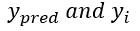

并且当目标是最小化成本函数时，这些变量将被馈送到目标函数中。因此，这两个变量构成了目标函数中 x 向量的元素。注意，目标函数 f(x)也可以表示为—

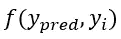

在矩阵符号中，目标函数的输入向量将被写成:

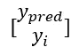

继续[第三章:一些重要的凸集](/nerd-for-tech/optimization-algorithms-for-machine-learning-acffa886a343)