# 神经网络优化器

> 原文：<https://medium.com/nerd-for-tech/optimizers-for-neural-networks-a74cb4152307?source=collection_archive---------7----------------------->

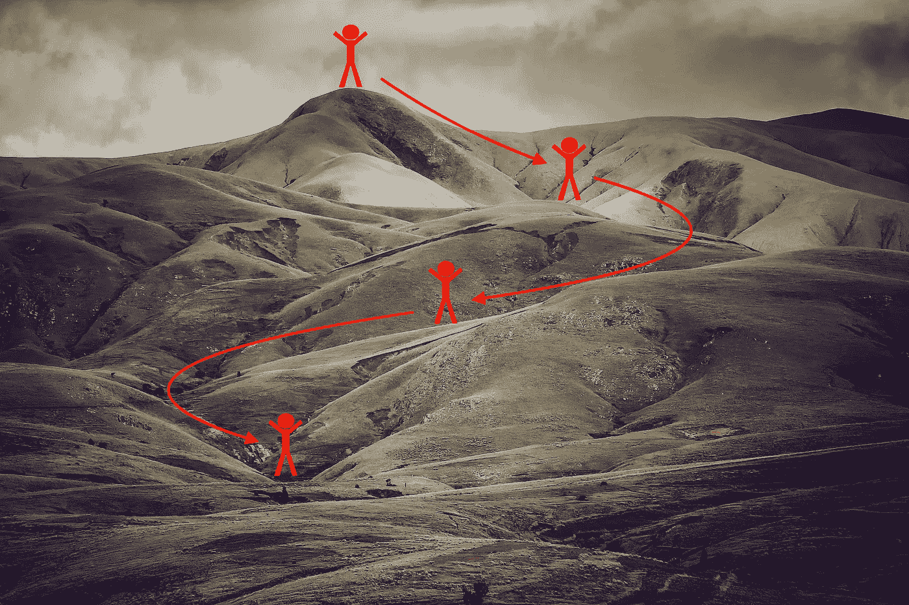

> ***按算法划分，按目标统一***

任何机器学习或深度学习算法的主要目标都是预测更接近实际的输出。这降低了基于预测误差的成本函数。**优化算法**是一种迭代执行的程序，比较各种解决方案，直到找到最优值，也称为全局最小值。

天生具有计算能力的神经网络需要一个最佳的优化器，在向前和向后传播过程中能够有效地帮助它们。

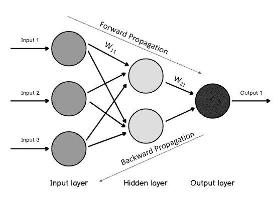

让我们来看看一些优化器…

# **梯度下降(物品)**

梯度下降是最基本和最流行的优化算法。它是一种一阶优化算法，依赖于成本函数的一阶导数。它计算权重必须以何种方式修改才能达到最小值。通过反向传播，损耗从一层转移到另一层，并且模型的参数(权重和偏差)根据损耗进行修改，从而可以最小化损耗。

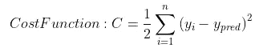

回归问题的成本函数

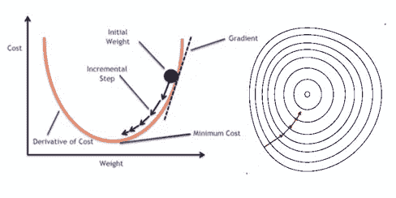

渐变下降([博客。clairvoyantsoft.com](https://www.google.com/search?q=gradient+descent&sxsrf=ALeKk005IbXqzGjKRQprF6yewJi92PkV4g:1618101739048&tbm=isch&source=iu&ictx=1&fir=SIjfAY4Q5Hv84M%252CYe43U5gv58coVM%252C_&vet=1&usg=AI4_-kSKPM9cleFQ9KkKHQ-Sy9Isk-xGog&sa=X&ved=2ahUKEwjA4Pba-vTvAhVFVK0KHfPLA8cQ_h16BAgTEAE)

梯度表示增加的方向。因为我们需要最小化成本，所以我们反其道而行之。然后，我们在梯度的相反方向上更新我们的参数，学习率(η)决定了我们达到最小值所采取的步长。

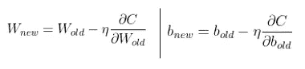

更新的参数(权重和偏差)

这是一个迭代过程，因此在每一步中，我们都需要遍历整个数据集来计算梯度和更新参数。例如:如果我们有包含 10K 记录的数据，对于每个迭代，模型处理所有的记录并修改参数。当数据在梯度下降中作为一批传入时，[迭代次数将与历元数相同。](https://towardsdatascience.com/epoch-vs-iterations-vs-batch-size-4dfb9c7ce9c9)为了避免欠拟合，我们通常会增加迭代次数，从而增加处理整个数据的次数。想象一下，如果我们有 1B 记录和 1000 次迭代会是什么情况！😱😢

## 优势:

1.  容易理解
2.  因为它是一阶导数，所以不太复杂

## 缺点:

1.  对于庞大的数据集，可能需要很长时间才能收敛
2.  计算整个数据集的梯度需要大量内存

# **随机梯度下降(SGD)**

这是梯度下降算法的下一个版本。算法在处理每个记录后更新参数，导致更新更加频繁。SGD 克服了 GD 的一个主要缺点，即冗余计算。梯度下降执行冗余计算，因为它在每次参数更新之前重新计算相似示例的梯度，而 SGD 一次执行一次更新，并且它通常比 GD 快得多，用于 [**在线学习**](https://shabarigirish.medium.com/introduction-to-online-learning-19c8d8a270d0) 。在我们前面的 10K 记录的例子中，SGD 一次更新一个参数，也就是说，它需要 10K 迭代来完成一个时期。

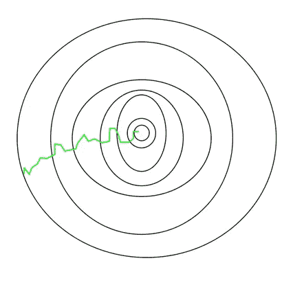

SGD 执行频繁的高方差更新，导致目标函数大幅波动

SGD 波动使其能够跳到潜在的局部最小值。这可能最终使收敛到全局最小值变得复杂。通过适当选择学习速率，SGD 可以表现出与 GD 相似的收敛行为。

## **优点:**

1.  频繁的参数更新，从而在更短的时间内收敛
2.  存储整个数据集以进行梯度计算需要更少的内存

## **缺点:**

1.  模型参数中的高方差
2.  必须修改学习率，以使模型执行类似于 GD，或者必须批量处理恒定学习率数据，以减少参数变化

# **小批量梯度下降(MBGD)**

小批量梯度下降是 GD 的改进版本，它调节 SGD 的参数变化。这一壮举是通过为每次迭代考虑小块或小批量数据来更新参数而实现的。对于我们之前的 10K 记录的例子，考虑 200 的批量大小，将需要 50 次迭代来完成一个时期。很明显，我们将有多个时代来获得更好的结果。

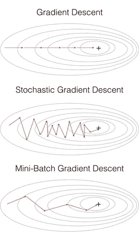

梯度下降类型之间的比较

## **优点:**

1.  与 SGD 相比，MBGD 明显减少了参数变化，与 GD 相比，MBGD 频繁更新(两全其美👍)
2.  与 GD 相比，需要更少的存储

## **缺点:**

1.  由于学习速率是恒定的，所以收敛不是平滑的。

# **气势**

我们在下面提到的图片中看到，岩石在下坡时积累了动量，在途中变得更快，直到停止。

我们的参数更新也是如此。**具有 SGD 的动量**相应地转向，以减少方差并软化收敛。它加速了向正确方向的收敛，减少了波动。

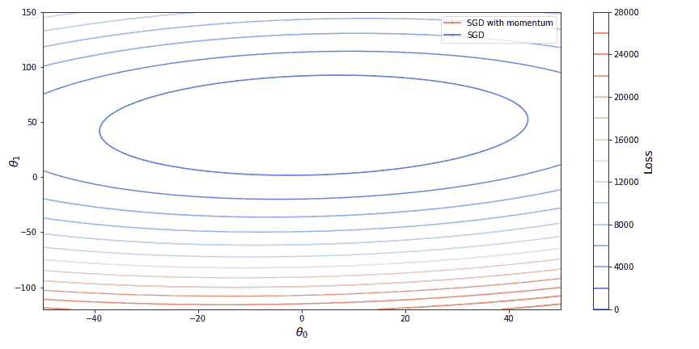

[随动量减少的方差](https://www.google.com/search?q=momentum+with+SGD+gifs&tbm=isch&ved=2ahUKEwjt2LSZ6vbvAhWMAKwKHT3VCvsQ2-cCegQIABAA&oq=momentum+with+SGD+gifs&gs_lcp=CgNpbWcQA1CBI1izK2CBLWgAcAB4AIABWogB_gKSAQE1mAEAoAEBqgELZ3dzLXdpei1pbWfAAQE&sclient=img&ei=CkFzYO2rCYyBsAW9qqvYDw#imgrc=IHRvSe20zetuYM)

我们应用 [**指数平滑**](https://machinelearningmastery.com/exponential-smoothing-for-time-series-forecasting-in-python/) 来平滑收敛到全局最小值的参数。

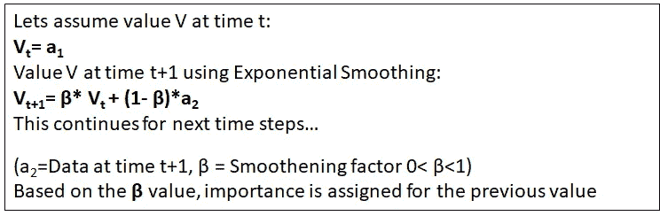

指数平滑法

指数平滑的权重和偏差参数为:

## **优点:**

减少参数的方差，收敛速度比 SGD 更快

## **缺点:**

1.  恒定的学习速率可能需要更多的步骤来收敛
2.  手动选择多一个超参数( **β)** (通常为 0.9/0.95)

您已经成功完成了优化之旅的一半。到目前为止，我们一直认为学习率( **η)，**从现在起，我们将改变学习率。**这太令人激动了！！！**

# **Adagrad(自适应梯度下降)**

如上所述，我们将有一个动态变化的学习率 **η** 。这个特性有望帮助我们比以前更快地达到最优。参数越接近最小值，学习率越低，收敛越平滑。

[阿达格勒收敛](https://www.google.com/url?sa=i&url=https%3A%2F%2Fmorioh.com%2Fp%2F15c995420be6&psig=AOvVaw0BJv7fDXihXWOqby0MTtwS&ust=1618281714646000&source=images&cd=vfe&ved=0CAMQjB1qFwoTCNjkvbXX9-8CFQAAAAAdAAAAABAi)

我们将看到如何使用 Adagrad 更新我们的参数:

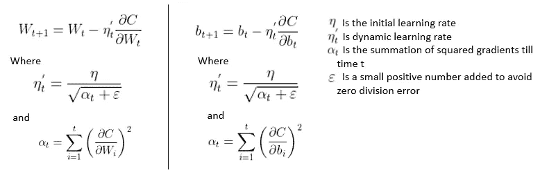

计算相对于时间的梯度，对其进行平方(以增强强调)，然后求和。该值预计会随着时间的推移而增加。添加一个小的正值(ε)以避免#DIV/0！。因此，对于每一步，学习率除以(αt + ε)的平方根(它随步数增加)，从而降低学习率，导致平滑。

**优点:**

1.  无需手动调整学习速度
2.  与以前的技术相比，收敛平滑

**缺点:**

1.  计算成本高
2.  对于非常深的神经网络，参数可能急剧减小，导致 [***消失梯度问题***](https://en.wikipedia.org/wiki/Vanishing_gradient_problem) 。

# **RMS 道具**

均方根传播是一种广泛用于神经网络小批量学习的优化技术。这一过程有效地平均了连续小批量的梯度，因此可以通过调节 Adagrad 的梯度递减问题来精确校准砝码。

梯度递减的阿达格拉德

RMS Prop 通过 ***指数平滑学习速率来解决梯度递减问题(耶！就像我们用*SGD)**对动量梯度所做的那样。

我们的权重和偏差参数是:

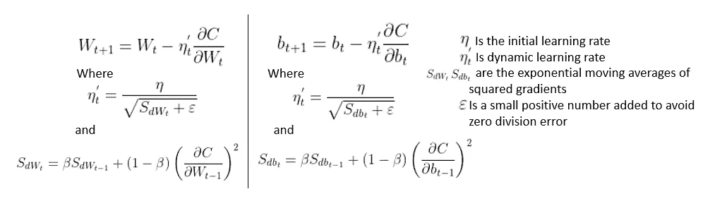

平方梯度的指数移动平均线帮助我们解决了 Adagrad 问题。它利用最近梯度下降的幅度来归一化梯度。在这个过程中，学习率 ***不会*** 变得太小，从而解决了问题。

**优点:**

1.  学习率基于最近的梯度而不是所有的梯度进行调整
2.  每个参数可以有不同的学习率

**缺点:**

# **亚当**

ADA**感受性**Mmoment optimizer 是所有讨论过的优化器中最好的。

> [*通过使用大型模型和数据集，我们证明了 Adam 可以高效地解决实际的深度学习问题。*](https://machinelearningmastery.com/adam-optimization-algorithm-for-deep-learning/#:~:text=Adam%20is%20a%20replacement%20optimization,sparse%20gradients%20on%20noisy%20problems.)

该优化器根据 RMSProp 的 ***学习率，并通过使用 SGD*** 对动量梯度进行平滑来更新参数。

更新后的参数如下:

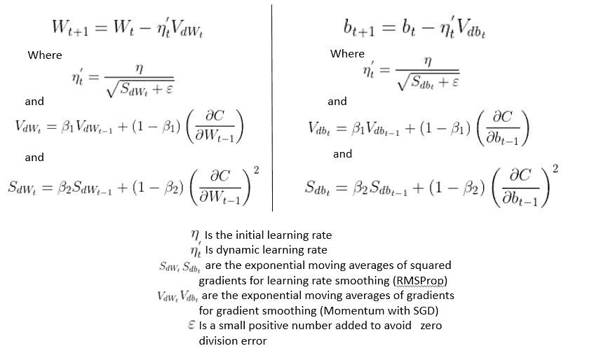

Adam 优化器实施

提到的超参数( **β1)和(β2)** 不同，但通常在(0.95–0.99)的[范围内。](https://ruder.io/optimizing-gradient-descent/)

**优点:**

1.  可以处理数据集上的稀疏梯度
2.  默认值在大多数情况下都适用
3.  需要更少的存储和计算效率
4.  适用于大型数据集

**缺点:**

1.  可能遭受[重量衰减](/analytics-vidhya/deep-learning-basics-weight-decay-3c68eb4344e9)，并且在某些情况下可能不会收敛到最优解

# **结论**

寻找更好的优化程序是永无止境的…..

但是在可用的优化器和条件中， **ADAM** 无疑是最好的优化器。

## **参考文献:**

我通过下面提到的链接来学习和理解这些概念

*   [https://towards data science . com/optimizer-for-training-neural-network-59450d 71 caf 6](https://towardsdatascience.com/optimizers-for-training-neural-network-59450d71caf6)
*   [https://medium . datadriveninvestor . com/overview-of-different-optimizer-for-neural-networks-e0ed 119440 c 3](https://medium.datadriveninvestor.com/overview-of-different-optimizers-for-neural-networks-e0ed119440c3)
*   【https://latex.codecogs.com/legacy/eqneditor/editor.php 
*   [https://ruder.io/optimizing-gradient-descent/](https://ruder.io/optimizing-gradient-descent/)
*   [https://towards data science . com/10-gradient-descent-optimization-algorithms-86989510 b5e 9](https://towardsdatascience.com/10-gradient-descent-optimisation-algorithms-86989510b5e9)
*   [https://towards data science . com/complete-guide-to-Adam-optimization-1e5f 29532 c 3d](https://towardsdatascience.com/complete-guide-to-adam-optimization-1e5f29532c3d)
*   [https://medium . com/analytics-vid hya/deep-learning-basics-weight-decay-3c 68 EB 4344 e 9](/analytics-vidhya/deep-learning-basics-weight-decay-3c68eb4344e9)
*   https://www.youtube.com/watch?v=TudQZtgpoHk&t = 1177s&ab _ channel = KrishNaik