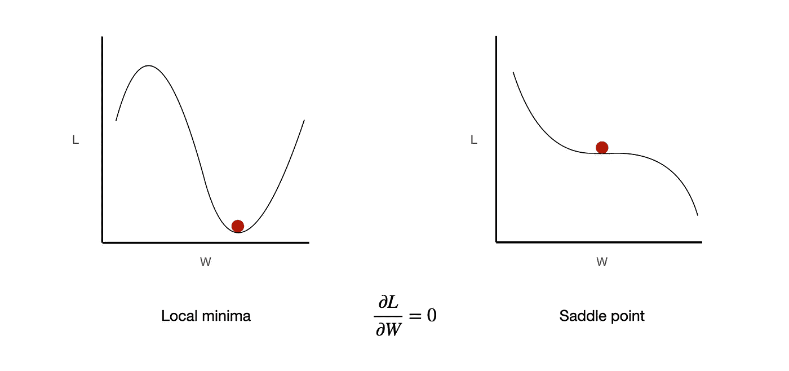
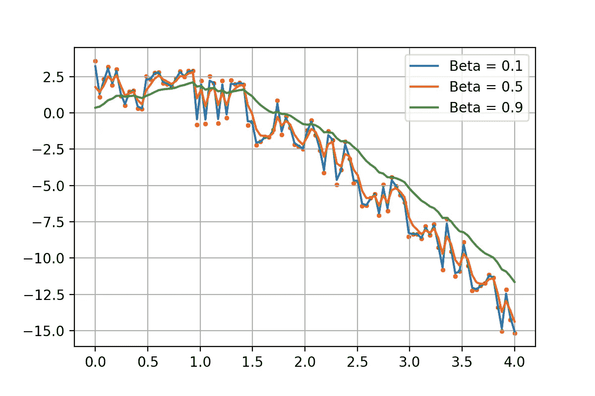
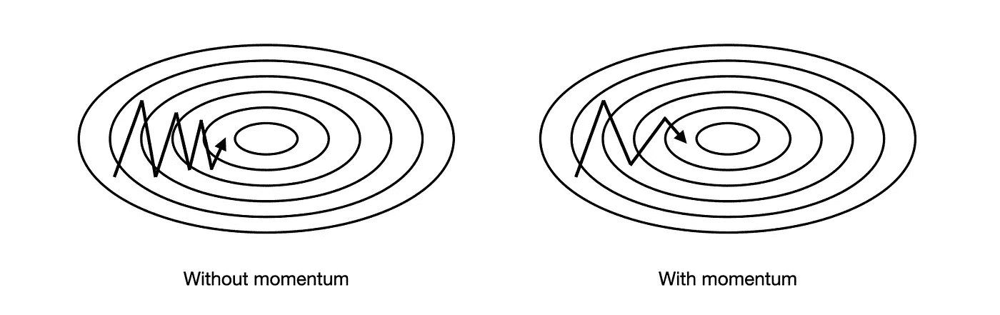
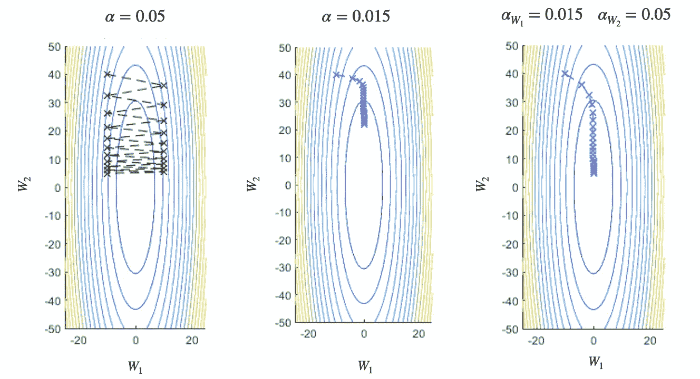
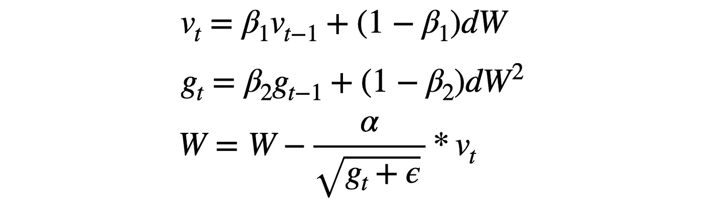
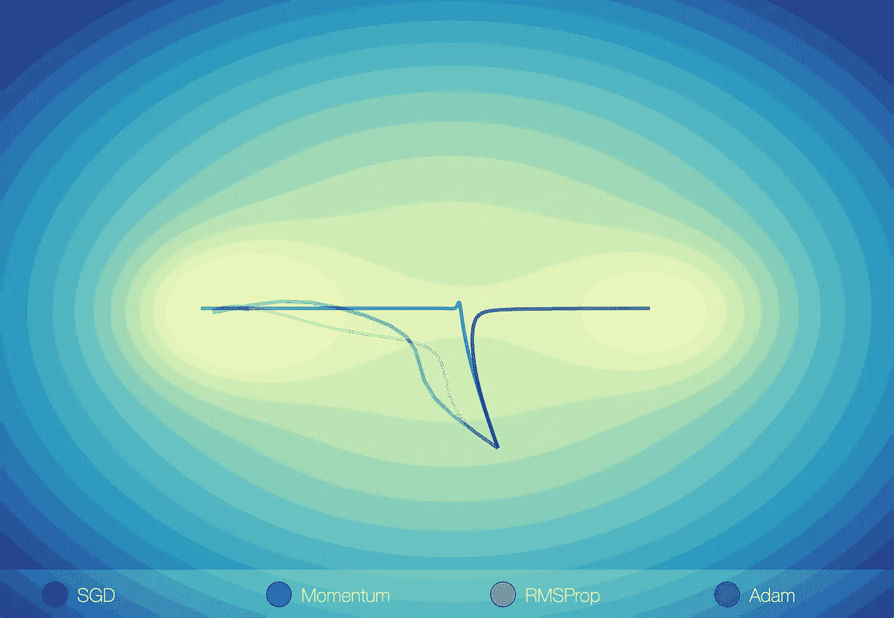

# 机器学习中的优化器

> 原文：<https://medium.com/nerd-for-tech/optimizers-in-machine-learning-f1a9c549f8b4?source=collection_archive---------2----------------------->

优化器是 ML 模型学习过程中的一个关键元素。PyTorch 本身有 13 个优化器，为问题选择一个合适的优化器很有挑战性。

在本教程中，我将介绍五个最流行的优化器，解释它们的优点和局限性，以及它们背后的数学原理。那么，让我们开始吧！

照片由 [Unsplash](https://unsplash.com?utm_source=medium&utm_medium=referral) 上的 [Einar Ingi Sigmundsson](https://unsplash.com/@acerthings?utm_source=medium&utm_medium=referral) 拍摄

# 什么是优化？

ML 模型的最终目标是达到损失函数的最小值。在我们传递输入之后，我们计算误差并相应地更新权重。这就是优化器发挥作用的地方。它定义了如何调整参数以接近最小值。

*所以从本质上来说，优化就是为模型寻找最优参数的过程，从而显著降低误差函数。*

# **香草渐变下降**

α——学习率

在机器学习中，梯度下降有三种不同的变体:

1.  **随机梯度下降(SGD)** —计算每个随机样本的梯度
2.  **小批量梯度下降** —计算随机取样批量的梯度
3.  **批量梯度下降**-计算整个数据集的梯度

正如你可能想到的，更新每个样本的**的权重会使训练变得不稳定和混乱。另一方面，对于像 ImageNet 这样的大型数据集，一次传递整个数据集很慢，甚至是不可能的。**

**Mini-Batch GD** 二者兼而有之，目前是训练深度学习模型的首选算法。主要是因为它利用了 GPU 的能力，使训练更加稳定。

> 如今，**新币**主要指的是小批量梯度下降，所以我们将在博客的其余部分坚持这一约定。

## **优点:**

*   总是收敛
*   易于计算

## **缺点:**

*   慢的
*   容易陷入局部最小值或鞍点
*   对学习速度敏感

SGD 是 50 年代的基础优化算法。它简单明了，易于计算，但是它面临着巨大的挑战，尤其是对于更复杂的模型。

我们知道如果斜率为 0，那么模型**收敛**。虽然在**凸**函数(一个最小值)中是这种情况，但大多数深度学习模型都是**非凸**(多个局部最小值)。在这种情况下，我们可能会堆积在这些点中的一个点上，并且可能永远不会达到全局最小值。

> 令人惊讶的是，在更复杂的深度学习模型中，局部最小值不像鞍点那样经常出现。

在我们使用更好的技术来解决这个问题之前，我将介绍一个概念，我认为这个概念是理解所有其他优化器的关键。

# 指数移动平均线

e —指数平均值，x —新点

如你所见，EMA 平滑了图形，减少了振荡。参数 **β** 定义了新点和加权平均值的重要性。

*为什么是指数级？*

正如你在上面的例子中看到的，权重 **β** 呈指数增长。由于 **β < 1，**旧术语的重要性降低，我们考虑更近的点。

基本上 **EMA** 减少了摆动，创造了平均轨迹。这就是我们想要的优化器！

# 动力

α——学习率

## **优点:**

*   有助于避免鞍点和最小值
*   收敛更快
*   减少振荡

## 缺点:

*   所有参数的学习率相同

*关于动量的流行故事说:*

> SGD 是一个走下坡路的人，缓慢但稳定。动量是一个沉重的下坡球，平稳而快速。

动量利用 **EMA** 的能力来减少改变**方向**的梯度振荡，并在梯度稳定地指向**的地方建立**动量**。它帮助我们“滚动”局部最小值和平台，并继续向全局最小值前进。**

图形灵感来自塞巴斯蒂安·路德·波斯特[2]

随着动力的增加，优化器似乎越来越稳定地向最小值前进。尽管如此，它仍然**在其移动的方向上超过**。这个挑战是由 **AdaGrad** 优化器解决的。

# 阿达格拉德

g-梯度的平方和，ɛ-避免被 0 除的小常数

## **优点:**

*   参数的自适应学习率
*   没有学习率的手动调整

## **缺点:**

*   学习率消失

AdaGrad 是第一个为不同的模型参数引入自适应学习率的算法。让我告诉你为什么它很重要:

自适应学习率对参数的影响[1]

如果学习率对于一个大的梯度来说太高了，我们就会过冲并反弹。如果学习速率太低**，学习就很慢并且可能**永远不会收敛**。**

**AdaGrad 使用**的平方和先前的梯度**来解决这个问题。如果坡度**高**，则学习率**降低**。如果坡度**低**，则**增加**。以这种方式，算法沿着所有的**尺寸**平滑地调整步长的大小。**

> **AdaGrad 主要与**稀疏数据**一起使用，其中不频繁的要素比频繁的要素获得更大的更新。**

**这是一个绝妙的解决方案，但是由于我们**累积**平方梯度，学习率将随着每次迭代**降低**，最终**收缩**。那么学习过程可能会在我们达到收敛之前停止。**

# ****RMSProp****

****

## ****优点:****

*   **学习率不会消失**
*   **每个参数的自适应学习率**

**RMSProp 是 AdaGrad 的升级版，它利用了 mighty **EMA** (再次)。我们**控制**先前信息的数量，而不是仅仅**累积**平方梯度。这样分母就不会变大，学习率也不会消失！**

> **RMSProp 仍然用于强化学习，在某些情况下，它实际上比 Adam 更稳定。[3]**

# **圣经》和《古兰经》传统中）亚当（人类第一人的名字**

****

## ****优点:****

*   **适应性学习率**
*   **动力**

**本质上，Adam 是动量和 RMSProp 的组合。它具有减少振荡、更平滑的路径和自适应学习速率的能力。结合这些能力使其成为最强大的和最适合不同问题的。**

> **好的开始配置是学习率 0.0001，动量 0.9，平方梯度 0.999。**

# **比较**

****

**这张图完美地总结了每种算法的优缺点。**

**纯 **SGD** 在局部最小值中获得股票。**

****动量**向两个方向溢出，但找到了全局最小值的方法。**

****RMSProp** 沿所有维度平滑移动。**

**最后， **Adam** 跑得有点快，但动作稳定，是所有选手中最快的(这一点你必须相信我)。
如果你想玩这些可视化，尝试不同的功能，请访问这个 [**网站**](https://emiliendupont.github.io/2018/01/24/optimization-visualization/) 。**

# **结论**

**在这篇博客中，我们浏览了深度学习中最受欢迎的五个优化器。即使现在大部分都不用了，但分析他们所面临的挑战对于深入理解和欣赏亚当是至关重要的。**

**读完这篇博客后，我希望你能获得不同优化算法背后的直觉，这有助于你进一步探索这个话题。**

**查看我的 [**中**](https://maciejbalawejder.medium.com/) 和[**Github**](https://github.com/maciejbalawejder)**简介如果你想看我的其他项目。****

# ****参考****

****[【1】](https://datascience.stackexchange.com/questions/82240/why-sparse-features-should-have-bigger-learning-rates-associated-and-how-adagra)为什么稀疏特征要有较大的关联学习率？阿达格拉德是如何做到的？****

****[【2】](https://ruder.io/optimizing-gradient-descent/index.html#momentum)梯度下降优化算法概述****