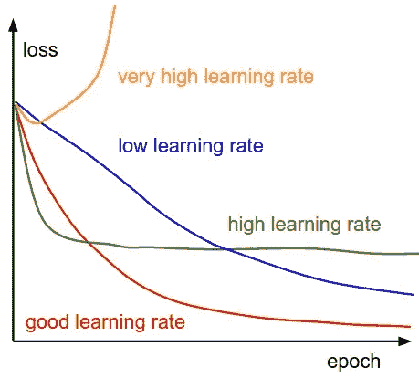

# 神经网络优化器

> 原文：<https://medium.com/nerd-for-tech/optimizers-in-neural-networks-b962a233051e?source=collection_archive---------8----------------------->


尼古拉斯·瑞恩在 [Unsplash](https://unsplash.com/s/photos/slope?utm_source=unsplash&utm_medium=referral&utm_content=creditCopyText) 上的照片

优化器是用于修改属性(如权重和学习率)以最小化损失的方法/算法。

## 基于梯度

**批量梯度下降** —回归分类&

它计算损失函数相对于整个训练数据集的参数的梯度。

```
for i in range(epochs):
    param_gradient = evaluate_gradient(loss_function, data, params)
    params = params - learning_rate * param_gradient
```

> 缓慢的
> 计算繁重的
> 内存密集型

**随机梯度下降**

在 SGD 中，每个训练示例和标签都会发生参数更新。

```
for i in range(epochs):
    np.random.shuffle(data)
    for sample in data:
        params_gradient = evaluate_gradient(loss_function, sample, params)
        params = params - learning_rate * params_gradient
```

> 快速
> 高方差
> 内存高效

**小批量新币**

小批量梯度下降结合了批量和 SGD 的优点。在这种情况下，参数更新发生在 n 个训练样本的每个小批量(32，64…通常是 2 的幂)中。

```
for i in range(epochs):
    np.random.shuffle(data)
    for batch in get_batches(data, batch_size=64):
       params_gradient = evaluate_gradient(loss_function, batch, params)
       params = params - learning_rate * params_gradient
```

> 快速
> 较小方差
> 内存效率高

在上述三个优化器中，我们有一个恒定的学习率。这些学习率也会影响表现。下图总结了不同值的学习率和损失之间的关系。



所以有一些优化器可以动态调整学习速度。让我们讨论这些。

## 基于动量

动量是一种有助于在相关方向加速 SGD 并抑制振荡的方法。

**Adagrad(自适应梯度算法)**

学习率与参数的所有先前梯度的平方和成反比。因此，较大的过去梯度值将导致较低的学习率。而如果过去的梯度和很小，学习率就会很高。

**RMSprop(均方根传播)**

RMSprop 将学习率除以梯度平方的指数衰减平均值。[γ = 0.9，学习率= 0.001]

```
eps , gamma = 1e-8, 0.999for epoch in range(epochs):   

    for batch in get_batches(data, batch_size=64):
        params_gradient = evaluate_gradient(loss_function, batch, params)
        expected_grad = gamma * expected_grad + (1 - gamma) * np.square(params_gradient)
        RMS_grad = np.sqrt(expected_grad + eps)
        params = params -(eta/RMS_grad) * grad
```

**亚当(自适应矩估计)**

为每个网络权重保持一个学习速率，并随着学习的进行而调整。

```
alpha, beta1, beta2, epsilon  = 0.01, 0.9, 0.999, 1e-8
m_t, v_t, t = 0, 0, 0while (1):
 t+=1
 param_gradient = evaluate_gradient(loss_function, data, params)
 m_t = beta1*m_t + (1-beta1)*param_gradient
 v_t = beta2*v_t + (1-beta2)*(param_gradient**2)
 m_cap = m_t/(1-(beta1**t))
 v_cap = v_t/(1-(beta2**t))       
 params = params - (alpha*m_cap)/(math.sqrt(v_cap)+epsilon)
```

> 计算量小内存效率高超级参数几乎不需要调整。