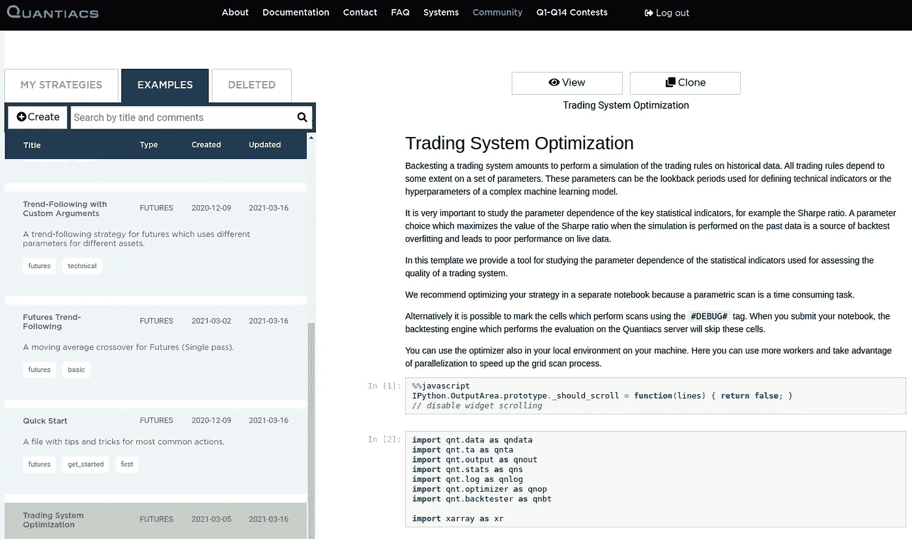
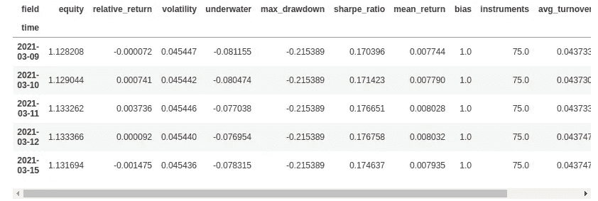
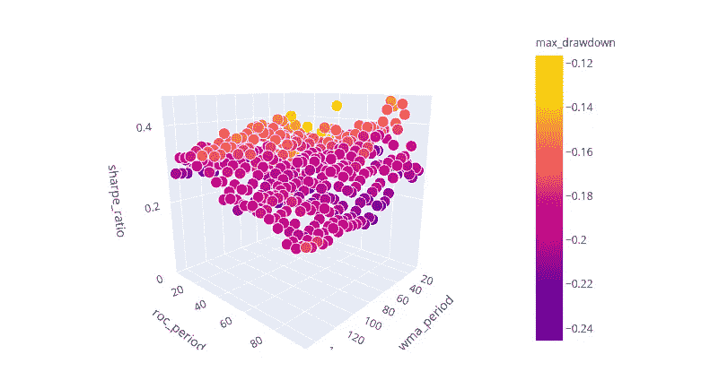
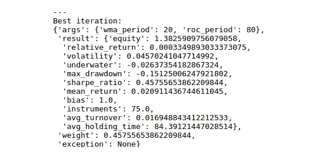

# 使用 Quantiacs 优化和监控交易系统

> 原文：<https://medium.com/nerd-for-tech/optimizing-and-monitoring-a-trading-system-with-quantiacs-5ba099a16609?source=collection_archive---------8----------------------->

*在本文中，我们描述了我们为*[*quanti ACS*](http://www.quantiacs.com)*Python 工具箱发布的新工具的实现:一个用于测试交易系统健壮性的快速优化器。*

正如 Donald Knuth 指出的，“过早优化是万恶之源。”这是软件开发人员的一句名言，在交易系统开发中也是如此。


杰斐逊·桑托斯在 [Unsplash](https://unsplash.com/s/photos/software-development?utm_source=unsplash&utm_medium=referral&utm_content=creditCopyText) 上拍摄的照片

写一个算法，一个简单的趋势跟踪策略，或者一个更精确的基于机器学习的系统，然后搜索最优参数，通常是夏普比率，通常是 T21。

由于最佳参数是最大化过去选择的得分函数，并且金融数据非常嘈杂，参数优化的通常结果是**过度拟合**:交易系统对过去的数据工作得如此之好，以至于它对预测未来的市场走势变得无用。

夸大交易系统模拟性能的问题不仅限于回溯测试优化:例如，开发人员倾向于只关注和报告他们尝试的所有模型的积极结果，这个问题被称为选择偏差。关于这些问题的详细描述，我们可以参考 Marcos Lopez de Prado2014 年的文章。

然而，优化程序依赖于一个基本的功能，这个功能可以用来测试交易系统的[健壮性](https://en.wikipedia.org/wiki/Robust_statistics):对系统可能的参数组合进行**网格扫描。扫描的结果可用于可视化和测试交易系统的性能对参数选择的敏感程度。一个**健壮的**系统对于大范围的独立参数将具有良好的夏普比率。**

# 基于 Quantiacs 的交易系统优化

您可以在您客户的发展领域的示例部分找到我们的优化器:



要运行该示例，只需单击克隆按钮，并在您最喜欢的环境中工作，Jupyter 笔记本或 JupyterLab。或者，您可以[在本地下载 Quantiacs 工具箱](https://quantiacs.com/documentation/en/user_guide/local_development.html)，并在您自己的机器上利用**并行化**。

让我们分析一下代码。首先，我们导入所需的库:

```
**import** qnt.data **as** qndata
**import** qnt.ta **as** qnta
**import** qnt.output **as** qnout
**import** qnt.stats **as** qns
**import** qnt.log **as** qnlog
**import** qnt.optimizer **as** qnop
**import** qnt.backtester **as** qnbt

**import** xarray **as** xr
```

除了在我们的 [GitHub 页面](https://github.com/Quantiacs)上免费提供的 Quantiacs 库，我们还导入了 [xarray](http://xarray.pydata.org/en/stable/) 来快速处理多维数据结构。

接下来，我们基于两个参数定义一个简单的交易规则。只有当线性加权移动平均线在过去`wma_period`个交易日(在本例中为 20 个交易日)的最后`roc_period`个交易日(在本例中为 10 个交易日)的变化率为正值时，该策略才会做多:

```
**def** single_pass_strategy(data, wma_period**=**20, roc_period**=**10):
    wma **=** qnta**.**lwma(data**.**sel(field**=**'close'), wma_period)
    sroc **=** qnta**.**roc(wma, roc_period)
    weights **=** xr**.**where(sroc **>** 0, 1, 0)
    weights **=** weights **/** len(data**.**asset)
    **with** qnlog**.**Settings(info**=False**, err**=False**):
        weights **=** qnout**.**clean(weights, data, debug**=False**)
    **return** weights
```

该策略返回每天的分配权重(要投资的资本部分)。我们使用选择的参数来检查该策略的性能:

```
data **=** qndata**.**futures**.**load_data(min_date**=**'2004-01-01')
single_pass_output **=** single_pass_strategy(data)
single_pass_stat **=** qns**.**calc_stat(data,\
    single_pass_output**.**sel(time**=**slice('2006-01-01', **None**)))
display(single_pass_stat**.**to_pandas()**.**tail())
```

该代码在表格中返回自样本期开始以来的相关统计指标值，包括夏普比率:



接下来，我们运行**优化代码**，它在预定义的参数值范围内执行扫描:用户可以为每个参数选择起始值、最终值和步长:

```
data **=** qndata**.**futures**.**load_data(min_date**=**'2004-01-01')

result **=** qnop**.**optimize_strategy(
    data,
    single_pass_strategy,
    qnop**.**full_range_args_generator(
        wma_period**=**range(10, 150, 5), *# min, max, step*
        roc_period**=**range(5, 100, 5)   *# min, max, step*
    ),
    workers**=**1 *# you can set more workers on your PC*
)

qnop**.**build_plot(result)

print("---")
print("Best iteration:")
display(result['best_iteration'])
```

代码返回一个**交互式**图，用户可以在其中分析关键统计指标对参数的依赖性。在该图中，我们在 x 和 y 轴上显示两个独立的参数，在 z 轴上显示夏普比率值，并根据最大压降使用不同的颜色。



作为参考，我们显示了使夏普比率最大化的参数的最佳值(小心过度拟合！):



一个稳健的交易系统将具有夏普比率对参数值的平滑依赖性，理想地，对于广泛的参数选择，具有大于 1 的良好值。对于独立参数的特定选择，过度拟合的系统通常会显示夏普比率峰值。

你有问题或建议吗？张贴在我们的 [**论坛**](https://quantiacs.com/community/) 或写信给我们【info@quantiacs.com】[！](mailto:info@quantiacs.com)

您可以在 [Quantiacs](http://www.quantiacs.com) 上尝试优化器。代码可以在您帐户的**开发**区域的**示例**部分找到。或者你可以**从我们的 [GitHub 库](https://github.com/quantiacs/strategy-futures-ta-global-optimizer/blob/master/strategy.ipynb)下载完整代码**。