# 在 Unity 中使用类继承优化代码

> 原文：<https://medium.com/nerd-for-tech/optimizing-code-using-class-inheritance-in-unity-3c4eca7c617e?source=collection_archive---------8----------------------->

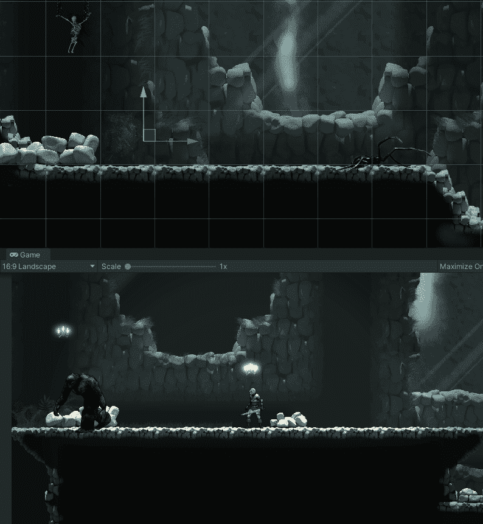

在游戏中，我创造了多个敌人，他们有自己的脚本，本质上做着同样的事情。我决定这将是一个使用类继承的好时机，这样如果我决定添加更多的敌人，我就不必一遍又一遍地输入相同的代码。

首先，我必须获得对敌人类中的 animator 和 sprite 渲染器组件的引用来控制动画。我创建了引用并在一个虚拟方法中初始化它们。

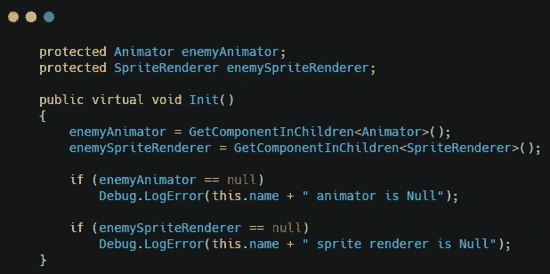

现在创建一个虚拟方法来保存敌人的移动代码，并将代码复制到虚拟方法中。

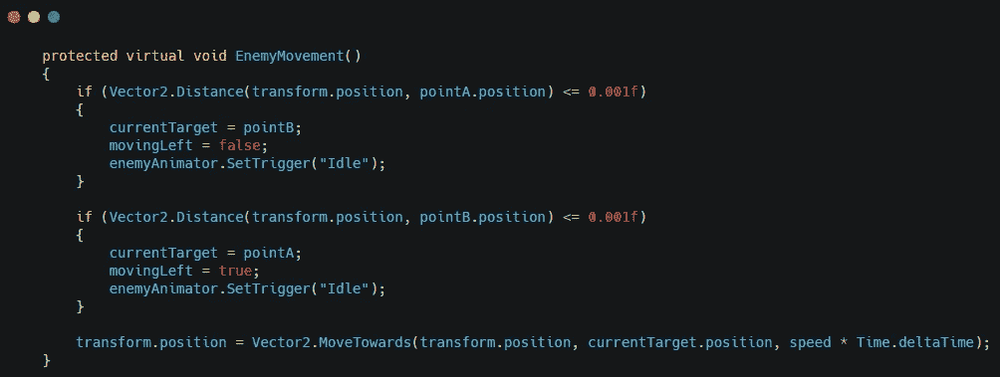

注意:将 animator 引用替换为敌人类中的那个

用翻转精灵的方法做同样的事情。

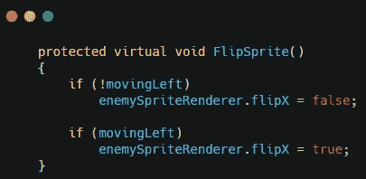

在敌人类中设置更新方法，使其与在单个敌人脚本中的方法相同，只是替换了 animator 引用。

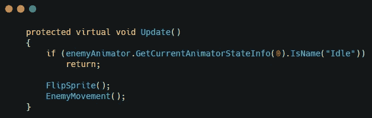

在敌人类中创建一个将调用 init 方法的 start 方法。

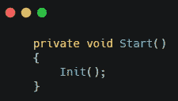

现在你可以删除单个敌人脚本中的所有代码。

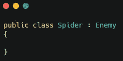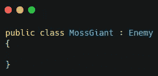

当这些类继承了敌人的类时，它们现在不需要任何代码就可以工作了。

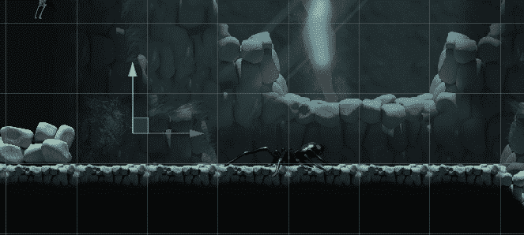

这也允许你保留原来的功能，并为每个敌人添加特定的代码。

如果你想增加苔藓巨人的高度，创建高度变量。然后您可以覆盖 init 方法并添加代码。

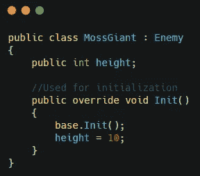

注:基数。init()；保留基本功能

现在身高变量只会出现在苔藓巨人身上。

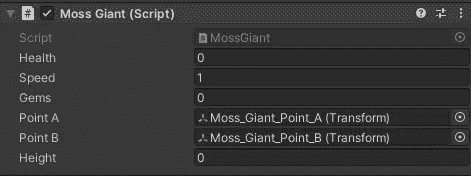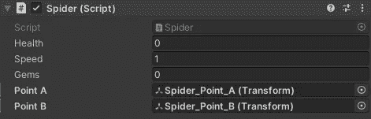

当我点击 play 时，它会将高度变量设置为 10。

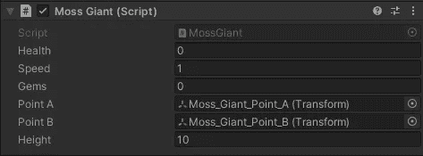