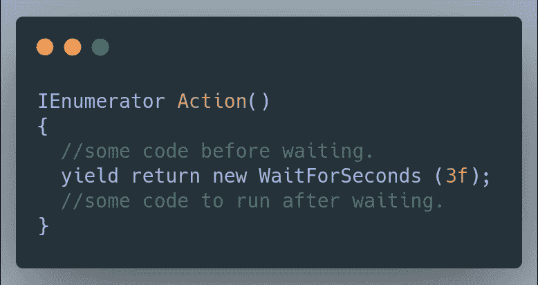
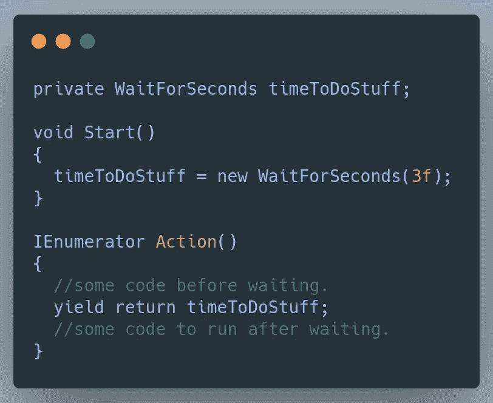

# 优化 Unity 中的协程

> 原文：<https://medium.com/nerd-for-tech/optimizing-coroutines-in-unity-99a90d9ccf6c?source=collection_archive---------4----------------------->

协程对于任何特定时间的函数都非常有用，但是当使用 yield return new 函数时，会使用大量垃圾分配资源，因为每次使用 new 关键字时，Unity 都必须就地构建新的东西。

这就是缓存 WaitForSeconds 的用武之地。可以把缓存 WaitForSeconds 想象成一个 Hot-N-Ready WaitForSeconds 例程，只是等待任何人来获取和使用它！

因为 WaitForSeconds 已经建立并可用，所以当协程运行时，Unity 不需要执行任何额外的步骤，也不会降低游戏速度！

这里的关键要点是优化代码的一个重要概念是缓存数据！希望有帮助！