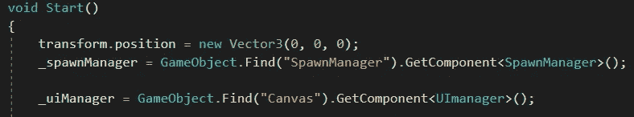

# 优化 GetComponent()

> 原文：<https://medium.com/nerd-for-tech/optimizing-getcomponent-1674e25c8c7c?source=collection_archive---------21----------------------->

GetComponent 是一个非常密集的过程，如果我们不注意使用它的频率，它会淹没我们的游戏。保持代码整洁高效的一个方法是尽可能少地使用 GetComponent。

使用这个命令改变*的位置*会有很大的不同。

例如，在我制作的 2D 射击游戏中，到目前为止每当我使用 GetComponent 时，我都在我需要的方法中为它编写代码。但是，这样做的问题是，如果我在另一个方法中需要它，我将需要再次使用该命令，这将花费更多的时间和精力。

简单的解决方法是在 start 方法中使用全局命令，在这里我们需要的组件被获取一次，并在我们的其余任务中访问它们。

总是考虑确保我们的代码做尽可能少的工作，以保持我们的代码干净和优化。