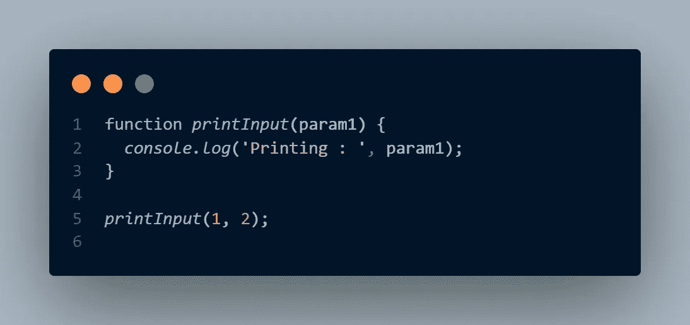
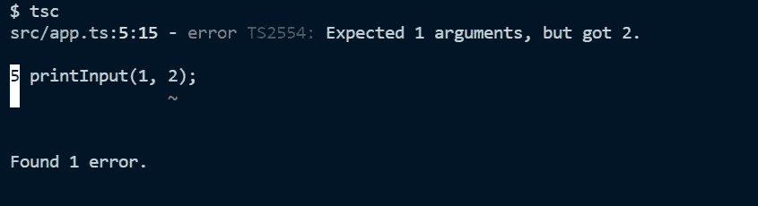
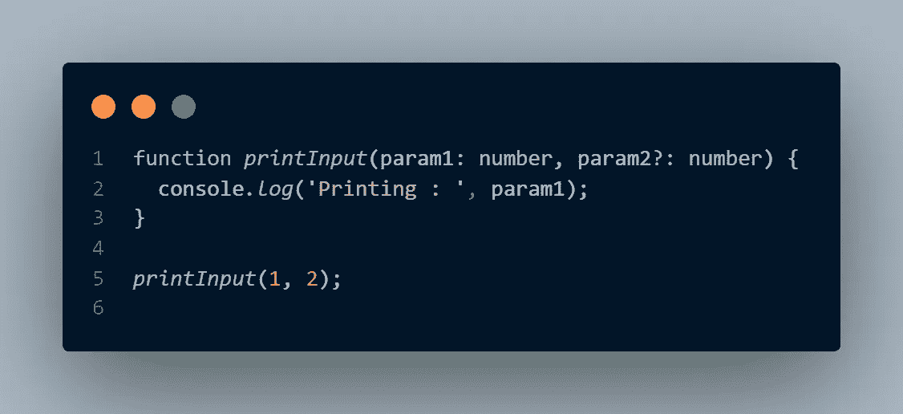
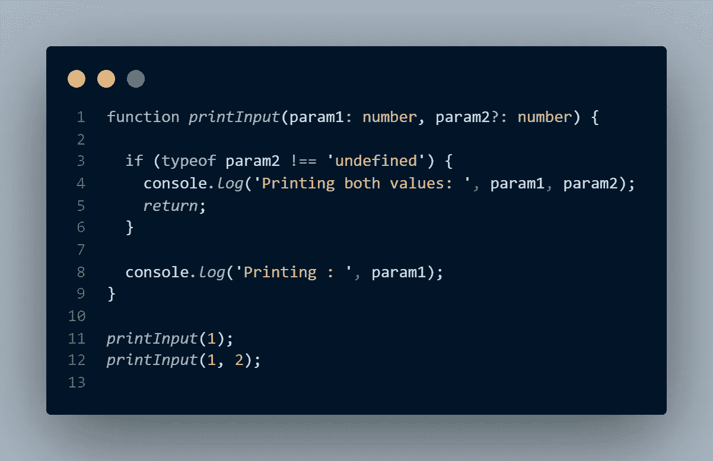
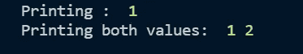
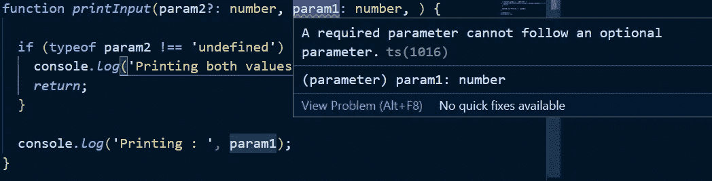

# TypeScript 中的可选参数

> 原文：<https://medium.com/nerd-for-tech/optional-parameter-in-typescript-2d42de4fc1f3?source=collection_archive---------6----------------------->

以下代码的输出会是什么？

它会抛出一个错误，还是会执行？

它将执行，我们将给出输出- **Printing: 1**
因为，

> 在 JavaScript 中，您可以调用带有任意数量参数的函数。

正如我们所知，TypeScript 为 JS 带来了编译时类型检查。

如果我们将语言更改为 TypeScript，然后尝试编译该文件，我们将得到以下错误:

那么在 TS 中，如果您希望一个函数主要使用一个参数来调用，但是它也应该能够接受第二个参数，那该怎么办呢？

输入可选参数。

**可选参数**允许我们将输入标记为可选的，这样即使函数在没有传递这些值的情况下被调用，它仍然会执行。

要将参数标记为可选，请在参数名称后添加一个`?`。

所以上面的函数变成了:

现在编译成功了。但是我们仍然没有在代码中使用可选参数。为此，我们必须检查可选参数是否有任何值。

为此，我们可以使用`typeof`操作符。如果`typeof`运算符返回`‘undefined’`(字符串未定义)，则表示可选值为空。所以我们的代码变成了:

现在，当我们执行代码时，我们将得到如下预期的输出:

最后，可选参数应该在必需参数之后声明。因此，在我们的示例中，如果我们将 param2 作为函数的第一个参数，那么我们将得到以下错误:

如果你觉得这篇文章很有帮助，请鼓掌并分享给你的朋友。如果你有任何建议/意见，请告诉我。请务必关注我，以免错过任何文章。