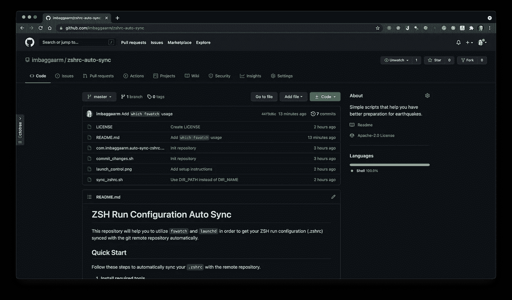
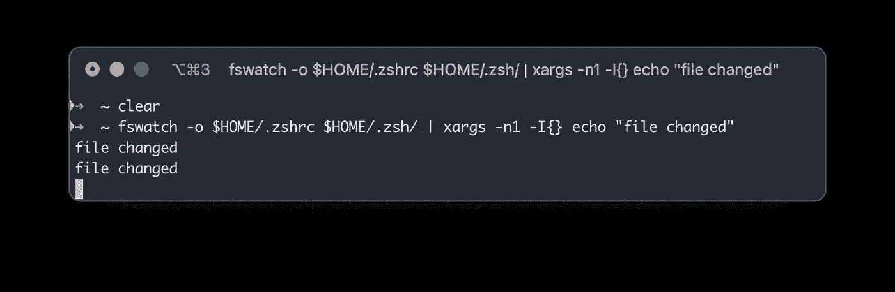
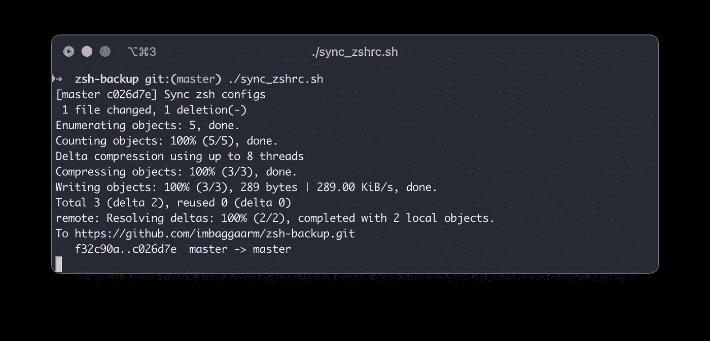
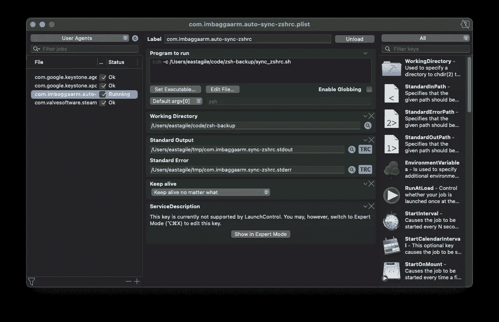
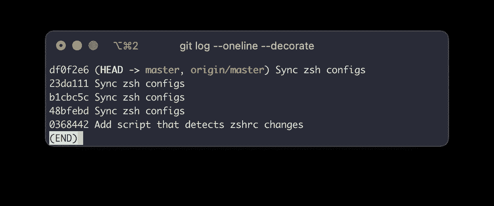

# 组织和自动备份您的。zshrc 文件到 Github

> 原文：<https://medium.com/nerd-for-tech/organize-and-auto-back-up-your-zshrc-files-to-github-364a262b3227?source=collection_archive---------2----------------------->



github.com/imbaggaarm/zshrc-auto-sync

这是一个非常好的周日晚上，当我试图安装 Flutter SDK 来开始一个新的项目时。我需要将 Flutter 二进制文件的路径添加到 **$PATH** 中，而不是打开`.zshrc`文件并添加下面一行:

```
export PATH**=**"$PATH:`pwd`/flutter/bin"
```

我用了这个:

```
echo 'export PATH="$PATH:$HOME/development/flutter/bin"' > ~/.zshrc
```

你知道我的指挥有什么问题吗？如果没有，请备份文件，自己试试:)。

或者简单地说，你可以继续阅读我的文章😄。

事情是这样的。我应该在上面的命令中使用`>>`而不是`>`。因为如果你使用`>>`，它会把你的文本追加到文件的末尾，否则，用`>`，它会覆盖整个文件。我以前多次使用过这个命令，是的，它比打开文件并添加新行要快，我可能节省了 3 秒钟，但最终花了 3 个小时来修复它。

运行完那个命令后，像往常一样，我使用`cat ~/.zshrc`来查看`.zshrc`的内容，我得到了这个:

```
export PATH="$PATH:$HOME/development/flutter/bin"
```

我又试着用了一次`cat ~/.zshrc`，打开了`.zshrc`文件，看看有没有什么不同，但是当我回头看我的 echo 命令的时候，你知道，我的脸就是这样的😐。我相信你能理解我当时的感受。因为如果你是一个软件工程师，你之前肯定至少犯过一次这样的错误，不小心删除了一些配置文件，甚至更糟糕的是，删除了整个生产数据库。

我开始在谷歌上寻找任何恢复我的`.zshrc`的方法，并且尝试了一些我找到的建议，但是没有一个对我有效。然后，我开始在我的本地机器中搜索，看看我是否有备份，幸运的是，我找到了一个，文件的最后修改日期是 2021 年 5 月 26 日，但这就是我所需要的。

我也很幸运，因为我没有在`~/.zshrc`中存储我所有的配置。我的机器中有一个`.zsh`目录，其结构如下:

```
.
├── aliases.zsh
├── cli.zsh
├── fp_kube.zsh
├── pablo.zsh
├── pandora.zsh
```

而在`~/.zshrc`中，我只需要加上这一行:

```
for config (~/.zsh/*.zsh) source $config
```

有了这个配置，我可以很容易地组织我的环境变量，并且我的`~/.zshrc`文件不会在我需要添加更多配置时变得一团糟。请记住，不要把所有的鸡蛋放在一个篮子里。所以基本上，我的`~/.zshrc`文件只包含`oh-my-zsh` setup、$PATH 和一些通用的东西，但是丢失它仍然要花费我很多时间。

为了防止将来再次发生这种情况，我决定备份我的。云服务的 zsh 配置。但是我也不想每次修改的时候都手动上传。我需要它与远程存储库自动同步。最后我写了自己的解决方案，要求如下:

*   云服务有我可以用来上传文件的 CLI = > Git 是最好的选择。
*   用 Mac 自动检测`~/.zshrc`和`~/.zsh/` = >的变化，我发现 [fswatch](https://github.com/emcrisostomo/fswatch) 是最合适的解决方案。
*   检测更改的脚本需要在重启机器后自动在后台运行=> [launchd](https://support.apple.com/en-vn/guide/terminal/apdc6c1077b-5d5d-4d35-9c19-60f2397b2369/mac) 。

在列出所有需求并了解我需要使用的所有工具和服务后，我开始开发我的解决方案，我将它分解成更小的任务:

1.  在本地机器和 Github 中创建一个 git 存储库。
2.  写一个可以检测到`~/.zshrc`、`~/.zsh/`变化的脚本。我把它命名为`sync-zshrc.sh`
3.  编写一个脚本，可以将修改后的`~/.zshrc`和`~/.zsh/`复制到本地存储库，然后提交，将更改推送到远程存储库。我把它命名为`commit-changes.sh`
4.  当有新变化时，修改`sync-zshrc.sh`以执行`commit-changes.sh`。
5.  使用`launchd`使`sync-zshrc.sh`在后台模式下运行。

仅此而已。没什么大不了的，开始实施吧。

…但是，如果你太懒或者没有足够的时间来读完这篇文章，我发布了一个资源库，可以帮助你更容易地做到这一点，自述文件中有一个简短的说明，只需不到 5 分钟即可完成。

**Github 资源库:**[github.com/imbaggaarm/zshrc-auto-sync](https://github.com/imbaggaarm/zshrc-auto-sync)

# 履行

## 创建 git 存储库

我将我的 ZSH 运行配置的所有脚本和备份文件放在以下路径的目录中:`/Users/eastagile/code/zsh-backup`，因此如果您在任何文件中看到此文本，请用您自己的值替换它。

首先，创建一个新目录并导航到它:

```
# Use this if you haven't had the `code` directory yet
mkdir ~/code# Then use this to create a new directory inside `code` directory
mkdir ~/code/zsh-backup# Navigate to it
cd ~/code/zsh-backup
```

然后，让我们初始化 git 存储库，您可以使用 [Github CLI](https://github.com/cli/cli) 在命令行上创建一个远程存储库，请记住将 repo 的可见性设置为 **Private。**

```
git init
gh repo create
```

## 写一个脚本来检测。zshrc 变化

为了检测文件变化，我们将使用前面提到的 [fswatch](https://github.com/emcrisostomo/fswatch) 。

你可以通过自制软件安装`fswatch`:

```
brew install fswatch
```

然后，让我们试试`fswatch`是否能检测到变化，在您的终端上键入以下命令:

```
fswatch -o $HOME/.zshrc $HOME/.zsh/ | xargs -n1 -I{} echo "file changed"
```

基本上，每当你改变`.zshrc`或`.zsh/`文件夹时，这个脚本会在你的终端上打印“文件已改变”。



在验证这个脚本如预期的那样工作之后，让我们在`zsh-backup`文件夹中创建一个名为`sync_zshrc.sh`的新文件，并将上面的脚本复制到这个新文件中。

```
touch sync_zshrc.sh
```

以下是该文件的内容:

```
#!/bin/zshfswatch -o $HOME/.zshrc $HOME/.zsh/ | xargs -n1 -I{} echo "file changed"
```

使脚本可执行:

```
chmod +x sync_zshrc.sh
```

记得通过修改你的`.zshrc`再次测试这个脚本，请注意这个脚本稍后会被修改，这不是它的最终版本。

让我们将第一次提交推送到远程存储库，然后进入下一部分:

```
git add .
git commit -m "Add script that detects zshrc changes"
git push
```

故障排除:

1.  请注意 **fswatch** 的标志参数，例如`-o`不是`-0`、`-n1`不是`-n 1`、`-I{}`不是`-I {}`。
2.  如果您得到此错误:`zsh: command not found: fswatch`，请检查 **fswatch** 是否安装正确，如果需要，将其添加到 **$PATH** 中。

## 编写一个脚本，将新的更改推送到远程存储库

这个脚本基本上只是将`.zshrc`和`zsh/`的内容复制到`zsh-backup`文件夹中，然后将它们推送到远程存储库。我把它命名为`commit_changes.sh`

以下是脚本:

```
#!/bin/zshcd `dirname "$0"`cp $HOME/.zshrc .
cp -R $HOME/.zsh .git add --all
git commit -m "Sync zsh configs"
git push origin
```

我需要使用`cd `dirname "$0"``的原因是我们可能会在`zsh-backup`文件夹之外执行脚本，因此我们可能会将文件复制到错误的位置，使用`dirname`将确保您将它们复制到与`commit_changes.sh`脚本相同的目录。

记住要使这个脚本可执行:

```
chmod +x commit_changes.sh
```

请运行脚本来验证其功能:)。

## 连接脚本

现在，我们已经分离出可以正常工作的脚本。下一步是连接它们。

让我们修改`sync_zshrc.sh`以在有新变化时执行`commit_changes.sh`。

```
#!/bin/zshDIR_PATH=`dirname "$0"`fswatch -o $HOME/.zshrc $HOME/.zsh/ | xargs -n1 zsh $DIR_PATH/commit_changes.sh
```

因为我将两个脚本放在同一个目录中，所以我使用`dirname "$0"`来获取包含`commit_changes.sh`的目录的绝对路径。如果您将它们存储在不同的位置，您必须替换路径。

我还删除了`fswatch`脚本中的`-I{}`参数，因为它已经没有必要了。

请再次使用`./sync_zshrc.sh`启动脚本，更改`.zshrc`文件的内容，并检查远程存储库，查看是否有新的提交。



## 让脚本在 macOS 中作为服务运行

我们必须让脚本在后台模式下运行，并且它们必须在我们重启机器时自动启动。为了在 macOS 中实现这一点，我们必须使用 [launchd](https://support.apple.com/en-vn/guide/terminal/apdc6c1077b-5d5d-4d35-9c19-60f2397b2369/mac) 。

您可以阅读[这篇文章](/swlh/how-to-use-launchd-to-run-services-in-macos-b972ed1e352)来了解更多关于 launchd 以及如何使用它的信息，但总的来说，因为我们必须使用 git 命令，这些命令需要凭据才能推送到远程存储库，而 ZSH 运行配置是特定于每个用户的，所以我们应该使用用户代理来运行登录用户行为上的服务。

Launchd 使用属性列表(**)。plist** )文件，这对于使用 macOS 定义服务/作业的开发人员来说是非常熟悉的(您可以随意调用它:)。所以让我们在我们的`zsh-backup`目录中创建它。

```
touch com.**<your-username>**.auto-sync-zshrc.plist
```

你必须用当前用户名替换`your-username`。实际上，你可以为文件使用任何名称，但是遵循苹果的命名惯例更好，因为我们是工程师，遵循惯例是我们工作的一部分，对吗？😅

下面是我**的内容。plist** 文件:

```
<?xml version="1.0" encoding="UTF-8"?>
<!DOCTYPE plist PUBLIC "-//Apple//DTD PLIST 1.0//EN" "[http://www.apple.com/DTDs/PropertyList-1.0.dtd](http://www.apple.com/DTDs/PropertyList-1.0.dtd)">
<plist version="1.0">
    <dict>
        <key>Label</key>
        <string>**com.imbaggaarm.auto-sync-zshrc**</string>
        <key>ServiceDescription</key>
        <string>Auto sync zsh configs to git repository</string>
        <key>ProgramArguments</key>
        <array>
            <string>zsh</string>
            <string>-c</string>
            <string>**/Users/eastagile/code/zsh-backup/sync_zshrc.sh**</string>
        </array>
        <key>StandardOutPath</key>
        <string>**/Users/eastagile/tmp/com.imbaggaarm.sync-zshrc.stdout**</string>
        <key>StandardErrorPath</key>
        <string>**/Users/eastagile/tmp/com.imbaggaarm.sync-zshrc.stderr**</string>
        <key>WorkingDirectory</key>
        <string>**/Users/eastagile/code/zsh-backup**</string>
        <key>KeepAlive</key>
        <true/>
     </dict>
  </plist>
```

您可以看到，我使用了 **KeepAlive** 选项，因为我希望我们的脚本即使在结束或崩溃时也能继续运行。

你必须在你的机器中用正确的值替换粗体文本。对于**standardeoutpath**和**standardeerrorpath，** Launchd 会将日志写入这些文件，稍后您可以在那里查看`error`日志和`info`日志。你可以使用任何你想要的位置，**但是请记住**来确保登录的用户**有足够的权限**来写那个位置。

有了文件后，你必须把它复制到`~/Library/LaunchAgents`，这个目录是我们存储所有服务配置的地方，这些服务将在登录用户的行为下运行。

```
cp com.**<your-username>**.auto-sync-zshrc.plist ~/Library/LaunchAgents
```

让我们导航到`~/Library/LaunchAgents`，它现在应该包含我们的配置文件。

我们使用`launchctl load`命令来启动我们的服务，请导航到`~/Library/LaunchAgents`并运行:

```
launchctl load com.**<your-username>**.auto-sync-zshrc.plist
```

如果得到`Load failed: 5: Input/output error`，请检查**。plist** 文件格式正确，并且您位于正确的目录中。

调用这个之后，您应该检查位于 **StandardErrorPath** 的文件，看看是否有错误。您也可以使用`launchctl list`来检查您的服务状态。

```
launchctl list | grep auto-sync-zshrc
```

如果状态是`0`并且 PID 值不为空，那么恭喜你，你的脚本现在运行正常了。但是如果你看到其他值，或者甚至没有结果，很可能是你的脚本有问题。

对于我们的脚本，您可能会遇到这个错误: `command not found: fswatch`。请用这个来查看错误:

```
cat <your-path>/com.<your-username>.sync-zshrc.stderr
```

如果你得到这个但是你已经安装了`launchctl`，你必须修改`sync_zshrc.sh`文件:

```
#!/bin/zshDIR_PATH=`dirname "$0"`**/opt/homebrew/bin/fswatch** -o $HOME/.zshrc $HOME/.zsh/ | xargs -n1 zsh $DIR_PATH/commit_changes.sh
```

我把`fswatch` 改成了`/opt/homebrew/bin/fswatch` ，因为**launch**找不到二进制，也许还有其他的解决方案，但这是我拥有的最简单的解决方案。你**要用你机器里的值替换**这个路径，你可以用`which fswatch`得到它。

修改并保存属性列表后。您应该使用`launchctl unload`来停止服务:

```
launchctl unload com.**<your-username>**.auto-sync-zshrc.plist
```

然后重新启动它:

```
launchctl load com.**<your-username>**.auto-sync-zshrc.plist
```

有一个 GUI 应用程序用于检查 LaunchControl 的 **launchd** 服务。要安装它，你可以使用家酿桶:

```
brew --cask install launchcontrol
```

以下是该应用程序的截图:



如果你遇到任何错误，我建议你使用这个应用程序。

是的，如果你看到所有的字段都是绿色的，就像我的截图一样，那么你的脚本工作正常(记得选择 LaunchControl 应用程序左上角按钮中的 **UserAgents** )。

您应该更改您的`~/.zshrc`或`~/.zsh`并检查您的远程存储库，所有配置都已同步。

毕竟，你的`zsh-backup`应该有这样的结构:

```
➜  zsh-backup git:(master) tree -a -L 1
.
├── .git
├── .zsh
├── .zshrc
├── com.**<your-username>**.auto-sync-zshrc.plist
├── commit_changes.sh
└── sync_zshrc.sh
```

你可能需要用自制软件安装`tree`:`brew install tree`。

您的提交历史如下所示:



# 结局

正如我上面提到的，我在 Github 上传了脚本和快速入门指南，你可以看看:[https://github.com/imbaggaarm/zshrc-auto-sync](https://github.com/imbaggaarm/zshrc-auto-sync)

我希望我的帖子能帮助你组织和备份你的 ZSH 运行配置，这样你就不用处理我遇到的情况了。您也可以使用相同的方法来同步您的 Vim 配置。我认为这将与`bash`一起正常工作，你可能只需要改变文件名，但它可能需要更多的努力才能在其他操作系统上运行，但总的来说，方法是相同的。

对于**令牌、凭证、秘密**，你应该把它们都放在其他文件中，比如`secrets.zsh`(记得把`source secrets.sh`添加到`.zshrc`中)，并且**不要在`commit_changes.sh`脚本中复制它们**或者简单地把那个文件添加到`.gitignore`中。Github 库是私有的，但是我们可能会不小心发布它，或者万一 Github 被黑客攻击，我们的凭证不会被泄露。稍后我将更新脚本，用 Django 处理其秘密变量的相同方式通过`*`屏蔽秘密。

最后但同样重要的是，如果我将我所有的配置存储在`~/.zsrhc`中，情况可能会更糟，我真的很幸运，但如果我没有仔细组织我的 ZSH 运行配置，这种运气就不会出现。我从公司的一项倡议中受到启发，我们试图通过让能自动运行的东西自动运行来减少工作量，等等。

希望我以后能找到更多有价值的东西来分享，各位，请记住，**管理你的机器就像管理你的代码**一样。