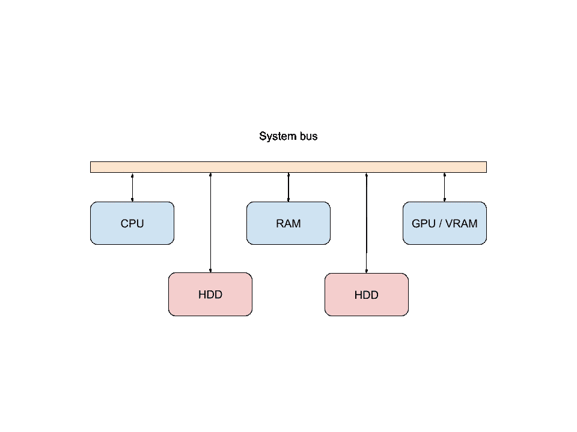
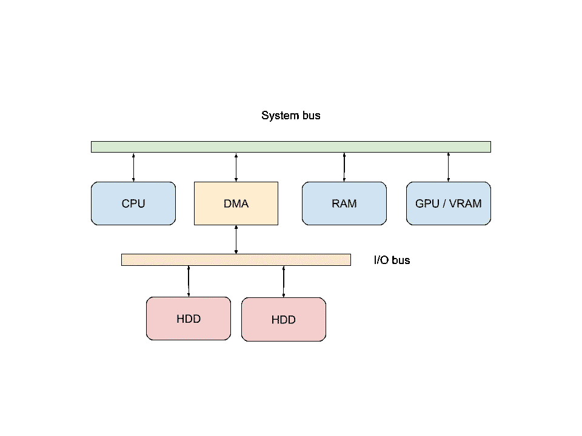
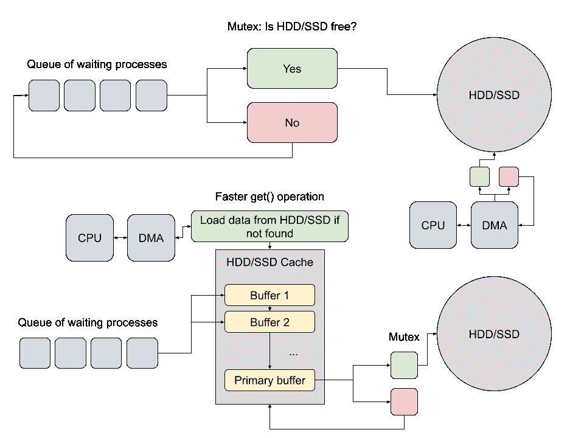

# 操作系统设计:I/O 优化

> 原文：<https://medium.com/nerd-for-tech/os-design-i-o-optimizations-6c0e584372be?source=collection_archive---------10----------------------->

在这篇文章中，我将告诉你操作系统如何管理 I/O 设备。我们知道 I/O 设备比 CPU 或 RAM 慢，因此操作系统开发人员想出了添加特殊调度程序、缓存和缓冲区的主意。

Windows、Linux 和 Mac OS

**在阅读这篇文章之前我强烈推荐阅读** [**这篇文章**](https://dmfrpro.medium.com/os-design-threads-and-dispatcher-6de6f6ef4bc3) **关于进程、线程和调度器。**

## DMA 和 I/O 总线

我们都知道，CPU、RAM、GPU 是连在一条系统总线上的。在硬件上，总线是 PCI-Express 总线，可以在很短的时间内传输千兆字节的数据。

请看下图:

系统总线和连接的设备

但是这种连接方式在人们开发 **DMA** 的时候被修改了。

**DMA(直接内存访问)是一种共享数据模式，当 I/O 设备没有连接到 CPU 时。**输入/输出设备连接到独立的**输入/输出总线(SATA)。这项技术提高了数据传输的速度，因为现在 CPU 不处理 I/O 设备的数据。**

请看下图:

具有 I/O 总线的支持 DMA 的系统

## 缓存和缓冲

**硬盘缓存(缓冲存储器)是一种特殊的快速存储器，用于存储进程和 CPU 最常用的数据。**该内存芯片位于每个硬盘/固态硬盘上。

想象一下硬盘没有高速缓存。我们知道 HDD 不支持并行读写，当很多进程调用 HDD 写东西的时候，会有一个调用队列。并且进程必须**等待**直到 HDD 不执行队列前面的操作，我们失去性能。

让我们看看下图:

无缓存硬盘与带缓存和多缓冲的硬盘

与没有高速缓存的 HDD/SSD 相比，高速缓存可提供更快的读取操作。

## 调度器及其算法

我们知道硬盘有一个磁头，可以将数据写入磁盘或从磁盘读取数据。这些物理操作太慢，开发人员想出了有趣的解决方案——调度器。

**调度程序是一个管理输入输出操作的程序。**例如，在上图中，调度程序响应将数据从硬盘加载到高速缓存，反之亦然——从高速缓存加载到硬盘。

让我们来看看默认情况:我们有一千个点随机分布在磁盘上，我们需要使用 HDD 的磁头在最短的时间内读取所有这些点。

**有三种类型的调度:**

1.  **短期调度** —从硬盘读取/写入数据，并将其发送到线程
2.  **中期调度** —调用将数据从 HDD 交换到 RAM
3.  **长期调度** —将线程添加到队列中

**读写点数的算法有 3 组:**

1.  **FCFS 和 FCLS** —以 FIFO(先进先出)或 LIFO(后进先出)顺序处理呼叫。这些算法不是很有效，有时我们可能会资源匮乏
2.  **SSTF 和 SJF**——以最短的周转时间处理电话
3.  **扫描查看** —处理从磁盘开始到磁盘结束的调用，反之亦然

现代调度程序使用的算法包括 SSTF/SJF 和扫描/观察基本算法的优点。