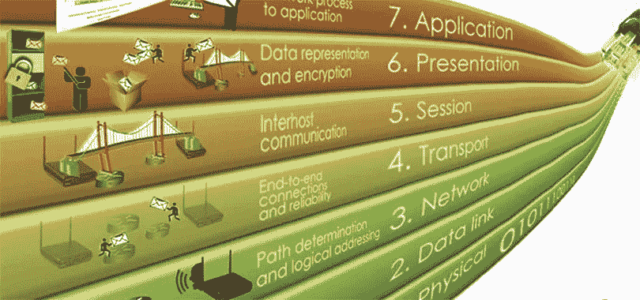
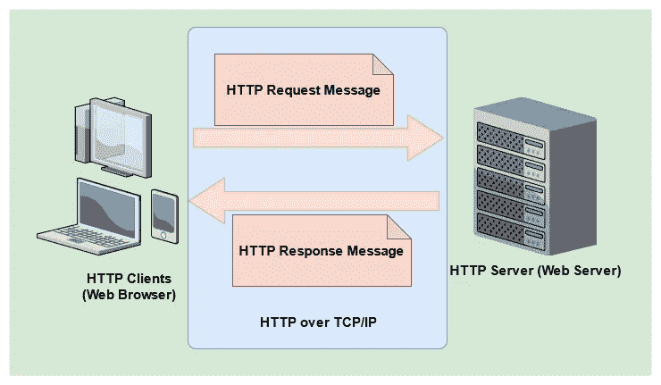
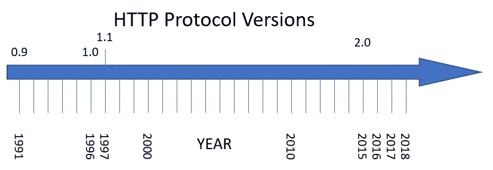
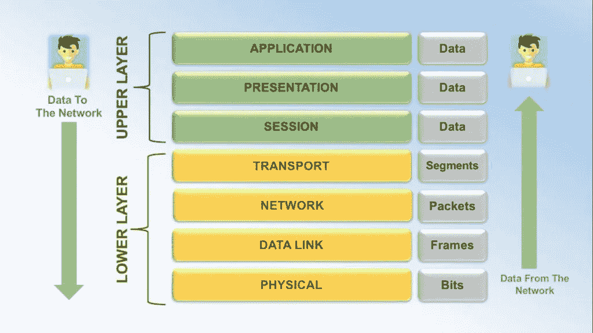
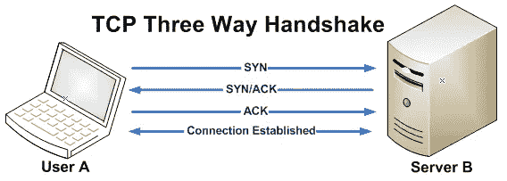
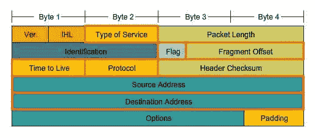

# OSI 模型和 HTTP 概述

> 原文：<https://medium.com/nerd-for-tech/osi-model-and-overview-of-http-2383e988d278?source=collection_archive---------3----------------------->



(来源:[https://www.youtube.com/watch?v=lmFFc8ih244](https://www.youtube.com/watch?v=lmFFc8ih244))

# 什么是 HTTP？

万维网的基础是超文本传输协议(HTTP)，用于通过超文本链接加载网页(如 HTML 文档)。HTTP 是一种应用层协议，运行在网络协议栈的其他层之上，用于在联网设备之间传送数据。典型的 HTTP 流包括客户端向服务器发送请求，然后服务器用消息进行响应。



这是在 90 年代早期设计的。在该协议的帮助下，通过互联网在客户端设备和服务器之间交换数据。因此，基本上，客户端设备向服务器发送加载网页所需的数据请求。因此服务器会将响应发送给客户端。

web 服务器包含一个 HTTP 守护进程(一个监听 HTTP 请求和响应并在它们进来时处理它们的程序)。当用户试图访问一个网页(键入 URL)时，浏览器建立一个 HTTP 请求，并将其发送到 URL 指向的 IP 地址。目标服务器上的 HTTP 守护程序接收请求，然后发回所请求的一个或多个文件。

如果你注意到了，你会在 URL 中看到 **HTTPS** ，这是什么意思？。它使用 SSL 作为 HTTP 上的子层。HTTPS 加密和解密用户 HTTP 页面请求和 web 服务器的响应页面。

HTTP 是一种客户端-服务器协议，所有请求都由一个实体(主要是 Web 浏览器)发送。在客户端和服务器通信之间，有很多实体，我们通常称它们为**代理**。代理执行不同的任务，它还充当网关或缓存。更多信息[点击此处](https://developer.mozilla.org/en-US/docs/Web/HTTP/Overview)。

所以现在，我们知道了 HTTP 的基本思想。让我们看看 HTTP 的**历史，**



(来源:[https://dzone.com/articles/http2-server-push](https://dzone.com/articles/http2-server-push))

## HTTP/0.9

这是 HTTP 协议的第一个版本，最初，这个版本没有版本号，后来它被命名以区别于后来的版本。这个版本非常简单，因为请求只有一行。这就是为什么这个版本也被称为“**单行协议**”。让我们看一个例子，

```
GET /hello.html
```

这是 HTTP/0.9 中请求的样子。在一行中使用唯一的方法 **GET** 后跟路径。响应如下所示，

```
<HTML>
Hello World!
</HTML>
```

它只有文件，没有别的了。(没有标题或任何其他类型的文档)。有趣的是，在这个版本中没有状态或错误代码。如果有任何错误，一个特定的 HTML 文件将被发送回错误的简要。

## HTTP/1.0

在这个版本中，版本信息将与请求本身一起发送(将`HTTP/1.0`添加到 GET 方法行)。响应中还会发送状态代码。在这里，客户端将打开一个到服务器的隧道，并以纯文本的形式发送请求。将为每个请求建立一个连接。

示例请求将如下所示，

```
GET /TheProject.html HTTP/1.0
```

以下部分显示了 HTTP/1.0 响应的样子。(鸣谢:[https://condor . de Paul . edu/DMU maugh/readings/讲义/SE435/HTTP/node16.html](https://condor.depaul.edu/dmumaugh/readings/handouts/SE435/HTTP/node16.html) )

```
HTTP/1.0 200 OK 
 Date: Fri, 08 Aug 2003 08:12:31 GMT 
 Server: Apache/1.3.27 (Unix) 
 MIME-version: 1.0 
 Last-Modified:  Fri, 01 Aug 2003 12:45:26 GMT 
 Content-Type: text/html 
 Content-Length: 2345 
   ** a blank line * 
   <HTML> ...
```

## HTTP/1.1

在这个版本中，它只是升级到 HTTP/1.0，这是 HTTP 中持久连接引入地方。正因为如此，它节省了时间。这将允许多个请求，而不是为每个请求打开和关闭连接。这增加了性能优化，如保持活动连接、字节范围请求、附加缓存机制、编码传输、请求流水线和传输编码。

我在“SOAP 和 REST”一文中谈到了 HTTP 版本 1.0 和 1.1 及其区别。[点击这里](https://ramsunthar.medium.com/soap-rest-and-the-importance-of-message-brokers-77e2fb2e6b17)阅读。

## HTTP/2.0 及以上

这从一个 **SPDY** 协议开始。在服务器和客户机之间，HTTP/2 使用单一的 TCP 通道。当从多个服务器下载内容时，客户端最终会为每个服务器打开单独的 TCP 通道，但是 HTTP/2 只为来自同一服务器的内容片段使用一个 TCP 通道。在单个客户端和单个服务器之间使用多个 TCP 通道不会加快通信速度；它只是在 HTTP/1.1 中作为一种变通方法使用，以部分缓解慢速资源的阻塞效应。

二进制成帧层可以被视为互联网协议栈中应用层的一部分，它是从技术角度区分 HTTP/1.1 和 HTTP/2 的最重要的方面之一。与 HTTP/1.1 不同，HTTP/2 采用二进制帧层以二进制格式包装所有通信，同时仍然保留动词、方法和头等 HTTP 语义。应用程序级的 API 将继续产生标准 HTTP 格式的消息，但是底层将把它们转换成二进制格式。这保证了在 HTTP/2 之前构建的 web 应用程序可以像以前一样与新协议通信。

然后是 HTTP/3.0(现在正在开发中)，或者你可以调用“ **HTTP over QUIC** ”，这在当时是众所周知的。要了解更多关于 HTTP/3.0 的信息，[点击这里](https://blog.cloudflare.com/http3-the-past-present-and-future/)

# OSI 模型

当你使用网络时，这是一个巨大的讨论话题。OSI 模型帮助我们更好地理解它。 **OSI** 代表**开放系统互联。**这解释了当系统相互通信时，网络如何运行。该模型分为 7 层。因此，通过每一层，我们将能够了解数据是如何通过互联网从一个系统传输到另一个系统的。我们一个一个讨论吧，



(来源:[https://www.stemjar.com/osi-model-seven-layers-explained/](https://www.stemjar.com/osi-model-seven-layers-explained/))

在发送过程中，它是从应用层到物理层，在接收过程中，它是从物理层到应用层。让我们仔细看看，

## 第 7 层:应用层

实际上，这是第 7 层，一旦建立了连接，这一层就允许程序通过网络进行交互，因为这一层直接与软件应用程序进行交互。(离用户最近)。当用户希望发送文件或图片时，该层与和网络通信的应用程序进行交互。

这个播放器中使用了几种协议，它们是 HTTP、Telnet、POP3 或 SMTP(用于电子邮件)、FTP、IMAP 等。

因此，特定的应用程序允许这一层从表示层发送和接收数据。

## 第 6 层:表示层

这一层负责根据终端系统的语法或语义转换数据。该层也被称为**语法层**，因为该层管理加密和解密。假设您在 UberEats 中订购食物，这些交易通常在安全传输中处理，这意味着您和“UberEats”之间流动的数据是加密的，必须由这一层解密和处理。

最后，在将数据传输到会话层之前，表示层会压缩从应用层收到的数据。通过减少交换的数据量，有助于提高通信速度和效率。

## 第 5 层:会话层

会话层将在设备之间建立通信信道，这将被称为会话。这一层负责启动这样的会话，并确保它们在数据传输期间正常工作。这一层负责建立、管理、终止和通信会话。该层管理不同类型的连接，以及在网络中断时的身份验证和重新连接。会话层允许两个系统以半双工或全双工方式开始通信。该层允许在传输订单数据时添加检查点，如果在传输过程中出现数据传输错误，将从检查点重新开始传输。同步和恢复是这个过程的术语。

一旦会话成功建立，数据将被传递到传输层。

## 第 4 层:传输层

这一层主要负责跨网络连接的数据传输**，错误检查，流量控制，**和**对数据包进行排序。**这一层决定了发送多少数据、发送速度和发送目的地等因素。 **TCP** 和 **UDP** 是这一层使用的协议。

**TCP(传输控制协议)**



(来源:[https://www . freecodecamp . org/news/an-introduction-to-http-understanding-the-open-systems-interconnection-model-9dd 06233 d30e/](https://www.freecodecamp.org/news/an-introduction-to-http-understanding-the-open-systems-interconnection-model-9dd06233d30e/))

TCP 通过在最终用户之间建立握手协议来提供面向连接的通信，以确保在数据(如该层中的数据包)交换之前正确建立连接。在这一层，它使用校验和(在 TCP 报头中)来确保用户发送的数据包和用户接收的数据包是相同的。通常情况下，所有的数据包都会被编号，因为 TCP 会在将收到的数据包传递到上层之前，确保其有序与否(如果不有序，则会重新排序)。流量控制是 TCP 的特性之一，它可以防止缓冲区溢出。在面向连接的协议中，这是最常见的协议，建立和维护连接的方式将在该协议中定义。因此，这将在客户端和主机之间建立一个连接(套接字),如上图所示。

**UDP(用户数据报协议)**

这是一个完全无连接的协议，与 TCP 相反，因为它以无序的方式发送数据，这使得它不可靠。每当数据包被丢弃时，它不会重新发送数据包，从而导致数据中的间隙。TCP 和 UDP 的主要区别在于确认不会被发送回接收方。这也是 UDP 变得不可靠的一个原因。

## 第 3 层:网络层

这一层将处理数据的**路由**，并通过最符合逻辑的路径将数据包发送到指定地点，因为这一层知道网络中存在的所有花费时间最短的路径和路由数量。这一层还有另一个功能，即**逻辑寻址**，我们来讨论一下。



IP 头(来源:【http://www.highteck.net/EN/Network/OSI_Network_Layer.html】T4

此图显示了附在该层数据上的 IP 报头。在标题中，你可以看到有源地址和目的地址，它们分别有发送者和接收者的 IP 地址。所以通过这个数据包会根据目的地址发送到特定的目的地。

## 第 2 层:数据链路层

这一层被认为是所有 7 层中最复杂的一层，并且这一层纠正错误(如果在物理层中出现任何错误)。这将确保通过物理层在节点之间进行无错误的数据传输。这里的数据称为帧。该层中有两个子部分，如 **MAC(媒体访问控制)**和 **LLC(逻辑链路控制)。**

*   **MAC(媒体访问控制)——**网络上的流量控制和多路复用设备通信由 MAC 地址层处理。
*   **LLC(逻辑链路控制)—** 在物理介质上，LLC 层提供错误控制和流量控制，以及根据报头识别网络层协议。

## 第 1 层:物理层

这是 OSI 模型的最低层，网络设备完全参与其中，如电缆、路由器、交换机和集线器等。这一层负责物理层上网络设备之间的实际物理连接。这里，数据以**位的形式传输。**所以在接收数据时，这一层接收到信号，转换成 0 和 1 后，再发送给数据链路层。

所以现在我希望你对 HTTP 和 OSI 模型的工作原理有一个基本的了解。

# 参考

[](https://developer.mozilla.org/en-US/docs/Web/HTTP/Overview) [## HTTP - HTTP | MDN 概述

### HTTP 是一种允许获取资源(如 HTML 文档)的协议。它是任何数据的基础…

developer.mozilla.org](https://developer.mozilla.org/en-US/docs/Web/HTTP/Overview) [](https://whatis.techtarget.com/definition/HTTP-Hypertext-Transfer-Protocol) [## 什么是 HTTP，它是如何工作的？超文本传输协议定义

### HTTP(超文本传输协议)是用于在互联网上传输文件的基本协议。这个…

whatis.techtarget.com](https://whatis.techtarget.com/definition/HTTP-Hypertext-Transfer-Protocol)  [## 在 HTTP 基础知识介绍中

### WEB Internet(或 WEB)是一个巨大的分布式客户机/服务器信息系统，如下图所示…

www3.ntu.edu.sg](https://www3.ntu.edu.sg/home/ehchua/programming/webprogramming/HTTP_Basics.html) [](https://dzone.com/articles/http2-server-push) [## HTTP/2 服务器推送- DZone Web Dev

### HTTP 协议的新版本 HTTP/2 允许服务器在客户端请求之前将内容推送到客户端…

dzone.com](https://dzone.com/articles/http2-server-push) [](https://www.digitalocean.com/community/tutorials/http-1-1-vs-http-2-what-s-the-difference) [## HTTP/1.1 vs HTTP/2:有什么区别？数字海洋

### 作者选择女工程师协会接受捐赠，作为“为捐赠而写”项目的一部分…

www.digitalocean.com](https://www.digitalocean.com/community/tutorials/http-1-1-vs-http-2-what-s-the-difference) [](https://www.educative.io/blog/osi-model-layers) [## 什么是 OSI 模型？7 层详细解释

### 开放系统互连(OSI)模型是一个概念框架，它描述了网络或…

www.educative.io](https://www.educative.io/blog/osi-model-layers) [](https://realpars.com/osi/) [## 什么是 OSI 模型？实数部分

### OSI 代表开放系统互连，是应用程序如何通过开放系统互连进行通信的概念框架。

realpars.com](https://realpars.com/osi/) [](https://www.freecodecamp.org/news/an-introduction-to-http-understanding-the-open-systems-interconnection-model-9dd06233d30e/) [## HTTP 简介:探索计算机系统中的远程通信

### 作者 Cher Don HTTP 简介:探索计算机系统中的远程通信了解开放系统…

www.freecodecamp.org](https://www.freecodecamp.org/news/an-introduction-to-http-understanding-the-open-systems-interconnection-model-9dd06233d30e/) [](https://www.geeksforgeeks.org/layers-of-osi-model/) [## OSI 模型的层次

### 先决条件:计算机网络基础 OSI 代表开放系统互连。它是由 ISO 开发的…

www.geeksforgeeks.org](https://www.geeksforgeeks.org/layers-of-osi-model/) [](https://www.javatpoint.com/osi-model) [## OSI 模型:层次、特征、功能-Java point

### 计算机网络| OSI 模型分层与计算机网络教程，介绍，功能，计算机类型…

www.javatpoint.com](https://www.javatpoint.com/osi-model)