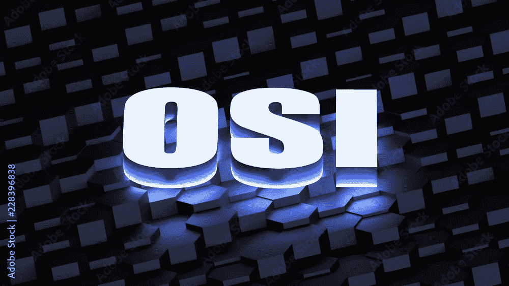
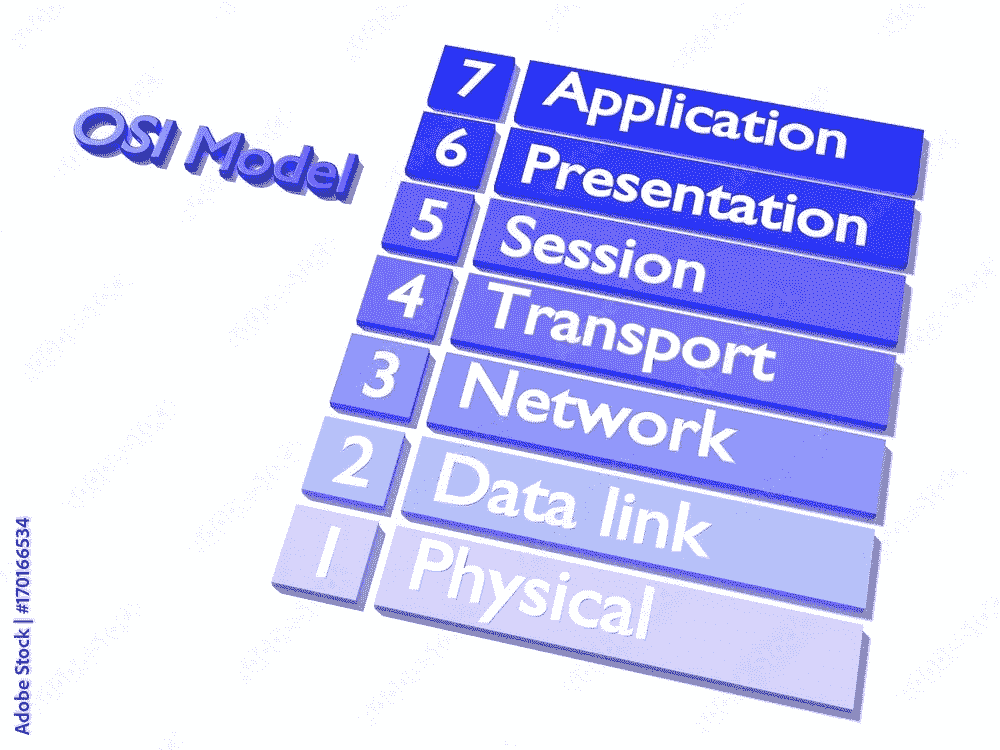

# OSI 模型

> 原文：<https://medium.com/nerd-for-tech/osi-model-c2570ff0d49d?source=collection_archive---------22----------------------->

开放系统互连模型:开放系统互连(OSI)模型描述了计算机系统用来通过网络进行通信的七个层次。这是网络通信的第一个标准模型。

OSI 模型共有 7 层，根据其职责分为两部分:

1.  **主机职责**:应用层、表示层、会话层、传输层
2.  **网络的职责**:网络层、数据链路层、物理层。

> **应用层:**

1.  向用户提供服务
2.  网络透明度、资源分配
3.  邮件服务:(SMTP，POP3)
4.  文件传输、访问和管理

> **表示层:**

1.  代码转换
2.  加密/解密
3.  压缩
4.  翻译

> **会话层**

1.  证明
2.  批准
3.  会话恢复(使用会话 Beans:保存特定会话的值)
4.  同步(网上研讨会中的音频、视频) :在按顺序传输数据时添加一些检查点。
5.  对话控制:允许两个进程之间的通信

> **传输层**

1.  端到端数据交付(端口到端口交付)
2.  数据的有序传输(无任何损失)
3.  错误控制
4.  拥塞控制
5.  流控制
6.  复用/解复用
7.  分段和重组:将消息分成多个段，每个段都分配有一个唯一标识每个段的序列号

> **网络层**

1.  主机到主机交付
2.  按指定路线发送
3.  将数据包从源移动到目的地
4.  将源地址和目的地址添加到帧的报头中。

> **数据链路层**

1.  逐跳传送(节点到节点)
2.  成帧时，在包含目的地址的帧中添加帧头
3.  每个节点的流量控制:1。停下来等一等。回去三号。选择性重复
4.  在两个或多个设备之间提供可靠有效的通信。
5.  错误控制
6.  访问控制:1。CSMA 2。欢迎
7.  本地网络中每台设备的唯一标识。

> **物理层**

1.  为数据链路层提供功能
2.  提供传输比特的物理介质
3.  建立、维护和停用物理连接。