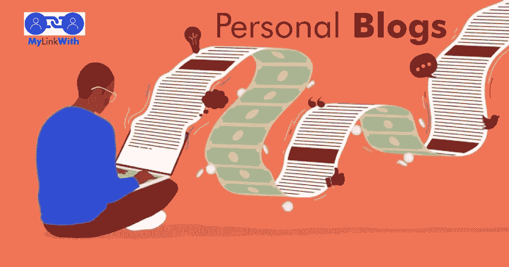
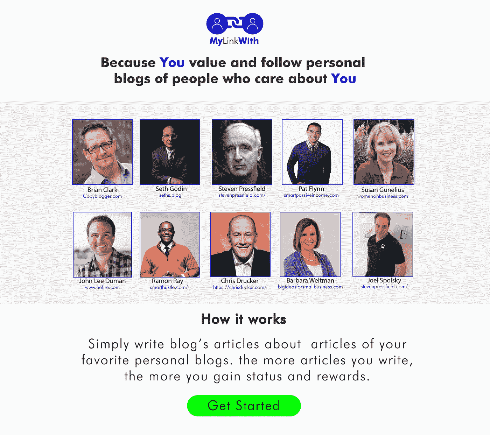

# 我们与个人博客的链接

> 原文：<https://medium.com/nerd-for-tech/our-links-with-personal-blogs-e665fcfe3ac7?source=collection_archive---------33----------------------->

你的个人博客链接

我在之前的一篇文章中说过，过去和个人博客是接下来的事情([在这里](/nerd-for-tech/the-next-blogs-4ef123ebca2a))。对于过去的博客，有一些正在进行的工作，一些关键的想法可能会使它们复苏。

对于个人博客来说，他们只是在忙碌的内向型和搜索引擎优化营销人员的博客面前被低估了，而专业和热情的人，如[塞斯·戈丁](http://seths.blog)、[史蒂文·普莱斯菲尔德](http://stevenpressfield.com/)、[布莱恩·克拉克](http://Copyblogger.com)、[乔尔·斯波尔斯基](https://www.joelonsoftware.com/)、[克里斯·德鲁克](http://www.chrisdrucker.com/)、[芭芭拉·韦尔特曼](http://bigideasforsmallbusiness.com)、[约翰·李·杜曼](https://www.eofire.com/)、[苏珊·古纳留斯](https://www.womenonbusiness.com/)、 [仅举几个例子，我只是说出他们的想法，这些想法可能是未来的解决方案，因为在过去的博客上工作已经让我看到，一些博客作者已经清楚地陈述了我们现在生活中的问题，以及一些适用的解决方案。 作为读者，我们的目标是给那些有技能和热情的人的个人博客更多的信任，我们可以在拥有自己的博客的同时做到这一点。](https://smarthustle.com/)

围绕个人博客进行一项名为 [**MyLinkWith**](http://clickmetertracking.com/s6xy) 的实验，如下所示，但它并不适合所有人，而是适合那些致力于写作和阅读的人。如果你想成为体验的一部分，请填写这张表格。另一个人说，它不是为每个人准备的，不是为大众准备的，而是为那些关心阅读和写作个人博客的人准备的

因为你重视并关注那些关心你的人的个人博客，你应该成为这个[实验](http://clickmetertracking.com/s6xy)的一部分

你与这些由关心你的有技能的人持有的个人博客的链接