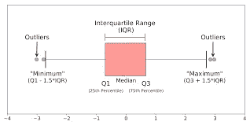
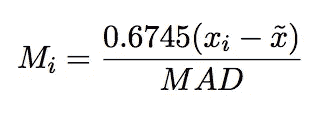

# 离群点检测技术

> 原文：<https://medium.com/nerd-for-tech/outliers-detection-techniques-85e0a5d1c3c4?source=collection_archive---------22----------------------->

## 这篇文章将是一篇理论性的短文。每种技术的代码都很容易在互联网上找到。

威尔·梅尔斯在 [Unsplash](https://unsplash.com?utm_source=medium&utm_medium=referral) 上拍照

## 介绍

在这篇文章中，我将列出我遇到的不同的异常检测技术。

但是首先让我们知道异常值。

**定义:**

异常值是与其他观察值不同的观察值。异常值可能是由各种原因造成的，例如:

1.  测量误差。
2.  数据损坏。
3.  真正的异常值(例如，板球比赛中单回合 72 分。)

保留或删除离群值取决于具体问题。例如，如果我们知道异常值是由于测量中的错误而出现的，那么我们可以删除它，但是在异常检测问题的情况下，我们感兴趣的是找到这样的异常值。

# 我们开始吧

我将要讨论的技术如下:

1.  绘制数据。
2.  百分位值。
3.  修改后的 z 值。
4.  隔离森林。

## 绘图数据

在探索性数据分析过程中，我们应该始终单独绘制所有特征，以了解特征的分布。一个有助于发现异常值的图是**箱线图。**

箱形图

如上图所示，数据中可能会出现异常值。一般来说，位于箱线图须线之外的数据点被认为是异常值。

## 百分点值

百分比值表示低于该值的数据点的百分比。例如，如果一个特性的 90%是 200，那么我们可以将其解释为该特性的 90%的值低于 200。

在 python 中，计算它是非常容易的。我们可以使用 Numpy 库计算百分位值。

现在，我们如何使用百分位值来检查异常值的存在？让我解释一下。

假设对于给定的特征，我们计算不同的百分位值(90，95，99.9，100)。例如，如果我们观察到 99.9 百分位值是 200，而 100 百分位值是 800。

我们可以清楚地看到，只有 0.1%特征具有等于 800 的值。这是异常值的指示，我们可以基于此分析决定是否保留这些值。

## 修改后的 Z 值。

公式

这是修改后的 z 值的公式。这里 MAD 是中值绝对偏差，xbar 是给定特征的中值。

为了基于该技术计算异常值，我们执行以下过程:

1.  对于所有数据点，我们计算上述得分。
2.  如果一个数据点的分数大于一个阈值，那么我们可以将其标记为异常值。通常阈值保持在 3。

## **隔离林**

这是一种非常有效的检查异常值的技术。这种技术使用决策树的集合来确定一个给定点是否是离群点。要了解更多这方面的内容，你可以参考 [**这篇**](https://towardsdatascience.com/outlier-detection-with-isolation-forest-3d190448d45e) 关于媒介的大文章。

幸运的是 sklearn 已经为我们实现了隔离森林。因此我们可以使用**[**sklearn . ensemble . isolation forest**](https://scikit-learn.org/stable/modules/generated/sklearn.ensemble.IsolationForest.html)**来检查异常值。****

****现在，使用这种方法的主要优点是我们可以使用分类特征来确定异常值。在我前面提到的其余三种技术中，我们可以主要在数字特征上有效地使用它们。是的，在绘图中，我们可以得到一些关于分类特征的见解，但不是很清楚。****