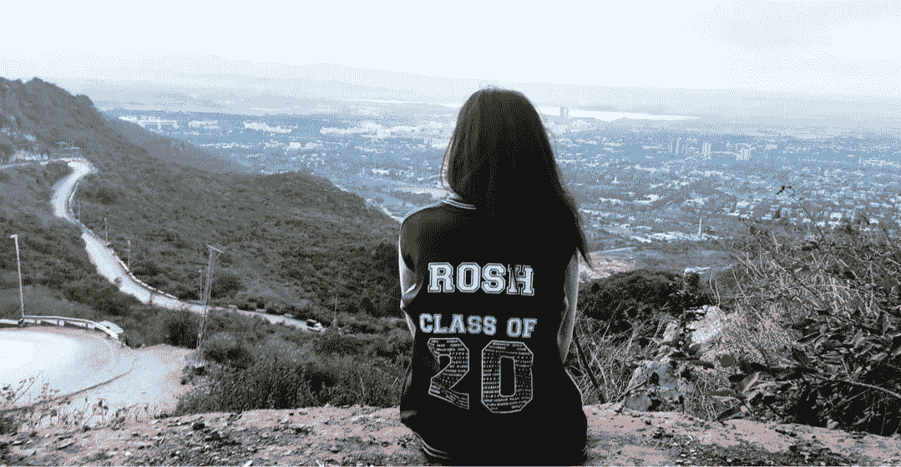
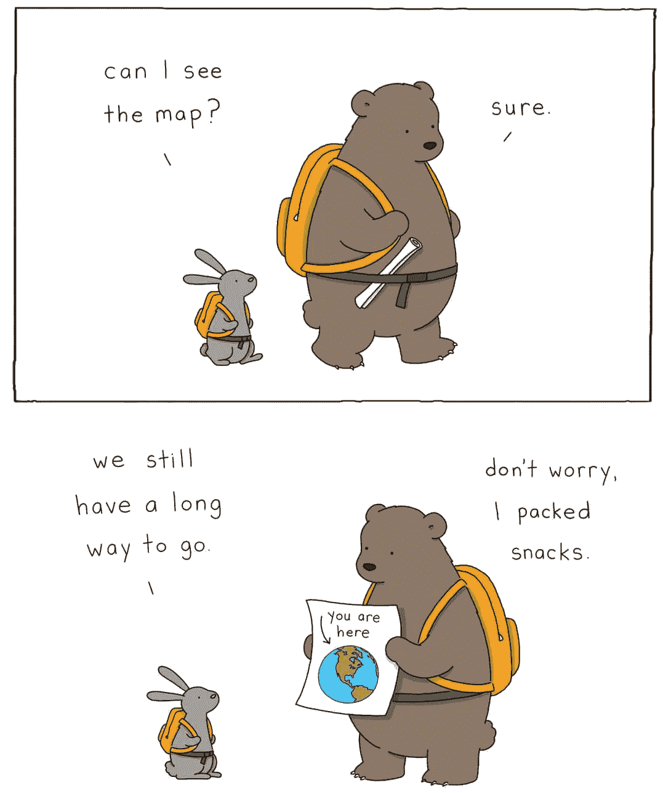

# 外展实习总结

> 原文：<https://medium.com/nerd-for-tech/outreachy-internship-wrap-up-a998c4def8d0?source=collection_archive---------7----------------------->

“梵拉·多黑里斯”——所有人都必须服役

在给了我巨大的信心后，我的外展之旅将于本周结束。有很多担心最终都没有成为现实。第一个也是最糟糕的一个是我永远不会被选中。😅但是我在这里写我的总结博客。

梦想远大

我想提几个在实习期间发生的惊人的事情。

## 信心

它给了我大胆梦想的信心，和战胜骗子综合症的勇气。我明白了，开始新的事物永远不会晚。勇敢永远不嫌老。

> “设定新目标或实现新梦想永远不会嫌老。”——c·s·刘易斯

## 博客

另一件事，我第一次尝试的是发表我的博客，虽然它们只是由我的日志的随机片段组成。但是和你们分享感觉很好。此外，我探索了自己新的一面，“是的，我也能做到！”

来源: [hapuriainen](https://hapuriainen.wordpress.com/2014/05/25/a-year-in-the-life-of-a-blog/)

## 开源

我每天都在使用 Ubuntu、GitHub 和开源项目，我甚至不知道我什么时候对所有这些工具感到如此舒适了。

## 帮助他人

对某人的生活产生积极影响并帮助他人是一种美好的感觉。

> “我们通过提升他人而崛起”——罗伯特·g·英格索尔

当我在 LinkedIn 上收到寻求帮助和建议的消息时，我觉得我可能已经激励了某人开始一些新的事情，并且有远大的梦想。

来源:[the little world fliz](https://thelittleworldofliz.com/)

# 我的核心价值观

在第一篇博客中，我谈到了帮助我入选的三个核心价值观。

1.  增长
2.  决心
3.  积极的人生观

我想说，这次实习增强了这些品质，使我成为一个更好的人。

我的拓展实习即将结束，但希望我会继续写博客。感谢您的阅读:'))