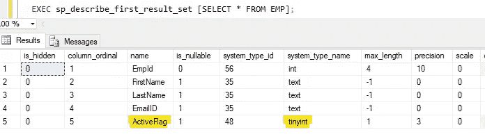
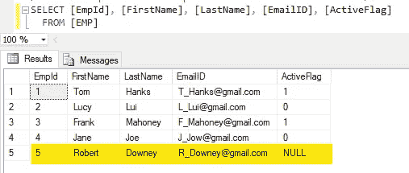
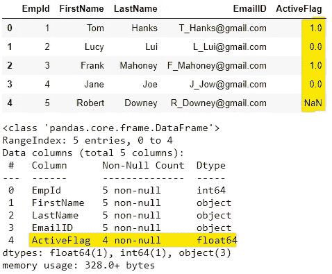
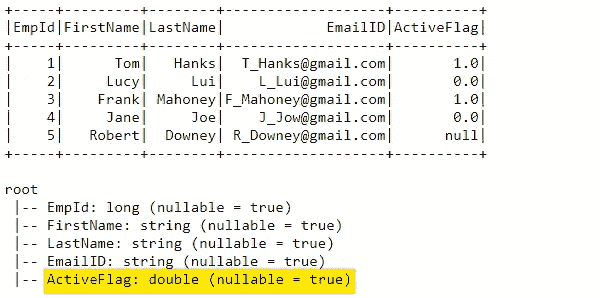
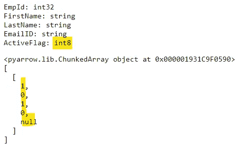
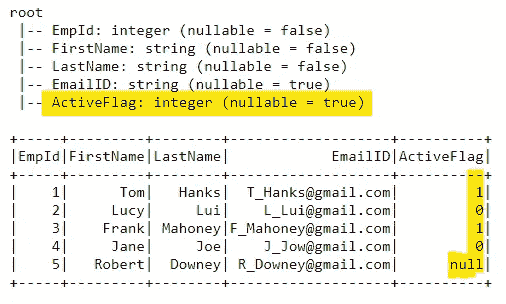
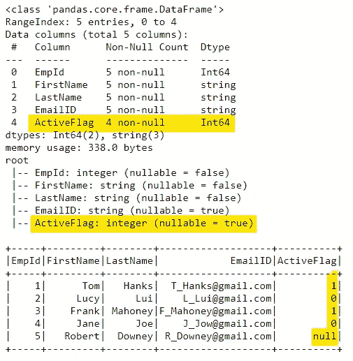

# 克服拼花图案问题

> 原文：<https://medium.com/nerd-for-tech/overcoming-parquet-schema-issues-4f7ae38d1c4a?source=collection_archive---------0----------------------->


Genessa panainite 在 [Unsplash](https://unsplash.com/s/photos/spark?utm_source=unsplash&utm_medium=referral&utm_content=creditCopyText) 上拍摄的照片

关于我们在使用 Pandas 和 Spark 数据框架时如何克服拼花模式相关问题的几种方法。

在我目前的项目中，我们完全依赖于 parquet 文件进行所有的数据处理。最初，我们将数据从 MS SQL Server 提取到。csv (dat)文件和模式转换成。sch 文件。使用 Spark 和 iconv，我们将这些文件转换成 parquet 文件，确保在保存到 Hadoop 数据存储之前应用模式。

最近我们转而使用 Pandas(带有 pyodbc)进行提取，并使用 Pandas to_parquet()方法直接上传到 HDFS 作为拼花。这些文件需要再进行一轮处理才能应用模式，现在它们安全地存储在一个中央模式存储库中。这是我们遇到如下问题的地方

```
**TypeError**: field ActiveFlag: **IntegerType can not accept object** 1.0 **in type <class 'float'>**
```

让我解释一下我的分析



作者图片

在截图中，您可以看到一个虚拟表(EMP ),它是我用列 ActiveFlag 作为 tinyint 创建的。预期值为 0、1 或 null



作者图片

创建了一些虚拟数据来填充表。突出显示的记录是我们感兴趣的记录。
正如我们所见，ActiveFlag 对于最后一条记录有整数值 0、1 和 null。

我读取 Pandas 数据帧中的数据，显示记录和模式，并将其写出到一个 parquet 文件中。



作者图片

正如上面突出显示的，ActiveFlag 列存储为 float64。像 0、1 和 null 这样的值被转换为 0.0、1.0 和 NaN。这是因为 Pandas 限制在 int64 Dtype 系列中存储 null。

现在，我们将文件读入 Spark 数据帧，打印记录并检查模式。我们看到 ActiveFlag 为 double，所有列都标记为 nullable = true



作者图片

让我们创建一个模式，并将其应用于 Spark 数据帧。模式应用成功，但当我们执行显示或写入时，Spark 将抛出一个 TypeError，表明它无法将 float 转换为 IntegerType。

一种方法是在应用所需模式时从 Pandas 数据帧创建 PyArrow 表，然后将其转换为 Spark 数据帧。
如下所示，PyArrow 表正确显示了模式和数据



作者图片

如果您搜索将 PyArrow 表转换为 Spark 数据帧的方法，您将最常见地看到 PyArrow 表的 to_pandas()方法被调用，然后 Spark 的 createDataFrame 方法在 pandas 数据帧上被调用。但是如果我们再次转换回 Pandas，那么模式将会丢失，数据将会混乱。所以回顾可用的选项，我们看到 PyArrow 表上的 to_pydict()方法。这将把表转换成有序的字典，并正确地保留模式和数据。然后从这里我们可以创建一个 Spark 数据框架并应用我们的模式。



作者图片

我最近想到的另一种方法是使用熊猫 1.0.0 中新提供的 Int64 Dtype。当保存拼花文件时，我们可以在 Pandas 数据帧上直接使用 [convert_dtypes()](https://pandas.pydata.org/pandas-docs/stable/reference/api/pandas.DataFrame.convert_dtypes.html) ，它会正确地存储数据和数据类型。然后我们只需在 Spark 中读取它并应用我们的模式。完成的工作:)



作者图片

**参考文献:**
1。[https://stack overflow . com/questions/48578787/convert-ordered-dictionary-to-py spark-data frame](https://stackoverflow.com/questions/48578787/convert-ordered-dictionary-to-pyspark-dataframe)
2 .[https://pandas . pydata . org/pandas-docs/stable/reference/API/pandas。data frame . convert _ dtypes . html](https://pandas.pydata.org/pandas-docs/stable/reference/api/pandas.DataFrame.convert_dtypes.html)