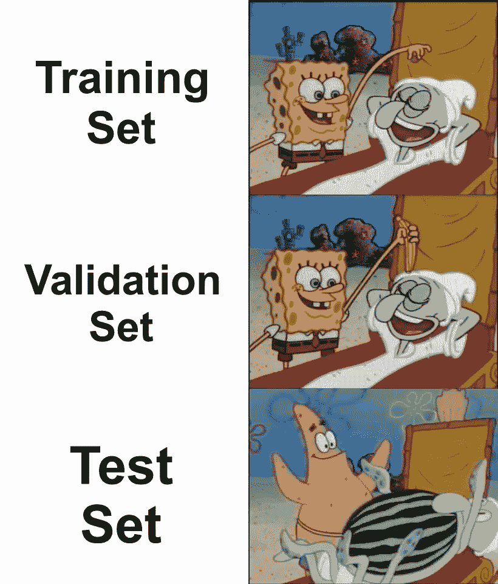
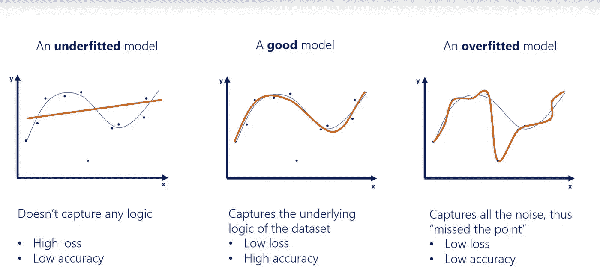
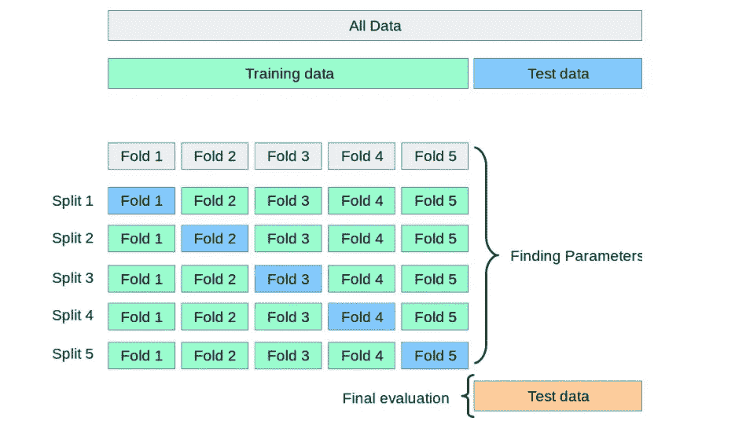
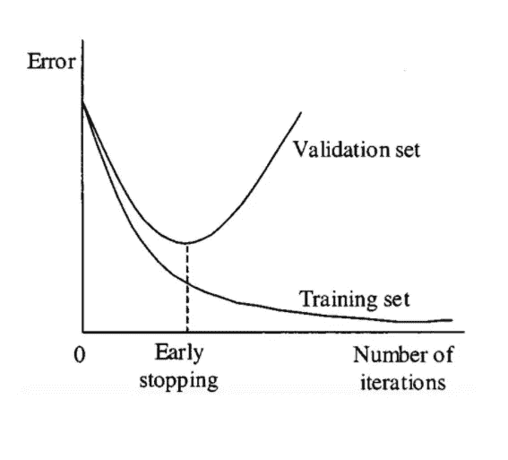
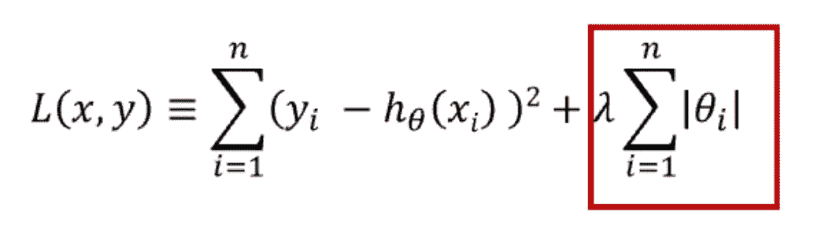
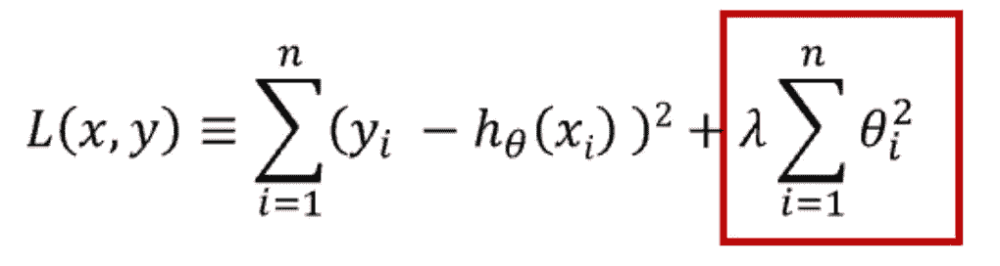
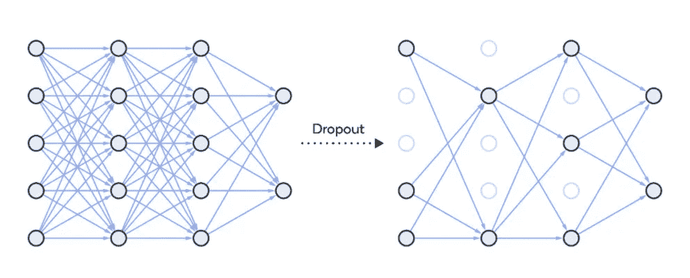

# 过度拟合:识别和解决

> 原文：<https://medium.com/nerd-for-tech/overfitting-identify-and-resolve-df3e3fdd2860?source=collection_archive---------2----------------------->

*与其精确错误，不如近似正确*沃伦·巴菲特

来源:ML 迷因在线

在机器学习中，如果模型过于专注于特定的训练数据，以至于错过了关键点，那么我们认为模型是过度拟合的。因此，它提供了一个远非正确的答案。也就是说准确率低。该模型将来自无关数据的噪声视为会影响模型精度的信号。即使模型被很好地训练，导致低损失，它也不会帮助我们，因此这些类型的模型在新数据下表现不佳。欠拟合是指模型没有捕捉到数据的逻辑。因此，欠拟合的模型将具有低精度和高损耗。下图可以说明这一点。

来源:过度拟合在线图片

**如何识别我们的模型过拟合？**

在建立模型时，数据被分成 3 类:训练、验证和测试。训练数据用于训练模型。验证用于在每个步骤测试构建的模型，测试数据最终用于评估模型。通常通常使用 80:10:10 或 70:20:10 的比例。

在建立模型的过程中，在每个时期使用验证数据来测试在此之前建立的模型。结果，我们得到了模型的损失和精度的值，以及每个时期的验证损失和验证精度。模型建立后，我们将使用测试数据对模型进行测试，并获得准确性。如果这种准确性和验证准确性有更大的差异，那么我们可以诊断我们的模型是过度拟合。

如果验证集和测试集中的损失都很高，那么模型是欠拟合的。

**如何防止过度拟合:**

**1。交叉验证:**

这是防止过度拟合的一个非常好的方法。在这里，我们生成多个训练测试分割并调整模型。k 折叠验证是一种标准交叉验证，其中我们将数据分成 k 个子集。我们保留 1 个子集用于验证，并在其他子集上训练算法。交叉验证允许你调整你的超参数。性能是所有值的平均值。这种方法可能计算量很大，但不会浪费太多数据。这个过程可以用下图来表示。

来源:scikit 网站

**2。用更多数据训练:**

用更相关的数据训练模型将有助于更好地识别信号，并避免将噪声作为信号。数据扩充是增加训练数据的一种方式。这可以通过翻转、平移、旋转、缩放、改变亮度等来实现。

**3。移除功能:**

这降低了模型的复杂性，并且还可以在一定程度上避免噪声，这将使模型更有效。为了降低复杂性，我们可以删除层或减少神经元的数量，使网络更小。

**4。提前停止:**

当模型被迭代训练时，我们可以在每次迭代中测量性能。当验证损失开始增加时，我们应该停止训练模型。这样我们就可以停止过度拟合。

下图表示何时停止定型模型。

**5。正规化:**

正则化用于降低模型的复杂性。这是通过惩罚损失函数来实现的，L1 和 L2 有两种方法。它们可以用下面的数学方程来表示。

套索(最小绝对收缩和选择算子)也称为 L1 惩罚，以优化权重绝对值的总和。它生成一个简单且可解释的模型。这对于异常值是稳健的。

L2 对重量平方值的总和进行处罚。这个模型能够学习复杂的数据模式。这对于异常值来说是不稳健的。

这两种正则化技术都有助于克服过拟合，并且可以根据需要使用。

**6。退学:**

这是一种正则化方法，用于随机禁用神经网络的单元。它可以在任何隐藏层或输入层上实现，但不能在输出层上实现。这防止了对其他神经元的依赖性，进而使得网络能够学习独立的相关性。它降低了网络的密度，如下图所示。

**结论:**

过度拟合是一个需要注意的问题，因为它不会让我们有效地使用现有的数据。有时，这也可以在构建模型之前进行估计。通过观察数据、收集数据的方式、采样的方式、错误的假设、错误的陈述可能会发出过度拟合的信号。为了避免这种情况，在进行建模之前，请正确检查数据。有时过拟合在预处理中无法检测到，在这种情况下，可以在建立模型后检测到。我们可以使用上面的一些技术来克服过度拟合。

*最初发表于 2021 年 1 月 11 日 https://www.numpyninja.com**的* [*。*](https://www.numpyninja.com/post/overfitting-identify-and-resolve)